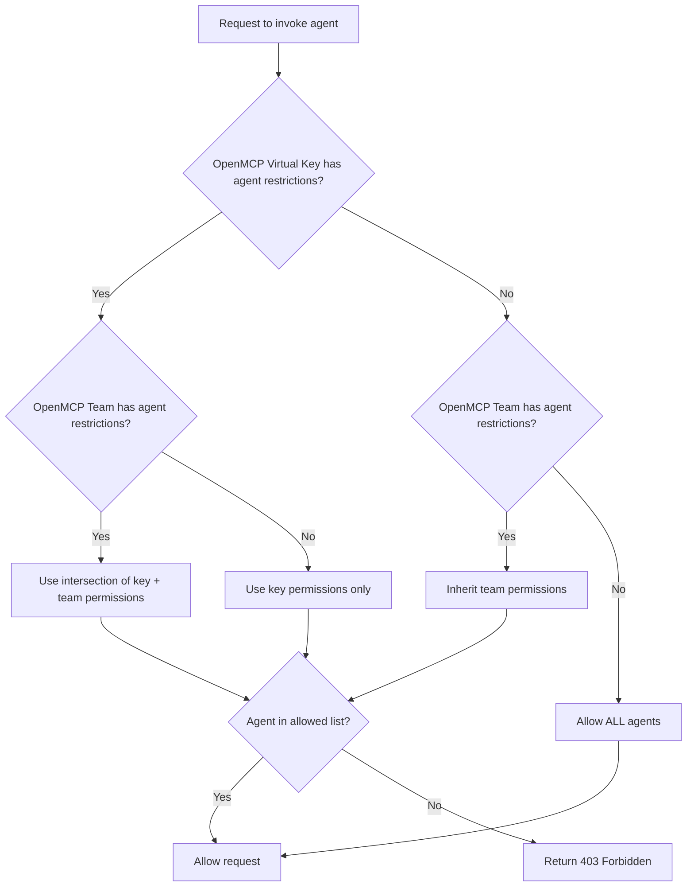

在 OpenMCP 中控制特定密钥或团队可以访问哪些 A2A 智能体。

## 概述

智能体权限管理让你限制 OpenMCP 虚拟密钥或团队可以访问的智能体。这有助于：

- **多租户环境**：让不同的团队访问不同的智能体
- **安全性**：防止密钥调用其不应有权访问的智能体
- **合规性**：对敏感的智能体工作流执行访问策略

配置权限后：
- `GET /v1/agents` 仅返回密钥/团队可以访问的智能体
- `POST /a2a/{agent_id}`（调用智能体）在访问被拒绝时返回 `403 Forbidden`

## 在密钥上设置权限

本示例展示如何创建带智能体权限的密钥并测试访问。

### 1. 获取智能体 ID

<Tabs items={["UI","API"]}>
<Tab>

1. 在侧边栏中前往 **Agents**
2. 点击你想要的智能体
3. 复制 **Agent ID**


</Tab>
<Tab>

```bash title="List all agents" showLineNumbers
curl "http://localhost:4000/v1/agents" \
  -H "Authorization: Bearer sk-master-key"
```

响应：
```json title="Response" showLineNumbers
{
  "agents": [
    {"agent_id": "agent-123", "name": "Support Agent"},
    {"agent_id": "agent-456", "name": "Sales Agent"}
  ]
}
```

</Tab>
</Tabs>

### 2. 创建带智能体权限的密钥

<Tabs items={["UI","API"]}>
<Tab>

1. 前往 **Keys** → **Create Key**
2. 展开 **Agent Settings**
3. 选择你想要允许的智能体


</Tab>
<Tab>

```bash title="Create key with agent permissions" showLineNumbers
curl -X POST "http://localhost:4000/key/generate" \
  -H "Authorization: Bearer sk-master-key" \
  -H "Content-Type: application/json" \
  -d '{
    "object_permission": {
      "agents": ["agent-123"]
    }
  }'
```

</Tab>
</Tabs>

### 3. 测试访问

**允许的智能体（成功）：**
```bash title="Invoke allowed agent" showLineNumbers
curl -X POST "http://localhost:4000/a2a/agent-123" \
  -H "Authorization: Bearer sk-your-new-key" \
  -H "Content-Type: application/json" \
  -d '{"message": {"role": "user", "parts": [{"type": "text", "text": "Hello"}]}}'
```

**被阻止的智能体（返回 403 失败）：**
```bash title="Invoke blocked agent" showLineNumbers
curl -X POST "http://localhost:4000/a2a/agent-456" \
  -H "Authorization: Bearer sk-your-new-key" \
  -H "Content-Type: application/json" \
  -d '{"message": {"role": "user", "parts": [{"type": "text", "text": "Hello"}]}}'
```

响应：
```json title="403 Forbidden Response" showLineNumbers
{
  "error": {
    "message": "Access denied to agent: agent-456",
    "code": 403
  }
}
```

## 在团队上设置权限

将某个团队的所有密钥限制为只能访问特定智能体。

### 1. 创建带智能体权限的团队

<Tabs items={["UI","API"]}>
<Tab>

1. 前往 **Teams** → **Create Team**
2. 展开 **Agent Settings**
3. 选择你想为该团队允许的智能体


</Tab>
<Tab>

```bash title="Create team with agent permissions" showLineNumbers
curl -X POST "http://localhost:4000/team/new" \
  -H "Authorization: Bearer sk-master-key" \
  -H "Content-Type: application/json" \
  -d '{
    "team_alias": "support-team",
    "object_permission": {
      "agents": ["agent-123"]
    }
  }'
```

响应：
```json title="Response" showLineNumbers
{
  "team_id": "team-abc-123",
  "team_alias": "support-team"
}
```

</Tab>
</Tabs>

### 2. 为团队创建密钥

<Tabs items={["UI","API"]}>
<Tab>

1. 前往 **Keys** → **Create Key**
2. 从下拉列表中选择 **Team**


</Tab>
<Tab>

```bash title="Create key for team" showLineNumbers
curl -X POST "http://localhost:4000/key/generate" \
  -H "Authorization: Bearer sk-master-key" \
  -H "Content-Type: application/json" \
  -d '{
    "team_id": "team-abc-123"
  }'
```

</Tab>
</Tabs>

### 3. 测试访问

该密钥继承团队的智能体权限。

**允许的智能体（成功）：**
```bash title="Invoke allowed agent" showLineNumbers
curl -X POST "http://localhost:4000/a2a/agent-123" \
  -H "Authorization: Bearer sk-team-key" \
  -H "Content-Type: application/json" \
  -d '{"message": {"role": "user", "parts": [{"type": "text", "text": "Hello"}]}}'
```

**被阻止的智能体（返回 403 失败）：**
```bash title="Invoke blocked agent" showLineNumbers
curl -X POST "http://localhost:4000/a2a/agent-456" \
  -H "Authorization: Bearer sk-team-key" \
  -H "Content-Type: application/json" \
  -d '{"message": {"role": "user", "parts": [{"type": "text", "text": "Hello"}]}}'
```

## 智能体访问组

随着智能体目录的增长，为每个密钥或团队逐一授予单个智能体会变得难以维护。**智能体访问组**让你在控制台中用逻辑标签标记智能体，然后将**组**授予密钥或团队。向组中添加新智能体会自动使其对所有持有该组的密钥/团队可用。

### 1. 用一个或多个组标记智能体

在 OpenMCP 控制台中：

1. 前往 **Agents**。
2. 创建或编辑一个智能体。
3. 在 **Access Groups** 下，输入组名（例如 `clinical-tools`）并按 Enter。

<Callout type="info">

用访问组标记智能体目前只能通过控制台完成。`POST /v1/agents` 的请求体模式不将 `agent_access_groups` 作为顶级字段暴露；组标签通过底层数据库列持久化，并在权限解析时使用。

</Callout>

### 2. 将组授予密钥或团队

```bash title="Key with access to two agent groups" showLineNumbers
curl -X POST "http://localhost:4000/key/generate" \
  -H "Authorization: Bearer sk-master-key" \
  -H "Content-Type: application/json" \
  -d '{
    "object_permission": {
      "agent_access_groups": ["clinical-tools", "research-tools"]
    }
  }'
```

该密钥现在可以访问被标记为任一组的所有智能体，无需逐一枚举智能体。同样的 `agent_access_groups` 字段也适用于团队的 `object_permission`。

当密钥同时**既有**直接的 `agents` 列表**又有** `agent_access_groups` 时，会计算并集（通过任一路径可到达的智能体均被允许），然后按下文所述应用团队级别的交集。

## 工作原理



A2A 权限解析在两层上运行：密钥和团队。（MCP 的 [权限层级](./mcp_control#permission-hierarchy) 还扩展到端用户 / 智能体 / 组织；智能体权限目前是一个更窄的模型。）

| 密钥权限 | 团队权限 | 结果 | 备注 |
|-----------------|------------------|--------|-------|
| 无 | 无 | 密钥可以访问**所有**智能体 | 未设置任何限制时默认开放访问 |
| `["agent-1", "agent-2"]` | 无 | 密钥可以访问 `agent-1` 和 `agent-2` | 密钥使用自己的权限 |
| 无 | `["agent-1", "agent-3"]` | 密钥可以访问 `agent-1` 和 `agent-3` | 密钥继承团队的权限 |
| `["agent-1", "agent-2"]` | `["agent-1", "agent-3"]` | 密钥只能访问 `agent-1` | 两个列表的交集（最严格者生效） |
| `agent_access_groups: ["clinical"]` | 无 | 密钥可以访问每个标记为 `clinical` 的智能体 | 访问组解析为具体的智能体 ID |
| `agent_access_groups: ["clinical"]` | `agents: ["agent-1"]` | （所有标记为 `clinical` 的智能体）与 `["agent-1"]` 的交集 | 支持混合直接授予和组授予 |

## 查看权限

<Tabs items={["UI","API"]}>
<Tab>

1. 前往 **Keys** 或 **Teams**
2. 点击你想要查看的密钥/团队
3. 在信息视图中会显示智能体权限

</Tab>
<Tab>

```bash title="Get key info" showLineNumbers
curl "http://localhost:4000/key/info?key=sk-your-key" \
  -H "Authorization: Bearer sk-master-key"
```

</Tab>
</Tabs>