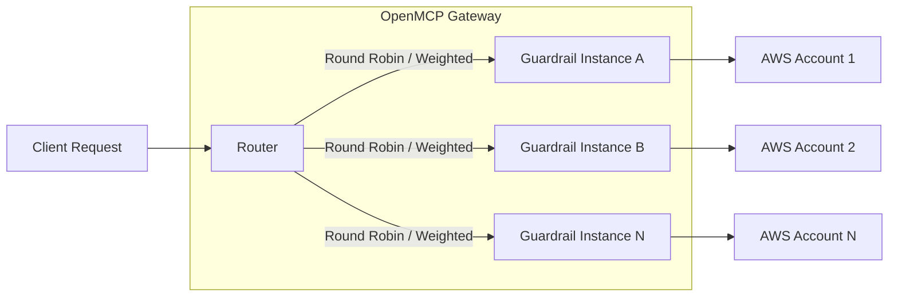
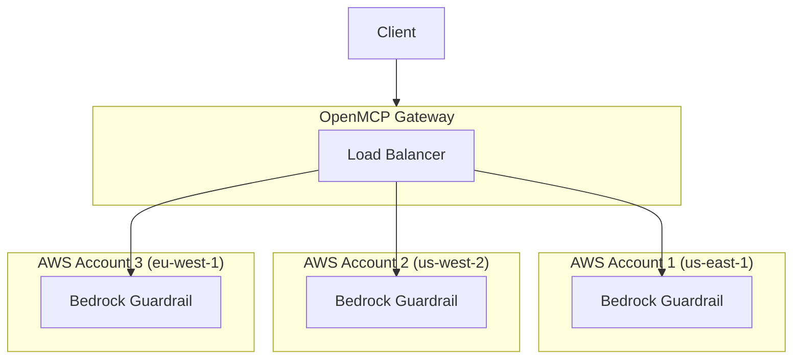

在多个护栏部署之间对护栏请求进行负载均衡。当你在护栏提供方（例如 AWS Bedrock Guardrails）上遇到速率限制，并希望将请求分发到多个账户或区域时，这非常有用。

## 工作原理



当你定义多个具有**相同 `guardrail_name`** 的护栏时，OpenMCP 会使用路由器的负载均衡策略自动在它们之间对请求进行负载均衡。

## 为什么使用护栏负载均衡？

| 使用场景 | 好处 |
|----------|---------|
| **AWS Bedrock 速率限制** | Bedrock Guardrails 有按账户的速率限制。将请求分发到多个 AWS 账户以提高吞吐量 |
| **多区域冗余** | 跨区域部署护栏以实现故障转移和更低的延迟 |
| **成本优化** | 将用量分摊到具有不同定价层级或积分的账户 |
| **A/B 测试** | 使用加权分发测试不同的护栏配置 |

## 快速入门

### 1. 定义多个同名的护栏

定义多个具有**相同 `guardrail_name`** 但不同配置的护栏条目：

<Tabs items={["Bedrock 护栏","自定义护栏","Aporia 护栏"]}>
<Tab>

```yaml showLineNumbers title="config.yaml"
model_list:
  - model_name: {{openai_large}}
    openmcp_params:
      model: openai/{{openai_large}}
      api_key: os.environ/OPENAI_API_KEY

guardrails:
  # First Bedrock guardrail - AWS Account 1
  - guardrail_name: "content-filter"
    openmcp_params:
      guardrail: bedrock/guardrail
      mode: "pre_call"
      guardrailIdentifier: "abc123"
      guardrailVersion: "1"
      aws_access_key_id: os.environ/AWS_ACCESS_KEY_ID_1
      aws_secret_access_key: os.environ/AWS_SECRET_ACCESS_KEY_1
      aws_region_name: "us-east-1"
  
  # Second Bedrock guardrail - AWS Account 2
  - guardrail_name: "content-filter"
    openmcp_params:
      guardrail: bedrock/guardrail
      mode: "pre_call"
      guardrailIdentifier: "def456"
      guardrailVersion: "1"
      aws_access_key_id: os.environ/AWS_ACCESS_KEY_ID_2
      aws_secret_access_key: os.environ/AWS_SECRET_ACCESS_KEY_2
      aws_region_name: "us-west-2"
```

</Tab>

<Tab>

```yaml showLineNumbers title="config.yaml"
model_list:
  - model_name: {{openai_large}}
    openmcp_params:
      model: openai/{{openai_large}}
      api_key: os.environ/OPENAI_API_KEY

guardrails:
  # First custom guardrail instance
  - guardrail_name: "pii-filter"
    openmcp_params:
      guardrail: custom_guardrail.PIIFilterA
      mode: "pre_call"
  
  # Second custom guardrail instance
  - guardrail_name: "pii-filter"
    openmcp_params:
      guardrail: custom_guardrail.PIIFilterB
      mode: "pre_call"
```

</Tab>

<Tab>

```yaml showLineNumbers title="config.yaml"
model_list:
  - model_name: {{openai_large}}
    openmcp_params:
      model: openai/{{openai_large}}
      api_key: os.environ/OPENAI_API_KEY

guardrails:
  # First Aporia instance
  - guardrail_name: "toxicity-filter"
    openmcp_params:
      guardrail: aporia
      mode: "pre_call"
      api_key: os.environ/APORIA_API_KEY_1
      api_base: os.environ/APORIA_API_BASE_1
  
  # Second Aporia instance
  - guardrail_name: "toxicity-filter"
    openmcp_params:
      guardrail: aporia
      mode: "pre_call"
      api_key: os.environ/APORIA_API_KEY_2
      api_base: os.environ/APORIA_API_BASE_2
```

</Tab>
</Tabs>

### 2. 启动 OpenMCP 网关

```bash showLineNumbers title="Start proxy"
openmcp --config config.yaml --detailed_debug
```

### 3. 发起请求

使用该护栏的请求将被自动负载均衡：

```bash showLineNumbers title="Test request"
curl -X POST http://localhost:4000/v1/chat/completions \
  -H "Content-Type: application/json" \
  -H "Authorization: Bearer sk-1234" \
  -d '{
    "model": "{{openai_large}}",
    "messages": [{"role": "user", "content": "Hello, how are you?"}],
    "guardrails": ["content-filter"]
  }'
```

## 加权负载均衡

分配权重以在护栏实例之间不均匀地分发流量：

```yaml showLineNumbers title="config.yaml - Weighted distribution"
guardrails:
  # 80% of traffic
  - guardrail_name: "content-filter"
    openmcp_params:
      guardrail: bedrock/guardrail
      mode: "pre_call"
      guardrailIdentifier: "primary-guard"
      guardrailVersion: "1"
      weight: 8  # Higher weight = more traffic
  
  # 20% of traffic
  - guardrail_name: "content-filter"
    openmcp_params:
      guardrail: bedrock/guardrail
      mode: "pre_call"
      guardrailIdentifier: "secondary-guard"
      guardrailVersion: "1"
      weight: 2  # Lower weight = less traffic
```

## Bedrock 护栏 - 多账户设置

AWS Bedrock Guardrails 有按账户的速率限制。以下是如何设置跨多个 AWS 账户的负载均衡：

### 架构



### 配置

```yaml showLineNumbers title="config.yaml - Multi-account Bedrock"
model_list:
  - model_name: {{anthropic}}
    openmcp_params:
      model: bedrock/us.anthropic.{{anthropic}}

guardrails:
  # AWS Account 1 - US East
  - guardrail_name: "bedrock-content-filter"
    openmcp_params:
      guardrail: bedrock/guardrail
      mode: "during_call"
      guardrailIdentifier: "guard-us-east"
      guardrailVersion: "DRAFT"
      aws_access_key_id: os.environ/AWS_ACCESS_KEY_1
      aws_secret_access_key: os.environ/AWS_SECRET_KEY_1
      aws_region_name: "us-east-1"
  
  # AWS Account 2 - US West
  - guardrail_name: "bedrock-content-filter"
    openmcp_params:
      guardrail: bedrock/guardrail
      mode: "during_call"
      guardrailIdentifier: "guard-us-west"
      guardrailVersion: "DRAFT"
      aws_access_key_id: os.environ/AWS_ACCESS_KEY_2
      aws_secret_access_key: os.environ/AWS_SECRET_KEY_2
      aws_region_name: "us-west-2"
  
  # AWS Account 3 - EU West
  - guardrail_name: "bedrock-content-filter"
    openmcp_params:
      guardrail: bedrock/guardrail
      mode: "during_call"
      guardrailIdentifier: "guard-eu-west"
      guardrailVersion: "DRAFT"
      aws_access_key_id: os.environ/AWS_ACCESS_KEY_3
      aws_secret_access_key: os.environ/AWS_SECRET_KEY_3
      aws_region_name: "eu-west-1"
```

### 测试多账户设置

```bash showLineNumbers title="Run multiple requests to verify load balancing"
# Run 10 requests - they will be distributed across accounts
for i in {1..10}; do
  curl -s -X POST http://localhost:4000/v1/chat/completions \
    -H "Content-Type: application/json" \
    -H "Authorization: Bearer sk-1234" \
    -d '{
      "model": "{{anthropic}}",
      "messages": [{"role": "user", "content": "Hello"}],
      "guardrails": ["bedrock-content-filter"]
    }' &
done
wait
```

检查代理日志以验证请求已分发到不同的 AWS 账户。

## 自定义护栏示例

创建两个用于负载均衡的自定义护栏类：

```python showLineNumbers title="custom_guardrail.py"
from openmcp.integrations.custom_guardrail import CustomGuardrail
from openmcp.proxy._types import UserAPIKeyAuth
from openmcp.caching.caching import DualCache

class PIIFilterA(CustomGuardrail):
    """PII Filter Instance A"""
    
    async def async_pre_call_hook(
        self,
        user_api_key_dict: UserAPIKeyAuth,
        cache: DualCache,
        data: dict,
        call_type: str,
    ):
        print("PIIFilterA processing request")
        # Your PII filtering logic here
        return data

class PIIFilterB(CustomGuardrail):
    """PII Filter Instance B"""
    
    async def async_pre_call_hook(
        self,
        user_api_key_dict: UserAPIKeyAuth,
        cache: DualCache,
        data: dict,
        call_type: str,
    ):
        print("PIIFilterB processing request")
        # Your PII filtering logic here
        return data
```

```yaml showLineNumbers title="config.yaml"
guardrails:
  - guardrail_name: "pii-filter"
    openmcp_params:
      guardrail: custom_guardrail.PIIFilterA
      mode: "pre_call"
  
  - guardrail_name: "pii-filter"
    openmcp_params:
      guardrail: custom_guardrail.PIIFilterB
      mode: "pre_call"
```

## 验证负载均衡

启用详细调试日志以验证负载均衡正常工作：

```bash showLineNumbers title="Start with debug logging"
openmcp --config config.yaml --detailed_debug
```

你应该会看到指示正在选择哪个护栏实例的日志：

```
Selected guardrail deployment: bedrock/guardrail (guard-us-east)
Selected guardrail deployment: bedrock/guardrail (guard-us-west)
Selected guardrail deployment: bedrock/guardrail (guard-eu-west)
...
```

## 相关内容

- [护栏快速入门](/docs/guardrails)
- [Bedrock 护栏](/docs/guardrails/bedrock)
- [自定义护栏](/docs/guardrails/custom-guardrail)
- LLM 调用的负载均衡