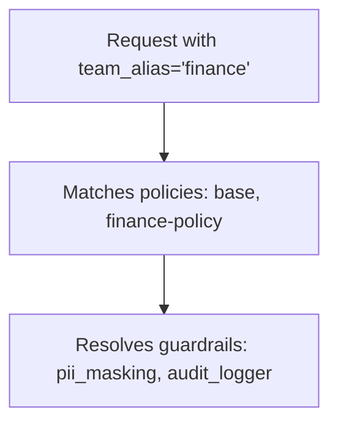

使用策略将护栏分组，并控制针对特定团队、密钥或模型运行哪些护栏。

## 为什么要使用策略？

- 为团队、密钥或模型启用/禁用特定的护栏
- 将护栏分组到单个策略中
- 从现有策略继承并按需覆盖

## 快速入门

<Tabs items={["config.yaml","UI（OpenMCP 仪表盘）"]}>
<Tab>

```yaml showLineNumbers title="config.yaml"
model_list:
  - model_name: {{openai_large}}
    openmcp_params:
      model: openai/{{openai_large}}

# 1. Define your guardrails
guardrails:
  - guardrail_name: pii_masking
    openmcp_params:
      guardrail: presidio
      mode: pre_call

  - guardrail_name: prompt_injection
    openmcp_params:
      guardrail: lakera
      mode: pre_call
      api_key: os.environ/LAKERA_API_KEY

# 2. Create a policy
policies:
  my-policy:
    guardrails:
      add:
        - pii_masking
        - prompt_injection

# 3. Attach the policy
policy_attachments:
  - policy: my-policy
    scope: "*"  # apply to all requests
```

</Tab>
<Tab>

**第 1 步：创建策略**

转到 **Policies** 标签页，点击 **+ Create New Policy**。填写策略名称、描述，并选择要添加的护栏。


</Tab>
</Tabs>

响应头会显示运行了什么：

```
x-openmcp-applied-policies: my-policy
x-openmcp-applied-guardrails: pii_masking,prompt_injection
```

## 为特定团队添加护栏

<EnterpriseFeature feature="Team/key-based policy attachment" />

你有一个全局基准，但想为特定团队添加额外的护栏。

<Tabs items={["config.yaml","UI（OpenMCP 仪表盘）"]}>
<Tab>

```yaml showLineNumbers title="config.yaml"
policies:
  global-baseline:
    guardrails:
      add:
        - pii_masking

  finance-team-policy:
    inherit: global-baseline
    guardrails:
      add:
        - strict_compliance_check
        - audit_logger

policy_attachments:
  - policy: global-baseline
    scope: "*"

  - policy: finance-team-policy
    teams:
      - finance  # team alias from /team/new
```

</Tab>
<Tab>

**选项 1：创建团队范围的附件**

转到 **Policies** > **Attachments** 标签页，点击 **+ Create New Attachment**。选择策略以及要将其限定到的团队。


**选项 2：从团队设置中附加**

转到 **Teams** > 点击某个团队 > **Settings** 标签页 > 在 **Policies** 下，选择要附加的策略。


</Tab>
</Tabs>

现在 `finance` 团队获得 `pii_masking` + `strict_compliance_check` + `audit_logger`，而其他所有人只获得 `pii_masking`。

## 为特定团队移除护栏

<EnterpriseFeature feature="Team/key-based policy attachment" />

你在全局运行护栏，但想为特定团队禁用其中一些（例如内部测试）。

```yaml showLineNumbers title="config.yaml"
policies:
  global-baseline:
    guardrails:
      add:
        - pii_masking
        - prompt_injection

  internal-team-policy:
    inherit: global-baseline
    guardrails:
      remove:
        - pii_masking  # don't need PII masking for internal testing

policy_attachments:
  - policy: global-baseline
    scope: "*"

  - policy: internal-team-policy
    teams:
      - internal-testing  # team alias from /team/new
```

现在 `internal-testing` 团队只获得 `prompt_injection`，而其他所有人获得两个护栏。

## 继承

从一个基础策略开始并在此基础上构建：

```yaml showLineNumbers title="config.yaml"
policies:
  base:
    guardrails:
      add:
        - pii_masking
        - toxicity_filter

  strict:
    inherit: base
    guardrails:
      add:
        - prompt_injection

  relaxed:
    inherit: base
    guardrails:
      remove:
        - toxicity_filter
```

你得到的结果：
- `base` → `[pii_masking, toxicity_filter]`
- `strict` → `[pii_masking, toxicity_filter, prompt_injection]`
- `relaxed` → `[pii_masking]`

## 模型条件

只针对特定模型运行护栏：

```yaml showLineNumbers title="config.yaml"
policies:
  gpt-safety:
    guardrails:
      add:
        - strict_content_filter
    condition:
      model: "gpt-5.6.*"  # regex - matches {{openai_small}}, {{openai_large}}

  bedrock-compliance:
    guardrails:
      add:
        - audit_logger
    condition:
      model:  # exact match list
        - bedrock/anthropic.{{anthropic}}
        - bedrock/anthropic.{{anthropic_large}}
```

## 附件

策略在附加之前不会产生任何效果。附件告诉 OpenMCP 在*哪里*应用每个策略。

**全局** - 在每个请求上运行：

```yaml showLineNumbers title="config.yaml"
policy_attachments:
  - policy: default
    scope: "*"
```

**特定团队**（使用来自 `/team/new` 的团队别名）：

```yaml showLineNumbers title="config.yaml"
policy_attachments:
  - policy: hipaa-compliance
    teams:
      - healthcare-team  # team alias
      - medical-research  # team alias
```

**特定密钥**（使用来自 `/key/generate` 的密钥别名，支持通配符）：

```yaml showLineNumbers title="config.yaml"
policy_attachments:
  - policy: internal-testing
    keys:
      - "dev-*"  # key alias pattern
      - "test-*"  # key alias pattern
```

**基于标签**（按元数据标签匹配密钥/团队，支持通配符）：

```yaml showLineNumbers title="config.yaml"
policy_attachments:
  - policy: hipaa-compliance
    tags:
      - "healthcare"
      - "health-*"  # wildcard - matches health-team, health-dev, etc.
```

标签从密钥和团队的 `metadata.tags` 中读取。例如，使用 `metadata: {"tags": ["healthcare"]}` 创建的密钥将匹配上面的附件。

## 测试策略匹配

调试在给定上下文下应用哪些策略和护栏。在部署前用它来验证你的策略配置。

<Tabs items={["UI（OpenMCP 仪表盘）","API"]}>
<Tab>

转到 **Policies** > **Test** 标签页。输入团队别名、密钥别名、模型或标签，点击 **Test** 以查看哪些策略匹配以及会应用哪些护栏。


</Tab>
<Tab>

```bash
curl -X POST "http://localhost:4000/policies/resolve" \
    -H "Authorization: Bearer <your_api_key>" \
    -H "Content-Type: application/json" \
    -d '{
        "tags": ["healthcare"],
        "model": "{{openai_large}}"
    }'
```

响应：

```json
{
    "effective_guardrails": ["pii_masking"],
    "matched_policies": [
        {
            "policy_name": "hipaa-compliance",
            "matched_via": "tag:healthcare",
            "guardrails_added": ["pii_masking"]
        }
    ]
}
```

</Tab>
</Tabs>

## 策略执行顺序

当若干策略匹配一个请求时，OpenMCP 会按照从最宽泛的附件到最具体的附件运行它们：先 `scope: "*"`，然后是 `teams`，接着是 `keys`，再是 `tags`，最后是 `models`。同时组合多个此类条件的附件按其最具体的条件排名，并排在相同层级中仅含单个条件的附件之后（`models: [gpt-4o]` 在 `teams: [finance], models: [gpt-4o]` 之前）。仍然并列的附件保留其在 `config.yaml` 中的顺序，其后是通过 API 或 UI 创建的附件，新的在前。在请求体中传入的策略（`"policies": [...]`）按照给出的顺序在每个附件匹配之后运行。跨层级时，顺序不取决于附件在 `config.yaml` 中的列出方式，也不取决于哪个代理 worker 处理请求。

这是流水线执行的顺序，因此全局阻止策略总是在模型范围的策略运行之前拒绝请求。它也是 `x-openmcp-applied-policies` 以及 `/policies/resolve` 和策略模拟器中 `matched_policies` 的顺序。当同一策略在多个匹配范围内附加时，它只运行一次，按其最宽泛的附件排名，`matched_via` 报告该附件（`scope:*` 而不是 `model:gpt-4o`）。

```yaml showLineNumbers title="config.yaml"
policy_attachments:
  - policy: model-policy
    models: [gpt-4o]
  - policy: team-policy
    teams: [finance]
  - policy: global-policy
    scope: "*"
```

来自 `finance` 密钥的 `gpt-4o` 请求运行 `global-policy`，然后是 `team-policy`，再是 `model-policy`，并返回 `x-openmcp-applied-policies: global-policy,team-policy,model-policy`。

## 策略流程构建器

对于条件执行（例如，仅当第一个护栏失败时才运行第二个护栏），请使用[策略流程构建器](./policy_flow_builder)定义带有每个步骤的**通过**、**失败**和可选的**错误**动作（`on_pass`、`on_fail`、`on_error`）的流水线。

## 配置参考

### `policies`

```yaml
policies:
  <policy-name>:
    description: ...
    inherit: ...
    guardrails:
      add: [...]
      remove: [...]
    condition:
      model: ...
    pipeline: ...  # optional; see Policy Flow Builder
```

| 字段 | 类型 | 描述 |
|-------|------|-------------|
| `description` | `string` | 可选。此策略的作用。 |
| `inherit` | `string` | 可选。要从中继承护栏的父策略。 |
| `guardrails.add` | `list[string]` | 要启用的护栏。 |
| `guardrails.remove` | `list[string]` | 要禁用的护栏（与继承一起使用很有用）。 |
| `condition.model` | `string` 或 `list[string]` | 可选。仅在模型匹配时应用。支持正则。 |
| `pipeline` | `object` | 可选。带每个步骤动作（`on_pass`、`on_fail`、可选 `on_error`）的有序护栏执行。请参阅[策略流程构建器](./policy_flow_builder)。 |

### `policy_attachments`

```yaml
policy_attachments:
  - policy: ...
    scope: ...
    teams: [...]
    keys: [...]
    models: [...]
    tags: [...]
```

| 字段 | 类型 | 描述 |
|-------|------|-------------|
| `policy` | `string` | **必填。**要附加的策略名称。 |
| `scope` | `string` | 使用 `"*"` 全局应用。 |
| `teams` | `list[string]` | 团队别名（来自 `/team/new`）。支持 `*` 通配符。 |
| `keys` | `list[string]` | 密钥别名（来自 `/key/generate`）。支持 `*` 通配符。 |
| `models` | `list[string]` | 模型名称。支持 `*` 通配符。 |
| `tags` | `list[string]` | 标签模式（来自密钥/团队的 `metadata.tags`）。支持 `*` 通配符。 |

### 响应头

| 响应头 | 描述 |
|--------|-------------|
| `x-openmcp-applied-policies` | 匹配此请求的策略 |
| `x-openmcp-applied-guardrails` | 实际运行的护栏 |
| `x-openmcp-policy-sources` | 每个策略匹配的原因（例如 `hipaa=tag:healthcare; baseline=scope:*`） |

## 工作原理

示例配置：

```yaml showLineNumbers title="config.yaml"
policies:
  base:
    guardrails:
      add: [pii_masking]

  finance-policy:
    inherit: base
    guardrails:
      add: [audit_logger]

policy_attachments:
  - policy: base
    scope: "*"
  - policy: finance-policy
    teams: [finance]
```



1. 请求以 `team_alias='finance'` 进入
2. 匹配 `base`（通过 `scope: "*"`）和 `finance-policy`（通过 `teams: [finance]`）
3. 解析护栏：`base` 添加 `pii_masking`，`finance-policy` 继承并添加 `audit_logger`
4. 最终护栏：`pii_masking`、`audit_logger`