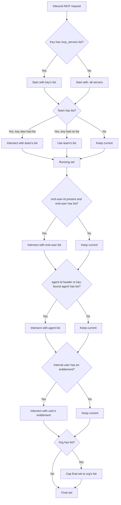

Control which MCP servers and tools can be accessed by specific keys, teams, or organizations in OpenMCP. When a client attempts to list or call tools, OpenMCP enforces access controls based on configured permissions.

## Overview

OpenMCP provides fine-grained permission management for MCP servers, allowing you to:

- **Restrict MCP access by entity**: Control which keys, teams, or organizations can access specific MCP servers
- **Tool-level filtering**: Automatically filter available tools based on entity permissions
- **Centralized control**: Manage all MCP permissions from the OpenMCP Admin UI or API
- **One-click public MCPs**: Mark specific servers as available to every OpenMCP API key when you don't need per-key restrictions

This ensures that only authorized entities can discover and use MCP tools, providing an additional security layer for your MCP infrastructure.

<Callout type="info" title="Related Documentation">

- [MCP Overview](/docs/mcp-gateway) - Learn about MCP in OpenMCP
- [MCP Cost Tracking](/docs/mcp-gateway/cost) - Track costs for MCP tool calls
- [MCP Guardrails](/docs/mcp-gateway/guardrail) - Apply security guardrails to MCP calls
- [Using MCP](/docs/mcp-gateway/usage) - How to use MCP with OpenMCP

</Callout>

## How It Works

OpenMCP supports managing permissions for MCP Servers by Keys, Teams, Organizations (entities) on OpenMCP. When a MCP client attempts to list tools, OpenMCP will only return the tools the entity has permissions to access.

When Creating a Key, Team, or Organization, you can select the allowed MCP Servers that the entity has access to.


## Permission Hierarchy

Permissions can be set at six distinct levels. When more than one level applies to a request, OpenMCP **intersects** the lists (most-restrictive wins), except for the organization level, which acts as a **ceiling**.

| Level | Source | How it composes |
|---|---|---|
| **Key** | `object_permission.mcp_servers` / `object_permission.mcp_access_groups` on the virtual key | If the key has an explicit list, it's used. |
| **Team** | Same fields on the team | If both key and team have lists, the result is the **intersection** (only servers in both). If only the team has a list, the key inherits it. |
| **End user** | Same fields on the `OpenMCP_EndUserTable` row matching `x-openmcp-end-user-id` | Intersected with the running result. Skipped if no end-user-id is present on the request. |
| **Agent** | Same fields on the agent identified by `x-openmcp-agent-id`, or the agent the key is bound to (`agent_id` set at key generation) | Intersected with the running result. Skipped if no agent applies. |
| **Internal user** | Same fields on the internal user (the human) the request authenticated as | Intersected with the running result, so it can only narrow. Skipped if that user carries no entitlement. |
| **Organization** | Same fields on the org owning the key/team | Acts as a **ceiling**; the final allowed-server set is intersected with the org's list. If the org has no list, no additional restriction. |

If no level has a list, the request can access **every** MCP server (open by default).

A key bound to an agent (`agent_id` passed to `/key/generate`) gets the same treatment as a request carrying `x-openmcp-agent-id`: the agent's list is intersected with the key's on every request the key makes. Granting a server to the key alone is not enough; the agent must also hold the grant (via the Admin UI agent edit form or `PATCH /v1/agents/{agent_id}`), otherwise requests scoped to that server are denied with an error naming the agent.



The same intersection model applies to the per-server tool-level dict `mcp_tool_permissions` (see [Per-entity Tool-Level Permissions](#per-entity-tool-level-permissions) below).

### Require keys to define their own MCP access

By default a key with an empty or absent `mcp_servers` list inherits its team's list, so the team is effectively a default that every key falls back to. Set `require_key_mcp_access_defined: true` under `general_settings` to flip that relationship: the team becomes a ceiling rather than a default, and a key with an empty list is granted no MCP servers unless it grants some explicitly (either directly in `object_permission.mcp_servers` or via an [access group](#grouping-mcps-access-groups)).

```yaml title="config.yaml" showLineNumbers
general_settings:
  require_key_mcp_access_defined: true
```

Turning this on is the recommended posture. With inheritance, every key issued under a team silently reaches every MCP server that team can reach, so access is granted implicitly and widens whenever the team's list grows; with the flag on, a key reaches only what it was explicitly granted, and the team's list caps rather than defines that grant. We're looking to make this the default behavior in a future release; follow along and weigh in on the [deprecation discussion](https://github.com/BerriAI/openmcp/discussions/32090). Enable it once your keys carry their own `object_permission.mcp_servers` (or an access group), since flipping it on before that will drop MCP access for keys that were relying on inheritance.

A team with an empty `mcp_servers` list still means "no restriction" regardless of this flag, since an empty team list never restricts. The flag only changes what an empty *key* list means when the team does have a list: inherit it (default) versus grant nothing (flag on). Access-group grants on the key remain additive, so attaching a group still reaches its servers even when the flag is enabled.

For the equivalent control at the end-user level, see [`require_end_user_mcp_access_defined`](./proxy/config_settings#general_settings---reference).

### Opting a key out of all MCP servers (`no-mcp-servers`)

To explicitly deny a key every MCP server, put the sentinel `no-mcp-servers` in its `mcp_servers` list. This mirrors the `no-default-models` sentinel used for model access. Unlike an empty list, which inherits the team's servers, `no-mcp-servers` overrides team inheritance and any additive access-group grants, so the key resolves to zero MCP servers no matter what its team allows.

```bash title="Key with no MCP access" showLineNumbers
curl -X POST "http://localhost:4000/key/generate" \
  -H "Authorization: Bearer sk-master-key" \
  -H "Content-Type: application/json" \
  -d '{
    "object_permission": {
      "mcp_servers": ["no-mcp-servers"]
    }
  }'
```

## Allow/Disallow MCP Tools
  
Control which tools are available from your MCP servers. You can either allow only specific tools or block dangerous ones.

<Tabs items={["Only Allow Specific Tools","Block Specific Tools"]}>
<Tab>

Use `allowed_tools` to specify exactly which tools users can access. All other tools will be blocked.

```yaml title="config.yaml" showLineNumbers
mcp_servers:
  github_mcp:
    url: "https://api.githubcopilot.com/mcp"
    auth_type: oauth2
    oauth2_flow: authorization_code
    authorization_url: https://github.com/login/oauth/authorize
    token_url: https://github.com/login/oauth/access_token
    client_id: os.environ/GITHUB_OAUTH_CLIENT_ID
    client_secret: os.environ/GITHUB_OAUTH_CLIENT_SECRET
    scopes: ["public_repo", "user:email"]
    allowed_tools: ["list_tools"]
    # only list_tools will be available
```

**Use this when:**
- You want strict control over which tools are available
- You're in a high-security environment
- You're testing a new MCP server with limited tools

</Tab>
<Tab>

Use `disallowed_tools` to block specific tools. All other tools will be available.

```yaml title="config.yaml" showLineNumbers
mcp_servers:
  github_mcp:
    url: "https://api.githubcopilot.com/mcp"
    auth_type: oauth2
    oauth2_flow: authorization_code
    authorization_url: https://github.com/login/oauth/authorize
    token_url: https://github.com/login/oauth/access_token
    client_id: os.environ/GITHUB_OAUTH_CLIENT_ID
    client_secret: os.environ/GITHUB_OAUTH_CLIENT_SECRET
    scopes: ["public_repo", "user:email"]
    disallowed_tools: ["repo_delete"]
    # only repo_delete will be blocked
```

**Use this when:**
- Most tools are safe, but you want to block a few dangerous ones
- You want to prevent expensive API calls
- You're gradually adding restrictions to an existing server

</Tab>
</Tabs>

### Important Notes

- If you specify both `allowed_tools` and `disallowed_tools`, the allowed list takes priority
- Tool names are case-sensitive

## Public MCP Servers (allow_all_keys)

Some MCP servers are meant to be shared broadly: internal knowledge bases, calendar integrations, or other low-risk utilities where every team should be able to connect without requesting access. Instead of adding those servers to every key, team, or organization, enable the new `allow_all_keys` toggle.

<Tabs items={["UI","config.yaml"]}>
<Tab>

1. Open **MCP Servers → Add / Edit** in the Admin UI.
2. Expand **Permission Management / Access Control**.
3. Toggle **Allow All OpenMCP Keys** on.

 

The toggle makes the server “public” without touching existing access groups.

</Tab>
<Tab>

Set `allow_all_keys: true` to mark the server as public:

```yaml title="Make an MCP server public" showLineNumbers
mcp_servers:
  deepwiki:
    url: https://mcp.deepwiki.com/mcp
    allow_all_keys: true
```

</Tab>
</Tabs>

### When to use it

- You have shared MCP utilities where fine-grained ACLs would only add busywork.
- You want a “default enabled” experience for internal users, while still being able to layer tool-level restrictions.
- You’re onboarding new teams and want the safest MCPs available out of the box.

Once enabled, OpenMCP automatically includes the server for every key during tool discovery/calls, with no extra virtual-key or team configuration required.

---

## Allow/Disallow MCP Tool Parameters

Control which parameters are allowed for specific MCP tools using the `allowed_params` configuration. This provides fine-grained control over tool usage by restricting the parameters that can be passed to each tool.

### Configuration

`allowed_params` is a dictionary that maps tool names to lists of allowed parameter names. When configured, only the specified parameters will be accepted for that tool - any other parameters will be rejected with a 403 error.

```yaml title="config.yaml with allowed_params" showLineNumbers
mcp_servers:
  deepwiki_mcp:
    url: https://mcp.deepwiki.com/mcp
    transport: "http"
    auth_type: "none"
    allowed_params:
      # Tool name: list of allowed parameters
      read_wiki_contents: ["status"]
  
  my_api_mcp:
    url: "https://my-api-server.com"
    auth_type: "api_key"
    auth_value: "my-key"
    allowed_params:
      # Using unprefixed tool name
      getpetbyid: ["status"]
      # Using prefixed tool name (both formats work)
      my_api_mcp-findpetsbystatus: ["status", "limit"]
      # Another tool with multiple allowed params
      create_issue: ["title", "body", "labels"]
```

### How It Works

1. **Tool-specific filtering**: Each tool can have its own list of allowed parameters
2. **Flexible naming**: Tool names can be specified with or without the server prefix (e.g., both `"getpetbyid"` and `"my_api_mcp-getpetbyid"` work)
3. **Whitelist approach**: Only parameters in the allowed list are permitted
4. **Unlisted tools**: If `allowed_params` is not set, all parameters are allowed
5. **Error handling**: Requests with disallowed parameters receive a 403 error with details about which parameters are allowed

### Example Request Behavior

With the configuration above, here's how requests would be handled:

**✅ Allowed Request:**
```json
{
  "tool": "read_wiki_contents",
  "arguments": {
    "status": "active"
  }
}
```

**❌ Rejected Request:**
```json
{
  "tool": "read_wiki_contents",
  "arguments": {
    "status": "active",
    "limit": 10  // This parameter is not allowed
  }
}
```

**Error Response:**
```json
{
  "error": "Parameters ['limit'] are not allowed for tool read_wiki_contents. Allowed parameters: ['status']. Contact proxy admin to allow these parameters."
}
```

### Use Cases

- **Security**: Prevent users from accessing sensitive parameters or dangerous operations
- **Cost control**: Restrict expensive parameters (e.g., limiting result counts)
- **Compliance**: Enforce parameter usage policies for regulatory requirements
- **Staged rollouts**: Gradually enable parameters as tools are tested
- **Multi-tenant isolation**: Different parameter access for different user groups

### Combining with Tool Filtering

`allowed_params` works alongside `allowed_tools` and `disallowed_tools` for complete control:

```yaml title="Combined filtering example" showLineNumbers
mcp_servers:
  github_mcp:
    url: "https://api.githubcopilot.com/mcp"
    auth_type: oauth2
    oauth2_flow: authorization_code
    authorization_url: https://github.com/login/oauth/authorize
    token_url: https://github.com/login/oauth/access_token
    client_id: os.environ/GITHUB_OAUTH_CLIENT_ID
    client_secret: os.environ/GITHUB_OAUTH_CLIENT_SECRET
    scopes: ["public_repo", "user:email"]
    # Only allow specific tools
    allowed_tools: ["create_issue", "list_issues", "search_issues"]
    # Block dangerous operations
    disallowed_tools: ["delete_repo"]
    # Restrict parameters per tool
    allowed_params:
      create_issue: ["title", "body", "labels"]
      list_issues: ["state", "sort", "perPage"]
      search_issues: ["query", "sort", "order", "perPage"]
```

This configuration ensures that:
1. Only the three listed tools are available
2. The `delete_repo` tool is explicitly blocked
3. Each tool can only use its specified parameters

---

## MCP Server Access Control

OpenMCP Proxy provides two methods for controlling access to specific MCP servers:

1. **URL-based Namespacing** - Use URL paths to directly access specific servers or access groups
2. **Header-based Namespacing** - Use the `x-mcp-servers` header to specify which servers to access

---

### Method 1: URL-based Namespacing

OpenMCP Proxy supports URL-based namespacing for MCP servers using the format `/<servers or access groups>/mcp`. This allows you to:

- **Direct URL Access**: Point MCP clients directly to specific servers or access groups via URL
- **Simplified Configuration**: Use URLs instead of headers for server selection
- **Access Group Support**: Use access group names in URLs for grouped server access

#### URL Format

```
<your-openmcp-proxy-base-url>/<server_alias_or_access_group>/mcp
```

**Examples:**
- `/github_mcp/mcp` - Access tools from the "github_mcp" MCP server
- `/zapier/mcp` - Access tools from the "zapier" MCP server  
- `/dev_group/mcp` - Access tools from all servers in the "dev_group" access group
- `/github_mcp,zapier/mcp` - Access tools from multiple specific servers

#### Usage Examples

<Tabs items={["OpenAI API","OpenMCP Proxy","Cursor IDE"]}>
<Tab>

```bash title="cURL Example with URL Namespacing" showLineNumbers
curl --location 'https://api.openai.com/v1/responses' \
--header 'Content-Type: application/json' \
--header "Authorization: Bearer $OPENAI_API_KEY" \
--data '{
    "model": "{{openai_large}}",
    "tools": [
        {
            "type": "mcp",
            "server_label": "openmcp",
            "server_url": "<your-openmcp-proxy-base-url>/github_mcp/mcp",
            "require_approval": "never",
            "headers": {
                "x-openmcp-api-key": "Bearer YOUR_OPENMCP_API_KEY"
            }
        }
    ],
    "input": "Run available tools",
    "tool_choice": "required"
}'
```

This example uses URL namespacing to access only the "github" MCP server.

</Tab>

<Tab>

```bash title="cURL Example with URL Namespacing" showLineNumbers
curl --location '<your-openmcp-proxy-base-url>/v1/responses' \
--header 'Content-Type: application/json' \
--header "Authorization: Bearer $OPENMCP_API_KEY" \
--data '{
    "model": "{{openai_large}}",
    "tools": [
        {
            "type": "mcp",
            "server_label": "openmcp",
            "server_url": "openmcp_proxy",
            "require_approval": "never",
            "headers": {
                "x-openmcp-api-key": "Bearer YOUR_OPENMCP_API_KEY"
            }
        }
    ],
    "input": "Run available tools",
    "tool_choice": "required"
}'
```

This example uses the `x-mcp-servers` header to access all servers in the "dev_group" access group. Use `server_url: "openmcp_proxy"` when calling the proxy's `/v1/responses` endpoint; do not use the full proxy URL.

</Tab>

<Tab>

```json title="Cursor MCP Configuration with URL Namespacing" showLineNumbers
{
  "mcpServers": {
    "OpenMCP": {
      "url": "<your-openmcp-proxy-base-url>/github_mcp,zapier/mcp",
      "headers": {
        "x-openmcp-api-key": "Bearer $OPENMCP_API_KEY"
      }
    }
  }
}
```

This configuration uses URL namespacing to access tools from both "github" and "zapier" MCP servers.

</Tab>
</Tabs>

#### Benefits of URL Namespacing

- **Direct Access**: No need for additional headers to specify servers
- **Clean URLs**: Self-documenting URLs that clearly indicate which servers are accessible
- **Access Group Support**: Use access group names for grouped server access
- **Multiple Servers**: Specify multiple servers in a single URL with comma separation
- **Simplified Configuration**: Easier setup for MCP clients that prefer URL-based configuration

---

### Method 2: Header-based Namespacing

You can choose to access specific MCP servers and only list their tools using the `x-mcp-servers` header. This header allows you to:
- Limit tool access to one or more specific MCP servers
- Control which tools are available in different environments or use cases

The header accepts a comma-separated list of server aliases: `"alias_1,Server2,Server3"`

**Notes:**
- If the header is not provided, tools from all available MCP servers will be accessible
- This method works with the standard OpenMCP MCP endpoint

<Tabs items={["OpenAI API","OpenMCP Proxy","Cursor IDE"]}>
<Tab>

```bash title="cURL Example with Header Namespacing" showLineNumbers
curl --location 'https://api.openai.com/v1/responses' \
--header 'Content-Type: application/json' \
--header "Authorization: Bearer $OPENAI_API_KEY" \
--data '{
    "model": "{{openai_large}}",
    "tools": [
        {
            "type": "mcp",
            "server_label": "openmcp",
            "server_url": "<your-openmcp-proxy-base-url>/mcp/",
            "require_approval": "never",
            "headers": {
                "x-openmcp-api-key": "Bearer YOUR_OPENMCP_API_KEY",
                "x-mcp-servers": "alias_1"
            }
        }
    ],
    "input": "Run available tools",
    "tool_choice": "required"
}'
```

In this example, the request will only have access to tools from the "alias_1" MCP server.

</Tab>

<Tab>

```bash title="cURL Example with Header Namespacing" showLineNumbers
curl --location '<your-openmcp-proxy-base-url>/v1/responses' \
--header 'Content-Type: application/json' \
--header "Authorization: Bearer $OPENMCP_API_KEY" \
--data '{
    "model": "{{openai_large}}",
    "tools": [
        {
            "type": "mcp",
            "server_label": "openmcp",
            "server_url": "openmcp_proxy",
            "require_approval": "never",
            "headers": {
                "x-openmcp-api-key": "Bearer YOUR_OPENMCP_API_KEY",
                "x-mcp-servers": "alias_1,Server2"
            }
        }
    ],
    "input": "Run available tools",
    "tool_choice": "required"
}'
```

This configuration restricts the request to only use tools from the specified MCP servers. Use `server_url: "openmcp_proxy"` when calling the proxy's `/v1/responses` endpoint.

</Tab>

<Tab>

```json title="Cursor MCP Configuration with Header Namespacing" showLineNumbers
{
  "mcpServers": {
    "OpenMCP": {
      "url": "<your-openmcp-proxy-base-url>/mcp/",
      "headers": {
        "x-openmcp-api-key": "Bearer $OPENMCP_API_KEY",
        "x-mcp-servers": "alias_1,Server2"
      }
    }
  }
}
```

This configuration in Cursor IDE settings will limit tool access to only the specified MCP servers.

</Tab>
</Tabs>

---

### Comparison: Header vs URL Namespacing

| Feature | Header Namespacing | URL Namespacing |
|---------|-------------------|-----------------|
| **Method** | Uses `x-mcp-servers` header | Uses URL path `/<servers>/mcp` |
| **Endpoint** | Standard `openmcp_proxy` endpoint | Custom `/<servers>/mcp` endpoint |
| **Configuration** | Requires additional header | Self-contained in URL |
| **Multiple Servers** | Comma-separated in header | Comma-separated in URL path |
| **Access Groups** | Supported via header | Supported via URL path |
| **Client Support** | Works with all MCP clients | Works with URL-aware MCP clients |
| **Use Case** | Dynamic server selection | Fixed server configuration |

<Tabs items={["OpenAI API","OpenMCP Proxy","Cursor IDE"]}>
<Tab>

```bash title="cURL Example with Server Segregation" showLineNumbers
curl --location 'https://api.openai.com/v1/responses' \
--header 'Content-Type: application/json' \
--header "Authorization: Bearer $OPENAI_API_KEY" \
--data '{
    "model": "{{openai_large}}",
    "tools": [
        {
            "type": "mcp",
            "server_label": "openmcp",
            "server_url": "<your-openmcp-proxy-base-url>/mcp/",
            "require_approval": "never",
            "headers": {
                "x-openmcp-api-key": "Bearer YOUR_OPENMCP_API_KEY",
                "x-mcp-servers": "alias_1"
            }
        }
    ],
    "input": "Run available tools",
    "tool_choice": "required"
}'
```

In this example, the request will only have access to tools from the "alias_1" MCP server.

</Tab>

<Tab>

```bash title="cURL Example with Server Segregation" showLineNumbers
curl --location '<your-openmcp-proxy-base-url>/v1/responses' \
--header 'Content-Type: application/json' \
--header "Authorization: Bearer $OPENMCP_API_KEY" \
--data '{
    "model": "{{openai_large}}",
    "tools": [
        {
            "type": "mcp",
            "server_label": "openmcp",
            "server_url": "openmcp_proxy",
            "require_approval": "never",
            "headers": {
                "x-openmcp-api-key": "Bearer YOUR_OPENMCP_API_KEY",
                "x-mcp-servers": "alias_1,Server2"
            }
        }
    ],
    "input": "Run available tools",
    "tool_choice": "required"
}'
```

This configuration restricts the request to only use tools from the specified MCP servers.

</Tab>

<Tab>

```json title="Cursor MCP Configuration with Server Segregation" showLineNumbers
{
  "mcpServers": {
    "OpenMCP": {
      "url": "openmcp_proxy",
      "headers": {
        "x-openmcp-api-key": "Bearer $OPENMCP_API_KEY",
        "x-mcp-servers": "alias_1,Server2"
      }
    }
  }
}
```

This configuration in Cursor IDE settings will limit tool access to only the specified MCP server.

</Tab>
</Tabs>

### Grouping MCPs (Access Groups)

MCP Access Groups allow you to group multiple MCP servers together for easier management.

#### 1. Create an Access Group

##### A. Creating Access Groups using Config:

```yaml title="Creating access groups for MCP using the config" showLineNumbers
mcp_servers:
  "deepwiki_mcp":
    url: https://mcp.deepwiki.com/mcp
    transport: "http"
    auth_type: "none"
    access_groups: ["dev_group"]
```

While adding `mcp_servers` using the config:
- Pass in a list of strings inside `access_groups`
- These groups can then be used for segregating access using keys, teams and MCP clients using headers

##### B. Creating Access Groups using UI

To create an access group:
- Go to MCP Servers in the OpenMCP UI
- Click "Add a New MCP Server" 
- Under "MCP Access Groups", create a new group (e.g., "dev_group") by typing it
- Add the same group name to other servers to group them together


#### 2. Use Access Group in Cursor

Include the access group name in the `x-mcp-servers` header:

```json title="Cursor Configuration with Access Groups" showLineNumbers
{
  "mcpServers": {
    "OpenMCP": {
      "url": "openmcp_proxy",
      "headers": {
        "x-openmcp-api-key": "Bearer $OPENMCP_API_KEY",
        "x-mcp-servers": "dev_group"
      }
    }
  }
}
```

This gives you access to all servers in the "dev_group" access group.
- Which means that if deepwiki server (and any other servers) which have the access group `dev_group` assigned to them will be available for tool calling

#### Advanced: Connecting Access Groups to API Keys

When creating API keys, you can assign them to specific access groups for permission management:

- Go to "Keys" in the OpenMCP UI and click "Create Key"
- Select the desired MCP access groups from the dropdown
- The key will have access to all MCP servers in those groups
- This is reflected in the Test Key page


## Per-entity Tool-Level Permissions

Control which tools different teams can access from the same MCP server. For example, give your Engineering team access to `list_repositories`, `create_issue`, and `search_code`, while Sales only gets `search_code` and `close_issue`.

This video shows how to set allowed tools for a Key, Team, or Organization.

<iframe width="840" height="500" src="https://www.loom.com/embed/7464d444c3324078892367272fe50745" frameBorder="0" webkitallowfullscreen="true" mozallowfullscreen="true" allowFullScreen={true}></iframe>

### `mcp_tool_permissions` API

`object_permission.mcp_tool_permissions` is a `Dict[server_id, List[tool_name]]` on the key, team, end-user, agent, internal user, or organization. It's evaluated **after** server-level access has been resolved (see [Permission Hierarchy](#permission-hierarchy) above) and applies the same six-level intersection: most-restrictive wins, organization acts as a ceiling.

This is distinct from the server-registration-level `allowed_tools` / `disallowed_tools` (which apply to **every** caller of the server). `mcp_tool_permissions` lets you carve out per-team subsets without changing the server config.

<Tabs items={["On a Key","On a Team","On an Agent","On an Internal User"]}>
<Tab>

```bash title="Engineering key — full GitHub access" showLineNumbers
curl -X POST "http://localhost:4000/key/generate" \
  -H "Authorization: Bearer sk-master-key" \
  -H "Content-Type: application/json" \
  -d '{
    "object_permission": {
      "mcp_servers": ["github_mcp"],
      "mcp_tool_permissions": {
        "github_mcp": ["list_repositories", "create_issue", "search_code"]
      }
    }
  }'
```

```bash title="Sales key — read-only on the same server" showLineNumbers
curl -X POST "http://localhost:4000/key/generate" \
  -H "Authorization: Bearer sk-master-key" \
  -H "Content-Type: application/json" \
  -d '{
    "object_permission": {
      "mcp_servers": ["github_mcp"],
      "mcp_tool_permissions": {
        "github_mcp": ["search_code", "close_issue"]
      }
    }
  }'
```

</Tab>
<Tab>

```bash title="Team-wide tool subset (all keys inherit)" showLineNumbers
curl -X POST "http://localhost:4000/team/new" \
  -H "Authorization: Bearer sk-master-key" \
  -H "Content-Type: application/json" \
  -d '{
    "team_alias": "engineering",
    "object_permission": {
      "mcp_servers": ["github_mcp", "deepwiki_mcp"],
      "mcp_tool_permissions": {
        "github_mcp": ["list_repositories", "create_issue", "search_code"]
      }
    }
  }'
```

When the key also sets `mcp_tool_permissions` for `github_mcp`, the resulting tool list is the **intersection** of the two.

</Tab>
<Tab>

When an agent (identified by `x-openmcp-agent-id`) calls MCP tools, the agent's own `mcp_tool_permissions` participate in the intersection. Useful for capping what an autonomous agent can do regardless of which key originally invoked it.

```bash showLineNumbers
curl -X PATCH "http://localhost:4000/v1/agents/{agent_id}" \
  -H "Authorization: Bearer sk-master-key" \
  -H "Content-Type: application/json" \
  -d '{
    "object_permission": {
      "mcp_servers": ["github_mcp"],
      "mcp_tool_permissions": {
        "github_mcp": ["search_code"]
      }
    }
  }'
```

</Tab>
<Tab>

An entitlement on the internal user says which tools that *person* may run, whatever key they happen to be holding. It only ever narrows: the tools they get on a server are the intersection of their entitlement with what the key, team, agent and organization already allow.

```bash title="Grant one person a single tool on one server" showLineNumbers
curl -X POST "http://localhost:4000/user/update" \
  -H "Authorization: Bearer sk-master-key" \
  -H "Content-Type: application/json" \
  -d '{
    "user_id": "alice",
    "object_permission": {
      "mcp_servers": ["github_mcp"],
      "mcp_tool_permissions": {"github_mcp": ["list_issues"]}
    }
  }'
```

`/user/new` takes the same `object_permission` block at creation time. See [Entitling a person rather than a credential](#per-user-tool-permissions) below for the read-back and the resolution details.

</Tab>
</Tabs>

### Entitling a person rather than a credential

Every other level describes a credential or a group: the key's scope, the team's scope, the organization's ceiling. The internal user level describes the human, so an admin can say which people may perform which MCP tool calls without chasing down every key those people hold

The grant lives on the internal user's `object_permission` and uses the same fields as everywhere else, `mcp_servers`, `mcp_access_groups` and `mcp_tool_permissions`. It resolves as a ceiling on both axes: the servers the person reaches are intersected with what their key, team, agent and organization allow, and so are the tools they may run on each of those servers. Someone entitled to a server their key does not grant still cannot reach it. In resolution order the key and team come first, then the end user, then the agent, then the internal user, then the organization ceiling

A user carrying no entitlement places no ceiling, so nothing changes for an existing deployment until an admin grants someone one. Servers named only as keys of `mcp_tool_permissions` count as entitled, so granting one tool never means naming its server twice

Read the grant back with `GET /v2/user/info`, which now returns the linked `object_permission`:

```bash showLineNumbers
curl -X GET "http://localhost:4000/v2/user/info?user_id=alice" \
  -H "Authorization: Bearer sk-master-key" \
  | jq '.object_permission | {mcp_servers, mcp_tool_permissions}'
```

```json
{
  "mcp_servers": ["github_mcp"],
  "mcp_tool_permissions": {"github_mcp": ["list_issues"]}
}
```

The full block also carries `object_permission_id`, `mcp_access_groups` and the remaining object-permission fields

The entitlement is applied at `tools/list` time and again at `tools/call` time, so a tool outside it is never advertised and a client that hardcodes the name is still refused. The refusal arrives inside the MCP result with `isError: true`:

```text
Tool 'delete_repo' is not allowed for your key/team on server 'issue_tracker'. Contact proxy admin for access.
```

The same grant is editable from the Admin UI on the internal user's detail page under **Internal Users**.


<Callout type="info" title="Only a proxy admin can set this">

`/user/new` and `/user/update` accept `object_permission` from a proxy admin only. A non-admin editing their own record is rejected, since an empty grant list means "no restriction" and a self-write would otherwise lift a ceiling an admin placed on them.

</Callout>

<Callout type="info" title="An admin role is not a waiver">

A caller with an admin role and no explicit key-level `mcp_servers` list normally sees the whole MCP server registry. Once that human carries an entitlement of their own, that shortcut no longer applies and the entitlement binds them; the admin role widens what the credential reaches, and leaves the scope attached to the person in place.

</Callout>

## Rate Limiting per MCP Server

Cap how many tool calls a key or team can make to a specific MCP server per minute with `mcp_rpm_limit`. This is a `Dict[str, int]` keyed by MCP server name, where the name is the server's alias if one is set, otherwise the configured server name. Each entry sets the requests-per-minute limit for that one server, so a limit on `github` does not affect calls to `slack`. Servers without an entry are uncapped.

Once the limit is exceeded within the window, further tool calls to that server return `429 Too Many Requests` until the window rolls over. The cap only applies to actual MCP tool calls; it has no effect on regular LLM requests.

<Tabs items={["On a Key","On a Team"]}>
<Tab>

```bash title="Cap a key at 100 github + 200 slack calls per minute" showLineNumbers
curl -X POST "http://localhost:4000/key/generate" \
  -H "Authorization: Bearer sk-master-key" \
  -H "Content-Type: application/json" \
  -d '{
    "mcp_rpm_limit": {"github": 100, "slack": 200},
    "object_permission": {"mcp_servers": ["github", "slack"]}
  }'
```

</Tab>
<Tab>

```bash title="Cap a team at 500 github calls per minute (all keys share the counter)" showLineNumbers
curl -X POST "http://localhost:4000/team/new" \
  -H "Authorization: Bearer sk-master-key" \
  -H "Content-Type: application/json" \
  -d '{
    "team_alias": "engineering",
    "mcp_rpm_limit": {"github": 500},
    "object_permission": {"mcp_servers": ["github"]}
  }'
```

</Tab>
</Tabs>

`mcp_rpm_limit` is also accepted on `/key/update`, `/team/update`, `/user/new`, and `/user/update`. A key-level limit takes precedence over a team-level limit for the same server; the team limit otherwise applies to every key on the team as a shared counter.

## Dashboard View Modes

Proxy admins can also control what non-admins see inside the MCP dashboard via `general_settings.user_mcp_management_mode`:

- `restricted` *(default)* – users only see servers that their team explicitly has access to.
- `view_all` – every dashboard user can see the full MCP server list. 

```yaml title="Config example"
general_settings:
  user_mcp_management_mode: view_all
```

This is useful when you want discoverability for MCP offerings without granting additional execution privileges.

## Publish MCP Registry

If you want other systems (for example external agent frameworks such as MCP-capable IDEs running outside your network) to automatically discover the MCP servers hosted on OpenMCP, you can expose a Model Context Protocol Registry endpoint. This registry lists the built-in OpenMCP MCP server and every server you have configured, using the [official MCP Registry spec](https://github.com/modelcontextprotocol/registry).

1. Set `enable_mcp_registry: true` under `general_settings` in your proxy config (or DB settings) and restart the proxy.
2. OpenMCP will serve the registry at `GET /v1/mcp/registry.json`.
3. Each entry points to either `/mcp` (built-in server) or `/{mcp_server_name}/mcp` for your custom servers, so clients can connect directly using the advertised Streamable HTTP URL.

<Callout type="info" title="Permissions still apply">

The registry only advertises server URLs. Actual access control is still enforced by OpenMCP when the client connects to `/mcp` or `/{server}/mcp`, so publishing the registry does not bypass per-key permissions.

</Callout>
