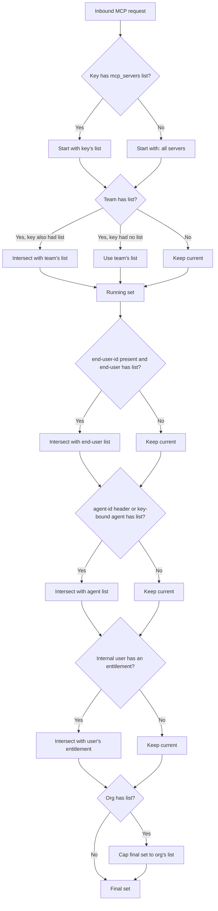

在 OpenMCP 中控制哪些 MCP 服务端和工具可以被特定的密钥、团队或组织访问。当客户端试图列出或调用工具时，OpenMCP 会根据配置的权限执行访问控制。

## 概述

OpenMCP 为 MCP 服务端提供细粒度的权限管理，让你可以：

- **按实体限制 MCP 访问**：控制哪些密钥、团队或组织可以访问特定的 MCP 服务端
- **工具级过滤**：根据实体权限自动过滤可用的工具
- **集中控制**：从 OpenMCP Admin UI 或 API 管理所有 MCP 权限
- **一键公开 MCP 服务端**：当你不需要按密钥限制时，将特定服务端标记为对所有 OpenMCP API 密钥可用

这可以确保只有被授权的实体才能发现和使用 MCP 工具，为你的 MCP 基础设施提供额外的安全层。

<Callout type="info" title="Related Documentation">

- [MCP Overview](/docs/mcp-gateway) - 了解 OpenMCP 中的 MCP
- [MCP Cost Tracking](/docs/mcp-gateway/cost) - 跟踪 MCP 工具调用的成本
- [MCP Guardrails](/docs/mcp-gateway/guardrail) - 为 MCP 调用应用安全护栏
- [Using MCP](/docs/mcp-gateway/usage) - 如何在 OpenMCP 中使用 MCP

</Callout>

## 工作原理

OpenMCP 支持通过密钥、团队、组织（实体）管理 MCP 服务端的权限。当 MCP 客户端尝试列出工具时，OpenMCP 只会返回该实体有权限访问的工具。

创建密钥、团队或组织时，你可以选择该实体有权访问的 MCP 服务端。


## 权限层级

权限可以在六个不同的层级设置。当同一请求适用多个层级时，OpenMCP 会**取交集**（最严格的限制生效），但组织层级除外，它作为**上限（ceiling）**起作用。

| 层级 | 来源 | 组合方式 |
|---|---|---|
| **密钥** | 虚拟密钥上的 `object_permission.mcp_servers` / `object_permission.mcp_access_groups` | 如果密钥有明确的列表，就使用该列表。 |
| **团队** | 团队上的相同字段 | 如果密钥和团队都有列表，则结果为**交集**（仅两个列表都包含的服务端）。如果只有团队有列表，则密钥继承该列表。 |
| **最终用户** | 与 `x-openmcp-end-user-id` 匹配的 `OpenMCP_EndUserTable` 行上的相同字段 | 与当前结果取交集。如果请求中没有 end-user-id，则跳过。 |
| **智能体** | 由 `x-openmcp-agent-id` 标识的智能体上的相同字段，或密钥绑定的智能体（在密钥生成时设置 `agent_id`） | 与当前结果取交集。如果没有适用的智能体，则跳过。 |
| **内部用户** | 请求认证身份对应的内部用户（自然人）上的相同字段 | 与当前结果取交集，因此只会收紧。如果该用户没有携带任何授权，则跳过。 |
| **组织** | 拥有该密钥/团队的组织上的相同字段 | 作为**上限**；最终允许的服务端集合会与组织的列表取交集。如果组织没有列表，则不施加额外限制。 |

如果任何层级都没有列表，请求可以访问**所有** MCP 服务端（默认开放）。

绑定到智能体的密钥（生成时传入了 `agent_id`）会与携带 `x-openmcp-agent-id` 的请求获得相同的处理：在密钥发出的每个请求中，智能体的列表都会与密钥的列表取交集。仅将服务端授权给密钥是不够的；智能体也必须持有该授权（通过 Admin UI 的智能体编辑表单或 `PATCH /v1/agents/{agent_id}`），否则针对该服务端的请求会被拒绝，并返回一个指明智能体名称的错误。



同样的交集模型也适用于每个服务端的工具级 dict `mcp_tool_permissions`（请参阅下面的[按实体工具级权限](#per-entity-tool-level-permissions)）。

### 要求密钥定义自己的 MCP 访问权限

默认情况下，`mcp_servers` 列表为空或不存在的密钥会继承其团队的列表，因此团队实际上是每个密钥回退的默认值。在 `general_settings` 下设置 `require_key_mcp_access_defined: true` 可以反转这种关系：团队成为上限而不是默认值，而列表为空的密钥不会被授予任何 MCP 服务端，除非它明确授予（要么直接在 `object_permission.mcp_servers` 中，要么通过[访问组](#grouping-mcps-access-groups)）。

```yaml title="config.yaml" showLineNumbers
general_settings:
  require_key_mcp_access_defined: true
```

开启此选项是推荐的做法。在继承模式下，团队下签发的每个密钥都会静默地到达该团队所能到达的每个 MCP 服务端，因此访问是被隐式授予的，并且每当团队列表增长时都会被放大；开启该标志后，密钥只能到达明确授予的内容，团队的列表起到封顶而非定义授权的作用。我们计划在未来的版本中将其设为默认行为；请关注并参与[废弃讨论](https://github.com/BerriAI/openmcp/discussions/32090)。请在你的密钥都携带了各自的 `object_permission.mcp_servers`（或访问组）之后再启用它，因为在此之前启用会让依赖继承的密钥失去 MCP 访问权限。

无论此标志如何，`mcp_servers` 列表为空的团队仍表示“无限制”，因为空的团队列表从不限制。该标志只改变当团队确实有列表时，空的*密钥*列表的含义：继承它（默认）与不授予任何内容（开启标志）。密钥上的访问组授权仍是加法式的，因此即使标志开启，附加某个组后仍能访问其服务端。

要获得最终用户级别的等价控制，请参阅 [`require_end_user_mcp_access_defined`](./proxy/config_settings#general_settings---reference)。

### 将密钥排除在所有 MCP 服务端之外（`no-mcp-servers`）

要明确拒绝某个密钥访问所有 MCP 服务端，请在其 `mcp_servers` 列表中加入哨兵值 `no-mcp-servers`。这与用于模型访问的 `no-default-models` 哨兵值类似。与继承团队服务端的空列表不同，`no-mcp-servers` 会覆盖团队的继承以及任何加法的访问组授权，因此无论其团队允许什么，该密钥最终解析到的 MCP 服务端数量都为零。

```bash title="Key with no MCP access" showLineNumbers
curl -X POST "http://localhost:4000/key/generate" \
  -H "Authorization: Bearer sk-master-key" \
  -H "Content-Type: application/json" \
  -d '{
    "object_permission": {
      "mcp_servers": ["no-mcp-servers"]
    }
  }'
```

## 允许/禁止 MCP 工具
  
控制哪些工具可以从你的 MCP 服务端获得。你可以只允许特定工具，也可以阻止危险工具。

<Tabs items={["Only Allow Specific Tools","Block Specific Tools"]}>
<Tab>

使用 `allowed_tools` 精确定义用户可以访问的工具。所有其他工具都会被阻止。

```yaml title="config.yaml" showLineNumbers
mcp_servers:
  github_mcp:
    url: "https://api.githubcopilot.com/mcp"
    auth_type: oauth2
    oauth2_flow: authorization_code
    authorization_url: https://github.com/login/oauth/authorize
    token_url: https://github.com/login/oauth/access_token
    client_id: os.environ/GITHUB_OAUTH_CLIENT_ID
    client_secret: os.environ/GITHUB_OAUTH_CLIENT_SECRET
    scopes: ["public_repo", "user:email"]
    allowed_tools: ["list_tools"]
    # only list_tools will be available
```

**何时使用：**
- 你需要严格控制在哪些工具可用
- 你处于高安全环境
- 你正在测试一个工具有限的 MCP 服务端

</Tab>
<Tab>

使用 `disallowed_tools` 阻止特定工具。所有其他工具都可以使用。

```yaml title="config.yaml" showLineNumbers
mcp_servers:
  github_mcp:
    url: "https://api.githubcopilot.com/mcp"
    auth_type: oauth2
    oauth2_flow: authorization_code
    authorization_url: https://github.com/login/oauth/authorize
    token_url: https://github.com/login/oauth/access_token
    client_id: os.environ/GITHUB_OAUTH_CLIENT_ID
    client_secret: os.environ/GITHUB_OAUTH_CLIENT_SECRET
    scopes: ["public_repo", "user:email"]
    disallowed_tools: ["repo_delete"]
    # only repo_delete will be blocked
```

**何时使用：**
- 大多数工具是安全的，但你想要阻止一些危险的工具
- 你想要防止产生昂贵的 API 调用
- 你正在逐步向现有服务端添加限制

</Tab>
</Tabs>

### 重要说明

- 如果同时指定了 `allowed_tools` 和 `disallowed_tools`，允许列表优先
- 工具名称区分大小写

## 公开 MCP 服务端（allow_all_keys）

有些 MCP 服务端旨在广泛共享：内部知识库、日历集成或其他低风险工具，每个团队都应该能连接到它们，而无需申请访问权限。与其把这些服务端逐个添加到每个密钥、团队或组织中，不如启用新的 `allow_all_keys` 开关。

<Tabs items={["UI","config.yaml"]}>
<Tab>

1. 在 Admin UI 中打开 **MCP Servers → Add / Edit**。
2. 展开 **Permission Management / Access Control**。
3. 将 **Allow All OpenMCP Keys** 开关打开。

 

该开关使服务端变为“公开”，而不会影响现有的访问组。

</Tab>
<Tab>

将 `allow_all_keys: true` 设置为将服务端标记为公开：

```yaml title="Make an MCP server public" showLineNumbers
mcp_servers:
  deepwiki:
    url: https://mcp.deepwiki.com/mcp
    allow_all_keys: true
```

</Tab>
</Tabs>

### 何时使用

- 你有一些共享的 MCP 工具，细粒度的 ACL 只会增加额外的工作。
- 你希望为内部用户提供“默认启用”的体验，同时仍然能够叠加工具级限制。
- 你正在接入新团队，希望开箱即用地提供最安全的 MCP。

启用后，OpenMCP 会在工具发现/调用期间自动为每个密钥包含该服务端，无需额外的虚拟密钥或团队配置。

---

## 允许/禁止 MCP 工具参数

使用 `allowed_params` 配置控制特定 MCP 工具允许使用的参数。这通过限制每个工具可传入的参数来提供对工具使用的细粒度控制。

### 配置

`allowed_params` 是一个将工具名称映射到允许参数名列表的字典。配置后，只有指定的参数才会被该工具接受——任何其他参数都会被拒绝并返回 403 错误。

```yaml title="config.yaml with allowed_params" showLineNumbers
mcp_servers:
  deepwiki_mcp:
    url: https://mcp.deepwiki.com/mcp
    transport: "http"
    auth_type: "none"
    allowed_params:
      # Tool name: list of allowed parameters
      read_wiki_contents: ["status"]
  
  my_api_mcp:
    url: "https://my-api-server.com"
    auth_type: "api_key"
    auth_value: "my-key"
    allowed_params:
      # Using unprefixed tool name
      getpetbyid: ["status"]
      # Using prefixed tool name (both formats work)
      my_api_mcp-findpetsbystatus: ["status", "limit"]
      # Another tool with multiple allowed params
      create_issue: ["title", "body", "labels"]
```

### 工作原理

1. **工具特定的过滤**：每个工具可以有自己的允许参数列表
2. **灵活命名**：工具名称可以带或不带服务端前缀指定（例如 `"getpetbyid"` 和 `"my_api_mcp-getpetbyid"` 都可行）
3. **白名单方式**：只有允许列表中的参数才被允许
4. **未列出的工具**：如果未设置 `allowed_params`，则所有参数都允许
5. **错误处理**：包含不允许参数的请求会收到 403 错误，并附带哪些参数被允许的详细信息

### 示例请求行为

使用上面的配置，以下是请求被处理的方式：

**✅ 允许的请求：**
```json
{
  "tool": "read_wiki_contents",
  "arguments": {
    "status": "active"
  }
}
```

**❌ 被拒绝的请求：**
```json
{
  "tool": "read_wiki_contents",
  "arguments": {
    "status": "active",
    "limit": 10  // This parameter is not allowed
  }
}
```

**错误响应：**
```json
{
  "error": "Parameters ['limit'] are not allowed for tool read_wiki_contents. Allowed parameters: ['status']. Contact proxy admin to allow these parameters."
}
```

### 使用场景

- **安全**：防止用户访问敏感参数或危险操作
- **成本控制**：限制昂贵的参数（例如限制结果数量）
- **合规**：为满足监管要求执行参数使用策略
- **分阶段发布**：随着工具的测试逐步启用参数
- **多租户隔离**：不同的用户组拥有不同的参数访问权限

### 与工具过滤结合使用

`allowed_params` 与 `allowed_tools` 和 `disallowed_tools` 配合使用，可进行完全控制：

```yaml title="Combined filtering example" showLineNumbers
mcp_servers:
  github_mcp:
    url: "https://api.githubcopilot.com/mcp"
    auth_type: oauth2
    oauth2_flow: authorization_code
    authorization_url: https://github.com/login/oauth/authorize
    token_url: https://github.com/login/oauth/access_token
    client_id: os.environ/GITHUB_OAUTH_CLIENT_ID
    client_secret: os.environ/GITHUB_OAUTH_CLIENT_SECRET
    scopes: ["public_repo", "user:email"]
    # Only allow specific tools
    allowed_tools: ["create_issue", "list_issues", "search_issues"]
    # Block dangerous operations
    disallowed_tools: ["delete_repo"]
    # Restrict parameters per tool
    allowed_params:
      create_issue: ["title", "body", "labels"]
      list_issues: ["state", "sort", "perPage"]
      search_issues: ["query", "sort", "order", "perPage"]
```

此配置可确保：
1. 只有列出的三个工具可用
2. `delete_repo` 工具被明确阻止
3. 每个工具只能使用其指定的参数

---

## MCP 服务端访问控制

OpenMCP Proxy 提供两种控制对特定 MCP 服务端访问的方法：

1. **基于 URL 的命名空间** - 使用 URL 路径直接访问特定的服务端或访问组
2. **基于请求头的命名空间** - 使用 `x-mcp-servers` 请求头指定要访问的服务端

---

### 方法一：基于 URL 的命名空间

OpenMCP Proxy 使用 `/<servers or access groups>/mcp` 格式支持 MCP 服务端的基于 URL 的命名空间。这让你可以：

- **直接 URL 访问**：通过 URL 将 MCP 客户端直接指向特定的服务端或访问组
- **简化配置**：使用 URL 而不是请求头来选择服务端
- **访问组支持**：在 URL 中使用访问组名称进行分组服务端访问

#### URL 格式

```
<your-openmcp-proxy-base-url>/<server_alias_or_access_group>/mcp
```

**示例：**
- `/github_mcp/mcp` - 访问 “github_mcp” MCP 服务端的工具
- `/zapier/mcp` - 访问 “zapier” MCP 服务端的工具  
- `/dev_group/mcp` - 访问 “dev_group” 访问组中所有服务端的工具
- `/github_mcp,zapier/mcp` - 访问多个特定服务端的工具

#### 使用示例

<Tabs items={["OpenAI API","OpenMCP Proxy","Cursor IDE"]}>
<Tab>

```bash title="cURL Example with URL Namespacing" showLineNumbers
curl --location 'https://api.openai.com/v1/responses' \
--header 'Content-Type: application/json' \
--header "Authorization: Bearer $OPENAI_API_KEY" \
--data '{
    "model": "{{openai_large}}",
    "tools": [
        {
            "type": "mcp",
            "server_label": "openmcp",
            "server_url": "<your-openmcp-proxy-base-url>/github_mcp/mcp",
            "require_approval": "never",
            "headers": {
                "x-openmcp-api-key": "Bearer YOUR_OPENMCP_API_KEY"
            }
        }
    ],
    "input": "Run available tools",
    "tool_choice": "required"
}'
```

此示例使用 URL 命名空间仅访问 “github” MCP 服务端。

</Tab>

<Tab>

```bash title="cURL Example with URL Namespacing" showLineNumbers
curl --location '<your-openmcp-proxy-base-url>/v1/responses' \
--header 'Content-Type: application/json' \
--header "Authorization: Bearer $OPENMCP_API_KEY" \
--data '{
    "model": "{{openai_large}}",
    "tools": [
        {
            "type": "mcp",
            "server_label": "openmcp",
            "server_url": "openmcp_proxy",
            "require_approval": "never",
            "headers": {
                "x-openmcp-api-key": "Bearer YOUR_OPENMCP_API_KEY"
            }
        }
    ],
    "input": "Run available tools",
    "tool_choice": "required"
}'
```

此示例使用 `x-mcp-servers` 请求头访问 “dev_group” 访问组中的所有服务端。调用代理的 `/v1/responses` 端点时请使用 `server_url: "openmcp_proxy"`；不要使用完整的代理 URL。

</Tab>

<Tab>

```json title="Cursor MCP Configuration with URL Namespacing" showLineNumbers
{
  "mcpServers": {
    "OpenMCP": {
      "url": "<your-openmcp-proxy-base-url>/github_mcp,zapier/mcp",
      "headers": {
        "x-openmcp-api-key": "Bearer $OPENMCP_API_KEY"
      }
    }
  }
}
```

此配置使用 URL 命名空间同时访问 “github” 和 “zapier” MCP 服务端的工具。

</Tab>
</Tabs>

#### URL 命名空间的好处

- **直接访问**：无需额外的请求头来指定服务端
- **清晰的 URL**：自文档化的 URL，清楚地表明哪些服务端可被访问
- **访问组支持**：使用访问组名称进行分组服务端访问
- **多服务端**：在单个 URL 中用逗号分隔指定多个服务端
- **简化配置**：为偏好 URL 配置的 MCP 客户端提供更简单的设置

---

### 方法二：基于请求头的命名空间

你可以选择使用 `x-mcp-servers` 请求头访问特定的 MCP 服务端并只列出它们的工具。此请求头允许你：
- 将工具访问限制到一个或多个特定的 MCP 服务端
- 控制不同环境或用例下可用的工具

该请求头接受以逗号分隔的服务端别名列表：`"alias_1,Server2,Server3"`

**注意：**
- 如果未提供该请求头，则所有可用 MCP 服务端的工具均可访问
- 此方法适用于标准的 OpenMCP MCP 端点

<Tabs items={["OpenAI API","OpenMCP Proxy","Cursor IDE"]}>
<Tab>

```bash title="cURL Example with Header Namespacing" showLineNumbers
curl --location 'https://api.openai.com/v1/responses' \
--header 'Content-Type: application/json' \
--header "Authorization: Bearer $OPENAI_API_KEY" \
--data '{
    "model": "{{openai_large}}",
    "tools": [
        {
            "type": "mcp",
            "server_label": "openmcp",
            "server_url": "<your-openmcp-proxy-base-url>/mcp/",
            "require_approval": "never",
            "headers": {
                "x-openmcp-api-key": "Bearer YOUR_OPENMCP_API_KEY",
                "x-mcp-servers": "alias_1"
            }
        }
    ],
    "input": "Run available tools",
    "tool_choice": "required"
}'
```

在此示例中，请求只能访问 “alias_1” MCP 服务端的工具。

</Tab>

<Tab>

```bash title="cURL Example with Header Namespacing" showLineNumbers
curl --location '<your-openmcp-proxy-base-url>/v1/responses' \
--header 'Content-Type: application/json' \
--header "Authorization: Bearer $OPENMCP_API_KEY" \
--data '{
    "model": "{{openai_large}}",
    "tools": [
        {
            "type": "mcp",
            "server_label": "openmcp",
            "server_url": "openmcp_proxy",
            "require_approval": "never",
            "headers": {
                "x-openmcp-api-key": "Bearer YOUR_OPENMCP_API_KEY",
                "x-mcp-servers": "alias_1,Server2"
            }
        }
    ],
    "input": "Run available tools",
    "tool_choice": "required"
}'
```

此配置将请求限制为只能使用指定 MCP 服务端的工具。调用代理的 `/v1/responses` 端点时请使用 `server_url: "openmcp_proxy"`。

</Tab>

<Tab>

```json title="Cursor MCP Configuration with Header Namespacing" showLineNumbers
{
  "mcpServers": {
    "OpenMCP": {
      "url": "<your-openmcp-proxy-base-url>/mcp/",
      "headers": {
        "x-openmcp-api-key": "Bearer $OPENMCP_API_KEY",
        "x-mcp-servers": "alias_1,Server2"
      }
    }
  }
}
```

Cursor IDE 设置中的此配置会将工具访问限制为仅限指定的 MCP 服务端。

</Tab>
</Tabs>

---

### 比较：请求头与 URL 命名空间

| 功能 | 请求头命名空间 | URL 命名空间 |
|---------|-------------------|-----------------|
| **方式** | 使用 `x-mcp-servers` 请求头 | 使用 URL 路径 `/<servers>/mcp` |
| **端点** | 标准的 `openmcp_proxy` 端点 | 自定义的 `/<servers>/mcp` 端点 |
| **配置** | 需要额外的请求头 | 在 URL 中自包含 |
| **多服务端** | 请求头内用逗号分隔 | URL 路径内用逗号分隔 |
| **访问组** | 通过请求头支持 | 通过 URL 路径支持 |
| **客户端支持** | 适用于所有 MCP 客户端 | 适用于感知 URL 的 MCP 客户端 |
| **使用场景** | 动态服务端选择 | 固定的服务端配置 |

<Tabs items={["OpenAI API","OpenMCP Proxy","Cursor IDE"]}>
<Tab>

```bash title="cURL Example with Server Segregation" showLineNumbers
curl --location 'https://api.openai.com/v1/responses' \
--header 'Content-Type: application/json' \
--header "Authorization: Bearer $OPENAI_API_KEY" \
--data '{
    "model": "{{openai_large}}",
    "tools": [
        {
            "type": "mcp",
            "server_label": "openmcp",
            "server_url": "<your-openmcp-proxy-base-url>/mcp/",
            "require_approval": "never",
            "headers": {
                "x-openmcp-api-key": "Bearer YOUR_OPENMCP_API_KEY",
                "x-mcp-servers": "alias_1"
            }
        }
    ],
    "input": "Run available tools",
    "tool_choice": "required"
}'
```

在此示例中，请求只能访问 “alias_1” MCP 服务端的工具。

</Tab>

<Tab>

```bash title="cURL Example with Server Segregation" showLineNumbers
curl --location '<your-openmcp-proxy-base-url>/v1/responses' \
--header 'Content-Type: application/json' \
--header "Authorization: Bearer $OPENMCP_API_KEY" \
--data '{
    "model": "{{openai_large}}",
    "tools": [
        {
            "type": "mcp",
            "server_label": "openmcp",
            "server_url": "openmcp_proxy",
            "require_approval": "never",
            "headers": {
                "x-openmcp-api-key": "Bearer YOUR_OPENMCP_API_KEY",
                "x-mcp-servers": "alias_1,Server2"
            }
        }
    ],
    "input": "Run available tools",
    "tool_choice": "required"
}'
```

此配置将请求限制为只能使用指定 MCP 服务端的工具。

</Tab>

<Tab>

```json title="Cursor MCP Configuration with Server Segregation" showLineNumbers
{
  "mcpServers": {
    "OpenMCP": {
      "url": "openmcp_proxy",
      "headers": {
        "x-openmcp-api-key": "Bearer $OPENMCP_API_KEY",
        "x-mcp-servers": "alias_1,Server2"
      }
    }
  }
}
```

Cursor IDE 设置中的此配置会将工具访问限制为仅限指定的 MCP 服务端。

</Tab>
</Tabs>

### MCP 分组（访问组）

MCP 访问组允许你将多个 MCP 服务端分组，以便更轻松地管理。

#### 1. 创建访问组

##### A. 使用配置创建访问组：

```yaml title="Creating access groups for MCP using the config" showLineNumbers
mcp_servers:
  "deepwiki_mcp":
    url: https://mcp.deepwiki.com/mcp
    transport: "http"
    auth_type: "none"
    access_groups: ["dev_group"]
```

使用配置添加 `mcp_servers` 时：
- 在 `access_groups` 中传入字符串列表
- 这些组随后可用于通过密钥、团队和使用请求头的 MCP 客户端来划分访问权限

##### B. 使用 UI 创建访问组

要创建访问组：
- 在 OpenMCP UI 中转到 MCP Servers
- 点击 “Add a New MCP Server” 
- 在 “MCP Access Groups” 下，通过输入创建一个新组（例如 “dev_group”）
- 在要分到同一组的所有服务端上添加相同的组名


#### 2. 在 Cursor 中使用访问组

在 `x-mcp-servers` 请求头中包含访问组名称：

```json title="Cursor Configuration with Access Groups" showLineNumbers
{
  "mcpServers": {
    "OpenMCP": {
      "url": "openmcp_proxy",
      "headers": {
        "x-openmcp-api-key": "Bearer $OPENMCP_API_KEY",
        "x-mcp-servers": "dev_group"
      }
    }
  }
}
```

这使你可以访问 “dev_group” 访问组中的所有服务端。
- 这意味着，任何分配了 `dev_group` 访问组的服务端（以及其他服务端）都可以用于工具调用

#### 高级：将访问组连接到 API 密钥

创建 API 密钥时，你可以将它们分配到特定的访问组以进行权限管理：

- 在 OpenMCP UI 中转到 “Keys” 并点击 “Create Key”
- 从下拉列表中选择所需的 MCP 访问组
- 该密钥将可以访问这些组中的所有 MCP 服务端
- 这会在 Test Key 页面中体现


## 按实体工具级权限

控制不同的团队可以从同一个 MCP 服务端访问哪些工具。例如，让你的 Engineering 团队访问 `list_repositories`、`create_issue` 和 `search_code`，而 Sales 团队只能获得 `search_code` 和 `close_issue`。

下面的视频展示了如何为密钥、团队或组织设置允许的工具。

<iframe width="840" height="500" src="https://www.loom.com/embed/7464d444c3324078892367272fe50745" frameBorder="0" webkitallowfullscreen="true" mozallowfullscreen="true" allowFullScreen={true}></iframe>

### `mcp_tool_permissions` API

`object_permission.mcp_tool_permissions` 是密钥、团队、最终用户、智能体、内部用户或组织上的 `Dict[server_id, List[tool_name]]`。它会在服务端级访问解析**之后**被评估（请参阅上面的[权限层级](#permission-hierarchy)），并应用相同的六级交集：最严格的限制生效，组织作为上限。

这与服务端注册级的 `allowed_tools` / `disallowed_tools`（适用于该服务端的**每个**调用者）不同。`mcp_tool_permissions` 允许你在不修改服务端配置的情况下为各团队划分子集。

<Tabs items={["On a Key","On a Team","On an Agent","On an Internal User"]}>
<Tab>

```bash title="Engineering key — full GitHub access" showLineNumbers
curl -X POST "http://localhost:4000/key/generate" \
  -H "Authorization: Bearer sk-master-key" \
  -H "Content-Type: application/json" \
  -d '{
    "object_permission": {
      "mcp_servers": ["github_mcp"],
      "mcp_tool_permissions": {
        "github_mcp": ["list_repositories", "create_issue", "search_code"]
      }
    }
  }'
```

```bash title="Sales key — read-only on the same server" showLineNumbers
curl -X POST "http://localhost:4000/key/generate" \
  -H "Authorization: Bearer sk-master-key" \
  -H "Content-Type: application/json" \
  -d '{
    "object_permission": {
      "mcp_servers": ["github_mcp"],
      "mcp_tool_permissions": {
        "github_mcp": ["search_code", "close_issue"]
      }
    }
  }'
```

</Tab>
<Tab>

```bash title="Team-wide tool subset (all keys inherit)" showLineNumbers
curl -X POST "http://localhost:4000/team/new" \
  -H "Authorization: Bearer sk-master-key" \
  -H "Content-Type: application/json" \
  -d '{
    "team_alias": "engineering",
    "object_permission": {
      "mcp_servers": ["github_mcp", "deepwiki_mcp"],
      "mcp_tool_permissions": {
        "github_mcp": ["list_repositories", "create_issue", "search_code"]
      }
    }
  }'
```

当密钥也为 `github_mcp` 设置了 `mcp_tool_permissions` 时，生成的工具列表是两者的**交集**。

</Tab>
<Tab>

当智能体（由 `x-openmcp-agent-id` 标识）调用 MCP 工具时，智能体自身的 `mcp_tool_permissions` 会参与交集。这在限制自主智能体（无论最初由哪个密钥调用）方面很有用。

```bash showLineNumbers
curl -X PATCH "http://localhost:4000/v1/agents/{agent_id}" \
  -H "Authorization: Bearer sk-master-key" \
  -H "Content-Type: application/json" \
  -d '{
    "object_permission": {
      "mcp_servers": ["github_mcp"],
      "mcp_tool_permissions": {
        "github_mcp": ["search_code"]
      }
    }
  }'
```

</Tab>
<Tab>

内部用户上的授权（entitlement）说明该*人员*可以运行哪些工具，无论他们持有哪个密钥。它只会在收紧：他们在某个服务端上获得的工具，是其授权与密钥、团队、智能体和组织已经允许的集合的交集。

```bash title="Grant one person a single tool on one server" showLineNumbers
curl -X POST "http://localhost:4000/user/update" \
  -H "Authorization: Bearer sk-master-key" \
  -H "Content-Type: application/json" \
  -d '{
    "user_id": "alice",
    "object_permission": {
      "mcp_servers": ["github_mcp"],
      "mcp_tool_permissions": {"github_mcp": ["list_issues"]}
    }
  }'
```

`/user/new` 在创建时接受相同的 `object_permission` 块。回读和解析细节请参阅下面的[向人员（而非凭证）授权](#per-user-tool-permissions)。

</Tab>
</Tabs>

### 向人员（而非凭证）授权

其他每个层级都描述凭证或组：密钥的范围、团队的范围、组织的上限。内部用户层级描述的是自然人，因此管理员可以指定哪些人员可以执行哪些 MCP 工具调用，而无需追查这些人员持有的每一个密钥

授权位于内部用户的 `object_permission` 上，使用与其他地方相同的字段，`mcp_servers`、`mcp_access_groups` 和 `mcp_tool_permissions`。它会在两条轴上都解析为上限：该人员能到达的服务端会与其密钥、团队、智能体和组织所允许的取交集，其在这些服务端上可以运行的工具也是如此。被授权访问某个服务端、但其密钥未授予该服务端的用户仍然无法访问。在解析顺序中，密钥和团队优先，然后是最终用户，然后是智能体，然后是内部用户，最后是组织上限

没有携带任何授权的用户不会施加任何上限，因此在管理员授予某人之前，现有部署不会有任何变化。仅作为 `mcp_tool_permissions` 键被命名的服务端也计为被授权，因此授予一个工具永远不需要两次命名其服务端

使用 `GET /v2/user/info` 回读授权，该接口现在会返回关联的 `object_permission`：

```bash showLineNumbers
curl -X GET "http://localhost:4000/v2/user/info?user_id=alice" \
  -H "Authorization: Bearer sk-master-key" \
  | jq '.object_permission | {mcp_servers, mcp_tool_permissions}'
```

```json
{
  "mcp_servers": ["github_mcp"],
  "mcp_tool_permissions": {"github_mcp": ["list_issues"]}
}
```

完整的块同时还携带 `object_permission_id`、`mcp_access_groups` 以及其余的对象权限字段

该授权在 `tools/list` 时和 `tools/call` 时都会被应用，因此列表之外的工具永远不会被公布，硬编码该名称的客户端也会被拒绝。拒绝会出现在 MCP 结果中，并带有 `isError: true`：

```text
Tool 'delete_repo' is not allowed for your key/team on server 'issue_tracker'. Contact proxy admin for access.
```

同样的授权也可以在 Admin UI 的 **Internal Users** 下从内部用户的详情页编辑。


<Callout type="info" title="Only a proxy admin can set this">

`/user/new` 和 `/user/update` 仅接受来自代理管理员的 `object_permission`。非管理员编辑自己的记录会被拒绝，因为空的授权列表意味着“无限制”，如果允许自我写入，就会解除管理员对其施加的上限。

</Callout>

<Callout type="info" title="An admin role is not a waiver">

具有管理员角色且没有显式密钥级 `mcp_servers` 列表的调用者通常可以看到整个 MCP 服务端注册表。一旦该人员携带了自己的授权，这个捷径就不再适用，授权将会约束他们；管理员角色扩大的是凭证所能到达的范围，而附加在该人员身上的范围保持不变。

</Callout>

## 每个 MCP 服务端的速率限制

使用 `mcp_rpm_limit` 限制一条密钥或一个团队每分钟对特定 MCP 服务端可以进行的工具调用次数。这是一个以 MCP 服务端名称为键的 `Dict[str, int]`，其中名称是该服务端的别名（如果设置了别名），否则为配置的服务端名称。每个条目设置该单个服务端的每分钟请求限制，因此对 `github` 的限制不会影响对 `slack` 的调用。没有条目的服务端不受限制。

一旦在窗口期内超过限制，对该服务端的进一步工具调用将返回 `429 Too Many Requests`，直到窗口滚动过去。该上限仅适用于实际的 MCP 工具调用；对常规 LLM 请求没有影响。

<Tabs items={["On a Key","On a Team"]}>
<Tab>

```bash title="Cap a key at 100 github + 200 slack calls per minute" showLineNumbers
curl -X POST "http://localhost:4000/key/generate" \
  -H "Authorization: Bearer sk-master-key" \
  -H "Content-Type: application/json" \
  -d '{
    "mcp_rpm_limit": {"github": 100, "slack": 200},
    "object_permission": {"mcp_servers": ["github", "slack"]}
  }'
```

</Tab>
<Tab>

```bash title="Cap a team at 500 github calls per minute (all keys share the counter)" showLineNumbers
curl -X POST "http://localhost:4000/team/new" \
  -H "Authorization: Bearer sk-master-key" \
  -H "Content-Type: application/json" \
  -d '{
    "team_alias": "engineering",
    "mcp_rpm_limit": {"github": 500},
    "object_permission": {"mcp_servers": ["github"]}
  }'
```

</Tab>
</Tabs>

`mcp_rpm_limit` 也接受在 `/key/update`、`/team/update`、`/user/new` 和 `/user/update` 上设置。对于同一服务端，密钥级限制优先于团队级限制；否则团队限制作为共享计数器应用于团队中的每个密钥。

## 仪表盘视图模式

代理管理员还可以通过 `general_settings.user_mcp_management_mode` 控制非管理员在 MCP 仪表盘中能看到什么：

- `restricted` *（默认）* – 用户只能看到其团队明确有权访问的服务端。
- `view_all` – 每个仪表盘用户都可以看到完整的 MCP 服务端列表。 

```yaml title="Config example"
general_settings:
  user_mcp_management_mode: view_all
```

当你希望让 MCP 产品可被发现，而又不授予额外的执行权限时，这很有用。

## 发布 MCP 注册表

如果你希望其他系统（例如运行在网络之外的、支持 MCP 的 IDE 等外部智能体框架）自动发现托管在 OpenMCP 上的 MCP 服务端，你可以公开一个 Model Context Protocol Registry 端点。该注册表使用[官方 MCP Registry 规范](https://github.com/modelcontextprotocol/registry)列出内置的 OpenMCP MCP 服务端以及你配置的每个服务端。

1. 在你的代理配置（或 DB 设置）的 `general_settings` 下设置 `enable_mcp_registry: true`，然后重启代理。
2. OpenMCP 将在 `GET /v1/mcp/registry.json` 提供注册表服务。
3. 每个条目要么指向 `/mcp`（内置服务端），要么为你的自定义服务端指向 `/{mcp_server_name}/mcp`，因此客户端可以按照公布的 Streamable HTTP URL 直接连接。

<Callout type="info" title="Permissions still apply">

注册表只公布服务端 URL。当客户端连接到 `/mcp` 或 `/{server}/mcp` 时，OpenMCP 仍会执行实际的访问控制，因此发布注册表不会绕过按密钥的权限。

</Callout>