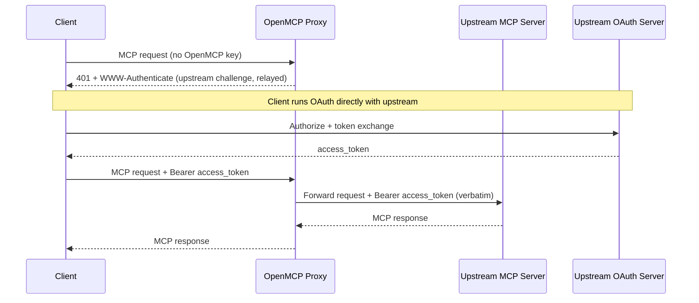
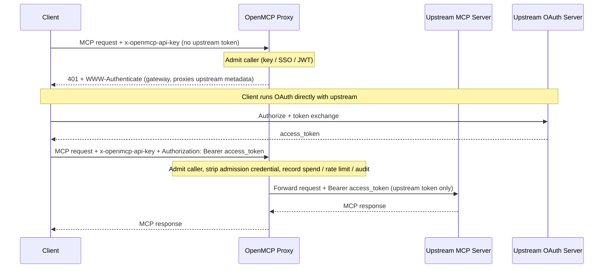
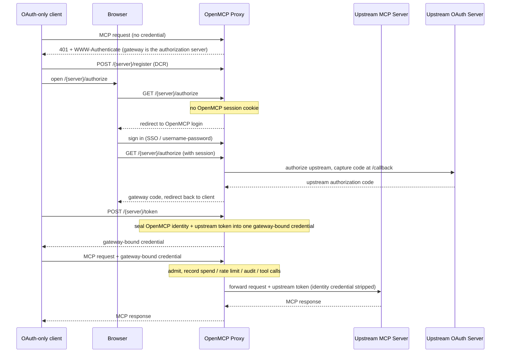
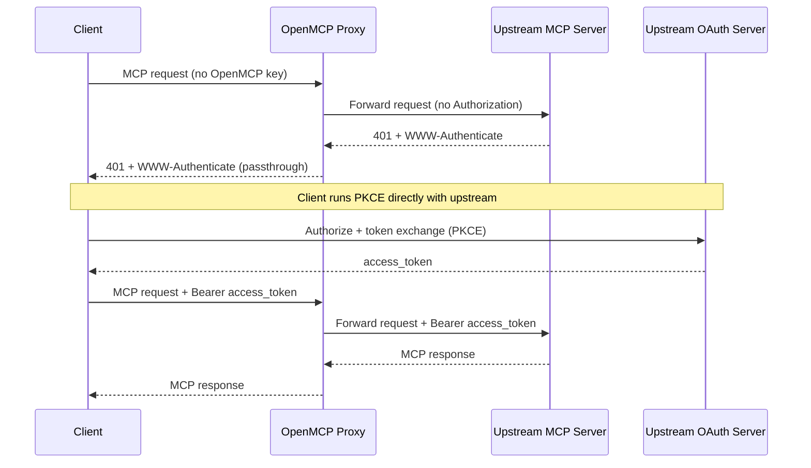

某些 MCP 服务端运行自己的 OAuth issuer，并期望客户端（Claude Code、Cursor、ChatGPT 等）直接针对它进行认证。对于这些服务端，OpenMCP 可以让客户端自己的上游令牌直接流过，而不是自己铸造、存储或刷新任何令牌。

两个 `auth_type` 值覆盖了这种情况。它们的区别仅在于一点：OpenMCP 是否仍然在自己的边缘认证调用方。

| 模式 | OpenMCP 准入 | 上游转发的凭证 | 消费 / 速率限制 / 审计 | 使用时机 |
|------|-------------------|-------------------------------|-----------------------------|----------|
| `true_passthrough` | 无；在 OpenMCP 层匿名 | 客户端原样的 `Authorization` | 不记录 | OpenMCP 应添加零认证，且上游是唯一的门槛 |
| `oauth_delegate` | 必须（OpenMCP 密钥 / SSO / JWT） | 调用方在准入之外携带的独立上游 bearer | 记录，以准入身份为键 | 你想要 OpenMCP 继续把关和观测路由，而上游拥有工具授权 |

两种模式在发现阶段都会原样返回上游的受保护资源元数据，因此客户端总是针对真实的上游 issuer 进行授权。

两者都完全按调用方发送的原样转发令牌。OpenMCP 不解码它，不检查其 audience 或 scope，也不交换它；只有上游 MCP 服务端这一方会验证它。如果调用方的令牌是为不同的资源铸造的，这两种模式都无法让它生效，此时你应该改用 [`oauth2_token_exchange`](#audience-locked-tokens-passthrough-or-token-exchange)。

两者还接受一个独立的 `dcr_bridge` 标志，它改变纯 OAuth 客户端发现其授权服务器的位置。为 OpenCode、Claude Code、Cursor 和 Claude Desktop 等无法自行与上游 IdP 注册，或无法发送两个独立凭证的客户端开启它。参见 [网关托管的登录（DCR bridge）](#gateway-hosted-sign-in-dcr-bridge)。

## 锁定 Audience 的令牌：透传还是令牌交换

OAuth 访问令牌携带一个 audience（`aud`，或其申请的 resource）。行为良好的上游 MCP 服务端会拒绝任何 audience 指向其他对象的令牌，例如智能体为某个 SaaS API 获取后又提交给 MCP 服务端的令牌。由于 `true_passthrough` 和 `oauth_delegate` 会原样转发令牌，这种拒绝会以上游自己的 `401` 被转发回客户端而呈现。这是正确的 anti-confused-deputy 结果：网关没有把一个为某资源铸造的令牌洗白成对另一资源的访问，这也不是 OpenMCP 的 bug 需要上报。

根据你实际持有的令牌选择模式：

| 调用方的令牌为谁铸造 | 使用 | OpenMCP 用它做什么 |
|-----------------------------------|-----|---------------------------|
| 上游 MCP 服务端本身（客户端针对该服务端的 issuer 运行了 OAuth） | `true_passthrough` 或 `oauth_delegate` | 原样转发；上游校验 audience 和 scope |
| 另一个资源（你的 IdP、内部 API、SaaS API），且你的 IdP 支持 RFC 8693 或 Entra On-Behalf-Of | `oauth2_token_exchange` | 将它作为 `subject_token` 发送给 IdP，收到一个 audience 为 MCP 服务端的令牌（服务端配置中的 `audience: ...`），缓存它，并且只转发交换后的令牌。参见 [MCP OBO Auth](/docs/mcp-gateway/obo-auth) |
| OpenMCP 虚拟密钥、SSO 会话或仅向网关证明身份的 IdP JWT | 两种透传模式都不适用 | 准入凭证从不转发到上游。请改为配置服务端侧凭证（`oauth2` 客户端凭证、静态 `authentication_token` 或令牌交换） |

实际检验标准：如果你必须请求 IdP 放宽令牌的 audience 才能让上游接受，那么就停下来使用令牌交换。放宽 audience 会把一个 bearer 变成通向多个资源的钥匙，而透传模式的存在恰恰是为了让网关绝不代表调用方做这件事。

## true_passthrough

OpenMCP 充当透明代理：无准入检查，不铸造、不存储任何东西，客户端授权的 `Authorization` 原样转发。当上游是访问的权威来源，且你不希望 OpenMCP 对路由把关两次时，应使用它。

### 设置

```yaml title="config.yaml" showLineNumbers
mcp_servers:
  notion_passthrough:
    url: "https://mcp.notion.com/mcp"
    auth_type: true_passthrough
```

这就是全部配置。没有客户端凭证或令牌端点，因为 OpenMCP 从不参与令牌交换。

### 工作原理

- 客户端发送 MCP 请求而不携带 OpenMCP API key。
- 尚无上游令牌时，OpenMCP 转发上游自己的 `401` 和 `WWW-Authenticate`。
- 客户端直接针对上游 issuer 运行 OAuth。
- 客户端以 `Authorization: Bearer <upstream-token>` 重试，OpenMCP 原封不动地转发。



### Fail-Closed 行为

透明路径只在每个目标都解析为 `true_passthrough` 时触发。在以下情况会回退到正常的 OpenMCP 准入：

- 服务端的 `auth_type` 是其他任何值。
- 请求针对多个服务端（`x-mcp-servers: a,b`），且其中任何一个不是 `true_passthrough`。
- 无法从 URL 路径或 `x-mcp-servers` 请求头解析出目标服务端。

### 安全权衡

- MCP 路由在 OpenMCP 层变成无认证的 ingress。
- 消费跟踪、按密钥速率限制以及任何依赖 `user_api_key_auth.user_id` 的护栏都不会运行。
- OpenMCP 无法得知调用方是谁，因此按用户审计必须来自上游服务端的日志。
- `available_on_public_internet: false` 在这里不增加任何认证；它主要控制基于 IP 的发现（[参见指南](/docs/mcp-gateway/public-internet)）。
- 只在那些你信任其上游 OAuth issuer 会强制执行访问控制的服务端上启用。

### 配置参考

| 字段 | 是否必填 | 说明 |
|-------|----------|-------------|
| `auth_type` | 是 | 必须为 `true_passthrough`。 |
| `url` | 是 | 上游 MCP 服务端 URL。 |
| `allowed_tools` | 否 | 服务端级工具允许列表。由于没有调用方身份，也就不存在按密钥或按团队的工具权限，因此这个列表是唯一的工具限制，且对每个调用方都一视同仁。 |

```yaml title="config.yaml" showLineNumbers
mcp_servers:
  notion_passthrough:
    url: "https://mcp.notion.com/mcp"
    auth_type: true_passthrough
    allowed_tools:
      - search
      - fetch
```

## oauth_delegate

OpenMCP 仍然准入调用方（OpenMCP API key、SSO 或 JWT），然后转发调用方提供的独立上游 bearer。OpenMCP 不铸造任何东西，也绝不把准入凭证转发到上游。当上游拥有工具级授权，但你仍希望 OpenMCP 把关路由并保留消费、速率限制和审计归属时使用它。

### 设置

```yaml title="config.yaml" showLineNumbers
mcp_servers:
  notion_delegate:
    url: "https://mcp.notion.com/mcp"
    auth_type: oauth_delegate
```

没有客户端凭证，原因与 `true_passthrough` 相同。变化发生在请求上：调用方发送两个凭证。

### 工作原理

- 调用方用 `x-openmcp-api-key` 中的 OpenMCP 凭证进行准入。
- 上游令牌放在 `Authorization` 中（聚合请求则为 `x-mcp-<alias>-authorization`）。
- OpenMCP 校验准入，然后只转发上游 bearer，绝不转发准入凭证。
- 尚无上游令牌时，OpenMCP 返回一个指向网关 `oauth-protected-resource` well-known 的 `401`，它会原样代理上游元数据。



<Callout type="warn" title="将两个凭证放在分离的请求头中">

如果调用方仅凭 `Authorization` 发送单个凭证且没有 `x-openmcp-api-key`，OpenMCP 会把它当作准入凭证（虚拟密钥、IdP JWT 或 SSO 会话令牌），并且绝不转发到上游。这就是防止 OpenMCP 或 IdP 令牌流到第三方 MCP 服务端的泄漏防御。

</Callout>

### 安全权衡

- 准入始终执行，因此不存在匿名 ingress。
- 消费、速率限制和审计按准入身份解析。
- OpenMCP 不检查就转发上游令牌，因此上游仍然拥有工具级授权和令牌校验。

### 配置参考

| 字段 | 是否必填 | 说明 |
|-------|----------|-------------|
| `auth_type` | 是 | 必须为 `oauth_delegate`。 |
| `url` | 是 | 上游 MCP 服务端 URL。 |

请求时：准入放在 `x-openmcp-api-key`，上游令牌放在 `Authorization: Bearer <upstream-token>`（聚合请求中针对特定服务端则为 `x-mcp-<alias>-authorization`）。

由于准入会执行，完整的 OpenMCP 权限模型会叠加在上游强制执行的内容之上：[按密钥和按团队的工具权限](/docs/mcp-gateway/control#per-entity-tool-level-permissions)、服务端级 `allowed_tools` 列表、按密钥速率限制，以及每个工具调用在准入身份下的消费日志。

## 多服务端聚合请求

发往聚合 `/mcp` 端点（或携带 `x-mcp-servers: a,b`）的请求会扇出到多个上游，但请求只能携带一个 `Authorization` 请求头。如果其中两个上游都转发调用方的令牌，把这一个请求头发给双方就会把一个单一 bearer 重放到无关的资源上（RFC 9700 所警告的跨资源重放）。因此 OpenMCP 会在聚合作用域内对 `true_passthrough` 和 `oauth_delegate` 服务端应用两条规则。

使用 `x-mcp-{alias}-authorization` 把一个上游令牌绑定到一个服务端。别名会被转为小写，任何 `a-z0-9_` 之外的字符都会变成 `_`，因此别名为 `Jira Cloud` 的服务端会以 `x-mcp-jira_cloud-authorization` 寻址。该值原样转发，所以请包含 scheme（`Bearer <token>`）。按服务端的请求头在任何操作上都不会被扣留，因为每个请求头都精确地命名了唯一一个接收方。

在列出扇出操作（`tools/list`，以及 prompt 和 resource 的列出）期间，只要同一作用域内还有另一个服务端也会消费请求级 `Authorization`，它就会被从一个客户端转发型服务端扣留。该服务端随后会被列成不带上游凭证，因此需要凭证的服务端会返回其 `401`，由聚合端点吸收它（见下文）。显式寻址的操作，例如针对命名工具的 `tools/call`、像 `/{server_name}/mcp` 这样的单服务端路由，或只有一个服务端转发调用方令牌的聚合作用域，都不受影响：客户端指名了唯一接收方，因此请求级请求头会转发给它。

实践中，这正是为什么一个对多个上游有效的单一 bearer 可以通过聚合端点执行工具，却不会出现在聚合的 `tools/list` 中：工具调用指名了一个服务端，而列出操作没有。修复方法是按服务端发送令牌，而不是请求级发送。

```bash title="Aggregate tools/list with per-server tokens" showLineNumbers
curl -X POST "https://openmcp.example.com/mcp" \
  -H "Content-Type: application/json" \
  -H "x-openmcp-api-key: Bearer sk-1234" \
  -H "x-mcp-servers: jira,confluence" \
  -H "x-mcp-jira-authorization: Bearer <token-for-jira>" \
  -H "x-mcp-confluence-authorization: Bearer <token-for-confluence>" \
  -d '{"jsonrpc":"2.0","id":1,"method":"tools/list","params":{}}'
```

在两个按服务端的请求头上发送相同的令牌值是你的决定，并按服务端显式做出，OpenMCP 会尊重它。它拒绝做的是：通过扇出一个未寻址的 `Authorization` 来替你做出那个决定。

对 `true_passthrough` 还有一个额外的约束：透明准入路径只在作用域内的每个服务端都是 `true_passthrough` 时触发。把一个 `true_passthrough` 服务端混入任何其他模式的聚合中，都会回退到正常的 OpenMCP 准入，因此该请求的调用方需要 OpenMCP 凭证。

## 在 Admin UI 中预览工具

OpenMCP 不持有这些服务端的上游令牌，因此创建和编辑表单无法自行列出工具。两个表单都会为 `true_passthrough` 和 `oauth_delegate` 显示 “Authorize & Fetch Tools (browser-only)” 按钮。它会在管理员的浏览器中运行上游 OAuth 流程，并把得到的令牌只保留在该浏览器会话中，按服务端转发它，用于工具预览和配置 `allowed_tools`。该令牌不会被写入服务端行、每用户凭证存储或任何缓存；关闭标签页即丢弃。

该按钮旁边的可选 OAuth Client ID 和 Client Secret 是不同的：它们作为声明的配置随服务端一起保存。当上游 issuer 不支持动态客户端注册，且每个管理员都应通过一个预注册的应用进行授权时，请设置它们。

## 有意的限制

以下是将令牌不加检查地原样转发带来的后果，它们是有意为之，而非缺陷。

在多服务端聚合端点上，不存在按服务端的“需要重新认证”信号。单服务端路由会如实转发上游的 `401` 和 `WWW-Authenticate`，但聚合端点会把一个服务端的认证失败吸收进该服务端的一个空列表中，以便其余服务端仍然列出。当你需要看清是哪个上游拒绝了令牌时，请使用单服务端路由或按服务端请求头。

发送方受限的令牌（DPoP、RFC 9449 或 mTLS 绑定的令牌、RFC 8705）无法转发。绑定证明了请求来自获得该令牌的 TLS 客户端或密钥持有者，而七层代理两者都不是。上游会拒绝它们；请为 MCP 服务端获取一个普通 bearer，或使用令牌交换。

被撤销的令牌无法在连接时检测。OpenMCP 不保存关于被转发令牌的任何状态，也不检查它，因此在 issuer 处被撤销的令牌会被转发，并在使用它的那个请求上被上游拒绝。客户端在那一刻看到上游的 `401`，与它直接同上游通信完全一样。

## 网关托管的登录（DCR bridge）

纯 OAuth MCP 客户端（OpenCode、Claude Code、Cursor、Claude Desktop）通过针对发现元数据所公布的授权服务器运行一次动态客户端注册（RFC 7591）加 PKCE 流程来连接。它们：

- 不持有上游 IdP 预先配置的客户端凭证。
- 无法在上游令牌之外再发送一个独立的 OpenMCP 凭证。

因此，朴素的 `true_passthrough` 请求和双请求头的 `oauth_delegate` 请求都不能满足它们。`dcr_bridge` 标志弥合了这个缺口：

- **开启：** OpenMCP 在发现阶段把自己公布为授权服务器，并托管 `/{server_name}/register`、`/{server_name}/authorize` 和 `/{server_name}/token`。客户端通过网关注册和登录，而 OpenMCP 在这些端点之后运行上游 OAuth。
- **关闭：** OpenMCP 原样转发上游服务端自己的 OAuth 元数据。适用于已与上游 IdP 注册的客户端，或能够直接针对它运行 DCR 的客户端。

在哪里设置它：

- 仅在 `true_passthrough` 和 `oauth_delegate` 上有效；在创建、更新和加载配置时，任何其他 `auth_type` 都会被拒绝。
- 在 Admin UI 中，它是 MCP 服务端表单上的 “Gateway-hosted sign-in (DCR bridge)” 开关，对这两种模式默认开启。
- 在配置中它是一个布尔字段。

### 带 bridge 的 true_passthrough

```yaml title="config.yaml" showLineNumbers
mcp_servers:
  miro:
    url: "https://mcp.miro.com/"
    transport: http
    auth_type: true_passthrough
    dcr_bridge: true
```

面向纯 OAuth 客户端的透明选项：

- 客户端把网关发现为自己的授权服务器，并通过 `POST /{server_name}/register` 注册。
- 它针对 `GET /{server_name}/authorize` 和 `POST /{server_name}/token` 运行 PKCE。
- 在上游支持 DCR 的地方，OpenMCP 会把客户端的注册转发给它。
- 在服务端没有存储 `client_id` 的地方，OpenMCP 会为该流程铸造一个临时的 ephemeral 客户端，且不持久化任何东西。
- 不涉及 OpenMCP 登录，也不记录调用方身份或消费。

### 带 bridge 的 oauth_delegate

```yaml title="config.yaml" showLineNumbers
mcp_servers:
  miro:
    url: "https://mcp.miro.com/"
    transport: http
    auth_type: oauth_delegate
    dcr_bridge: true
```

这个组合让 OpenMCP 保持在纯 OAuth 客户端的可观测性路径上，因此消费、速率限制、审计和按工具调用归属都能解析。当你想在 OpenMCP 中看到调用方用了哪个服务端、调用了哪些工具时，请使用它。

纯 OAuth 客户端无法内联出示 OpenMCP 密钥，因此身份改为来自一个 OpenMCP 浏览器会话：

- 在 authorize 步骤，OpenMCP 寻找一个 OpenMCP UI 会话 cookie。
- 没有 cookie 时，它先重定向到 OpenMCP 登录（`/sso/key/generate`）。
- 登录后，用户重新发起连接。
- OpenMCP 把该身份连同上游令牌一起封入一个绑定到网关的凭证。
- 客户端存储该凭证，并在以后的每个请求上重放它；准入、消费和审计都按它解析。

<Callout type="warn" title="两个前提条件">

- **网关需要一个可用的浏览器登录**（SSO 或用户名密码）。没有它就没有可绑定的身份，authorize 步骤无法进行。缺失网关登录是 `oauth_delegate` bridge 连接停在登录页面的常见原因。
- **客户端的 OAuth 流程必须在交互式浏览器会话中运行。** OpenCode、Claude Code、Cursor 和 Claude Desktop 都是如此。

对于完全脚本化、非交互式的委托，请关闭 `dcr_bridge`，改用双请求头的 `oauth_delegate` 请求。

</Callout>



### 选择标志

| 情况 | `dcr_bridge` |
|-----------|--------------|
| 不持有上游 `client_id` 且无法发送两个凭证的纯 OAuth 客户端（OpenCode、Claude Code、Cursor、Claude Desktop、ChatGPT） | `true` |
| 已与上游 IdP 注册的客户端，或能够直接针对上游运行 DCR 的客户端 | `false` |
| 能够发送 `x-openmcp-api-key` 加上游 `Authorization` bearer 的脚本化、非交互式调用方 | `false`，搭配 `auth_type: oauth_delegate`（双请求头形式） |

### 连接客户端

- 将客户端指向 `https://<gateway-host>/<server_name>/mcp`，并让它从那里发现 OAuth。
- 不要在客户端上配置 `client_id` 或 secret；网关处理注册和令牌交换。
- 在 `true_passthrough` bridge 服务端上，浏览器流程只同上游进行授权。
- 在 `oauth_delegate` bridge 服务端上，它先登录 OpenMCP，再同上游授权。

每个客户端各自的精确字段名请遵循其自带 MCP 文档，这些名称会随时间变化。

Claude Code 在首次使用时注册并运行浏览器流程：

```bash
claude mcp add --transport http miro https://<gateway-host>/miro/mcp
```

Cursor 从 `~/.cursor/mcp.json` 读取远程 MCP 服务端：

```json
{
  "mcpServers": {
    "miro": {
      "url": "https://<gateway-host>/miro/mcp"
    }
  }
}
```

OpenCode 从 `opencode.json` 读取它们：

```json
{
  "mcp": {
    "miro": {
      "type": "remote",
      "url": "https://<gateway-host>/miro/mcp",
      "enabled": true
    }
  }
}
```

### 配置参考

| 字段 | 是否必填 | 说明 |
|-------|----------|-------------|
| `auth_type` | 是 | 必须为 `true_passthrough` 或 `oauth_delegate`；任何其他值都会拒绝 `dcr_bridge`。 |
| `url` | 是 | 上游 MCP 服务端 URL。 |
| `dcr_bridge` | 是 | 设为 `true` 让网关为纯 OAuth 客户端托管登录。关闭则改为转发上游自己的 OAuth 元数据。 |

## 委托上游认证（PKCE 透传）

<Callout type="warn" title="已弃用">

`delegate_auth_to_upstream` 是透明透传最初的基于标志的形式，计划弃用。它是 `auth_type: true_passthrough` 的直接前身，行为方式相同（相同的工作原理、相同的 fail-closed 行为、相同的安全权衡），因此新服务端应使用 `true_passthrough`。下面的小节保留给现有配置。

</Callout>

对于客户端已经直接针对上游服务端自己的 OAuth issuer 进行认证的 OAuth2 MCP 服务端，你可以让该路由选择**上游委托认证**：OpenMCP 停止检查自己的 API key / SSO，让客户端的 PKCE 流程端到端地同上游 MCP 服务端运行。

### 设置

```yaml title="config.yaml" showLineNumbers
mcp_servers:
  notion_mcp:
    url: "https://mcp.notion.com/mcp"
    auth_type: oauth2
    oauth2_flow: authorization_code
    delegate_auth_to_upstream: true
```

被委托的服务端是交互式的，因此它们使用 `oauth2_flow: authorization_code`。该标志**仅**在 `auth_type: oauth2` 时被采纳；设置在任意其他认证类型上都会静默忽略。

<Callout type="warn" title="Internal-only（available_on_public_internet: false）与上游 PKCE 委托">

在一个 **`auth_type: oauth2`** 的交互式服务端（不是 `oauth2_flow: client_credentials`）上同时使用 **`available_on_public_internet: false`** 和 **`delegate_auth_to_upstream: true`**，仍然允许**匿名**调用方在**没有 OpenMCP API key 会话**的情况下，到达上游 OAuth2 的 **`/authorize`** 流程并为匹配的 MCP 路由完成 PKCE。internal-only 标志主要控制基于 IP 的发现和相关行为（[参见指南](/docs/mcp-gateway/public-internet)）；它**不**禁用这种委托旁路。

**该怎么做：** 在上游 IdP 和网络边缘强制执行访问。OpenMCP UI 在同时启用这两个设置时显示警告；代理在从配置或数据库加载该服务端时记录一条警告。

</Callout>

### 工作原理

1. 客户端向 OpenMCP 发送 MCP 请求，不携带 `x-openmcp-api-key`（可选地也没有 `Authorization` 请求头）。
2. OpenMCP 检测到请求中的每个目标服务端都是 `auth_type: oauth2` **且** `delegate_auth_to_upstream: true`，并跳过自己的 API-key/SSO 检查。
3. OpenMCP 也跳过自己预置的 401，因此上游 MCP 服务端自己的 `401` + `WWW-Authenticate` 流回客户端。
4. 客户端直接同上游 OAuth issuer 完成 PKCE。
5. 客户端以 `Authorization: Bearer <upstream-token>` 重试。OpenMCP 原封不动地转发。



### Fail-Closed 行为

该旁路只在**每个**目标都选择加入时触发。在以下情况它 fail closed，运行正常的 OpenMCP 认证：

- 服务端的 `auth_type` 不是 `oauth2`。
- `delegate_auth_to_upstream` 没有显式设为 `true`。
- 请求针对多个服务端（`x-mcp-servers: a,b`），且其中任何一个未被委托。
- 无法从 URL 路径或 `x-mcp-servers` 请求头解析出目标服务端。

### 安全权衡

- MCP 路由在 OpenMCP 层变成**无认证**的 ingress。消费跟踪、按密钥速率限制以及依赖 `user_api_key_auth.user_id` 的护栏都不会运行。
- OpenMCP 无法得知调用方是谁（这是设计使然），因此按用户审计必须来自上游 MCP 服务端自己的日志。
- 只在那些你信任其上游 OAuth issuer 会强制执行访问控制的服务端上启用。

### 配置参考

| 字段 | 是否必填 | 说明 |
|-------|----------|-------------|
| `auth_type` | 是 | 必须为 `oauth2`。否则该标志被忽略。 |
| `oauth2_flow` | 是 | 设置为 `authorization_code`；委托会把客户端的交互式 PKCE 流程透传给上游服务端。 |
| `delegate_auth_to_upstream` | 是 | 设为 `true` 让该服务端选择 PKCE 透传。 |