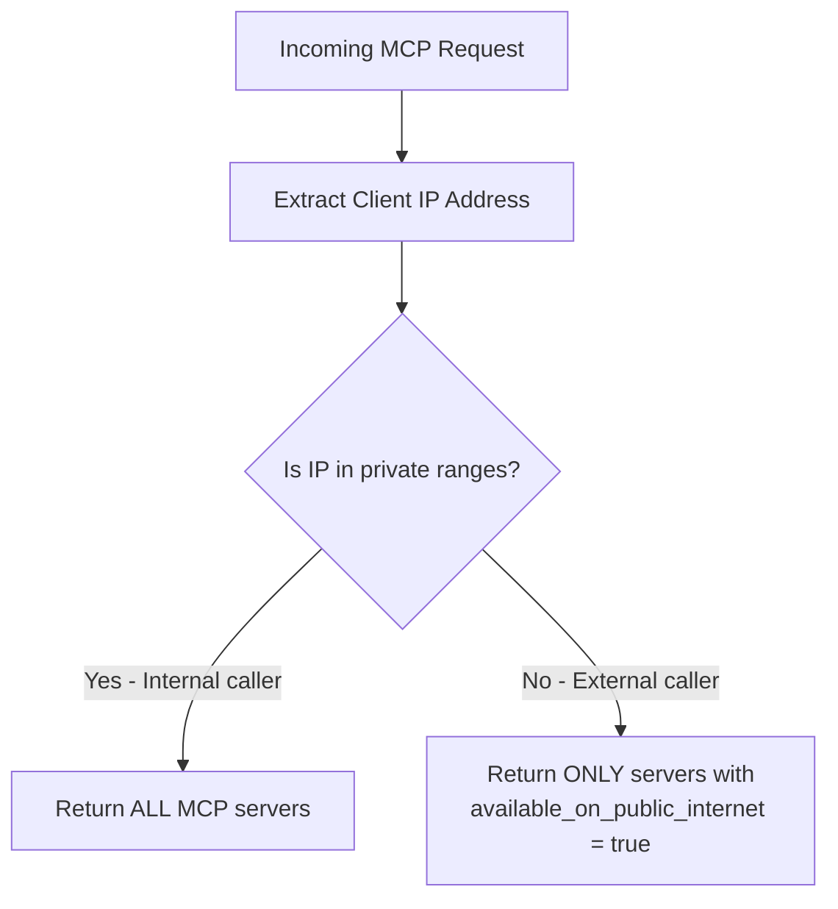

控制哪些 MCP 服务器对外部调用方（如 ChatGPT、Claude Desktop）可见，哪些仅对内部调用方可见。当你只希望将一部分 MCP 服务器公开可用，同时将敏感服务器限制在私有网络内时，这将非常有用。

## 概述

| 属性 | 详情 |
|-------|-------|
| 说明 | 基于 IP 的 MCP 服务器访问控制 — 外部调用方只能看到标记为公开的服务器 |
| 设置 | 每个 MCP 服务器上的 `available_on_public_internet` |
| 网络配置 | `mcp_internal_ip_ranges`（位于 `general_settings` 中） |
| 支持的客户端 | ChatGPT、Claude Desktop、Cursor、OpenAI API 或任何 MCP 客户端 |

<Callout type="warn" title="Interaction with delegate_auth_to_upstream">

如果某个 MCP 服务器的 **`available_on_public_internet: false`**（对于基于 IP 的发现而言属于内部）**并且**设置了 **`delegate_auth_to_upstream: true`** 和 **`auth_type: oauth2`**（交互式 PKCE，而非 M2M），匿名调用方仍然可以在没有 OpenMCP 会话的情况下使用上游 OAuth 的 **`/authorize`** 路径。详情和缓解措施请参阅 [MCP OAuth 直通：将认证委托给上游](/docs/mcp-gateway/oauth-passthrough#delegate-auth-to-upstream-pkce-passthrough)。

</Callout>

## 工作原理

当一个请求到达 OpenMCP 的 MCP 端点时，OpenMCP 会检查调用方的 IP 地址，以确定他们是**内部**还是**外部**调用方：

1. 从传入请求中**提取客户端 IP**（在反向代理后面配置时支持 `X-Forwarded-For`）。
2. 将 IP 与配置的私有 IP 范围进行比对，将其**分类为内部或外部**（默认为 RFC 1918：`10.0.0.0/8`、`172.16.0.0/12`、`192.168.0.0/16`、`127.0.0.0/8`）。
3. **过滤服务器列表**：
   - **内部调用方**可以看到所有 MCP 服务器（公开和私有）。
   - **外部调用方**只能看到 `available_on_public_internet: true` 的服务器。

此过滤应用于每个 MCP 访问点：MCP 注册表、工具列表、工具调用、动态服务器路由和 OAuth 发现端点。



## 演练

本演练涵盖两个流程：
1. **添加一个公开的 MCP 服务器**（DeepWiki）并从 ChatGPT 连接它
2. **将现有服务器设为私有**（Exa）并验证 ChatGPT 不再能看到它

### 流程 1：添加公开的 MCP 服务器（DeepWiki）

DeepWiki 是一个免费的 MCP 服务器，非常适合公开暴露，这样 AI 网关用户可以从 ChatGPT 访问它。

#### 步骤 1：创建 MCP 服务器

导航到 MCP Servers 页面，点击 **"+ 添加新的 MCP 服务器"**。


创建对话框打开。在服务器名称中输入 **"DeepWiki"**。


对于传输类型下拉框，选择 **HTTP**，因为 DeepWiki 使用 Streamable HTTP 传输。


现在向下滚动到 MCP Server URL 字段。


输入 DeepWiki 的 MCP URL：`https://mcp.deepwiki.com/mcp`。


填好名称、传输方式和 URL 后，基本的服务器配置就完成了。


#### 步骤 2：启用"在公共互联网上可用"

创建之前，向下滚动并展开**权限管理 / 访问控制**部分。在这里你可以控制谁能看到此服务器。


打开**"在公共互联网上可用"**开关。这是关键设置：它告诉 OpenMCP，外部调用方（如从公共互联网连接的 ChatGPT）应该能够发现并使用此服务器。


启用开关后，点击 **"创建"** 保存服务器。


#### 步骤 3：从 ChatGPT 连接

现在让我们验证它是否有效。打开 ChatGPT，找到 MCP 服务器图标以添加新连接。要使用的端点是 `<your-openmcp-url>/mcp`。


在下拉框中，选择 **"添加一个 MCP 服务器"** 来配置新连接。


ChatGPT 会要求输入服务器标签。给它一个容易识别的名称，如 "OpenMCP"。


接下来，输入服务器 URL。这应该是你的 OpenMCP 代理的 MCP 端点，即 `<your-openmcp-url>/mcp`。


粘贴你的 OpenMCP URL 并确认它看起来正确。


ChatGPT 还需要认证。在认证字段中输入你的 OpenMCP API 密钥，以便它连接到代理。


点击 **"连接"** 以建立连接。


ChatGPT 连接成功并显示可用工具。由于 DeepWiki 和 Exa 当前都标记为公开，ChatGPT 可以看到来自两个服务器的工具。


---

### 流程 2：将现有服务器设为私有（Exa）

现在让我们反过来做：将当前公开的 MCP 服务器（Exa）限制为仅限内部访问。更改之后，ChatGPT 应该不再看到 Exa 的工具。

#### 步骤 1：编辑服务器

转到 MCP Servers 表格，点击 Exa 服务器打开其详情视图。


切换到**"设置"**选项卡以访问编辑表单。


编辑表单会加载 Exa 的当前配置。


#### 步骤 2：关闭"在公共互联网上可用"

向下滚动并展开**权限管理 / 访问控制**部分，找到公共互联网开关。


关闭**"在公共互联网上可用"**开关。这将把 Exa 从私有网络之外的任何调用方中隐藏起来。


点击 **"保存更改"** 应用更改。更改立即生效，无需重启代理。


#### 步骤 3：在 ChatGPT 中验证

回到 ChatGPT，确认 Exa 不再可见。你需要重新连接，让 ChatGPT 重新获取工具列表。


打开 MCP 服务器设置，选择添加或重新连接服务器。


输入与之前相同的 OpenMCP MCP URL。


设置服务器标签。


输入你的 API 密钥进行认证。


点击 **"连接"** 重新建立连接。


这一次，只有 DeepWiki 的工具出现；Exa 消失了。OpenMCP 检测到 ChatGPT 正在从公共 IP 调用，便过滤掉了 Exa，因为它不再标记为公开。私有网络上的内部用户仍然可以看到两个服务器。


## 配置参考

### 每个服务器的设置

<Tabs items={["UI","config.yaml","API"]}>
<Tab>

在创建或编辑 MCP 服务器时，在"权限管理"部分切换**"在公共互联网上可用"**开关。

</Tab>
<Tab>

```yaml title="config.yaml" showLineNumbers
mcp_servers:
  deepwiki:
    url: https://mcp.deepwiki.com/mcp
    available_on_public_internet: true   # visible to external callers

  exa:
    url: https://exa.ai/mcp
    auth_type: api_key
    auth_value: os.environ/EXA_API_KEY
    available_on_public_internet: false  # internal only (default)
```

</Tab>
<Tab>

```bash title="Create a public MCP server" showLineNumbers
curl -X POST <your-openmcp-url>/v1/mcp/server \
  -H "Authorization: Bearer sk-..." \
  -H "Content-Type: application/json" \
  -d '{
    "server_name": "DeepWiki",
    "url": "https://mcp.deepwiki.com/mcp",
    "transport": "http",
    "available_on_public_internet": true
  }'
```

```bash title="Update an existing server" showLineNumbers
curl -X PUT <your-openmcp-url>/v1/mcp/server \
  -H "Authorization: Bearer sk-..." \
  -H "Content-Type: application/json" \
  -d '{
    "server_id": "<server-id>",
    "available_on_public_internet": false
  }'
```

</Tab>
</Tabs>

### 自定义私有 IP 范围

默认情况下，OpenMCP 将 RFC 1918 私有范围视为内部。你可以在 MCP Servers 下的**网络设置**选项卡中自定义，也可以通过配置：

```yaml title="config.yaml" showLineNumbers
general_settings:
  mcp_internal_ip_ranges:
    - "10.0.0.0/8"
    - "172.16.0.0/12"
    - "192.168.0.0/16"
    - "100.64.0.0/10"    # Add your VPN/Tailscale range
```

为空时，将使用标准的私有范围（`10.0.0.0/8`、`172.16.0.0/12`、`192.168.0.0/16`、`127.0.0.0/8`）。

---

## 公共互联网与 MCP Hub 可见性

`available_on_public_internet` 和 **MCP Hub**（`GET /public/mcp_hub`）是两种容易被混淆的独立机制：

| 关注点 | 由谁控制 | 默认值 |
|---|---|---|
| 外部（非私有 CIDR）调用方能否在 MCP 工具端点（list/call）看到此服务器？ | 服务器上的 `available_on_public_internet` | `True`（默认可见；切换为 `false` 以限制为私有 CIDR） |
| 此服务器是否会出现在未认证的 `GET /public/mcp_hub` 公告中？ | `openmcp.public_mcp_servers` 列表，由 `openmcp.public_mcp_hub_strict_whitelist` 控制 | Hub 严格白名单默认**开启** — 只有明确列在 `public_mcp_servers` 中的服务器才会被公告 |

在**默认的严格白名单模式**下，`available_on_public_internet: true`（默认值）不会让服务器出现在 hub 中。要在 hub 上公告服务器，你还需要将其添加到 `public_mcp_servers`：

```yaml title="Server on the hub AND visible to external callers (the default)" showLineNumbers
openmcp_settings:
  public_mcp_servers:
    - deepwiki
  # public_mcp_hub_strict_whitelist defaults to true

mcp_servers:
  deepwiki:
    url: https://mcp.deepwiki.com/mcp
    # available_on_public_internet defaults to true
```

如果你设置了 `openmcp.public_mcp_hub_strict_whitelist: false`，hub 将回退到公告每个具有 `available_on_public_internet: true` 的服务器。本页的基于 IP 的访问过滤器仍独立应用于实际的工具端点。