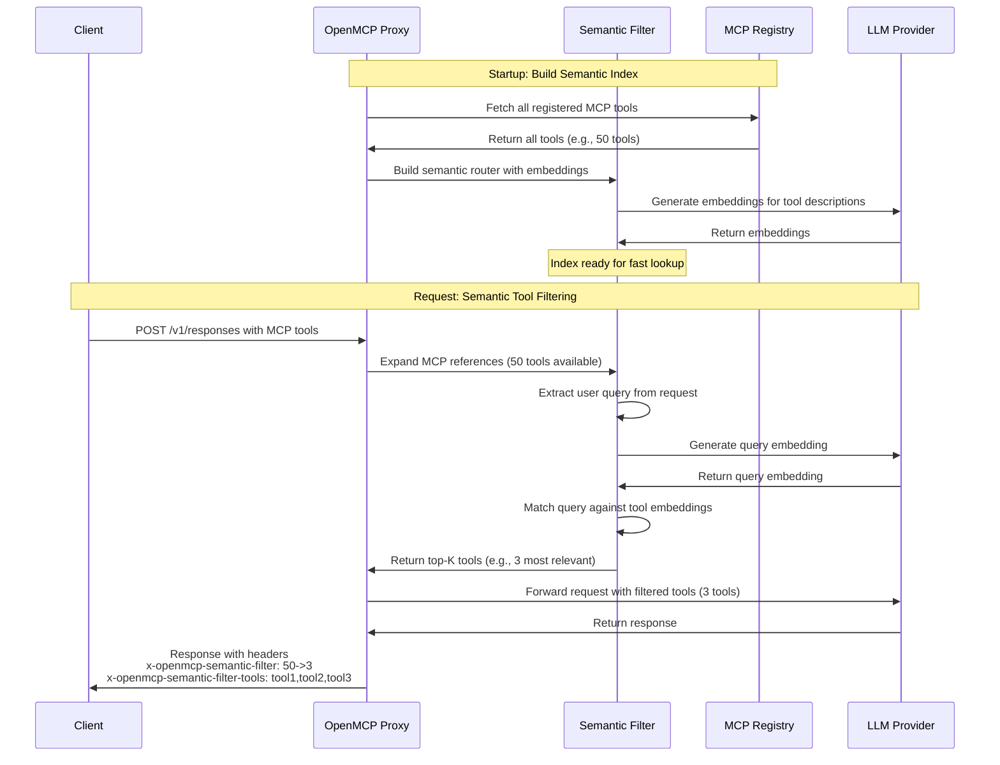

根据语义相关性自动过滤 MCP 工具。当注册了大量 MCP 工具时，OpenMCP 会将用户的查询与工具描述进行语义匹配，并只将最相关的工具发送给 LLM。

## 工作原理

工具搜索将工具选择从提示工程问题转变为检索问题。语义过滤器不会在每个提示中注入庞大的静态工具列表，而是：

1. 在启动时构建所有可用 MCP 工具的语义索引
2. 在每个请求中，将用户的查询与工具描述进行语义匹配
3. 只将 top-K 个最相关的工具返回给 LLM

这种方法提高了上下文效率，通过减少工具混淆来提升可靠性，并可扩展到拥有数百或数千个 MCP 工具的生态系统。



## 配置

在你的 OpenMCP 配置中启用语义过滤：

```yaml title="config.yaml" showLineNumbers
openmcp_settings:
  mcp_semantic_tool_filter:
    enabled: true
    embedding_model: "text-embedding-3-small"  # Model for semantic matching
    top_k: 5                                    # Max tools to return
    similarity_threshold: 0.3                   # Min similarity score
```

**配置选项：**
- `enabled` — 启用/禁用语义过滤（默认值：`false`）
- `embedding_model` — 用于生成嵌入向量的模型（默认值：`"text-embedding-3-small"`）
- `top_k` — 返回的最大工具数量（默认值：`10`）
- `similarity_threshold` — 匹配的最低相似度分数（默认值：`0.3`）

## 使用方法

照常通过 Responses API 或 Chat Completions 使用 MCP 工具。语义过滤器会自动运行：

<Tabs items={["Responses API","Chat Completions"]}>
<Tab>

```bash title="Responses API with Semantic Filtering" showLineNumbers
curl --location 'http://localhost:4000/v1/responses' \
--header 'Content-Type: application/json' \
--header "Authorization: Bearer sk-1234" \
--data '{
    "model": "{{openai_large}}",
    "input": [
    {
      "role": "user",
      "content": "give me TLDR of what BerriAI/openmcp repo is about",
      "type": "message"
    }
  ],
    "tools": [
        {
            "type": "mcp",
            "server_url": "openmcp_proxy",
            "require_approval": "never"
        }
    ],
    "tool_choice": "required"
}'
```

</Tab>
<Tab>

```bash title="Chat Completions with Semantic Filtering" showLineNumbers
curl --location 'http://localhost:4000/v1/chat/completions' \
--header 'Content-Type: application/json' \
--header "Authorization: Bearer sk-1234" \
--data '{
  "model": "{{openai_large}}",
  "messages": [
    {"role": "user", "content": "Search Wikipedia for OpenMCP"}
  ],
  "tools": [
    {
      "type": "mcp",
      "server_url": "openmcp_proxy"
    }
  ]
}'
```

</Tab>
</Tabs>

## 响应头

语义过滤器会给每个响应添加诊断响应头：

```
x-openmcp-semantic-filter: 10->3
x-openmcp-semantic-filter-tools: wikipedia-fetch,github-search,slack-post
```

- **`x-openmcp-semantic-filter`** — 显示过滤前后的工具数量（例如，`10->3` 表示 10 个工具被过滤为 3 个）
- **`x-openmcp-semantic-filter-tools`** — 过滤后工具名称的 CSV 列表（最多 150 个字符，超过后用 `...` 截断）

这些响应头帮助你了解每个请求选中了哪些工具，并验证过滤器是否正常工作。

## 示例

如果你注册了 50 个 MCP 工具，并发起一个询问 Wikipedia 的请求，语义过滤器将会：

1. 将你的查询 `"Search Wikipedia for OpenMCP"` 与全部 50 个工具描述进行语义匹配
2. 选择最相关的 top 5 个工具（例如 `wikipedia-fetch`、`wikipedia-search` 等）
3. 只将这 5 个工具传给 LLM
4. 添加显示 `x-openmcp-semantic-filter: 50->5` 的响应头

这大大减小了提示体积，同时确保 LLM 能够访问完成任务所需的正确工具。

## 性能

语义过滤器为生产环境做了优化：
- 路由器在启动时构建一次（无每次请求的开销）
- 语义匹配通常在 50ms 内完成
- 优雅降级 — 如果过滤失败，则返回所有工具
- 对不含 MCP 工具的请求的延迟没有影响

## 相关文档

- [MCP 概览](/docs/mcp-gateway) — 了解 OpenMCP 中的 MCP
- [MCP 权限管理](/docs/mcp-gateway/control) — 通过密钥/团队控制工具访问
- [使用 MCP](/docs/mcp-gateway/usage) — 完整的 MCP 使用指南