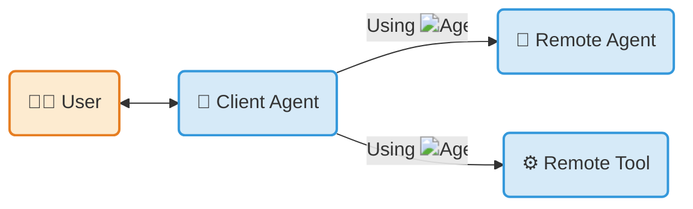

{/* markdownlint-disable MD041 */}

## 什么是 A2A 协议？

**Agent2Agent (A2A) Protocol** 是一套开放标准，用于 AI 智能体之间的无缝通信与协作。在一个由不同厂商使用各种框架构建智能体的世界里，A2A 为智能体互操作性提供了权威的通用语言。

<Callout>

使用 **[<LogoIcon src="https://google.github.io/adk-docs/assets/agent-development-kit.png" alt="ADK Logo"/> ADK](https://google.github.io/adk-docs/)** _（或任何框架）_ 构建，
使用 **[<LogoIcon src="https://modelcontextprotocol.io/mcp.png" alt="MCP Logo"/> MCP](https://modelcontextprotocol.io)** _（或任何工具）_ 装备，
并通过 **<LogoIcon src="/images/docs/a2a/a2a_logo/icon/color/SVG/a2a_icon_color.svg" alt="A2A Logo"/> A2A** 通信，
连接远程智能体、本地智能体和人类。

</Callout>

## 关键特性

-  **互操作性**

    连接基于不同平台（LangGraph、CrewAI、Semantic Kernel、自定义方案）构建的智能体，打造强大的复合型 AI 系统。

-  **复杂工作流**

    让智能体能够委派子任务、交换信息并协调行动，以解决单个智能体无法解决的复杂问题。

-  **安全且不透明**

    智能体在不分享内部记忆、工具或专有逻辑的情况下进行交互，从而确保安全并保护知识产权。

-  **可扩展**

    通过正式的协议[扩展和自定义绑定](/docs/a2a/extension-and-binding-governance)添加能力，并有分级晋升流程治理，以保持核心的稳定。

## 开始使用 A2A

-  **阅读简介**

    了解 A2A 背后的核心思想。

    [ 什么是 A2A？](/docs/a2a/what-is-a2a)

    [ 核心概念](/docs/a2a/key-concepts)

-  **深入规范**

    探索 A2A 协议的详细技术定义。

    [ 协议规范](/docs/a2a/specification/index)

-  **跟随教程**

    通过我们的分步 Python 快速入门，构建你的第一个符合 A2A 规范的智能体。

    [ 动手操作教程](/docs/tutorials/a2a/1-introduction)

-  **探索代码示例**

    通过示例客户端、服务器和智能体框架集成，看看 A2A 的实际应用。

    [ GitHub 示例](https://github.com/a2aproject/a2a-samples)

-  **下载官方 SDK**

    [ Python](https://github.com/a2aproject/a2a-python)

    [ JavaScript](https://github.com/a2aproject/a2a-js)

    [ Java](https://github.com/a2aproject/a2a-java)

    [ C#/.NET](https://github.com/a2aproject/a2a-dotnet)

    [ Golang](https://github.com/a2aproject/a2a-go)

    [ Rust](https://github.com/a2aproject/a2a-rs)

-  **视频** 8 分钟以内的入门介绍

    <iframe className="video-container" src="https://www.youtube.com/embed/Fbr_Solax1w?si=QxPMEEiO5kLr5_0F" title="YouTube video player" frameBorder="0" allow="accelerometer; autoplay; clipboard-write; encrypted-media; gyroscope; picture-in-picture; web-share" referrerPolicy="strict-origin-when-cross-origin" allowFullScreen></iframe>

-  **课程** [DeepLearning.AI](https://deeplearning.ai) - A2A 入门

    

## A2A 如何与 MCP 协同工作

Model Context Protocol（MCP）和 A2A 协议并非竞争对手——它们高度互补。它们解决两个不同的问题，并被设计为协同工作。

- **MCP 用于智能体到工具的通信：** 它标准化了智能体如何连接其工具、API 和资源以获取信息。参见 [Model Context Protocol](https://modelcontextprotocol.io/)。
- **A2A 用于智能体到智能体的通信：** 作为通用的去中心化标准，A2A 让独立智能体（包括使用 MCP 的那些智能体）能够相互发现、委派任务并共享结果。

使用 MCP 为单个智能体装备完成工作所需的特定工具（例如，访问 GitHub 仓库或 SQL 数据库）。使用 A2A 让该专业智能体能够跨不同框架与其他智能体安全协作。

[ 深入了解 A2A 与 MCP](/docs/a2a/a2a-and-mcp)

## A2A 不是什么

A2A 是一个聚焦的协议。为设定预期，以下说明它明确不试图成为什么：

- **不是智能体开发工具包**（例如用于构建智能体应用的 LangGraph、CrewAI 或 ADK）。A2A 是用其中任何一种构建的智能体之间的通信层。
- **不是子智能体或工具调用协议。** A2A 不规定智能体如何与其自己的子智能体对话，也不规定它如何调用工具——请为此使用你所在框架的原生原语或 MCP。
- **不是 [MCP](https://modelcontextprotocol.io/) 的替代品。** MCP 将智能体到工具的通信标准化；A2A 将智能体到智能体的通信标准化。它们是互补的（见[上文](#how-a2a-works-with-mcp)）。
- **不是即时通讯应用**（例如 Slack、Discord、WhatsApp 或 Telegram）。A2A 是面向自主智能体的机器对机器协议。

## 治理与开源

A2A 最初由 Google 开发，并捐赠给 Linux 基金会。它由一个技术指导委员会维护，成员来自 AWS、Cisco、Google、IBM Research、Microsoft、Salesforce、SAP 和 ServiceNow，并得到广泛的[合作伙伴](./partners)社区支持。

在 [Discord](https://discord.gg/a2aprotocol) 上加入社区，与贡献者联系、提问并讨论该协议。

关于项目如何运作的详细信息，请参阅 [`GOVERNANCE.md`](https://github.com/a2aproject/A2A/blob/main/GOVERNANCE.md) 和 [`MAINTAINERS.md`](https://github.com/a2aproject/A2A/blob/main/MAINTAINERS.md)。

## 许可

A2A 协议依据 [Apache License 2.0](https://github.com/a2aproject/A2A/blob/main/LICENSE) 许可，并欢迎社区的[贡献](https://github.com/a2aproject/A2A/blob/main/CONTRIBUTING.md)。