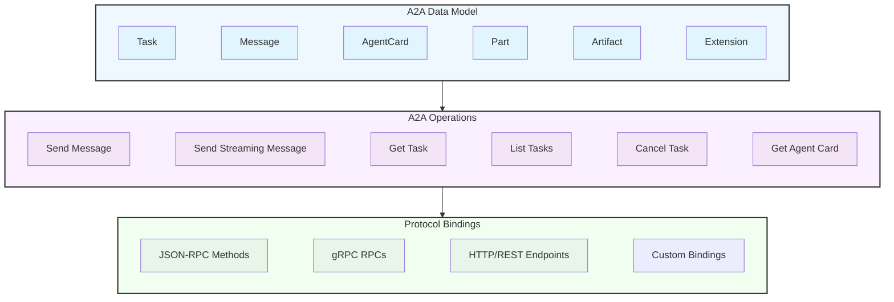

<Callout title="**最新发布版本** [`1.0.0`](https://a2a-protocol.org/v1.0.0/specification)">

**以前的版本**

- [`0.3.0`](https://a2a-protocol.org/v0.3.0/specification)
- [`0.2.6`](https://a2a-protocol.org/v0.2.6/specification)
- [`0.1.0`](https://a2a-protocol.org/v0.1.0/specification)

</Callout>

有关各版本之间所做的更改，请参阅[发行说明](https://github.com/a2aproject/A2A/releases)。

## 1. 引言

Agent2Agent (A2A) 协议是一种开放标准，旨在促进独立、可能不透明的 AI 智能体系统之间的通信和互操作性。在智能体可能由不同框架、语言或不同供应商构建的生态系统中，A2A 提供了一种通用语言和交互模型。

本文档提供了 A2A 协议的详细技术规范。其主要目标是使智能体能够：

- 发现彼此的能力。
- 协商交互模式（文本、文件、结构化数据）。
- 管理协作任务。
- 安全地交换信息以实现用户目标，**而无需访问彼此的内部状态、内存或工具。**

### 1.1. A2A 的核心目标

- **互操作性：**弥合不同智能体系统之间的通信鸿沟。
- **协作：**使智能体能够委派任务、交换上下文，并共同处理复杂的用户请求。
- **发现：**允许智能体动态查找并理解其他智能体的能力。
- **灵活性：**支持各种交互模式，包括同步请求/响应、用于实时更新的流式，以及用于长时间运行任务的异步推送通知。
- **安全性：**依托标准的 Web 安全实践，促进适合企业环境的安全通信模式。
- **异步性：**原生支持长时间运行的任务以及可能涉及人在环（human-in-the-loop）场景的交互。

### 1.2. 指导原则

- **简单：**复用现有且已被充分理解的标准（HTTP、JSON-RPC 2.0、Server-Sent Events）。
- **企业就绪：**通过与成熟的企业实践保持一致，处理认证、授权、安全、隐私、追踪和监控。
- **异步优先：**专为（可能非常）长时间运行的任务和人在环交互而设计。
- **模式无关：**支持多种内容类型的交换，包括文本、音频/视频（通过文件引用）、结构化数据/表单，以及可能嵌入的 UI 组件（例如 parts 中引用的 iframe）。
- **不透明执行：**智能体基于声明的能力和交换的信息进行协作，无需共享其内部思考、计划或工具实现。

如需更全面地了解 A2A 的目的和优势，请参阅[什么是 A2A？](/docs/a2a/what-is-a2a)。

### 1.3. 规范结构

本规范分为三个不同的层，它们协同工作以提供完整的协议定义：

**第 1 层：规范数据模型**定义了所有 A2A 实现必须理解的核心数据结构和消息格式。这些是以 Protocol Buffer 消息表达的、与协议无关的定义。

**第 2 层：抽象操作**描述了 A2A 智能体必须支持的基本能力和行为，与它们在特定协议上的暴露方式无关。

**第 3 层：协议绑定**提供了抽象操作和数据结构到特定协议绑定（JSON-RPC、gRPC、HTTP/REST）的具体映射，包括方法名称、端点模式和协议特定行为。

这种分层方法确保：

- 核心语义在所有协议绑定中保持一致
- 无需更改基本数据模型即可添加新的协议绑定
- 开发人员可以独立于绑定的具体关注点来理解 A2A 操作
- 通过共享对规范数据模型的理解来保持互操作性

### 1.4 规范性内容

除本文档中定义的协议要求外，`spec/a2a.proto` 文件是所有协议数据对象和请求/响应消息的唯一权威规范定义。为了方便工具和网站使用，**可以**发布生成的 JSON 构建产物（`spec/a2a.json`，在构建时生成且不会被提交），但它属于非规范性构建产物。SDK 语言绑定、schema 以及任何其他派生形式**必须**从 proto 中重新生成（直接生成或通过代码生成），而不是手动编辑。

**变更控制与弃用生命周期：**

- 引入：当 proto 消息或字段被重命名时，会添加新名称，同时现有已发布的名称在下一个主要版本发布之前仍然可用，但会被标记为已弃用。
- 文档：在引入重大破坏性变更时，必须通过辅助文档提供迁移指引。
- 锚点：必须保留旧版文档锚点（以隐藏的 HTML 锚点形式），以避免破坏入站链接。
- SDK/Schema 别名：SDK 和 JSON Schema 应当提供已弃用的别名类型/定义以保持向后兼容。
- 移除：已弃用的名称不应早于其替代名称引入后的下一个主要版本被移除。

**自动生成：**

文档构建会即时生成 `specification/json/a2a.json`（该文件不受源代码管理跟踪）。未来的改进可能会发布 OpenAPI v3 + JSON Schema 捆绑包，以增强工具支持。

**设计依据：**

以 proto 文件作为规范性来源，可以确保协议中立性、减少规范漂移，并为生态系统提供确定性的演进路径。

## 2. 术语

### 2.1. 要求性语言

本文档中的关键词 "MUST"、"MUST NOT"、"REQUIRED"、"SHALL"、"SHALL NOT"、"SHOULD"、"SHOULD NOT"、"RECOMMENDED"、"MAY" 和 "OPTIONAL" 应按照 [RFC 2119](https://tools.ietf.org/html/rfc2119) 中的描述进行解释。

### 2.2. 核心概念

A2A 围绕几个关键概念展开。有关详细说明，请参阅[关键概念指南](/docs/a2a/key-concepts)。

- **A2A Client:** 代表用户或其他系统向 A2A 服务端发起请求的应用程序或智能体。
- **A2A Server (Remote Agent):** 暴露符合 A2A 规范的端点、处理任务并提供响应的智能体或智能体系统。
- **Agent Card:** 由 A2A 服务端发布的 JSON 元数据文档，描述其身份、能力、技能、服务端点和认证要求。
- **Message:** 客户端与远程智能体之间的一次通信轮次，具有 `role`（"user" 或 "agent"）并包含一个或多个 `Parts`。
- **Task:** A2A 管理的基本工作单元，由唯一 ID 标识。任务是带状态的，并经历已定义的生命周期。
- **Part:** Message 或 Artifact 中的最小内容单元。Part 可以包含文本、文件引用或结构化数据。
- **Artifact:** 智能体作为任务结果生成的输出（例如文档、图像、结构化数据），由 `Parts` 组成。
- **Streaming:** 通过协议特定的流式机制投递的任务实时增量更新（状态变更、产物分块）。
- **Push Notifications:** 针对长时间运行或断连场景投递的异步任务更新，由服务端发起 HTTP POST 请求发送到客户端提供的 webhook URL。
- **Context:** 在逻辑上对相关任务和消息进行分组的一种可选标识符。
- **Extension:** 智能体用于提供超出核心 A2A 规范的功能或数据的一种机制。