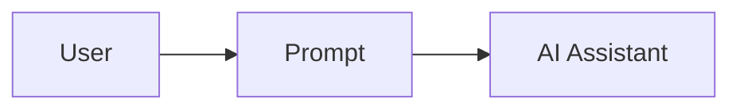
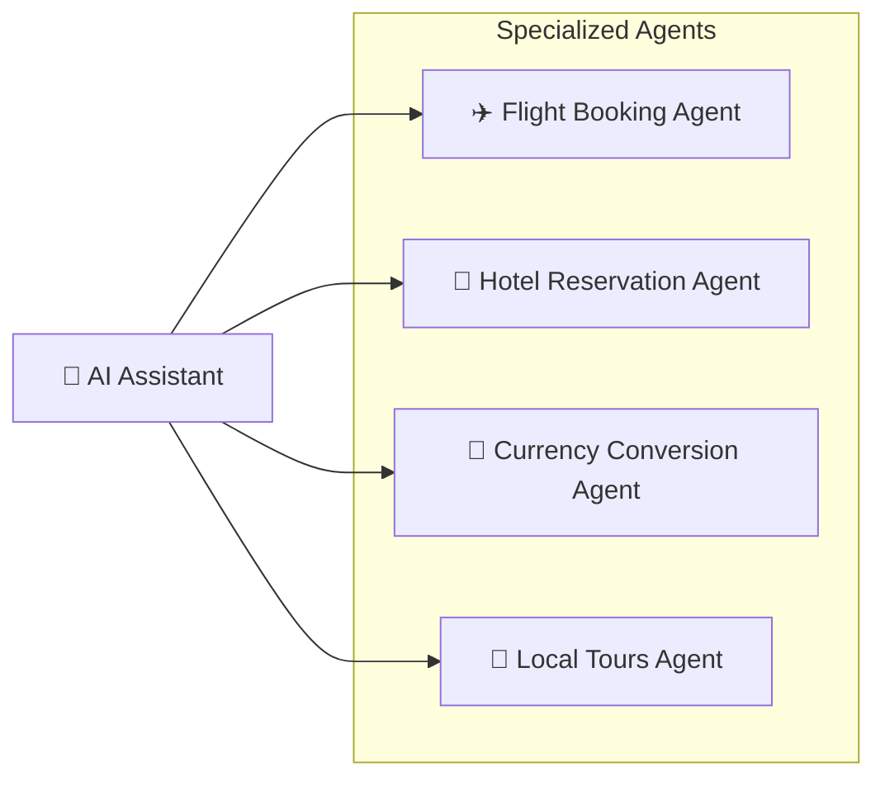
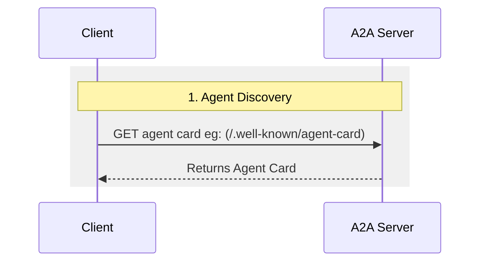
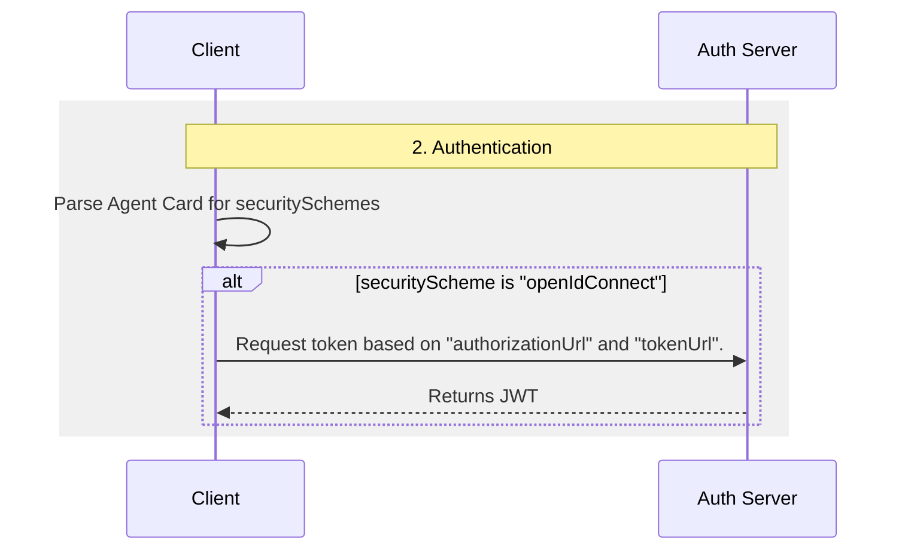
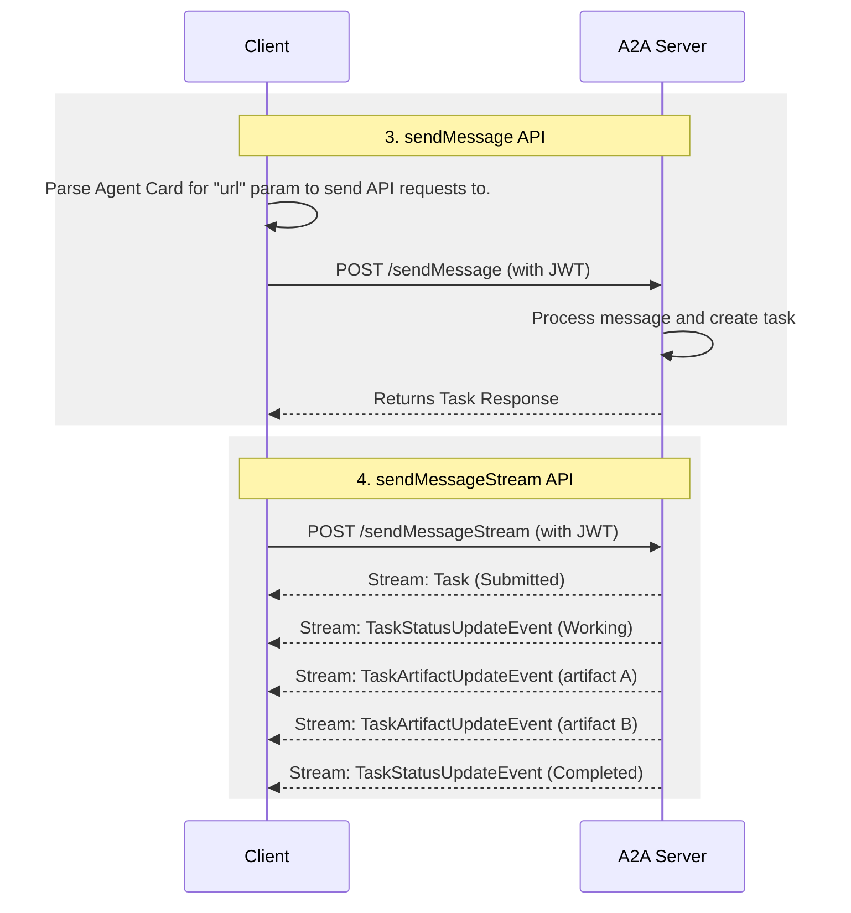

A2A 协议是一套用于 AI 智能体之间通信的开放标准。它赋予智能体一种通用语言，无论它们由哪个框架或厂商构建。这使得它们能够互操作，并打破孤岛。智能体是自主的问题解决者，在其环境中独立行动。借助 A2A，来自不同开发者、框架和组织的智能体可以协同工作。

## 为什么使用 A2A 协议

A2A 解决了 AI 智能体协作中的关键挑战。它为智能体交互提供了标准化方法。本节解释 A2A 解决的问题及其带来的益处。

### A2A 解决的问题

设想一个用户请求 AI 助手规划一次国际旅行。该任务涉及编排多个专业化智能体，例如：

- 一个机票预订智能体
- 一个酒店预订智能体
- 一个负责当地旅游推荐的智能体
- 一个货币兑换智能体

没有 A2A 时，集成这些不同的智能体会带来若干挑战：

- **智能体暴露（Agent Exposure）**：为了让智能体彼此可见，开发者经常把它们包装成工具，就像 Model Context Protocol（MCP）暴露工具那样。但这样做效率很低：智能体是为直接协商而构建的，把它们包装成工具会限制它们能做的事。A2A 按智能体的本来面目暴露它们，无需包装。
- **自定义集成**：每次交互都需要定制的、点对点的解决方案，造成巨大的工程开销。
- **创新缓慢**：为每次新集成进行定制开发拖慢了创新。
- **可扩展性问题**：随着智能体和交互数量的增长，系统会变得难以扩展和维护。
- **互操作性不足**：这种方法限制了互操作性，阻碍了复杂 AI 生态系统的自然形成。
- **安全漏洞**：临时性的通信往往缺乏一致的安全措施。

A2A 解决了这些挑战。它让 AI 智能体能够互操作，从而可靠、安全地交互。

### A2A 示例场景

此示例展示了 A2A（Agent2Agent）协议如何帮助 AI 智能体处理复杂的交互。

#### 用户的复杂请求

用户与 AI 助手交互，给出一个复杂的提示词，如"计划一次国际旅行"。

#### 协作的必要性

AI 助手收到提示词后，意识到它需要调用多个专业化的智能体来完成该请求。这些智能体包括机票预订智能体、酒店预订智能体、货币兑换智能体和当地旅游智能体。

#### 互操作性挑战

核心问题：这些智能体无法协同工作，因为每个智能体都有自己定制的开发和部署。

缺乏标准化协议的结果是，这些智能体不仅无法相互协作，甚至无法发现彼此能做什么。各个智能体（机票、酒店、货币和旅游）都处于孤立状态。

#### "有了 A2A" 的解决方案

A2A 协议赋予智能体用于相互对话的标准方法和数据结构。无论它们的底层实现如何，这一点都成立。现在，同样的这些智能体形成了一个相互连接的系统，通过共享协议进行通信。

AI 助手现在充当编排者。它收集每个启用 A2A 的智能体的结果，并针对用户的提示词呈现一个完整、单一的旅行计划。

### A2A 的核心益处

实现 A2A 协议在整个 AI 生态系统中带来显著优势：

- **安全协作**：没有标准，就难以保证智能体之间的安全通信。A2A 使用 HTTPS 并保持操作不透明，因此智能体无法窥见其所协作对象的内在运作。
- **互操作性**：A2A 打破了 AI 智能体生态系统之间的孤岛。来自不同厂商和框架的智能体协同工作。
- **智能体自主性**：借助 A2A，智能体在协作的同时保持自身能力并继续自主运行。
- **无需自定义集成**：你无需构建定制的插件或点对点代码来连接智能体。无论智能体运行在哪里——你的机器上、云端，还是由厂商托管——同一个协议都能触达它们。它连接跨团队、跨项目和跨公司的智能体。团队专注于其智能体提供的价值。
- **支持 LRO**：该协议支持长时间运行的操作（LRO）。它处理服务器发送事件（SSE）的流式传输和异步执行。

### A2A 的关键设计原则

A2A 的开发遵循优先考虑广泛采用、企业级能力和面向未来的原则。

- **简单性**：A2A 利用 HTTP、JSON-RPC 和服务器发送事件（SSE）等现有标准。这避免了重新发明核心技术，并加速了开发者的采用。
- **企业就绪**：A2A 满足关键的企业需求。它在认证、授权、安全、隐私、追踪和监控方面遵循标准的 Web 实践。
- **异步**：A2A 原生支持长时间运行的任务。它处理智能体或用户可能无法保持持续连接的场景。它使用流式和推送通知等机制。
- **模态无关**：智能体可以使用多种内容类型进行通信。这支持超越纯文本的丰富、灵活的交互。
- **不透明执行**：智能体在协作时不会暴露其内部逻辑、记忆或专有工具。交互依赖于已声明的能力和共享的上下文。这保护了知识产权并提高了安全性。

### 理解智能体技术栈：A2A、MCP、智能体框架和模型

A2A 位于更广泛的智能体技术栈中，该技术栈包括：

- **A2A**：标准化跨组织和跨框架的智能体通信。
- **MCP**：将模型连接到数据和外部资源。
- **智能体框架（例如 LangGraph、CrewAI、ADK）：** 提供用于构建智能体的工具包。
- **模型**：是智能体推理能力的基础，可以是任何大语言模型（LLM）。

#### A2A 与 MCP

你可能已经了解支持智能体、模型和工具之间交互的协议。Model Context Protocol（MCP）就是其中一种新兴标准。它专注于将大语言模型（LLM）连接到数据和外部资源。

Agent2Agent（A2A）协议是 AI 智能体（尤其是其他系统中的智能体）的共享语言。A2A 是 MCP 的补充：它涵盖了智能体交互中一个不同但相关的部分。

- **MCP 的侧重点：** 降低将智能体与工具和数据连接起来的复杂性。工具通常是无状态的，执行特定的、预定义的功能（例如，计算器、数据库查询）。
- **A2A 的侧重点：** 让智能体以其原生模态进行协作。它们以智能体（或用户）的身份通信，而不是通过类似工具的交互。这支持复杂的多轮交互，智能体在其中进行推理、规划和委派任务。例如，它们可以在下单时协商或请求澄清。

将智能体包装成简单的工具是有局限性的：它无法捕捉智能体的全部能力。文章 [为什么智能体不是工具](https://discuss.google.dev/t/agents-are-not-tools/192812) 深入探讨了这一区别。

如需更深入的比较，请参阅 [A2A 与 MCP 对比](/docs/a2a/a2a-and-mcp) 文档。

#### A2A 与智能体框架

A2A 是面向智能体的通信协议。它实现智能体间的通信，无论用于构建每个智能体的框架是什么。团队使用一系列智能体开发工具包和框架构建智能体——例如 LangGraph、CrewAI、ADK 等——而 A2A 让用其中任何一种构建的智能体都能协同工作。该协议不依赖、也不偏向任何单一框架。

### A2A 请求生命周期

一个请求跨三个阶段遵循四个主要步骤：智能体发现、认证，以及消息传递 API（`sendMessage` 和 `sendMessageStream`）。下面的图示将这三大阶段拆分开来，并展示了客户端、A2A 服务器和认证服务器如何交互。

#### 1. 智能体发现

客户端获取服务器的 Agent Card，以了解其能力和端点。

#### 2. 认证

客户端读取 Agent Card 的安全性方案，并在需要时获取令牌。

#### 3. sendMessage 和 sendMessageStream API

客户端向服务器的端点发送消息——要么通过 `sendMessage` 进行单次请求/响应，要么通过 `sendMessageStream` 以任务更新的流形式进行。

## 接下来做什么

选择适合你的路径：

- **更喜欢动手实践？** 通过 [Python 教程](/docs/tutorials/a2a/1-introduction) 构建你的第一个智能体。
- **想要了解基础？** 阅读支撑 A2A 协议的 [核心概念](/docs/a2a/key-concepts)。
- **想深入钻研 A2A 协议？** [A2A 规范](/docs/a2a/specification/index) 是每项能力、方法和数据结构的权威来源。