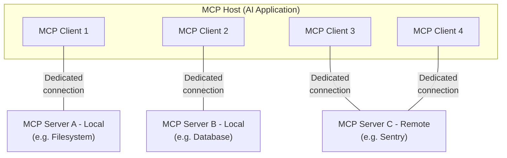

本页是对模型上下文协议（Model Context Protocol，MCP）的概览，讨论其[范围](#scope)与[核心概念](#concepts-of-mcp)，并提供一个[示例](#example)来演示每个核心概念。

由于 MCP SDK 封装了大量细节，大多数开发者可能会觉得[数据层协议](#data-layer-protocol)一节最有用。它讨论了 MCP 服务器如何向 AI 应用提供上下文。

具体的实现细节，请参阅你所使用语言的[SDK 文档](/docs/mcp/sdk)。

## 范围

模型上下文协议包含以下项目：

- [MCP 规范](https://modelcontextprotocol.io/specification/latest)：一份定义客户端和服务端实现要求的 MCP 规范。
- [MCP SDK](/docs/mcp/sdk)：实现 MCP 的多种编程语言的 SDK。
- **MCP 开发工具**：用于开发 MCP 服务器和客户端的工具，包括 [MCP Inspector](https://github.com/modelcontextprotocol/inspector)
- [MCP 参考服务器实现](https://github.com/modelcontextprotocol/servers)：MCP 服务器的参考实现。

<Callout>
  MCP 只关注上下文交换的协议本身——它不规定
  AI 应用如何使用 LLM 或如何管理所提供的上下文。
</Callout>

## MCP 的概念

### 参与者

MCP 采用客户端-伺服架构。在这个架构中，MCP宿主——一个 AI 应用，如 [Claude Code](https://www.anthropic.com/claude-code) 或 [Claude Desktop](https://www.claude.ai/download)——会与一个或多个 MCP 服务器建立连接。MCP 宿主通过为每个 MCP 服务器创建一个 MCP 客户端来实现这一点。每个 MCP 客户端与对应的 MCP 服务器之间维护一条专用的连接。

使用 STDIO 传输的本地 MCP 服务器通常服务单个 MCP 客户端，而使用 Streamable HTTP 传输的远程 MCP 服务器则通常服务多个 MCP 客户端。

MCP 架构中的关键参与者包括：

- **MCP 宿主**：协调并管理一个或多个 MCP 客户端的 AI 应用
- **MCP 客户端**：与 MCP 服务器保持连接、并从 MCP 服务器获取上下文供 MCP 宿主使用的组件
- **MCP 服务器**：向 MCP 客户端提供上下文的程序

**例如**：Visual Studio Code 充当 MCP 宿主。当 Visual Studio Code 与某个 MCP 服务器建立连接（如 [Sentry MCP 服务器](https://docs.sentry.io/product/sentry-mcp/)）时，Visual Studio Code 运行时会实例化一个负责维持与 Sentry MCP 服务器连接的 MCP 客户端对象。
当 Visual Studio Code 随后连接另一个 MCP 服务器（如[本地文件系统服务器](https://github.com/modelcontextprotocol/servers/tree/main/src/filesystem)）时，Visual Studio Code 运行时会再实例化一个额外的 MCP 客户端对象来维持这条连接。



请注意，**MCP 服务器**指的是提供上下文数据的程序，无论它
运行在何处。MCP 服务器可以在本地或远程执行。例如，当
Claude Desktop 启动[文件系统
服务器](https://github.com/modelcontextprotocol/servers/tree/main/src/filesystem)时，
由于该服务器使用 STDIO 传输，它运行在本机的同一台机器上。
这正是通常所说的"本地"MCP 服务器。官方的
[Sentry MCP 服务器](https://docs.sentry.io/product/sentry-mcp/)运行在
Sentry 平台，并使用 Streamable HTTP 传输。这通常被
称为"远程"MCP 服务器。

### 层次

MCP 由两个层组成：

- **数据层**：定义了基于 JSON-RPC 的客户端-服务端通信协议，包括能力与版本发现，以及核心原语，如工具、资源、提示词和通知。
- **传输层**：定义了实现客户端与服务端数据交换的通信机制与通道，包括传输特有的连接建立、消息帧格式和授权。

从概念上讲，数据层是内层，而传输层是外层。

#### 数据层

数据层实现了基于 [JSON-RPC 2.0](https://www.jsonrpc.org/) 的交换协议，定义了消息结构与语义。
该层包括：

- **发现**：让客户端能够通过 `server/discover` 请求查询服务器支持的协议版本、能力和身份
- **服务器特性**：让服务器能够提供核心功能，包括用于 AI 动作的工具、用于上下文数据的资源，以及用于与客户端进行交互模板的提示词
- **客户端特性**：让服务器能够向用户征询输入。抽样（sampling）自协议版本 `2026-07-28` 起被[弃用](/docs/mcp/specification/2026-07-28/deprecated)。
- **实用特性**：支持额外的能力，如用于实时更新的通知和用于长时运行操作的进度跟踪

#### 传输层

传输层管理客户端与服务器之间的通信通道和认证。它处理连接建立、消息帧格式，以及 MCP 参与者之间的安全通信。

MCP 支持两种传输机制：

- **Stdio 传输**：使用标准输入/输出流在同一台机器上的本地进程之间进行直接进程通信，无网络开销，性能最佳。
- **Streamable HTTP 传输**：使用 HTTP POST 发送客户端到服务器的消息，并可选用 Server-Sent Events 实现流式能力。该传输支持远程服务器通信，并支持标准的 HTTP 认证方法，包括承载令牌（bearer token）、API 密钥和自定义请求头。MCP 建议使用 OAuth 获取认证令牌。

传输层将通信细节从协议层中抽象出来，使所有传输机制都可以沿用同一种 JSON-RPC 2.0 消息格式。

### 数据层协议

MCP 的一个核心部分是定义 MCP 客户端与 MCP 服务器之间的模式和语义。开发者可能会发现数据层——特别是[原语](#primitives)这一组概念——是 MCP 中最有趣的部分。它定义了开发者如何将上下文从 MCP 服务器共享给 MCP 客户端。

MCP 使用 [JSON-RPC 2.0](https://www.jsonrpc.org/) 作为其底层的 RPC 协议。客户端与服务器相互发送请求并做出相应响应。当不需要响应时，可以使用通知。

#### 无状态与发现

MCP 是一种 <Tooltip tip="每个请求都包含处理它所需的全部信息，因此服务器不从前序请求中推断任何内容">无状态协议</Tooltip>。每个请求都在其 `_meta` 字段中携带协议版本和与该请求相关的<Tooltip tip="客户端或服务器支持的特性与操作，如工具、资源或提示词">能力</Tooltip>，因此服务器可以独立处理每个请求。客户端的身份也应放在同一字段中，除非配置为不这样做。服务器通过强制的 [`server/discover`](/docs/mcp/specification/2026-07-28/server/discover) 请求公布其支持的版本和能力，客户端可以在任何其他请求之前发送该请求。详细信息参见[规范](/docs/mcp/specification/2026-07-28/basic/index#statelessness)，而[示例](#example)演示了每个请求携带的元数据以及发现时序。

#### 原语

MCP 原语是 MCP 中最重要的概念。它们定义了客户端和服务器可以相互提供什么。这些原语确定了可以与 AI 应用共享的上下文信息类型，以及可以执行的动作范围。

MCP 定义了三种可以由_服务器_暴露的核心原语：

- **工具**：AI 应用可以调用以执行动作的可执行函数（例如，文件操作、API 调用、数据库查询）
- **资源**：为 AI 应用提供上下文信息的数据源（例如，文件内容、数据库记录、API 响应）
- **提示词**：帮助构建与语言模型交互的可复用模板（例如，系统提示词、少样本示例）

每种原语类型都有对应的发现（`*/list`）、检索（`*/get`）方法，部分还有执行（`tools/call`）方法。
MCP 客户端会使用 `*/list` 方法来发现可用的原语。例如，客户端可以先列出所有可用工具（`tools/list`），然后再执行它们。这种设计让列表可以是动态的。

举一个具体的例子：考虑一个提供数据库上下文的 MCP 服务器。它可以暴露用于查询数据库的工具、一个包含数据库模式的资源，以及一个包含用于与该工具交互的少样本示例的提示词。

关于服务器原语的更多细节，请参见[服务器概念](./server-concepts)。

MCP 还定义了可由_客户端_暴露的原语。这些原语让 MCP 服务器作者能够构建更丰富的交互。

- **征询（Elicitation）**：让服务器能够向用户请求额外的信息。当服务器作者想从用户那里获得更多信息，或请求确认某个动作时，这很有用。服务器通过 `elicitation/create` 方法请求用户输入。

征询请求通过[多轮往返请求](/docs/mcp/specification/2026-07-28/basic/patterns/mrtr)模式投递，详见[征询概览](/docs/mcp/learn/client-concepts#elicitation)。

**已弃用**：以下客户端原语自协议版本 `2026-07-28` 起被弃用。

- **抽样**：让服务器能够从客户端的 AI 应用请求语言模型的补全。当服务器作者想要访问语言模型，但又希望保持模型无关性、不在 MCP 服务器中包含语言模型 SDK 时，这很有用。服务器通过 `sampling/createMessage` 方法请求补全，同样通过多轮往返请求模式投递。新的实现应直接集成 LLM 提供商的 API。
- **日志（Logging）**：让服务器能够向客户端发送日志消息，用于调试和监控。新的实现应记录到 `stderr`（stdio 传输）或使用 OpenTelemetry。

关于客户端原语的更多细节，请参见[客户端概念](./client-concepts)。

除服务器原语和客户端原语之外，该协议还支持构建在核心协议之上的可选[扩展](/docs/mcp/extensions/overview)。例如，[任务扩展](/docs/mcp/extensions/tasks/overview)让服务器可以为长时间的请求返回一个持久句柄，客户端可以轮询状态并在之后取回结果。

#### 通知

该协议支持实时通知，以实现服务器与客户端之间的动态更新。例如，当服务器的可用工具发生变化时（例如新增了功能或修改了现有工具），服务器可以发送工具更新通知，告知已连接的客户端这些变化。通知以 JSON-RPC 2.0 通知消息的形式发送（不期望得到响应）。变更通知是选择加入的：客户端打开一个长期存活的 [`subscriptions/listen`](/docs/mcp/specification/2026-07-28/basic/patterns/subscriptions) 流，在其中列出它想接收的通知类型，服务器则在该流上投递匹配的通知。

## 示例

### 数据层

本节逐步演示一次 MCP 客户端-服务器交互，重点放在数据层协议上。我们将使用 JSON-RPC 2.0 消息演示发现、工具操作和通知。

<Steps>
<Step>

### 发现

如[无状态与发现](#statelessness-and-discovery)一节所述，每个 MCP 请求都会在其 `_meta` 字段中携带协议版本和客户端能力，客户端的身份也应放在同一字段中。如果客户端想在发出其他请求之前了解服务器支持什么，它可以发送一个每个服务器都必须实现的 `server/discover` 请求。发现响应通常可被缓存，这意味着它可以被复用，因此不必为每个请求都执行发现流程。

```json Discover Request
  {
    "jsonrpc": "2.0",
    "id": 1,
    "method": "server/discover",
    "params": {
      "_meta": {
        "io.modelcontextprotocol/protocolVersion": "2026-07-28",
        "io.modelcontextprotocol/clientInfo": {
          "name": "example-client",
          "version": "1.0.0"
        },
        "io.modelcontextprotocol/clientCapabilities": {
          "elicitation": {}
        }
      }
    }
  }
  ```
  ```json Discover Response
  {
    "jsonrpc": "2.0",
    "id": 1,
    "result": {
      "resultType": "complete",
      "supportedVersions": ["2026-07-28"],
      "capabilities": {
        "tools": {
          "listChanged": true
        },
        "resources": {}
      },
      "_meta": {
        "io.modelcontextprotocol/serverInfo": {
          "name": "example-server",
          "version": "1.0.0"
        }
      },
      "ttlMs": 3600000,
      "cacheScope": "public"
    }
  }
  ```

#### 理解发现交换

`_meta` 字段和发现响应共同服务于几个目的：

1. **协议版本选择**：`io.modelcontextprotocol/protocolVersion` 字段声明客户端在此请求上使用的版本，响应中的 `supportedVersions` 则列出服务器接受的版本。如果服务器不支持所请求的版本，它会用一个列出其支持版本的 `UnsupportedProtocolVersionError` 拒绝该请求，客户端随后用双方都支持的版本重试。

2. **能力发现**：客户端在每个请求的 `io.modelcontextprotocol/clientCapabilities` 中声明自己的能力，服务器则通过 `server/discover` 返回自己的 `capabilities` 对象。这告诉双方对方可以处理哪些[原语](#primitives)（工具、资源、提示词），以及是否支持变更[通知](#notifications)，从而避免尝试不支持的运算。

3. **身份交换**：请求 `_meta` 中的 `io.modelcontextprotocol/clientInfo` 字段和结果 `_meta` 中的 `io.modelcontextprotocol/serverInfo` 字段，为调试和兼容性提供身份标识与版本信息。

在本示例中，这次交换演示了 MCP 能力是如何被声明的：

**客户端能力**：

- `"elicitation": {}` - 客户端声明在服务器请求时，它可以收集来自用户的额外输入

**服务器能力**：

- `"tools": {"listChanged": true}` - 服务器支持工具原语，并且能兑现 [`subscriptions/listen`](/docs/mcp/specification/2026-07-28/basic/patterns/subscriptions) 中的 `toolsListChanged` 过滤器。请求了该过滤器的客户端，会在工具列表变化时收到 `notifications/tools/list_changed`。
- `"resources": {}` - 服务器还支持资源原语（可以处理 `resources/list` 和 `resources/read` 方法）

调用 `server/discover` 是可选的。由于每个请求都携带相同的 `_meta` 字段，客户端可以自由地直接发送任何请求，并在返回版本错误时进行处理。发现是一种通过单个请求获取服务器身份、能力和支持版本的便捷方式。

#### 这在 AI 应用中如何运作

AI 应用的 MCP 客户端管理器会连接到已配置的服务器，并存储它们发现到的能力以供后续使用。应用使用这些信息来确定哪些服务器能提供特定类型的功能（工具、资源、提示词），以及它们是否支持实时更新。在 Python SDK 中，发现发生在客户端连接的过程中。结果随后可在客户端对象上获得。

```python Pseudo-code for AI application discovery
# Pseudo Code
async with Client(stdio_client(server_config)) as client:
    if client.server_capabilities.tools:
        app.register_mcp_server(client, supports_tools=True)
    app.set_server_ready(client)
```


</Step>

<Step>

### 工具发现（原语）

客户端可以通过发送 `tools/list` 请求来发现可用的工具。这个请求是 MCP 工具发现机制的基础：它让客户端在尝试使用工具之前，先了解服务器上有哪些可用工具。

```json Tools List Request
  {
    "jsonrpc": "2.0",
    "id": 2,
    "method": "tools/list",
    "params": {
      "_meta": {
        "io.modelcontextprotocol/protocolVersion": "2026-07-28",
        "io.modelcontextprotocol/clientInfo": {
          "name": "example-client",
          "version": "1.0.0"
        },
        "io.modelcontextprotocol/clientCapabilities": {
          "elicitation": {}
        }
      }
    }
  }
  ```
  ```json Tools List Response
  {
    "jsonrpc": "2.0",
    "id": 2,
    "result": {
      "resultType": "complete",
      "tools": [
        {
          "name": "calculator_arithmetic",
          "title": "Calculator",
          "description": "Perform mathematical calculations including basic arithmetic, trigonometric functions, and algebraic operations",
          "inputSchema": {
            "type": "object",
            "properties": {
              "expression": {
                "type": "string",
                "description": "Mathematical expression to evaluate (e.g., '2 + 3 * 4', 'sin(30)', 'sqrt(16)')"
              }
            },
            "required": ["expression"]
          }
        },
        {
          "name": "weather_current",
          "title": "Weather Information",
          "description": "Get current weather information for any location worldwide",
          "inputSchema": {
            "type": "object",
            "properties": {
              "location": {
                "type": "string",
                "description": "City name, address, or coordinates (latitude,longitude)"
              },
              "units": {
                "type": "string",
                "enum": ["metric", "imperial", "kelvin"],
                "description": "Temperature units to use in response",
                "default": "metric"
              }
            },
            "required": ["location"]
          }
        }
      ],
      "ttlMs": 300000,
      "cacheScope": "public"
    }
  }
  ```

#### 理解工具发现请求

`tools/list` 请求除了伴随每个 MCP 请求的标准 `_meta` 字段外，不需要任何参数。它还可以接受一个可选的 `cursor` 参数用于[分页](/docs/mcp/specification/2026-07-28/server/utilities/pagination)，上述示例省略了该参数。

#### 理解工具发现响应

响应包含一个 `tools` 数组，提供每个可用工具的综合元数据。这种基于数组的结构让服务器可以同时暴露多个工具，同时在不同功能之间保持清晰的边界。

响应中的每个工具对象都包含几个关键字段：

- **`name`**：工具在服务器命名空间内的唯一标识符。它作为工具执行的主键，应采用清晰的命名模式（例如使用 `calculator_arithmetic` 而不是简单的 `calculate`）
- **`title`**：工具的人类可读显示名称，客户端可以向用户展示
- **`description`**：对工具的功能以及何时使用它的详细说明
- **`inputSchema`**：定义预期输入参数的 JSON Schema，用于类型校验，并提供关于必填与可选参数的清晰文档

结果被标记为 `"resultType": "complete"`，并携带两个缓存字段。`ttlMs` 是以毫秒为单位的新鲜度提示，因此这个工具列表可以被缓存五分钟。`cacheScope` 表示谁可以复用这个响应。规范的[缓存工具](/docs/mcp/specification/2026-07-28/server/utilities/caching)定义了完整规则。

#### 这在 AI 应用中如何运作

AI 应用从所有已连接的 MCP 服务器获取可用工具，并将它们组合成一个统一的可供语言模型访问的工具注册表。这让 LLM 能够理解它可以执行哪些动作，并在对话过程中自动生成适当的工具调用。

```python Pseudo-code for AI application tool discovery
# Pseudo-code using MCP Python SDK patterns
available_tools = []
for client in app.mcp_clients():
    tools_response = await client.list_tools()
    available_tools.extend(tools_response.tools)
conversation.register_available_tools(available_tools)
```

联邦了多个服务器的客户端可以使用[渐进式工具发现](/docs/mcp/develop/clients/client-best-practices#progressive-tool-discovery)，而不是一次性加载所有工具。


</Step>

<Step>

### 工具执行（原语）

现在，客户端可以使用 `tools/call` 方法执行工具。这演示了 MCP 原语在实践中是如何使用的：在发现可用工具之后，客户端可以用适当的参数调用它们。

#### 理解工具执行请求

`tools/call` 请求遵循结构化格式，确保客户端与服务器之间的类型安全和清晰通信。请注意，我们使用的是发现响应中的正式工具名（`weather_current`），而不是简化的名称：

```json Tool Call Request
  {
    "jsonrpc": "2.0",
    "id": 3,
    "method": "tools/call",
    "params": {
      "name": "weather_current",
      "arguments": {
        "location": "San Francisco",
        "units": "imperial"
      },
      "_meta": {
        "io.modelcontextprotocol/protocolVersion": "2026-07-28",
        "io.modelcontextprotocol/clientInfo": {
          "name": "example-client",
          "version": "1.0.0"
        },
        "io.modelcontextprotocol/clientCapabilities": {
          "elicitation": {}
        }
      }
    }
  }
  ```
  ```json Tool Call Response
  {
    "jsonrpc": "2.0",
    "id": 3,
    "result": {
      "resultType": "complete",
      "content": [
        {
          "type": "text",
          "text": "Current weather in San Francisco: 68°F, partly cloudy with light winds from the west at 8 mph. Humidity: 65%"
        }
      ]
    }
  }
  ```

#### 工具执行的关键要素

请求结构包含几个重要组成部分：

1. **`name`**：必须与发现响应中的工具名完全一致（`weather_current`）。这确保服务器能正确识别要执行哪个工具。

2. **`arguments`**：包含工具 `inputSchema` 定义的输入参数。在本示例中：
   - `location`: "San Francisco"（必填参数）
   - `units`: "imperial"（可选参数，未指定时默认为 "metric"）

3. **`_meta`**：携带标准的每请求字段：每个 MCP 请求都必须包含的协议版本和客户端能力，此外还有客户端的身份，客户端应包含身份字段，除非配置为不这样做。

4. **JSON-RPC 结构**：使用标准 JSON-RPC 2.0 格式，以唯一的 `id` 关联请求与响应。

#### 理解工具执行响应

该响应演示了 MCP 灵活的内容系统：

1. **`content` 数组**：工具响应返回内容对象的数组，支持丰富的多格式响应（文本、图片、资源等）

2. **内容类型**：每个内容对象都有一个 `type` 字段。在本示例中，`"type": "text"` 表示纯文本内容，但 MCP 为不同的使用场景支持多种内容类型。

3. **结构化输出**：响应提供可操作的信息，AI 应用可以将其用作语言模型交互的上下文。

这种执行模式让 AI 应用能够动态地调用服务器功能，并接收可与语言模型对话集成的结构化响应。

#### 这在 AI 应用中如何运作

当语言模型在对话过程中决定使用某个工具时，AI 应用会拦截该工具调用，将其路由到对应的 MCP 服务器，执行它，并将结果作为对话流程的一部分返回给 LLM。这让 LLM 能够访问实时数据，并在外部世界中执行动作。

```python
# Pseudo-code for AI application tool execution
async def handle_tool_call(conversation, tool_name, arguments):
    client = app.find_mcp_client_for_tool(tool_name)
    result = await client.call_tool(tool_name, arguments)
    conversation.add_tool_result(result.content)
```


</Step>

<Step>

### 实时更新（通知)

MCP 支持实时通知，让服务器无需被轮询即可告知客户端变化。本节演示通知系统——这是一个保持客户端同步与响应性的关键特性。

#### 订阅变更

变更通知是选择加入的。要接收它们，客户端会发送一个带有 `notifications` 过滤器的 [`subscriptions/listen`](/docs/mcp/specification/2026-07-28/basic/patterns/subscriptions) 请求来打开一个长期存活的订阅流，过滤器列出它想要的事件类型。这里，客户端请求的是工具列表变更：

```json Listen Request
{
  "jsonrpc": "2.0",
  "id": 4,
  "method": "subscriptions/listen",
  "params": {
    "_meta": {
      "io.modelcontextprotocol/protocolVersion": "2026-07-28",
      "io.modelcontextprotocol/clientInfo": {
        "name": "example-client",
        "version": "1.0.0"
      },
      "io.modelcontextprotocol/clientCapabilities": {
        "elicitation": {}
      }
    },
    "notifications": {
      "toolsListChanged": true
    }
  }
}
```

每个客户端请求都会在 `_meta` 中携带 `io.modelcontextprotocol/protocolVersion` 和 `io.modelcontextprotocol/clientCapabilities` 字段，通常还会携带 `io.modelcontextprotocol/clientInfo`，这样服务器可以识别客户端，而无需依赖连接状态。

服务器以 `notifications/subscriptions/acknowledged` 确认订阅，这是第一个在该订阅的 `_meta` 中携带其 ID 的消息（在此之前服务器不会为该订阅发送其他通知）。其 `notifications` 字段反映了服务器同意兑现的所请求过滤器的子集，未支持的通知类型会被省略：

```json Acknowledgment
{
  "jsonrpc": "2.0",
  "method": "notifications/subscriptions/acknowledged",
  "params": {
    "_meta": {
      "io.modelcontextprotocol/subscriptionId": 4
    },
    "notifications": {
      "toolsListChanged": true
    }
  }
}
```

#### 理解工具列表变更通知

在确认之后，当服务器的可用工具发生变化时（例如，新增了功能、修改了现有工具，或工具暂时不可用），服务器会在该流上投递一个通知：

```json Notification
{
  "jsonrpc": "2.0",
  "method": "notifications/tools/list_changed",
  "params": {
    "_meta": {
      "io.modelcontextprotocol/subscriptionId": 4
    }
  }
}
```

#### MCP 通知的关键特性

1. **不需要响应**：请注意通知中没有 `id` 字段。这遵循 JSON-RPC 2.0 的通知语义，即既不期望也不发送响应。

2. **基于选择加入**：该通知只发送给在其 `subscriptions/listen` 过滤器中请求了 `"toolsListChanged": true` 的客户端，并且只有在其工具能力中声明了 `"listChanged": true` 的服务器才提供该通知（如步骤 1 所示）。

3. **订阅 ID 标记**：流上的每条通知都会在 `_meta` 中携带 `io.modelcontextprotocol/subscriptionId`。其值为打开该流的 `subscriptions/listen` 请求的 JSON-RPC ID（在本示例中为 `4`），这样客户端可以将每条通知与产生它的订阅关联起来。

4. **事件驱动**：服务器根据内部状态变化决定何时发送通知，这让 MCP 连接动态且响应灵敏。

5. **尽力而为**：无法保证每条通知都会被发送或接收，尤其是跨传输层重连时。客户端也应依赖轮询来保持结果的时效性。

#### 客户端对通知的响应

收到该通知后，客户端通常会通过请求更新后的工具列表来作出反应。这会形成一个刷新循环，让客户端对可用工具的理解保持最新：

```json Request
{
  "jsonrpc": "2.0",
  "id": 5,
  "method": "tools/list",
  "params": {
    "_meta": {
      "io.modelcontextprotocol/protocolVersion": "2026-07-28",
      "io.modelcontextprotocol/clientInfo": {
        "name": "example-client",
        "version": "1.0.0"
      },
      "io.modelcontextprotocol/clientCapabilities": {
        "elicitation": {}
      }
    }
  }
}
```

#### 为什么通知很重要

这个通知系统至关重要，原因有几方面：

1. **动态环境**：工具可能会根据服务器状态、外部依赖或用户权限而出现或消失
2. **效率**：客户端不需要轮询变更；发生更新时它们会收到通知
3. **一致性**：确保客户端始终拥有关于服务器可用能力的准确信息
4. **实时协作**：支持能够适应不断变化上下文的响应式 AI 应用

这种通知模式可被扩展到工具之外的其它 MCP 原语，实现客户端与服务器之间全面的实时同步。

#### 这在 AI 应用中如何运作

AI 应用会为它关心的变更保持一条打开的通知流。当通知到达时，它会立即刷新工具注册表，并更新 LLM 的可用能力。这确保进行中的对话始终能访问最新的工具集，LLM 也能随着新功能的出现动态适应。

```python
# Pseudo-code for AI application notification handling
async def follow_tool_changes(client):
    async with client.listen(tools_list_changed=True) as sub:
        async for _event in sub:
            tools_response = await client.list_tools()
            app.update_available_tools(client, tools_response.tools)
            if app.conversation.is_active():
                app.conversation.notify_llm_of_new_capabilities()
```


</Step>

</Steps>