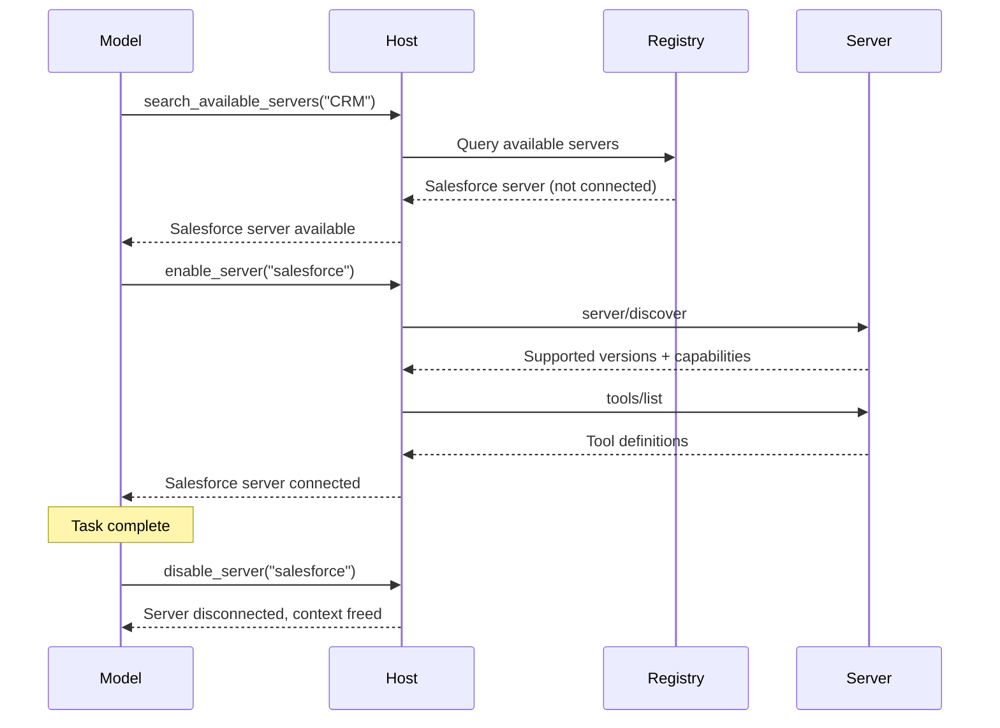
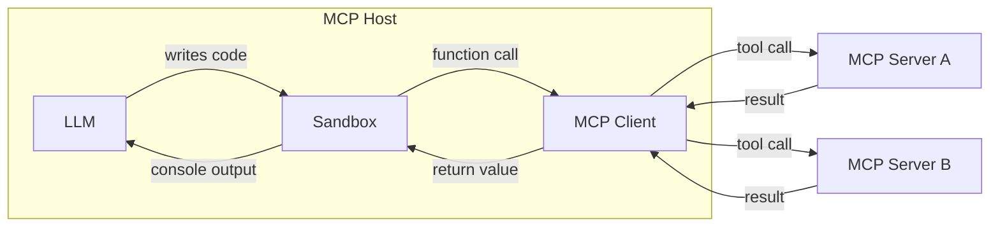

当 MCP 宿主应用（如智能体）连接到更多 MCP 服务器并积累了数百甚至数千个工具的访问权限时，朴素的工具管理方式就会失效。在一开始就把每个工具的定义加载进模型的上下文窗口，既浪费 token、增加延迟，又会降低模型性能。在顺序工具调用之间把大量的中间结果经由模型传递，会使问题雪上加霜。

有两种模式可以应对这些挑战：**渐进式发现**，它控制工具定义_何时_进入上下文；以及**程序化工具调用**，它控制工具_如何_被调用。

## 渐进式工具发现

朴素的 MCP 宿主实现会在每次对话开始时，把所有已连接服务器的工具定义直接传给模型。对于少量工具而言，这种做法完全合理。但当宿主能访问数十个暴露了数百个工具的服务器时，仅仅这些定义本身就可能在模型尚未阅读用户消息之前耗尽大部分上下文窗口。


渐进式发现可以避免这一点：

- 宿主像平常一样通过 `tools/list` 获取工具定义，但延迟将其注入模型的上下文。
- 宿主向模型提供一个轻量级的 `search_tools` 元工具。
- 宿主只在需要时才把完整定义加载进上下文。

### 何时使用渐进式发现

当工具定义占用了上下文窗口的大部分空间时，最适合使用渐进式发现。对于少量工具且其定义只占上下文窗口的一小部分时，一次性加载所有工具没有问题。一旦工具定义占用了可用上下文窗口的很大一部分，客户端就应该切换到渐进式发现。我们建议客户端实现阈值来决定何时切换：

- 将阈值设为上下文窗口的一个百分比。例如 1%–5%。
- 加载工具定义。一旦达到阈值，就切换到渐进式发现。

### 选择发现策略

一旦模型调用了 `search_tools` 工具，我们就需要选择一种搜索策略：

- **基于关键词**：关键词匹配（BM25、正则表达式）。简单有效，尤其适合描述性的工具名和工具描述。
- **基于嵌入**：对工具描述做向量相似度检索。能更好地处理同义词和语义匹配。
- **基于子智能体**：由一个次级模型（通常是像 Claude Haiku 或 Gemini Flash 这样小巧快速的模型）为任务挑选工具。这种方法通常效果很好，但可能比基于嵌入或基于关键词的方案成本更高。
- **混合**：组合多种方法。例如，综合关键词与嵌入排名打分，或者根据用例或查询选择不同的策略。

一些模型提供商已经提供了内置的工具搜索。例如，[OpenAI](https://developers.openai.com/api/docs/guides/tools-tool-search) 和 [Anthropic](https://platform.claude.com/docs/en/agents-and-tools/tool-use/tool-search-tool) 原生支持这一点；请查阅你所用提供商的文档了解对应能力。如果可用，你可能更倾向于使用平台的工具搜索而不是自定义实现。当提供商没有提供，或者你需要专门的检索逻辑（例如领域特定的排序或访问控制过滤）时，再构建你自己的方案。

下面介绍的三层模式详细展示了一种基于搜索的自定义方法，但层次化原则（目录、检查、执行）不论采用哪种检索机制都适用。

### 使用渐进式发现

一种常见的渐进式发现实现采用基于搜索的三层方法：

**第 1 层：目录。** 宿主暴露一组用于搜索可用能力的小型元工具。`search_tools` 工具接受自然语言查询，并返回匹配的工具名及其简短描述。

```typescript
// The model calls a lightweight search tool
search_tools({ query: "update salesforce record" })

// Returns concise matches: names and one-line descriptions only
→ [
    { name: "salesforce_updateRecord", description: "Update fields on a Salesforce object" },
    { name: "salesforce_upsertRecord", description: "Insert or update based on external ID" }
  ]
```

**第 2 层：检查。** 一旦模型确定了一个候选工具，它就只获取该工具的完整定义（输入模式、输出模式、文档）。

```typescript
// The model inspects only the tool it needs
get_tool_details({ name: "salesforce_updateRecord" });
```

这会为单个工具返回完整的模式：

```json
{
  "name": "salesforce_updateRecord",
  "description": "Updates a record in Salesforce",
  "inputSchema": {
    "type": "object",
    "properties": {
      "objectType": {
        "type": "string",
        "description": "Salesforce object type"
      },
      "recordId": { "type": "string", "description": "Record ID to update" },
      "data": { "type": "object", "description": "Fields to update" }
    },
    "required": ["objectType", "recordId", "data"]
  }
}
```

**第 3 层：执行。** 模型在完全了解工具接口的情况下调用该工具，因为只加载了它需要的定义。

这种模式能大幅减少 token 消耗，并且可以提高工具选择的准确性：模型专注于少数相关的工具，而不是扫描数百个无关的工具。其他发现策略（嵌入、子智能体等）遵循同样的层次化原则，只是在目录层替换了不同的检索机制。

### 动态服务器管理

渐进式发现可以扩展到不仅仅是单个工具，还包括整个服务器。宿主不必在启动时就连接所有已配置的服务器，而是可以：

1. 维护一个可用服务器及其高层描述的注册表。
2. 只在模型确定需要某个服务器的能力时才连接到它。
3. 断开与当前任务不再相关的服务器，释放上下文。



这尤其适合通用型智能体，因为这类场景中用户的意图一开始并不明确。智能体从一个最小化的常驻服务器集起步，按需连接其他服务器。结合[智能体技能](/docs/mcp/develop/build-with-agent-skills)，技能文件可以声明它需要哪些 MCP 服务器，宿主只在该技能被调用时才连接它们。

### 实现指南

在实现渐进式发现时：

| 指南                          | 理由                                                                                                                                                                                                        |
| ----------------------------- | ----------------------------------------------------------------------------------------------------------------------------------------------------------------------------------------------------------- |
| **提供多个详细级别**          | 让模型可以在仅名称、名称加描述或完整模式等响应之间选择。                                                                                                                                                    |
| **缓存工具定义**              | 一旦从服务器获取了定义，就在宿主侧缓存下来，这样之后重新注入时就不需要再来一次 `tools/list` 往返。这与当前模型上下文中已有的定义是两回事。                                                                  |
| **在收到 `list_changed` 时刷新** | 当服务器发送 `notifications/tools/list_changed` 时，重新索引搜索目录。                                                                                                                                      |
| **按服务器对工具分组**        | 按来源服务器来组织展示工具，这样模型可以推断相关的能力。                                                                                                                                                    |

### 缓存

每个列表结果（如 `tools/list`），以及每次 `server/discover` 和
`resources/read` 的结果，都携带 `ttlMs` 和 `cacheScope` 提示。请遵循规范的
[缓存工具](/docs/mcp/specification/2026-07-28/server/utilities/caching)中的定义。特别要
注意，一旦 `list_changed` 通知到达，即使 TTL 尚未到期，也要把已缓存的列表视为过期。

### 与提示词缓存的交互

大多数提供商会缓存提示词前缀，包括 `tools` 数组。在对话中途添加或移除工具
定义会使该缓存失效，由此产生的缓存未命中可能会比你所移除的定义消耗更多的 token。
为了保住缓存：

- 在缓存断点之后追加新发现的定义，而不是重新排序
  `tools` 数组；或者让所有调用都经由一个固定的 `call_tool({name, args})` 元工具，
  使数组永不改变。
- 将服务器断开视为一次对话边界操作，而不是单轮操作。
- 结合上面的工具搜索链接，查阅你所用提供商的缓存文档。

## 程序化工具调用 / 代码模式

采用直接工具调用时，每次工具调用都是一次往返：模型生成一个工具调用，客户端执行它，完整的返回结果再次流入模型的上下文。当一个任务需要串联多个工具（读取文档、转换它、再写到别处）时，每个中间结果都会经过模型，即使与它们毫无关系，也会消耗 token 并增加延迟。

程序化工具调用（有时称为"代码模式"）为客户端提供了一种能够**编排组合工具调用**的方式。模型不再直接调用工具，而是编写一段调用工具的代码。这段代码在沙箱环境中执行，只有最终结果会返回给模型。

程序化工具调用功能强大，能更高效地使用 MCP 工具和资源，但它要求
客户端实现一个沙箱环境。


### 工作原理

宿主将 MCP 工具模式转换为沙箱内可用的类型化 API。当模型需要工具时，它会编写一段脚本并执行它。

**第 1 步：从 MCP 模式生成程序化 API。** 宿主读取每个服务器的工具定义，并根据每个工具的参数和 `outputSchema` 生成类型化函数：

```typescript
// Auto-generated from the Logging MCP server's tool schema
interface LogEntry {
  timestamp: string;
  message: string;
  level: string;
}

function logging_getLogs(input: {
  level: "error" | "warn" | "info";
  since: number;
}): Promise<{ entries: LogEntry[] }> {
  return mcp.callTool<{ entries: LogEntry[] }>("logging_getLogs", input);
}

// Auto-generated from the Ticketing MCP server's tool schema
function ticketing_createIssue(input: {
  title: string;
  body?: string;
  priority: "low" | "medium" | "high";
}): Promise<{ issueId: string }> {
  return mcp.callTool<{ issueId: string }>("ticketing_createIssue", input);
}
```

MCP 服务器可以为每个工具提供可选的 [`outputSchema`](/docs/mcp/specification/2026-07-28/server/tools#output-schema)。当存在输出模式时，宿主可以生成精确的返回类型（如上文的 `LogEntry`）。

当输出模式缺失时，优先采用简单的路径：

- **使用通用类型并继续。** 接受 `any` 或 `string`，在后续处理非结构化输出。真正的解决方案是让服务器作者提供 `outputSchema`。
- **用快速模型提取类型化结果**，适用于循环外的单次调用场景。通过与 MCP 工具调用相同的桩拦截路径，暴露一个宿主代理的 `extract(value, ExpectedType)` 辅助函数，这样沙箱本身永远不会打开网络连接。该辅助函数路由到一个小型模型（例如 Claude Haiku 或 Gemini Flash），将值转换为 `ExpectedType`。这会增加每次调用的延迟，并可能产生幻觉或丢失字段，因此在使用前要针对 `ExpectedType` 校验结果。

**第 2 步：模型针对这些 API 编写代码。** 模型不再分别发起工具调用、让完整结果在它们之间流经上下文，而是编写单个脚本。考虑这样一个任务："找出过去一小时内所有的错误日志，并为每个去重后的错误提交一张工单。"如果采用直接工具调用，成千上万条日志条目会流经模型的上下文。而使用代码，模型就可以在沙箱中进行过滤：

```typescript
// Model-generated code, executes in sandbox
const logs = await logging_getLogs({
  level: "error",
  since: Date.now() - 3600000,
});

// Filter and deduplicate inside the sandbox, not in the model's context
const uniqueErrors = new Map<string, LogEntry>();
for (const log of logs.entries) {
  if (!uniqueErrors.has(log.message)) {
    uniqueErrors.set(log.message, log);
  }
}

for (const [message, log] of uniqueErrors) {
  await ticketing_createIssue({
    title: `Error: ${message}`,
    body: `First seen: ${log.timestamp}\nOccurrences: ${
      logs.entries.filter((l) => l.message === message).length
    }`,
    priority: "high",
  });
}

console.log(
  `Filed ${uniqueErrors.size} tickets from ${logs.entries.length} error logs`,
);
```

**第 3 步：沙箱执行代码。** 沙箱内的函数调用会被拦截，并通过宿主代理路由回对应的 MCP 服务器。日志数据和工单创建在服务器之间直接流转，从不进入模型的上下文。只有 `console.log` 的输出——一行摘要——会返回给模型。

### 选择沙箱

正确的沙箱取决于你想让模型编写的语言、你宿主应用的语言，以及你需要多大的隔离度。下表列出的只是示例运行时，并非背书；请针对你的用例评估其成熟度：

| 沙箱语言       | 运行时 / 库                                                        | 宿主语言         | 方案                                                                                                  |
| -------------- | ------------------------------------------------------------------ | ---------------- | ------------------------------------------------------------------------------------------------------ |
| **JavaScript** | [Deno](https://github.com/denoland/deno)、`isolated-vm`            | Rust / Node / CLI | 基于 V8 的运行时，具有细粒度的权限控制。可以禁用所有权限以实现完全锁定。                                |
| **Python**     | [Monty](https://github.com/pydantic/monty)_（实验性)_              | Rust              | 为 AI 用例构建的极简 Python 解释器。默认无 I/O。                                                        |
| **TypeScript** | [pctx](https://github.com/portofcontext/pctx)_（早期阶段)_         | Python / Rust     | 以库的形式融入代码模式概念，并提供底层 Rust 支持。                                                        |
| **任意语言（经 Wasm）** | [Wasmtime](https://github.com/bytecodealliance/wasmtime)           | Rust / C / Go     | 将任意语言编译为 Wasm，并以基于能力的安全模型运行。                                                   |

无论采用何种沙箱，集成的模式都是一样的：宿主注入函数桩，在进程内或 stdio 通道上拦截调用（因此网络权限可以保持完全禁止），并将它们作为 `tools/call` 请求分发到 MCP 服务器。

### 执行架构

该实现有三个组成部分：



**沙箱**在隔离环境中运行模型生成的代码，无法直接访问网络。它与外部世界的唯一接口是通过生成的函数桩，这些桩把调用路由回宿主。

**宿主**充当代理。它接收来自沙箱的函数调用，将它们映射到正确的 MCP 服务器，执行工具调用，并把结果返回给沙箱。授权令牌和凭据由宿主持有，永远不会暴露给生成的代码。

**模型**只能看到沙箱返回的内容，通常是 `console.log` 语句的输出或最终的返回值。这让模型（以及客户端开发者）能精确控制进入上下文窗口的内容。

### 安全考量

程序化工具调用引入了一个代码执行面，需要仔细地做沙箱隔离：

- **每次调用的授权**：在规范意义上，代理仍然是 MCP 宿主。对沙箱发起的调用应用与直接调用相同的人工确认策略（参见[工具：安全](/docs/mcp/specification/2026-07-28/server/tools#security-considerations)）。批准脚本并不等于对它在运行时发出的每次工具调用都一概放行；宿主可以授予类别化的批准（例如，"允许本次脚本运行期间调用 `ticketing_createIssue`"），而不必每次迭代都向用户弹窗，但代理仍必须对照该授权逐次评估每个调用。
- **跨服务器数据流**：来自一个服务器的工具结果，对另一个服务器而言是不可信的输入。代理应像对待直接调用一样，对代理调用应用相同的输入审查策略；仅仅截断输出无法阻止数据泄露。
- **网络隔离**：沙箱不应有直接的网络访问。所有外部通信都经由宿主代理，由它强制实施授权和访问控制。
- **不暴露凭据**：API 密钥和令牌由宿主持有。生成的代码调用类型化函数；宿主导发到服务器时添加认证信息。
- **资源限制**：为沙箱执行设置超时和内存限制，以防止脚本失控。
- **输出过滤**：在把沙箱的控制台输出回传给模型之前，进行校验和截断。

### 错误处理

MCP 工具错误是以一个带
[`isError: true`](/docs/mcp/specification/2026-07-28/server/tools#error-handling) 的成功响应
到达的，而不是传输层故障。生成的包装函数应把它转换为抛出的异常，这样模型编写的代码
就可以使用 `try`/`catch`。如果未捕获的错误终止了脚本，把它作为脚本的结果
呈现出来，以便模型自行修正；对于已提交的副作用，模型要负责报告其中任何部分。

## 组合两种模式

渐进式发现与程序化工具调用能很好地配合使用。模型使用发现工具来确定它需要哪些工具，加载它们的模式，然后编写一个在单次执行中调用多个工具的脚本。这种组合同时把工具定义的 token 成本_和_工具结果的 token 成本都降到最低，让模型的上下文专注于推理，而不是用于传递数据。