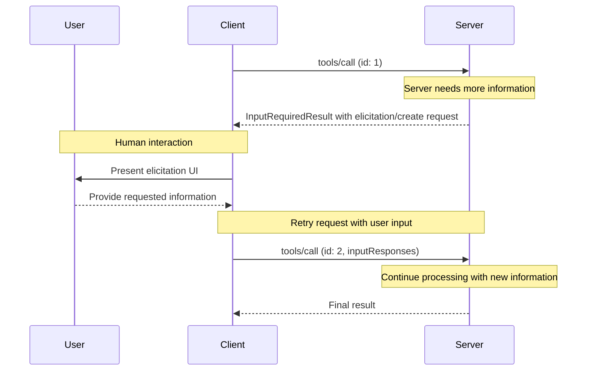
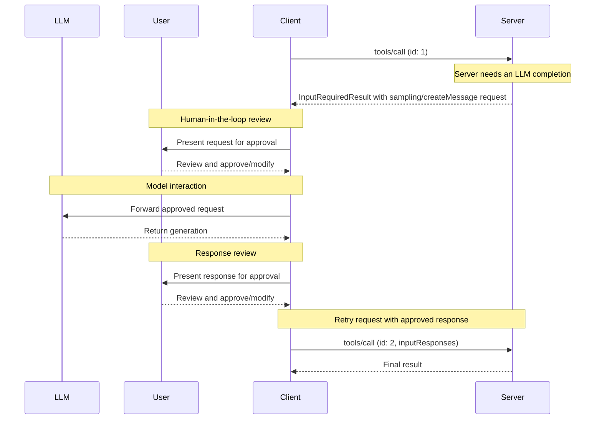

MCP 客户端由宿主应用实例化，用于与特定的 MCP 服务器通信。宿主应用（如 Claude.ai 或一个 IDE）管理整体用户体验并协调多个客户端。每个客户端负责与一个服务器进行一次直接通信。

理解两者的区别很重要：_宿主_是用户与之交互的应用，而_客户端_是启用服务器连接的协议级组件。

## 核心客户端特性

除了利用服务器提供的上下文外，客户端还可以向服务器提供若干特性。这些客户端特性让服务器作者能够构建更丰富的交互。

| 特性         | 说明                                                                                                                                                                                                                                                         | 示例                                                                                                                                  |
| ------------ | ------------------------------------------------------------------------------------------------------------------------------------------------------------------------------------------------------------------------------------------------------------ | -------------------------------------------------------------------------------------------------------------------------------------- |
| **征询（Elicitation）** | 征询让服务器能够在交互过程中向用户请求特定信息，为服务器按需收集信息提供了一种结构化方式。                                                                                                                                                                 | 一个预订旅行的服务器可能向用户询问关于飞机座位、房型的偏好，或他们的联系电话，以完成预订。                                               |
| **根（Roots）**     | 根允许客户端指定服务器应聚焦于哪些目录，通过一种协调机制传达预期的范围。根自协议版本 `2026-07-28` 起被[弃用](/docs/mcp/specification/2026-07-28/deprecated)。                                                                                                       | 一个预订旅行的服务器可能被授予访问某个特定目录的权限，并从中读取用户的日历。                                                           |
| **抽样（Sampling）**    | 抽样允许服务器通过客户端请求 LLM 补全，从而实现智能体化的流程。这种方法让客户端完全掌控用户权限和安全措施。抽样自协议版本 `2026-07-28` 起被弃用。                                                                                                       | 一个预订旅行的服务器可以把航班列表发送给 LLM，并请求 LLM 为用户挑选最佳航班。                                                         |

### 征询

征询让服务器能够在交互过程中向用户请求特定信息，从而创建更动态、更响应灵敏的工作流。

#### 概览

征询为服务器按需收集必要信息提供了一种结构化方式。服务器不必在一开始就要求全部信息，也不必在数据缺失时失败，而是可以暂停操作，向用户请求特定输入。这创造了更灵活的交互，让服务器能适应于用户的需求，而不是遵循僵化的模式。

征询支持两种模式：

- **表单模式**：服务器要求客户端收集用户的结构化数据。请求中包含一个模式，客户端用它来构建输入表单并校验响应。
- **URL 模式**：服务器提供一个 URL 供用户打开。交互在带外发生，其数据永远不会经过客户端，这使得该模式适合敏感流程，例如凭据输入或第三方 OAuth 授权。

征询遵循[多轮往返请求](/docs/mcp/specification/2026-07-28/basic/patterns/mrtr)（MRTR）模式。当服务器在处理诸如 `tools/call` 之类的请求时需要用户输入时，它会以一个 `InputRequiredResult` 作出响应，其 `inputRequests` 字段携带一个或多个 `elicitation/create` 请求。客户端收集输入并重试原始请求，附上收集到的 `inputResponses`，并回传服务器包含的任何 `requestState`。

**征询流程：**



该流程实现了动态的信息收集。服务器可以在需要时请求特定数据，用户通过合适的 UI 提供信息，服务器再携带新获取的上下文完成被重试的请求。

**征询请求示例（在 `InputRequiredResult.inputRequests` 内投递）：**

```typescript
{
  method: "elicitation/create",
  params: {
    mode: "form",
    message: "Please confirm your Barcelona vacation booking details:",
    requestedSchema: {
      type: "object",
      properties: {
        confirmBooking: {
          type: "boolean",
          description: "Confirm the booking (Flights + Hotel = $3,000)"
        },
        seatPreference: {
          type: "string",
          enum: ["window", "aisle", "no preference"],
          description: "Preferred seat type for flights"
        },
        roomType: {
          type: "string",
          enum: ["sea view", "city view", "garden view"],
          description: "Preferred room type at hotel"
        },
        travelInsurance: {
          type: "boolean",
          default: false,
          description: "Add travel insurance ($150)"
        }
      },
      required: ["confirmBooking"]
    }
  }
}
```

#### 示例：假期预订审批

一个旅行预订服务器通过最终的预订确认流程展示了征询的能力。当用户已经挑选好他理想的巴塞罗那假期套餐时，服务器需要在继续之前收集最终的批准以及任何缺失的细节。

服务器通过一个结构化的请求征询预订确认，该请求包含行程摘要（巴塞罗那航班 6 月 15–22 日、海滨酒店、总计 3,000 美元）以及任何附加偏好的字段——例如座位选择、房型或旅行保险选项。

随着预订的推进，服务器会征询完成预订所需的联系方式。它可能会询问航班预订的旅客信息、酒店的特别要求，或紧急联系人信息。

#### 用户交互模型

征询交互的设计目标是清晰、契合上下文，并尊重用户自主权：

**请求呈现**：客户端在展示征询请求时，会附带清晰的上下文，说明是哪个服务器在询问、为什么需要这些信息、以及这些信息将如何使用。请求消息说明目的，而模式提供结构和校验。

**响应选项**：用户可以通过合适的 UI 控件（文本框、下拉框、复选框）提供所请求的信息，也可以在附上可选说明的情况下拒绝提供信息，或者取消整个操作。客户端会在将响应返回给服务器之前，根据所提供的模式校验响应。

**URL 处理**：对于 URL 模式，客户端会展示完整的 URL，并在打开它之前征求明确的同意，绝不会自动获取该 URL。客户端只知道用户是否同意。交互本身停留在用户与目标站点之间。

**隐私考量**：服务器不得使用表单模式来请求诸如密码、API 密钥、访问令牌或支付凭据之类的敏感信息。这类交互属于 URL 模式，该模式让数据留在带外，永远不会经过客户端或 LLM 上下文。客户端会针对可疑请求发出警告，并让用户在发送前审查表单数据。

### 根

<Callout type="warn">
  根自协议
  版本 `2026-07-28` 起被[弃用](/docs/mcp/specification/2026-07-28/deprecated)，
  并计划移除。新的实现应
  通过工具参数、资源 URI 或服务器配置
  来传递目录或文件。
</Callout>

根定义了服务器操作的文件系统边界，允许客户端指定服务器应聚焦于哪些目录。

#### 概览

根是客户端与服务器之间传达文件系统访问边界的一种机制。它们由文件 URI 组成，指示服务器可以操作的目录，帮助服务器理解可用文件和文件夹的范围。虽然根传达的是预期边界，但它并不强制实施安全限制。真正的安全必须在操作系统层面、通过文件权限和/或沙箱来强制实施。

**根结构：**

```json
{
  "uri": "file:///Users/agent/travel-planning",
  "name": "Travel Planning Workspace"
}
```

根只针对文件系统路径，并且始终使用 `file://` URI 方案。它们帮助服务器理解项目边界、工作区组织以及可访问的目录。随着用户在不同的项目或文件夹中工作，根列表会变化。服务器会在下一次请求根列表时获取到更新后的边界。

#### 示例：旅行规划工作区

一个为多个客户行程工作的旅行智能体，会受益于使用根来组织文件系统访问。设想一个工作区，其中有不同目录用于旅行规划的各个方面。

客户端向旅行规划服务器提供文件系统根：

- `file:///Users/agent/travel-planning` - 包含所有旅行文件的主工作区
- `file:///Users/agent/travel-templates` - 可复用的行程模板和资源
- `file:///Users/agent/client-documents` - 客户护照和旅行文件

当智能体创建巴塞罗那行程时，行为规范的服务器会尊重这些边界——在指定的根内访问模板、保存新行程、引用客户文件。服务器通常通过使用相对于根目录的路径，或使用尊重根边界的文件搜索工具来访问根内的文件。

如果智能体打开了一个存档文件夹，如 `file:///Users/agent/archive/2023-trips`，客户端会把它添加到根列表，服务器会在下一次 `roots/list` 请求时看到这个新的边界。

关于一个尊重根的完整服务器实现，请参阅官方服务器仓库中的[文件系统服务器](https://github.com/modelcontextprotocol/servers/tree/main/src/filesystem)。

#### 设计理念

根是客户端与服务器之间的协调机制，而不是安全边界。规范要求服务器"**应当**尊重根边界"，而不是"**必须**强制"根边界，因为服务器运行的代码是客户端无法控制的。

当服务器受信任或经过审查、用户理解根的咨询性质、且目标是防止意外而不是阻止恶意行为时，根的效果最好。它们擅长上下文定界（告诉服务器聚焦于哪里）、事故预防（帮助行为规范的服务器保持在边界内）以及工作流组织（例如自动管理项目边界）。

#### 用户交互模型

根通常由宿主应用根据用户操作自动管理，不过有些应用可能会提供手动管理根的方式：

**自动根检测**：当用户打开文件夹时，客户端会自动将它们暴露为根。打开旅行工作区可以让客户端将该目录暴露为一个根，帮助服务器理解当前工作范围内有哪些行程和文件。

**手动根配置**：高级用户可以通过配置指定根。例如，添加 `/travel-templates` 来提供可复用的资源，同时排除包含财务记录的目录。

### 抽样

<Callout type="warn">
  抽样自协议
  版本 `2026-07-28` 起被[弃用](/docs/mcp/specification/2026-07-28/deprecated)，
  并计划移除。新的实现应
  直接集成 LLM 提供商的 API。
</Callout>

抽样允许服务器通过客户端请求语言模型补全，在保持安全性和用户控制的同时，实现智能体化的行为。

#### 概览

抽样让服务器能够执行依赖 AI 的任务，而无需直接集成或付费使用 AI 模型。相反，服务器可以请求已具备 AI 模型访问能力的客户端代表它们处理这些任务。这种方法让客户端完全掌控用户权限和安全措施。由于抽样请求发生在其他操作的上下文中（例如，一个分析数据的工具），并作为独立的模型调用被处理，它们在不同上下文之间保持了清晰的边界，从而可以更高效地使用上下文窗口。

抽样遵循[征询](#elicitation)一节所述的相同[多轮往返请求](/docs/mcp/specification/2026-07-28/basic/patterns/mrtr)流程，其中 `InputRequiredResult` 携带一个 `sampling/createMessage` 请求。

服务器还可以在抽样过程中请求使用工具，方法是在请求中携带 `tools` 数组和一个可选的 `toolChoice` 字段。工具定义限定于该抽样请求，不必与服务器暴露的工具相对应。客户端通过 `sampling.tools` 能力声明支持，服务器不得向未声明该能力的客户端发送启用工具的抽样请求。详情参见规范的[sampling](/docs/mcp/specification/2026-07-28/client/sampling#tools-in-sampling)一节。

**抽样流程：**



该流程通过多个"人在回路中"的检查点确保安全。用户在客户端用批准后的内容重试原始请求之前，可以审查并修改最初的请求和生成的响应。

**请求参数示例：**

```typescript
{
  messages: [
    {
      role: "user",
      content: {
        type: "text",
        text: "Analyze these flight options and recommend the best choice:\n" +
              "[47 flights with prices, times, airlines, and layovers]\n" +
              "User preferences: morning departure, max 1 layover"
      }
    }
  ],
  modelPreferences: {
    hints: [{
      name: "claude-sonnet-4-20250514"  // Suggested model
    }],
    costPriority: 0.3,      // Less concerned about API cost
    speedPriority: 0.2,     // Can wait for thorough analysis
    intelligencePriority: 0.9  // Need complex trade-off evaluation
  },
  systemPrompt: "You are a travel expert helping users find the best flights based on their preferences",
  maxTokens: 1500
}
```

#### 示例：航班分析工具

考虑一个旅行预订服务器，其中有一个名为 `findBestFlight` 的工具，它使用抽样来分析可用航班并推荐最优选择。当用户问"帮我预订下个月去巴塞罗那的最佳航班"时，该工具需要 AI 的协助来评估复杂的权衡。

该工具查询航空公司 API 并收集 47 个航班选项。然后它请求 AI 协助分析这些选项："分析这些航班选项并推荐最佳选择：[包含价格、时间、航空公司和经停的 47 个航班] 用户偏好：上午出发，最多 1 次经停。"

客户端发起抽样请求，让 AI 评估权衡——比如更便宜的红眼航班与方便的上午出发。该工具利用这种分析来呈上前三名建议。

#### 用户交互模型

虽然并非强制要求，但抽样的设计支持"人在回路中"的控制。用户可以通过若干机制保持监督：

**审批控制**：抽样请求可能需要明确的用户同意。客户端可以展示服务器想要分析的内容及其原因。用户可以批准、拒绝或修改请求。

**透明度特性**：客户端可以显示确切的提示词、模型选择和令牌上限，让用户能在 AI 响应返回服务器之前对其审查。

**配置选项**：用户可以设置模型偏好、为受信任的操作配置自动批准，或要求对所有操作进行审批。客户端可以提供编辑敏感信息的选项。

**安全考量**：客户端和服务器在抽样期间都必须妥善处理敏感数据。客户端应实现速率限制并校验所有消息内容。"人在回路中"的设计确保服务器请求的 AI 交互无法在没有明确用户同意的情况下危害安全或访问敏感数据。