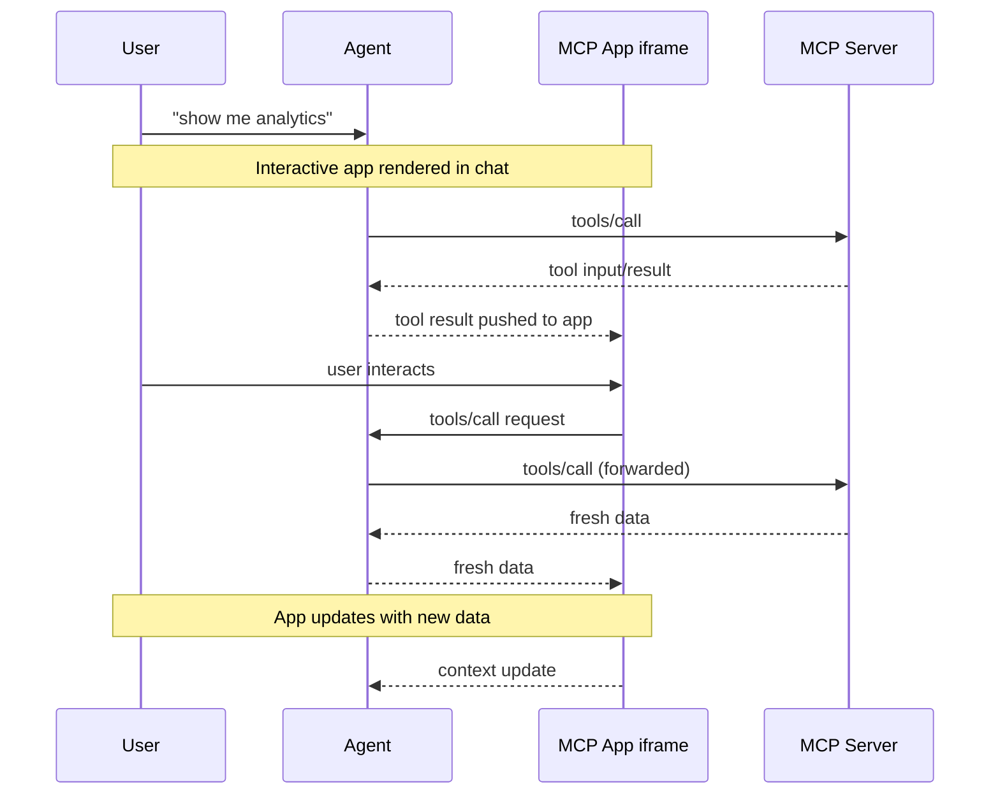

<Callout type="info">

如需全面的 API 文档、高级模式和完整规范，请访问 [官方 MCP 应用文档](https://apps.extensions.modelcontextprotocol.io)。

</Callout>

纯文本回复能做到的事情终究有限。有时用户需要与数据交互，而不只是
阅读数据。MCP 应用让服务端返回可直接渲染在聊天中的交互式 HTML 界面（数据
可视化、表单、仪表盘）。

在 Claude 中运行的 Excalidraw MCP 应用

## 为什么不直接构建一个 Web 应用？

你当然可以构建一个独立的 Web 应用并把链接发给用户。然而，MCP 应用
提供了独立页面无法比拟的关键优势：

- **上下文保留。** 应用存在于对话之中。用户无需
  切换标签页、无需担心迷失位置，也不用回忆哪个聊天记录里有那个仪表盘。
  UI 就出现在促成它的讨论旁边。
- **双向数据流。** 你的应用可以调用 MCP 服务端上的任何工具，
  宿主也可以将最新结果推送到你的应用。独立的 Web 应用需要
  自己的 API、认证和状态管理。而 MCP 应用通过现有
  MCP 模式即可实现。
- **与宿主能力的集成。** 应用可以将操作委托给宿主，由宿主调用用户已经连接的能力和工具（需经用户同意）。应用无需各自实现和维护直接集成（例如邮件服务商），只需提出一个目标结果（比如"安排这次会议"），宿主便会通过用户已有的已连接能力来完成它。
- **安全保障。** MCP 应用运行在由宿主控制的沙箱化 iframe 中。
  它们无法访问父页面、窃取 cookie 或逃逸出
  容器。这意味着宿主可以在无需完全信任
  服务端作者的情况下安全地渲染第三方应用。

如果你的使用场景用不到这些特性，普通的 Web 应用可能
更简单。但如果你想要与基于 LLM 的对话深度集成，
MCP 应用是更好的选择。

## MCP 应用的工作原理

传统 MCP 工具返回文本、图像、资源或结构化数据，由宿主将其作为
对话的一部分展示。MCP 应用扩展了这一模式，允许工具
在其描述中声明对交互式 UI 的引用，宿主会在对应位置进行渲染。

核心模式结合了两种 MCP 原语：一个在其描述中声明 UI 资源的
工具，以及一个将数据渲染为交互式 HTML 界面的 UI 资源。

当大语言模型（LLM）决定调用一个支持 MCP 应用的工具时，
会发生以下过程：

1. **UI 预加载**：工具描述中包含一个指向 `ui://` 资源的
   `_meta.ui.resourceUri` 字段。宿主可以在工具被调用之前就预加载该资源，
   从而支持诸如向应用流式传输工具输入等功能。

2. **获取资源**：宿主从服务器获取 UI 资源。该
   资源包含一个 HTML 页面，通常为了简便会将 JavaScript 和 CSS 一并打包。
   应用还可以从 `_meta.ui.csp` 中指定的来源加载外部脚本和资源。

3. **沙箱化渲染**：Web 宿主通常会在对话内一个沙箱化的
   [iframe](https://developer.mozilla.org/en-US/docs/Web/HTML/Element/iframe)
   中渲染 HTML。沙箱限制了应用对父页面的访问，确保安全性。资源的 `_meta.ui` 对象可以包含
   `permissions`，用于请求额外能力（例如麦克风、摄像头），以及 `csp`，用于控制应用可以从哪些外部来源加载资源。

4. **双向通信**：应用与宿主通过一套
   JSON-RPC 协议进行通信，这套协议构成了 MCP 的一个独立方言。部分
   请求和通知与核心 MCP 协议通用（例如 `tools/call`），
   部分则类似（例如 `ui/initialize`），而大多数是带有 `ui/` 方法名前缀的新内容。
   应用可以请求调用工具、发送消息、更新模型的
   上下文，以及接收宿主的数据。

应用与宿主保持隔离，但仍能通过安全的 postMessage 通道调用 MCP 工具。

## 何时使用 MCP 应用

当你的使用场景涉及以下情况时，MCP 应用是一个很好的选择：

**探索复杂数据。** 用户问"显示各地区销售数据"。文本
回复可能只是列出数字，而 MCP 应用可以渲染一张交互式地图，用户
可以点击区域下钻、悬停查看详情、切换不同指标，全程无需额外提示。

**多项配置。** 部署配置涉及几十个相互关联的选择。与其进行
来回对话（"选哪个区域？""实例多大？""启用自动扩缩容吗？"），
MCP 应用可以呈现一个表单，让用户一次性看到所有选项，并配有校验和默认值。

**查看富媒体。** 当用户要求查看 PDF、查看 3D 模型或
预览生成的图片时，文字描述就显得不足了。MCP 应用将
真正的查看器（平移、缩放、旋转）直接嵌入对话中。

**实时监控。** 展示实时指标、日志或系统状态的仪表盘需要持续更新。
MCP 应用维持持久连接，随数据变化更新显示内容，用户无需反复询问
"现在状态如何？"

**多步骤工作流。** 审批费用报告、审查代码变更或
分拣处理 issues 都需要逐项查看。MCP 应用提供了
导航控件、操作按钮以及跨交互持久化的状态。

## 安全模型

MCP 应用运行在沙箱化的
[iframe](https://developer.mozilla.org/docs/Web/HTML/Element/iframe) 中，
可以与宿主应用实现强隔离。沙箱可以防止你的
应用访问父窗口的
[DOM](https://developer.mozilla.org/docs/Web/API/Document_Object_Model)、读取
宿主的 cookie 或本地存储、导航父页面，或在父级上下文中
执行脚本。

应用与宿主之间的所有通信都通过
[postMessage API](https://developer.mozilla.org/docs/Web/API/Window/postMessage) 进行。
宿主控制你的应用可以访问哪些能力。例如，宿主
可能限制应用可以调用哪些工具，或禁用 `sendOpenLink` 能力。

沙箱的设计目的是防止应用逃逸，从而访问宿主或用户数据。

## 框架支持

MCP 应用使用 MCP 自身的方言，与核心协议一样基于 JSON-RPC 构建。
部分消息与常规 MCP 通用（例如 `tools/call`），而其余消息则是
应用特有的（例如 `ui/initialize`）。传输方式采用
[postMessage](https://developer.mozilla.org/docs/Web/API/Window/postMessage)
而非 stdio 或 HTTP。由于使用的都是标准 Web 原语，你可以使用任何
框架，也可以完全不使用框架。

`@modelcontextprotocol/ext-apps` 中的 `App` 类是一个便捷封装，
并非必需。如果你希望避免依赖或需要更精细的控制，可以直接实现
[postMessage 协议](https://github.com/modelcontextprotocol/ext-apps/blob/main/specification/2026-01-26/apps.mdx)。

[示例目录](https://github.com/modelcontextprotocol/ext-apps/tree/main/examples)
中包含 React、Vue、Svelte、Preact、Solid 和原生
JavaScript 的入门模板。这些模板演示了各个框架体系下的推荐模式，
但它们只是示例而非强制要求。你可以选择最适合
自己使用场景的方案。

## 客户端支持

<Callout>

MCP 应用是 [核心 MCP 规范](/docs/mcp/specification/latest) 的一项扩展。宿主支持情况因客户端而异。

</Callout>

MCP 应用目前受 [Claude](https://claude.ai)、
[Claude Desktop](https://claude.ai/download)、
[VS Code GitHub Copilot](https://code.visualstudio.com/)、[Microsoft 365 Copilot](https://www.microsoft.com/microsoft-365-copilot)、[Goose](https://block.github.io/goose/)、[Postman](https://postman.com)、[MCPJam](https://www.mcpjam.com/) 和 [Archestra.AI](https://www.archestra.ai/) 支持。完整的跨客户端扩展支持列表请参阅
[客户端矩阵](/docs/mcp/extensions/client-matrix)。

如果你正在构建 MCP 客户端并希望支持 MCP 应用，有两种选择：

1. **使用框架**：[`@mcp-ui/client`](https://github.com/MCP-UI-Org/mcp-ui)
   包提供了 React 组件，用于在你的宿主应用中渲染和交互 MCP 应用
   视图。使用详情请参阅
   [MCP-UI 文档](https://mcpui.dev/)。

2. **基于 AppBridge 构建**：SDK 中包含一个
   [**App Bridge**](https://apps.extensions.modelcontextprotocol.io/api/modules/app-bridge.html)
   模块，负责在沙箱 iframe 中渲染应用、传递消息、代理工具
   调用以及执行安全策略。
   [basic-host 示例](https://github.com/modelcontextprotocol/ext-apps/tree/main/examples/basic-host)
   展示了如何集成它。

实现细节请参阅 [API 文档](https://apps.extensions.modelcontextprotocol.io/api/)。

## 示例

[ext-apps 仓库](https://github.com/modelcontextprotocol/ext-apps/tree/main/examples)
中包含多个可立即运行的示例，演示了不同的使用场景：

- **3D 与可视化**：
  [map-server](https://github.com/modelcontextprotocol/ext-apps/tree/main/examples/map-server)
  （CesiumJS 地球仪）、
  [threejs-server](https://github.com/modelcontextprotocol/ext-apps/tree/main/examples/threejs-server)
  （Three.js 场景）、
  [shadertoy-server](https://github.com/modelcontextprotocol/ext-apps/tree/main/examples/shadertoy-server)
  （着色器效果）
- **数据探索**：
  [cohort-heatmap-server](https://github.com/modelcontextprotocol/ext-apps/tree/main/examples/cohort-heatmap-server)、
  [customer-segmentation-server](https://github.com/modelcontextprotocol/ext-apps/tree/main/examples/customer-segmentation-server)、
  [wiki-explorer-server](https://github.com/modelcontextprotocol/ext-apps/tree/main/examples/wiki-explorer-server)
- **业务应用**：
  [scenario-modeler-server](https://github.com/modelcontextprotocol/ext-apps/tree/main/examples/scenario-modeler-server)、
  [budget-allocator-server](https://github.com/modelcontextprotocol/ext-apps/tree/main/examples/budget-allocator-server)
- **媒体**：
  [pdf-server](https://github.com/modelcontextprotocol/ext-apps/tree/main/examples/pdf-server)、
  [video-resource-server](https://github.com/modelcontextprotocol/ext-apps/tree/main/examples/video-resource-server)、
  [sheet-music-server](https://github.com/modelcontextprotocol/ext-apps/tree/main/examples/sheet-music-server)、
  [say-server](https://github.com/modelcontextprotocol/ext-apps/tree/main/examples/say-server)
  （文字转语音）
- **实用工具**：
  [qr-server](https://github.com/modelcontextprotocol/ext-apps/tree/main/examples/qr-server)、
  [system-monitor-server](https://github.com/modelcontextprotocol/ext-apps/tree/main/examples/system-monitor-server)、
  [transcript-server](https://github.com/modelcontextprotocol/ext-apps/tree/main/examples/transcript-server)
  （语音转文字）
- **入门模板**：
  [React](https://github.com/modelcontextprotocol/ext-apps/tree/main/examples/basic-server-react)、
  [Vue](https://github.com/modelcontextprotocol/ext-apps/tree/main/examples/basic-server-vue)、
  [Svelte](https://github.com/modelcontextprotocol/ext-apps/tree/main/examples/basic-server-svelte)、
  [Preact](https://github.com/modelcontextprotocol/ext-apps/tree/main/examples/basic-server-preact)、
  [Solid](https://github.com/modelcontextprotocol/ext-apps/tree/main/examples/basic-server-solid)、
  [原生 JavaScript](https://github.com/modelcontextprotocol/ext-apps/tree/main/examples/basic-server-vanillajs)

要开始构建你自己的 MCP 应用，请参阅 [构建指南](/docs/mcp/extensions/apps/build)。