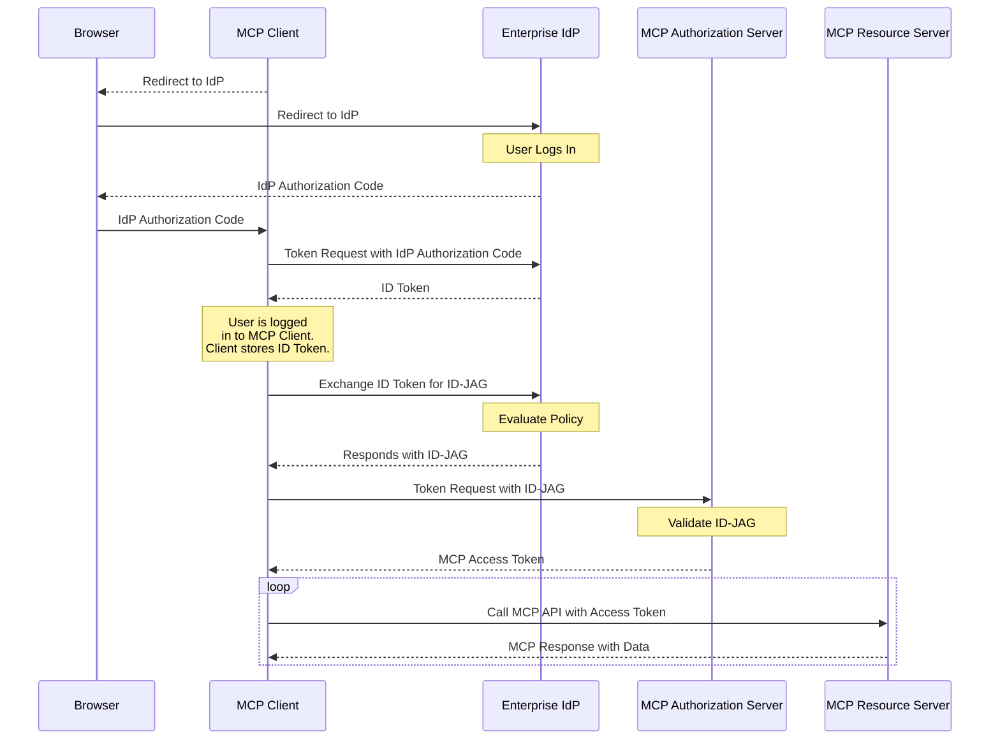

企业级托管授权（Enterprise-Managed Authorization）扩展（`io.modelcontextprotocol/enterprise-managed-authorization`）让组织能够通过其现有的身份提供方（IdP）集中控制 MCP 服务器访问。组织无需让每位员工单独对每台 MCP 服务器进行授权，IT 或安全团队可以在一个地方统一管理访问策略。

<Card
  title="规范"
  href="https://github.com/modelcontextprotocol/ext-auth/blob/main/specification/stable/enterprise-managed-authorization.mdx"
>
  企业级托管授权扩展的完整技术规范。
</Card>

## 它是什么

在标准的 MCP 部署中，每位用户都独立授权 MCP 客户端访问每台 MCP 服务器。对于消费级应用来说，这种以用户驱动的模式非常理想——它让个人能够控制是哪些主体访问自己的数据。

在企业环境中，这种模式会带来摩擦和安全漏洞：

- 员工无需了解其组织使用的每台 MCP 服务器的授权细节
- 如果每位用户独立授权，安全团队就无法强制执行一致的访问策略
- 新员工入职时需要手动授权数十项服务
- 离职时需要在每项服务上逐一撤销访问权限

企业级托管授权通过引入组织的 IdP 作为权威决策方来解决这一问题。IdP（例如 Okta、Azure AD 或企业 SSO 系统）控制员工可以访问哪些 MCP 服务器，以及在什么条件下可以访问。员工使用其企业身份进行认证——也就是他们用于邮件、Slack 和其他工作工具的同一套凭证——IdP 根据组织策略决定是否授予 MCP 服务器访问权限。

## 何时使用

在以下情况下使用企业级托管授权：

- **在企业环境中部署 MCP**，且由 IT 统一管理所有业务应用的访问
- **强制执行组织访问策略**——你需要确保只有经过授权的员工才能访问特定的 MCP 服务器
- **集中化访问控制**——你希望从单个管理控制台添加或撤销对 MCP 服务器的访问
- **满足合规要求**——你的组织需要针对所有 MCP 服务器访问的可审计授权记录
- **简化员工体验**——员工应使用现有的企业 SSO 凭证访问 MCP 工具，无需逐项服务进行授权流程

## 工作原理

该扩展建立了一种委托授权流程，由企业 IdP 充当 MCP 客户端与 MCP 服务器之间的中介。MCP 客户端向企业 IdP 请求一种特殊类型的令牌，称为身份断言 JWT 授权授予（Identity Assertion JWT Authorization Grant），即 ID-JAG。然后，MCP 客户端使用 ID-JAG 向 MCP 服务器的授权服务器换取出访问令牌：



流程的关键点：

1. **集中式策略**：企业 IdP 维护一份已批准的 MCP 服务器清单及各服务器的访问策略。管理员在其现有的身份管理工具中配置这些内容。

2. **单点登录**：员工只需使用企业凭证认证一次。IdP 签发的令牌即可授予对已批准 MCP 服务器的访问权限，无需再逐台服务器进行授权提示。

3. **策略执行**：IdP 在签发令牌之前评估访问策略（组成员资格、角色分配、条件访问规则）。未获授权的员工会收到相应的错误——MCP 客户端绝不会收到针对未授权服务器的令牌。

4. **集中式撤销**：撤销员工对 MCP 服务器的访问在 IdP 层面完成，并在所有 MCP 客户端中立即生效。无需逐客户端、逐服务器地撤销。

## 实现指南

### 面向 MCP 客户端

要支持企业级托管授权，你的客户端必须：

1. 在每次请求的能力声明中**声明支持**：

```jsonc
{
  "jsonrpc": "2.0",
  "id": 1,
  "method": "...",
  "params": {
    // Other fields...
    "_meta": {
      // Other fields...
      "io.modelcontextprotocol/clientCapabilities": {
        "extensions": {
          "io.modelcontextprotocol/enterprise-managed-authorization": {},
        },
      },
    },
  },
}
```

2. **支持 SSO**——用户应使用企业 IdP 向 MCP 客户端完成认证。保存登录时签发的身份断言（Identity Assertion）（可以是 OpenID ID Token 或 SAML 断言），以供后续使用。

3. **处理 ID-JAG**——当服务器指示需要企业级托管认证时，使用先前获取的身份断言，向企业 IdP 的授权端点请求 ID-JAG 令牌。再使用该 ID-JAG 向 MCP 授权服务器换取出访问令牌。不要将用户重定向到 MCP 授权服务器的授权端点。

4. **支持组织配置**——允许管理员配置企业 IdP 的端点，通常通过组织级设置而非用户级设置完成。

5. **遵循令牌作用域**——企业 IdP 签发的令牌可能带有与标准 MCP 授权不同的作用域限制。请妥善处理作用域错误。

### 面向 MCP 服务器

要启用企业级托管授权：

1. 在服务器的授权元数据中**声明该扩展**，表明客户端必须使用企业级托管流程。

2. **与 IdP 管理 API 集成**（可选）——发布服务器的资源描述符，让企业管理员可以在其 IdP 管理控制台中配置访问策略。

### 面向 MCP 授权服务器

1. **校验企业 IdP 签发的 ID-JAG**。这通常意味着对照 IdP 的 JWKS 端点验证 JWT 签名，并检查令牌的受众（audience）、签发者（issuer）和过期时间。

2. **将 IdP 声明映射为权限**——ID-JAG 令牌携带声明（作用域和资源信息），你的服务器据此确定员工的身份以及员工可以访问的内容。请基于这些声明定义授权逻辑。

3. **处理账户关联**——ID-JAG 令牌始终包含 subject 声明，并且可能额外包含 email 声明，可用于将企业身份关联到系统中已有的账户。请将 subject 声明作为用户的主要稳定标识符，并在匹配配置企业级托管授权之前创建的既有账户时，回退到 email 声明。

## 客户端支持

<Callout>

此扩展的支持情况因客户端而异。扩展默认不启用，必须显式选择加入。

</Callout>

要了解各 MCP 客户端的当前实现状态，请查看 [客户端矩阵](/docs/mcp/extensions/client-matrix)。企业级托管授权除了需要 MCP 客户端应用的支持外，通常还需要组织 IT 团队的客户端层面的支持。

## 相关资源

<Cards>
  <Card
    title="ext-auth 仓库"
    href="https://github.com/modelcontextprotocol/ext-auth"
  >
    源代码与参考实现
  </Card>
  <Card
    title="完整规范"
    href="https://github.com/modelcontextprotocol/ext-auth/blob/main/specification/stable/enterprise-managed-authorization.mdx"
  >
    含规范性要求的技术规范
  </Card>
  <Card
    title="SEP-990"
    href="#"
  >
    原始提案：启用企业 IdP 策略控制
  </Card>
  <Card
    title="MCP 授权"
    href="/docs/mcp/specification/latest/basic/authorization"
  >
    核心 MCP 授权规范
  </Card>
</Cards>