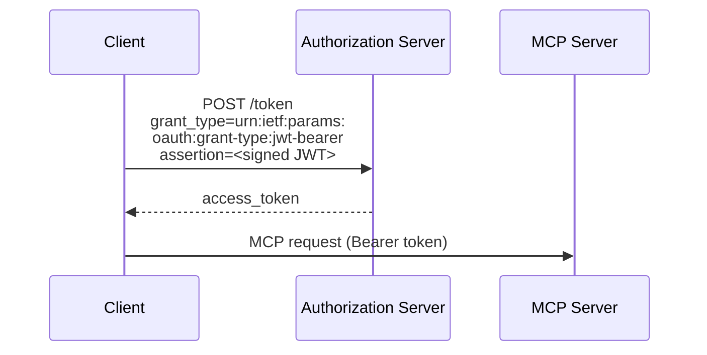
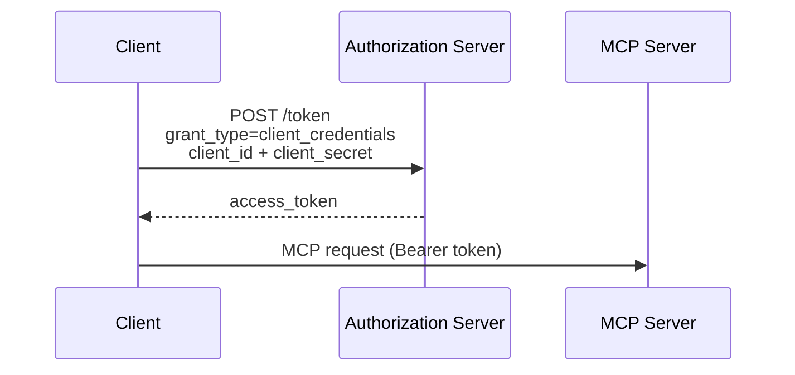

OAuth 客户端凭证扩展（`io.modelcontextprotocol/oauth-client-credentials`）为 MCP 增加了对 [OAuth 2.0 客户端凭证流程](https://datatracker.ietf.org/doc/html/rfc6749#section-4.4) 的支持。这让自动化系统无需交互式用户授权即可连接到 MCP 服务器。

<Card
  title="规范"
  href="https://github.com/modelcontextprotocol/ext-auth/blob/main/specification/draft/oauth-client-credentials.mdx"
>
  OAuth 客户端凭证扩展的完整技术规范。
</Card>

## 它是什么

标准的 MCP 授权流程要求用户交互式地批准访问——打开浏览器、用户登录并授予权限。这对真人来说很好用，但在没有用户在场时就会失效。

OAuth 客户端凭证扩展使用应用级凭证（client ID 和 secret，或已签名的 JWT 断言）而非委托的用户凭证来完成客户端认证，从而解决了这一问题。客户端直接向授权服务器证明其身份，授权服务器无需浏览器重定向或用户交互即可签发访问令牌。

## 何时使用

在以下情况下使用 OAuth 客户端凭证：

- **后台服务**需要在没有用户在场的情况下按计划或在响应事件时调用 MCP 工具
- **CI/CD 流水线**在自动化的构建、测试或部署工作流中调用 MCP 服务器
- **服务器到服务器的集成**在没有终端用户参与的情况下连接两个后端系统
- **守护进程**或长期运行的工作进程需要对 MCP 资源的持久访问

如果你的集成中有应当明确批准访问的人类用户，请改用标准的 MCP 授权流程。

## 工作原理

该扩展支持两种凭证格式：

### JWT Bearer 断言（推荐）

JWT Bearer 断言定义于 [RFC 7523](https://datatracker.ietf.org/doc/html/rfc7523)，允许客户端使用其私钥对令牌签名，并将其作为身份证明提交。授权服务器使用客户端注册的公钥验证签名。



JWT 断言通常包含：

- `iss`：客户端 ID（签发者）
- `sub`：客户端 ID（被认证的主体）
- `aud`：授权服务器令牌端点的 URL
- `exp`：过期时间
- `iat`：签发时间

### 客户端机密

对于更简单的部署，该扩展也支持使用 `client_id` 和 `client_secret` 的标准客户端凭证流程。客户端直接将凭证发送到授权服务器的令牌端点，并收到响应的访问令牌。



<Callout type="warn">

客户端机密是**长期有效的凭证**，可以在没有用户交互的情况下授予访问权限。如果机密泄露，攻击者可以在机密轮换之前悄无声息地冒充你的应用进行认证。为降低风险：

- 将机密存储在机密管理器中，绝不要放在提交到版本控制的源代码或环境文件中。
- 定期轮换机密，并在出现任何疑似泄露后立即轮换。
- 将凭证的作用域限制在所需的最低权限。
- 尽可能优先使用 JWT 断言——它们有效期短，且无需传输签名密钥。

</Callout>

## 实现指南

### 面向 MCP 客户端

要使用 OAuth 客户端凭证扩展，你的客户端必须：

<Steps>
<Step>

### 声明支持

在每次请求的能力中声明该扩展：

```jsonc
{
  "jsonrpc": "2.0",
  "id": 1,
  "method": "...",
  "params": {
    // Other fields...
    "_meta": {
      // Other fields...
      "io.modelcontextprotocol/clientCapabilities": {
        "extensions": {
          "io.modelcontextprotocol/oauth-client-credentials": {},
        },
      },
    },
  },
}
```


</Step>

<Step>

### 获取访问令牌

在连接到 MCP 服务器之前，使用客户端凭证授权从授权服务器请求令牌。


</Step>

<Step>

### 携带令牌

在发送给 MCP 服务器的 HTTP 请求的 `Authorization` 请求头中传入令牌：

```
Authorization: Bearer <access_token>
```


</Step>

<Step>

### 处理令牌刷新

客户端凭证令牌的有效期通常比用户委托的令牌更短。请实现令牌刷新逻辑，在过期前获取新令牌。


</Step>

</Steps>

### 面向 MCP 服务器

要接受客户端凭证令牌，你的服务器必须：

<Steps>
<Step>

### 校验令牌

在每个请求中，对照授权服务器的公钥（通常通过 JWKS 端点）验证 JWT 签名和声明。


</Step>

<Step>

### 检查作用域

确保令牌包含所请求操作必需的作用域。


</Step>

<Step>

### 通告支持

可选（但为便于被发现，建议实施）在 `server/discover` 响应中包含该扩展：

```jsonc
{
  "jsonrpc": "2.0",
  "id": 1,
  "result": {
    // Other fields...
    "capabilities": {
      "extensions": {
        "io.modelcontextprotocol/oauth-client-credentials": {},
      },
    },
  },
}
```


</Step>

</Steps>

## SDK 示例

官方 MCP SDK 对客户端凭证认证提供了内置支持。两者都会自动处理令牌获取和刷新。

<Steps>
<Step>

### 安装 SDK

<Tabs items={['TypeScript', 'Python']}>

<Tab>

```bash
npm install @modelcontextprotocol/client
```

</Tab>
<Tab>

```bash
pip install mcp
```

</Tab>

</Tabs>


</Step>

<Step>

### 创建提供方并连接

选择与你环境匹配的凭证格式：

#### 使用客户端机密

<Tabs items={['TypeScript', 'Python']}>

<Tab>

```typescript
import {
  Client,
  ClientCredentialsProvider,
  StreamableHTTPClientTransport,
} from "@modelcontextprotocol/client";

const provider = new ClientCredentialsProvider({
  clientId: "my-service",
  clientSecret: "s3cr3t",
});

const client = new Client(
  { name: "my-service", version: "1.0.0" },
  { capabilities: {} },
);

const transport = new StreamableHTTPClientTransport(
  new URL("https://mcp.example.com/mcp"),
  { authProvider: provider },
);

await client.connect(transport);

// Use the client
const tools = await client.listTools();
console.log(
  "Available tools:",
  tools.tools.map((t) => t.name),
);

await transport.close();
```

</Tab>
<Tab>

```python
import asyncio

import httpx2

from mcp import Client
from mcp.client.auth.extensions.client_credentials import (
    ClientCredentialsOAuthProvider,
)
from mcp.client.streamable_http import streamable_http_client
from mcp.shared.auth import OAuthClientInformationFull, OAuthToken


class InMemoryTokenStorage:
    def __init__(self) -> None:
        self.tokens: OAuthToken | None = None
        self.client_info: OAuthClientInformationFull | None = None

    async def get_tokens(self) -> OAuthToken | None:
        return self.tokens

    async def set_tokens(self, tokens: OAuthToken) -> None:
        self.tokens = tokens

    async def get_client_info(self) -> OAuthClientInformationFull | None:
        return self.client_info

    async def set_client_info(self, client_info: OAuthClientInformationFull) -> None:
        self.client_info = client_info


provider = ClientCredentialsOAuthProvider(
    server_url="https://mcp.example.com/mcp",
    storage=InMemoryTokenStorage(),
    client_id="my-service",
    client_secret="s3cr3t",
    scopes="read write",
)


async def main() -> None:
    async with httpx2.AsyncClient(auth=provider) as http_client:
        transport = streamable_http_client(
            "https://mcp.example.com/mcp",
            http_client=http_client,
        )
        async with Client(transport) as client:
            # Use the client
            tools = await client.list_tools()
            print("Available tools:", [t.name for t in tools.tools])


if __name__ == "__main__":
    asyncio.run(main())
```

</Tab>

</Tabs>

#### 使用 JWT 私钥

<Tabs items={['TypeScript', 'Python']}>

<Tab>

```typescript
import {
  Client,
  PrivateKeyJwtProvider,
  StreamableHTTPClientTransport,
} from "@modelcontextprotocol/client";

const provider = new PrivateKeyJwtProvider({
  clientId: "my-service",
  privateKey: process.env.CLIENT_PRIVATE_KEY_PEM,
  algorithm: "RS256",
});

const client = new Client(
  { name: "my-service", version: "1.0.0" },
  { capabilities: {} },
);

const transport = new StreamableHTTPClientTransport(
  new URL("https://mcp.example.com/mcp"),
  { authProvider: provider },
);

await client.connect(transport);

// Use the client
const tools = await client.listTools();
console.log(
  "Available tools:",
  tools.tools.map((t) => t.name),
);

await transport.close();
```

</Tab>
<Tab>

```python
import asyncio
from pathlib import Path

import httpx2

from mcp import Client
from mcp.client.auth.extensions.client_credentials import (
    PrivateKeyJWTOAuthProvider,
    SignedJWTParameters,
)
from mcp.client.streamable_http import streamable_http_client
from mcp.shared.auth import OAuthClientInformationFull, OAuthToken


class InMemoryTokenStorage:
    def __init__(self) -> None:
        self.tokens: OAuthToken | None = None
        self.client_info: OAuthClientInformationFull | None = None

    async def get_tokens(self) -> OAuthToken | None:
        return self.tokens

    async def set_tokens(self, tokens: OAuthToken) -> None:
        self.tokens = tokens

    async def get_client_info(self) -> OAuthClientInformationFull | None:
        return self.client_info

    async def set_client_info(self, client_info: OAuthClientInformationFull) -> None:
        self.client_info = client_info


# Create a signed JWT assertion provider from key parameters
jwt_params = SignedJWTParameters(
    issuer="my-service",
    subject="my-service",
    signing_key=Path("private_key.pem").read_text(),
    signing_algorithm="RS256",
    lifetime_seconds=300,
)

provider = PrivateKeyJWTOAuthProvider(
    server_url="https://mcp.example.com/mcp",
    storage=InMemoryTokenStorage(),
    client_id="my-service",
    assertion_provider=jwt_params.create_assertion_provider(),
    scopes="read write",
)


async def main() -> None:
    async with httpx2.AsyncClient(auth=provider) as http_client:
        transport = streamable_http_client(
            "https://mcp.example.com/mcp",
            http_client=http_client,
        )
        async with Client(transport) as client:
            # Use the client
            tools = await client.list_tools()
            print("Available tools:", [t.name for t in tools.tools])


if __name__ == "__main__":
    asyncio.run(main())
```

</Tab>

</Tabs>


</Step>

</Steps>

## 客户端支持

<Callout>

此扩展的支持情况因客户端而异。扩展默认不启用，必须显式选择加入。

</Callout>

要了解各 MCP 客户端的当前实现状态，请查看 [客户端矩阵](/docs/mcp/extensions/client-matrix)。

## 相关资源

<Cards>
  <Card
    title="ext-auth 仓库"
    href="https://github.com/modelcontextprotocol/ext-auth"
  >
    源代码与参考实现
  </Card>
  <Card
    title="完整规范"
    href="https://github.com/modelcontextprotocol/ext-auth/blob/main/specification/draft/oauth-client-credentials.mdx"
  >
    含规范性要求的技术规范
  </Card>
  <Card
    title="RFC 6749 — 客户端凭证授权"
    href="https://datatracker.ietf.org/doc/html/rfc6749#section-4.4"
  >
    底层的 OAuth 2.0 规范
  </Card>
  <Card
    title="RFC 7523 — JWT Bearer 断言"
    href="https://datatracker.ietf.org/doc/html/rfc7523"
  >
    JWT 断言格式规范
  </Card>
</Cards>