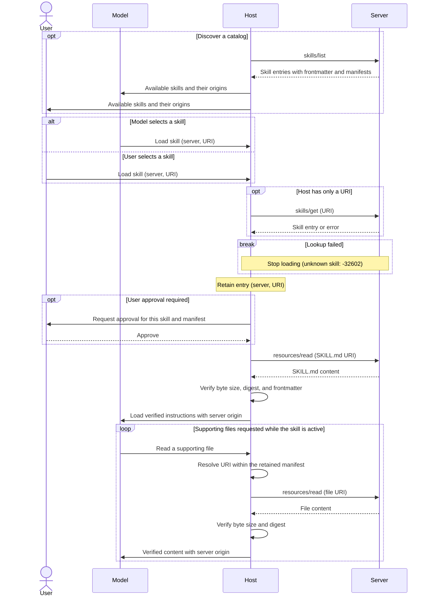

[ext-skills 仓库](https://github.com/modelcontextprotocol/ext-skills)
包含通过 MCP 提供技能（Skills over MCP）的规范。

<Card
  title="modelcontextprotocol/ext-skills"
  href="https://github.com/modelcontextprotocol/ext-skills"
>
  通过 MCP 提供技能的规范与文档。
</Card>

技能扩展允许 MCP 服务器向客户端暴露工作流指令和
支持文件。客户端可以使用现有的 Resources 原语发现可用技能、获取
它们的元数据并读取其内容。

技能是包含 `SKILL.md` 文件和可选支持文件的目录，
遵循 [Agent Skills 规范](https://agentskills.io/specification)。
本扩展定义了通过 MCP 进行的技能发现与获取。

技能适用于组合多个工具或需要配套参考资料的可复用工作流，
例如代码审查或文档处理。通过 MCP 提供技能，可以让这些
指令与它们所描述的服务保持在一起。客户端可以
从元数据中发现可用的工作流，并仅在需要时才加载指令和支持
文件。

## 用户交互模型

宿主应用决定如何向模型和用户展示技能。技能
可以由模型根据其名称和描述来选择，也可以由用户显式选择。
本扩展不强制规定特定的用户交互模型。

通过 `resources/read` 读取 `SKILL.md` 本身并不会激活技能。
要加载技能，宿主会将读取操作路由到其技能加载路径，先验证
内容并在加载到模型上下文之前应用任何必需的用户批准。

## 能力

支持技能的服务器**必须**在
[`server/discover`](/docs/mcp/specification/draft/server/discover) 中同时声明
`resources` 能力和 `io.modelcontextprotocol/skills` 扩展：

```json
{
  "capabilities": {
    "resources": {},
    "extensions": {
      "io.modelcontextprotocol/skills": {
        "directoryRead": true
      }
    }
  }
}
```

声明了此扩展的服务器**必须**实现 `skills/list` 和
`skills/get`。技能文件通过 `resources/read` 提供。

可选的 `directoryRead` 设置表示对
`resources/directory/read` 的支持，默认为 `false`。空的扩展对象
表示支持但未启用目录读取。客户端只在观察到服务器的声明之后
才发起 `skills/list` 和
`skills/get` 请求。

<Callout>
  这些示例使用协议修订版 `2026-07-28` 或更高版本。为简洁起见，
  请求示例省略了 `_meta`。每个请求**必须**包含必需的
  [请求元数据](/docs/mcp/specification/draft/basic/index#_meta)。
</Callout>

## 协议消息

### 列出技能

要发现可用的技能，客户端会发送 `skills/list` 请求。此
操作支持 [分页](/docs/mcp/specification/draft/server/utilities/pagination)
和 [缓存](/docs/mcp/specification/draft/server/utilities/caching)。

**请求：**

```json
{
  "jsonrpc": "2.0",
  "id": 1,
  "method": "skills/list",
  "params": {}
}
```

**响应：**

```json
{
  "jsonrpc": "2.0",
  "id": 1,
  "result": {
    "resultType": "complete",
    "skills": [
      {
        "uri": "skill://code-review/SKILL.md",
        "frontmatter": {
          "name": "code-review",
          "description": "Review code using the team's checklist."
        },
        "resources": [
          {
            "uri": "skill://code-review/SKILL.md",
            "digest": "sha256:d2489d6c182e8df9c178563ff9f2eac7998a0c1bb1278c52a7fd5306e4259160",
            "size": 149
          },
          {
            "uri": "skill://code-review/references/checklist.md",
            "digest": "sha256:dbab2de7bf7db9cc95cb6ce681c3690b26184db39f75b958a0287ca6d9e24e20",
            "size": 65
          }
        ]
      }
    ],
    "ttlMs": 300000,
    "cacheScope": "public"
  }
}
```

每个条目包含：

| 字段         | 含义                                                                     |
| ------------- | --------------------------------------------------------------------------- |
| `uri`         | 技能 `SKILL.md` 的资源 URI。                                 |
| `frontmatter` | 所有 YAML frontmatter 字段（原样保留），包括 `name` 和 `description`。 |
| `resources`   | 完整的文件清单，对于生成的内容则为 `"dynamic"`。           |

清单**必须**包含 `SKILL.md` 及每一个支持文件，以及每个文件的
URI、SHA-256 摘要和字节大小。`skills/list` 返回的每个条目都是
完整的；客户端无需再调用 `skills/get` 获取额外的元数据。

当响应包含 `nextCursor` 时，客户端将其作为 `params.cursor` 传递以
获取下一页。列出和获取的结果**必须**包含
`resultType: "complete"`、`ttlMs` 和 `cacheScope`。缓存字段描述的是
新鲜度和共享范围；它们不提供内容完整性保证。

技能身份由来源服务器的身份和技能 URI 组成。
名称只是标签，不保证唯一。宿主**必须**在
注册表、批准记录和缓存中同时保留服务器身份和 URI。服务器
**应该**使用 `skill://` 协议方案，但**可以**使用其他方案。
宿主**不得**仅凭 URI 协议方案就将某个资源识别为技能。

### 获取技能

要按 URI 获取技能条目，客户端会发送 `skills/get` 请求。该 URI
可以由用户、另一个技能或服务器指令提供。

**请求：**

```json
{
  "jsonrpc": "2.0",
  "id": 2,
  "method": "skills/get",
  "params": {
    "uri": "skill://code-review/SKILL.md"
  }
}
```

响应在 `result.skill` 下包含一个技能条目，其结构
与 `skills/list` 中的条目相同，同时带有
`resultType: "complete"`、`ttlMs`
和 `cacheScope`。客户端也可以使用此方法来刷新现有条目。

服务器**可以**返回空的或不完整的列表，但**必须**对其
提供的每个技能响应 `skills/get`。宿主**必须**支持按 URI 加载，
包括未出现在列表中的技能。

### 读取技能内容

要获取技能指令或支持文件，客户端会发送
[`resources/read`](/docs/mcp/specification/draft/server/resources#reading-resources)
请求。下面的示例获取上方列表中的 `SKILL.md`。

**请求：**

```json
{
  "jsonrpc": "2.0",
  "id": 3,
  "method": "resources/read",
  "params": {
    "uri": "skill://code-review/SKILL.md"
  }
}
```

**响应：**

```json
{
  "jsonrpc": "2.0",
  "id": 3,
  "result": {
    "resultType": "complete",
    "contents": [
      {
        "uri": "skill://code-review/SKILL.md",
        "mimeType": "text/markdown",
        "text": "---\nname: code-review\ndescription: Review code using the team's checklist.\n---\n\n# Code review\n\nRead `references/checklist.md`, then review the diff.\n"
      }
    ],
    "ttlMs": 300000,
    "cacheScope": "public"
  }
}
```

`SKILL.md` 文件**必须**以包含 `name` 和
`description` 的 YAML frontmatter 开头。其父目录路径的最后一段**必须**
与 `name` 匹配。

客户端基于技能的根目录解析相对引用。在本
示例中，`references/checklist.md` 解析为
`skill://code-review/references/checklist.md`。该支持文件通过 `resources/read` 从同一服务器获取，内容如下：

```markdown
# Review checklist

Check correctness, tests, and compatibility.
```

两个示例文件均以换行符结尾；它们的摘要和大小与清单一致。
宿主**不得**提前获取文件，包括在连接、列列表或批准阶段。
批准绑定到清单本身，无需预先获取文件。

### 读取目录

要列出某个目录的直接子项，客户端会发送 `resources/directory/read`
请求。此方法是可选的。除非服务器
声明 `directoryRead: true`，否则客户端**不得**调用它。

**请求：**

```json
{
  "jsonrpc": "2.0",
  "id": 4,
  "method": "resources/directory/read",
  "params": {
    "uri": "skill://code-review/references"
  }
}
```

**响应：**

```json
{
  "jsonrpc": "2.0",
  "id": 4,
  "result": {
    "resultType": "complete",
    "resources": [
      {
        "uri": "skill://code-review/references/checklist.md",
        "name": "checklist.md",
        "mimeType": "text/markdown"
      }
    ]
  }
}
```

目录 URI 没有结尾斜杠。子目录使用
`mimeType: "inode/directory"`。客户端通过向
子目录发起另一个请求来逐级下钻。结果支持 `cursor` / `nextCursor` 分页，且仅包含直接子项。

对于带清单的技能，宿主**可以**直接基于该清单回答目录查询。
目录读取同样支持动态技能和其他资源
树。宿主**不得**将实时的目录结果视为对已保留
清单的扩展，也不得将新列出的文件作为技能的一部分暴露。访问
这些文件需要刷新条目并获得任何所需的用户批准。

## 消息流程

此示例展示在探测到服务器能力之后，加载一个带文件清单的技能。
宿主中的 MCP 客户端负责发送协议请求。技能选择和用户批准属于宿主交互。



已知的 URI 无需经过列表即可直接加载。`skills/list`
返回的条目可以复用；否则宿主会调用 `skills/get`。未列出的技能可能
仍然存在，但未知的 URI 会返回 `-32602`（参数无效）并停止
加载。所有技能读取都使用来源服务器。

如果查找失败、批准被拒绝或验证失败，
宿主不会加载或使用该内容。要从发生变化后的清单中恢复，需要
刷新条目并再次获得所需的批准，具体如下所述。

## 完整性与验证

在处理技能期间，宿主会保留用于加载该技能的条目。这个时间段
至少持续到技能的 `SKILL.md` 离开模型上下文为止。对于带清单的技能，宿主**必须**：

1. 将文件读取限制在已保留清单中的 URI 范围内。
2. 在使用每个文件之前验证其原始字节大小和 SHA-256 摘要。
3. 解析 `SKILL.md` 的 frontmatter，并逐字段与条目的
   `frontmatter` 进行比对。

宿主**不得**使用未通过验证的内容。要从
过期的元数据中恢复，宿主会用 `skills/get` 刷新条目。持久化
的批准**必须**绑定到完整的文件 URI 和摘要集合。变更、新增或
删除文件都会撤销该批准；宿主在加载或执行之前**必须**再次获得批准。

宿主**应该**按需缓存已验证的内容。磁盘缓存**必须**要么
防止模型及其工具或其他用户修改缓存并将文件保持为
不可变，要么在每次访问时验证缓存的字节。宿主**必须**将缓存
文件从文件系统技能发现路径中排除，并保留其 MCP 来源，
包括在重启之后。

<Callout>
  摘要用于确立与服务器清单的一致性，而非对
  内容的信任。对于没有稳定摘要的生成内容，条目使用
  `"resources": "dynamic"`。宿主**可以**拒绝这些技能。如果接受，
  宿主**必须**仍然验证 frontmatter，并且**不得**将持久化的
  批准视为涵盖任意未来内容。
</Callout>

## 实现要求

### 服务器

服务器**必须**：

- 提供有效的 Agent Skills 并实现所声明的方法，包括基础
  Resources 支持。
- 保留所有 frontmatter 字段，并根据实际提供的字节发布完整的清单，除非技能的资源被声明为 `"dynamic"`。
- 独立于列表支持直接查找。每个技能条目都是原子的；
  其清单**不得**跨页面拆分。
- 在声明 `directoryRead: true` 时，支持所提供技能命名空间中的每个目录。

服务器**不应**超过**每个技能 512 个文件或 16 MiB**（包括
`SKILL.md`）。宿主**必须**支持达到这些限制的技能，并**可以**支持
更大的技能。

### 安全注意事项

宿主**必须**：

- 防止同名技能在不知不觉中相互替换。
- 为加载的内容标记其来源服务器，并使用宿主分配的标签将资源读取绑定到该
  服务器。跨服务器读取需要每次都显式
  批准，且批准中需指名两个服务器。
- 将技能内容视为不可信的输入。宿主侧代码执行以及诸如
  `allowed-tools` 之类的权限授予都需要用户对每个技能进行显式批准。
- 在激活嵌套技能之前获得用户的新鲜同意。将其
  `SKILL.md` 作为支持内容读取并不会激活该技能或它的 frontmatter。

完整的批准、来源和缓存规则请参阅
[安全要求](https://github.com/modelcontextprotocol/ext-skills/blob/main/specification/stable/skills.mdx#security-considerations)。

## 错误处理

| 情形                                       | 处理方式                                      |
| ----------------------------------------------- | --------------------------------------------- |
| 未知的技能/文件，或无效的目录 URI    | JSON-RPC `-32602`（参数无效）。           |
| 服务器内部故障                         | JSON-RPC `-32603`（内部错误）。           |
| 摘要、大小、frontmatter 或清单不匹配 | 宿主拒绝内容并刷新条目。 |

验证失败属于宿主侧情况，而非协议错误。
它们的处理方式如 [完整性与验证](#integrity-and-verification) 所述。

## 客户端支持

技能的支持情况和实现文档链接请参阅
[客户端矩阵](/docs/mcp/extensions/client-matrix)。

## 规范

完整规范位于 [ext-skills 仓库](https://github.com/modelcontextprotocol/ext-skills/blob/main/specification/stable/skills.mdx)。
开发工作由 [通过 MCP 提供技能工作组](#) 协调。