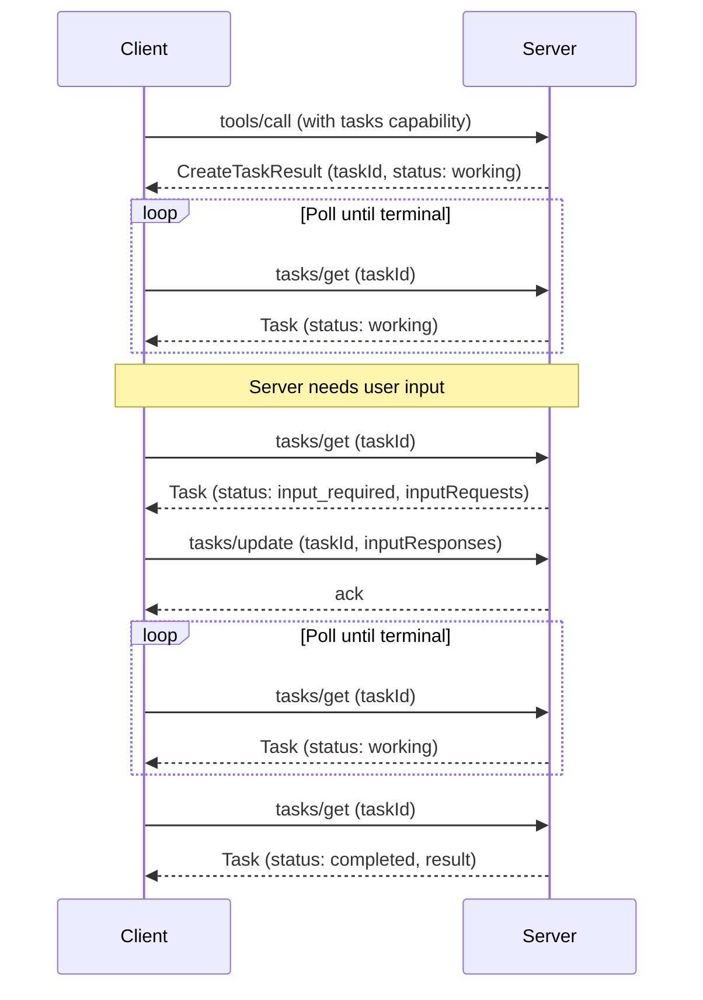

[ext-tasks 仓库](https://github.com/modelcontextprotocol/ext-tasks) 包含 MCP 任务（MCP Tasks）的完整规范和文档。

<Card
  title="modelcontextprotocol/ext-tasks"
  href="https://github.com/modelcontextprotocol/ext-tasks"
>
  MCP 任务的完整规范与文档。
</Card>

并非每次工具调用都会立即返回。有些操作——CI 流水线、批量
处理、人工审批——需要几秒钟、几分钟甚至更长时间。MCP 任务让
服务器返回一个持久化句柄而不是阻塞等待，这样客户端可以轮询
进度、在需要时提供输入，并在重连后获取最终结果。

## 为什么不干脆阻塞等待？

你当然可以让连接保持打开直到工作完成。但任务能解决
阻塞无法解决的问题：

- **无需长期连接。** 阻塞会在整个操作期间占用一个连接。许多客户端和传输中介会施加超时限制，这使得超过几秒的阻塞不切实际。
- **崩溃恢复能力。** 任务 ID 是一个持久化句柄。如果客户端
  断开连接或重启，它可以沿用同一个 ID 继续轮询。
- **进度可见性。** 任务携带状态元数据（`working`、
  `input_required`、`completed`、`failed`、`cancelled`）和可选的状态
  消息，让客户端能够了解进展。
- **运行中交互。** 当任务需要输入时（例如征求用户确认），它会切换到 `input_required` 状态并抛出请求。
  客户端通过 `tasks/update` 响应——无需建立第二个连接或发送未经请求的
  服务器到客户端消息。
- **服务器主导。** 服务器针对每个请求决定是否创建任务。
  客户端通过扩展能力一次性选择加入，并处理到达的任何结果
  形态。无需逐工具预热或逐请求标志。

## 任务的工作原理

任务扩展了标准的请求流程。当服务器判定某个请求将持续较长
时间时，它返回一个任务句柄而非最终结果。客户端
通过轮询获知完成情况。

1. **能力协商。** 客户端在每次请求的能力中声明
   `io.modelcontextprotocol/tasks`。服务器
   在自己的 `server/discover` 能力中通告同一扩展。

2. **创建任务。** 针对受支持的请求，服务器返回
   `CreateTaskResult`（以 `resultType: "task"` 标识），其中包含 `taskId`、
   初始状态、TTL 和建议的轮询间隔。任务在响应发出之前即被持久化
   创建。

3. **轮询。** 客户端使用 `taskId` 调用 `tasks/get`。响应
   携带当前状态，对于终态还包含最终结果或
   错误。

4. **运行中输入。** 如果任务切换到 `input_required` 状态，`tasks/get`
   响应会包含一个 `inputRequests` 映射，内含征求信息或其他服务器
   请求。客户端通过 `tasks/update` 来满足这些请求。

5. **完成。** 当状态达到 `completed` 时，`result` 字段
   包含原始请求原本应同步返回的内容。如果
   状态为 `failed`，则 `error` 字段包含 JSON-RPC 错误。

6. **取消。** 客户端可以随时发送 `tasks/cancel`。
   取消是协作式的——服务器会确认意图，但没有
   义务中止工作。



## 何时使用任务

当你的使用场景涉及以下情况时，任务是一个很好的选择：

**长时间运行的操作。** CI 流水线、批量数据处理或需要
数分钟乃至数小时的模型训练任务。

**人在回路中的工作流。** 审批关口、审查步骤或任何需要
停下来等待用户确认的操作。任务会切换到 `input_required` 状态，由
客户端呈现请求。

**外部任务系统。** 如果你的服务器封装了一个已经使用作业 ID 的 API
（云部署、异步 API、排队任务），请在创建作业时返回一个任务，并在作业完成时解析它。

**不稳定的连接。** 移动客户端、间歇性网络或
连接容易中断的环境。任务 ID 可以挺过断连。

**批处理。** 处理大量项目的操作（批量导入、大规模更新），
部分进度也是有意义的。状态消息用于报告进度。

## 任务生命周期

| 状态           | 含义                                                                    |
| ---------------- | -------------------------------------------------------------------------- |
| `working`        | 操作正在进行中。                                              |
| `input_required` | 服务器在继续之前需要客户端的输入。参见 `inputRequests`。      |
| `completed`      | 操作已完成。`result` 字段包含最终输出。      |
| `failed`         | 执行期间发生了 JSON-RPC 错误。`error` 字段包含详细信息。 |
| `cancelled`      | 操作已被取消（并非总是生效）。                          |

`completed`、`failed` 和 `cancelled` 是终态——一旦达到，任务的
状态不会再改变。

## 通知

服务器可以通过 `notifications/tasks` 推送状态更新。客户端通过
`subscriptions/listen` 机制选择接收这些通知。每条通知
携带完整的任务状态，从而无需额外进行一次 `tasks/get`
往返。

轮询是默认方式。如果服务器支持通知，客户端可以依赖通知
而无需轮询。

## 实现指南

### 面向 MCP 客户端

要消费带任务的结果响应，你的客户端必须：

<Steps>
<Step>

### 声明支持

在每次请求的能力中声明该扩展：

```jsonc
{
  "jsonrpc": "2.0",
  "id": 1,
  "method": "...",
  "params": {
    // Other fields...
    "_meta": {
      // Other fields...
      "io.modelcontextprotocol/clientCapabilities": {
        "extensions": {
          "io.modelcontextprotocol/tasks": {},
        },
      },
    },
  },
}
```


</Step>

<Step>

### 处理多形态结果

在发起受支持的请求（例如 `tools/call`）时，做好接收
标准结果或带 `resultType: "task"` 的 `CreateTaskResult` 的准备。


</Step>

<Step>

### 轮询直至完成

使用返回的 `taskId` 调用 `tasks/get`，并遵循 `pollIntervalMs`
值。持续轮询，直到任务达到终态（`completed`、
`failed` 或 `cancelled`）。


</Step>

<Step>

### 处理输入请求

如果任务状态为 `input_required`，请读取 `inputRequests` 映射，将
请求呈现给用户或模型，并通过 `tasks/update` 提交响应。


</Step>

<Step>

### 持久化任务 ID

持久化存储任务 ID，以便在客户端崩溃或重启后可以继续轮询。


</Step>

</Steps>

### 面向 MCP 服务器

要由你的服务器返回任务：

<Steps>
<Step>

### 通告支持

在你的 `server/discover` 能力中声明该扩展：

```jsonc
{
  "jsonrpc": "2.0",
  "id": 1,
  "result": {
    // Other fields...
    "capabilities": {
      "extensions": {
        "io.modelcontextprotocol/tasks": {},
      },
    },
  },
}
```


</Step>

<Step>

### 检查客户端能力

在返回 `CreateTaskResult` 之前，请确认客户端在每次请求的能力中
包含该扩展。绝不要向未声明支持的客户端返回任务。


</Step>

<Step>

### 返回 CreateTaskResult

当某个请求将持续较长时间时，以 `resultType: "task"` 响应，并携带一个
包含唯一 `taskId`、初始状态、`ttlMs` 和
`pollIntervalMs` 的 `Task` 对象。任务必须在发送响应之前被持久化创建。


</Step>

<Step>

### 提供 tasks/get

在每次轮询时返回当前的任务状态。对于终态，包含
`result` 字段（`completed` 时）或 `error` 字段（`failed` 时）。


</Step>

<Step>

### 处理 tasks/update

接受与待办的 `inputRequests` 对应的 `inputResponses`。以空结果
确认。忽略对未知或已满足键的响应。


</Step>

<Step>

### 处理 tasks/cancel

以空结果确认取消请求。尽可能予以执行，但取消是协作式的
——任务仍可能达到非 `cancelled` 的终态。


</Step>

</Steps>

## 客户端支持

<Callout>

MCP 任务是 [核心 MCP 规范](/docs/mcp/specification/latest) 的一项扩展。宿主
支持情况因客户端而异。

</Callout>

各客户端的扩展支持情况请参阅 [客户端矩阵](/docs/mcp/extensions/client-matrix)。
任务支持需要客户端和服务器双方显式选择加入。

## 规范

任务扩展的规范定义在 [ext-tasks 仓库](https://github.com/modelcontextprotocol/ext-tasks) 中。它使用标准的 MCP [扩展协商](/docs/mcp/extensions/overview#negotiation) 机制：客户端在每次请求的 `_meta` 中发送的 `io.modelcontextprotocol/clientCapabilities` 的 `extensions` 字段里声明支持，服务器则在 [`server/discover`](/docs/mcp/specification/draft/server/discover) 返回的能力中通告自身支持。