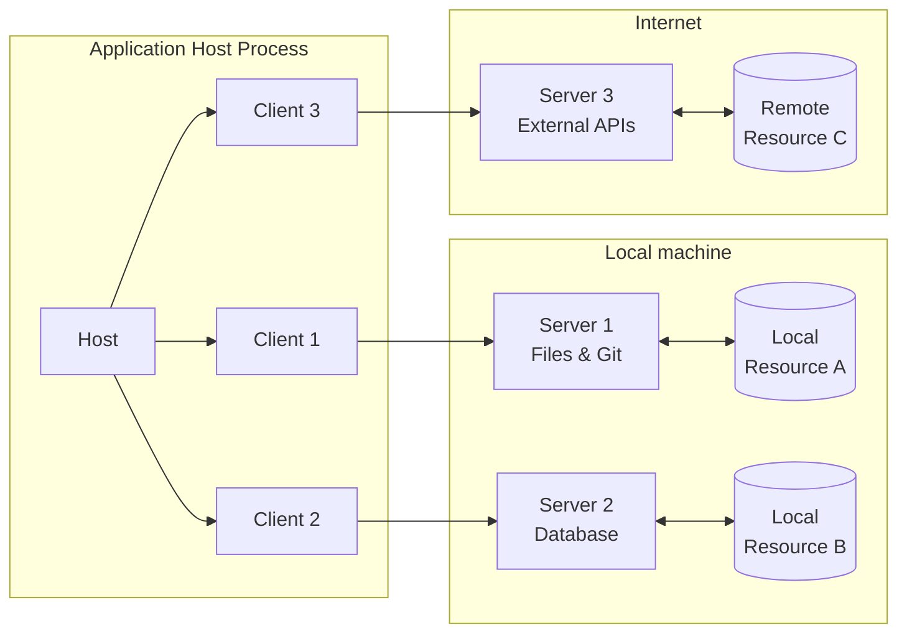
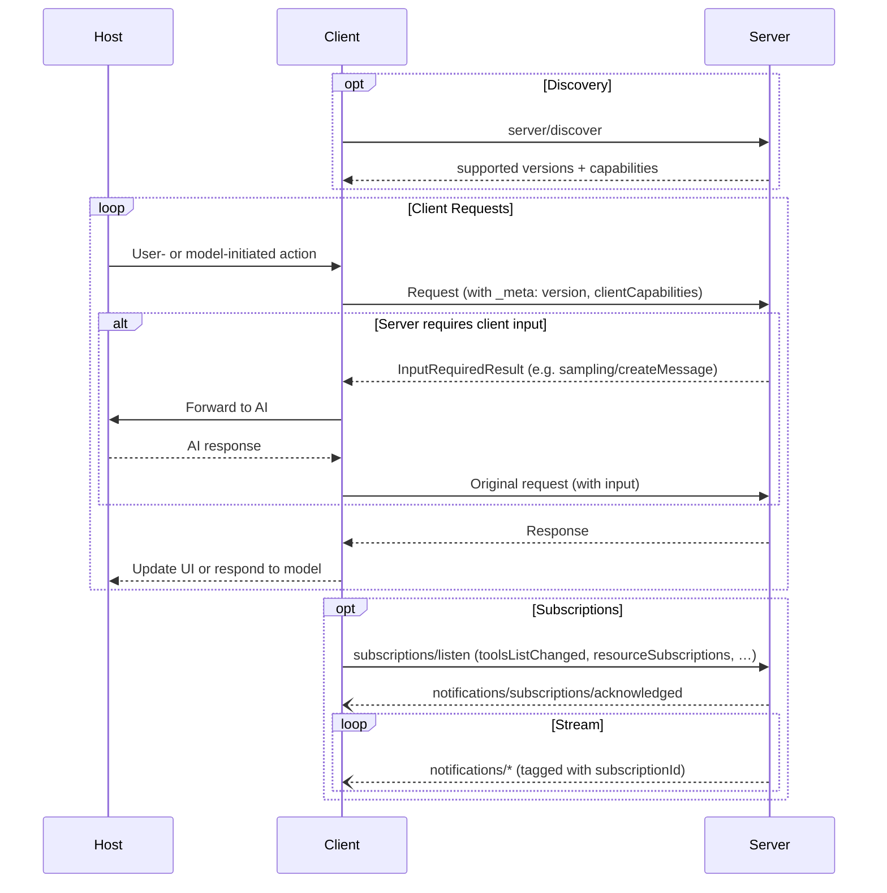

Model Context Protocol（MCP）遵循客户端-宿主-服务端（client-host-server）架构，其中每个
宿主可以运行多个客户端实例。MCP 是一个无状态协议：每个请求都是
自包含的，并携带其自身的协议版本和能力。
该架构使用户能够在多个应用间集成 AI 能力，同时
保持清晰的安全边界并隔离关注点。MCP 构建于 JSON-RPC 之上，
提供了一种聚焦于客户端与服务端之间上下文交换和模型抽样协调的协议。

## 核心组件

### 宿主（Host）

宿主进程充当容器和协调者：

- 创建并管理多个客户端实例
- 控制客户端的连接权限和生命周期
- 执行安全策略和同意要求
- 处理用户授权决策
- 协调 AI/LLM 集成与模型抽样
- 管理跨客户端的上下文聚合

### 客户端（Clients）

每个客户端由宿主创建，并与恰好一个服务端通信：

- 与恰好一个服务端通信
- 在每次请求上附加协议版本和能力
- 双向路由协议消息
- 管理订阅和通知
- 维护服务端之间的安全边界

宿主应用创建并管理多个客户端，每个客户端与
某个特定服务端保持 1:1 的关系。

### 服务端（Servers）

服务端提供专门化的上下文和能力：

- 通过 MCP 原语暴露资源、工具和提示词
- 独立运行，职责明确聚焦
- 通过回复中的 `InputRequiredResult` 请求客户端输入（模型抽样、征询、根）
- 必须尊重安全约束
- 可以是本地进程或远程服务

## 设计原则

MCP 建立在几个关键的设计原则之上，这些原则影响着其架构和
实现：

1. **服务端应当极其容易构建**
   - 宿主应用负责复杂的编排职责
   - 服务端聚焦于具体的、定义明确的能力
   - 简单的接口最大程度地降低实现开销
   - 清晰的分隔使代码易于维护

2. **服务端应当高度可组合**
   - 每个服务端都在隔离状态下提供聚焦的功能
   - 多个服务端可以无缝组合
   - 共享的协议支持互操作
   - 模块化设计支持可扩展性

3. **服务端不应能够读取整个对话，也不应能够"窥视"其他
   服务端**
   - 服务端只接收必要的上下文信息
   - 完整的对话历史保留在宿主侧
   - 每个服务端保持隔离
   - 跨服务端交互由宿主控制
   - 宿主进程强制实施安全边界

4. **服务端和客户端的特性可以被渐进式地添加**
   - 核心协议提供最小的必需功能
   - 额外的能力可以在需要时进行协商
   - 服务端和客户端独立演进
   - 协议为未来的可扩展性而设计
   - 保持向后兼容性

## 能力协商

Model Context Protocol 使用基于能力的协商系统，客户端和服务端在
每个请求上声明其支持的特性。客户端在每次请求的
`_meta.io.modelcontextprotocol/clientCapabilities` 中包含其能力。
服务端在响应
[`server/discover`](/docs/mcp/specification/2026-07-28/server/discover) 时公布其能力，客户端可以在任何
其他请求之前调用它，以预先进行能力发现。

- 服务端声明诸如工具支持、资源订阅和提示词
  模板等能力
- 客户端声明诸如模型抽样支持和征询处理等能力
- 双方在整个交互过程中都必须尊重所声明的能力
- 额外的能力可以通过协议扩展进行协商

每项能力都会在逐请求的基础上解锁特定的协议特性。例如：

- 已实现的[服务端特性](/docs/mcp/specification/2026-07-28/server)必须在
  服务端的能力中公布
- 接收资源更新通知需要打开一条
  [`subscriptions/listen`](/docs/mcp/specification/2026-07-28/basic/patterns/subscriptions) 流，
  并带有期望的资源 URI
- [工具](/docs/mcp/specification/2026-07-28/server/tools)调用要求服务端声明工具能力

这种能力协商机制确保客户端与服务端对所支持的
功能有清晰的理解，同时保持协议的可扩展性。