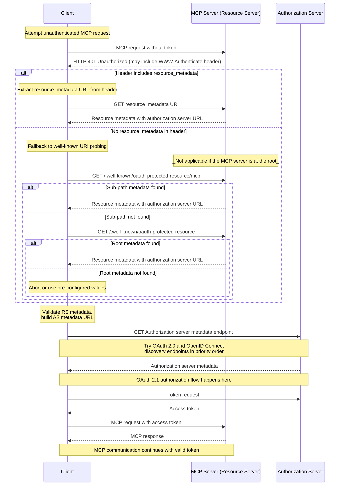

本文档描述 MCP 服务端向 MCP 客户端公布其关联授权服务器的机制，以及 MCP 客户端可以借此确定授权服务器端点及受支持能力的发现过程。

## 授权服务器位置

MCP 服务端**必须**实现 OAuth 2.0 Protected Resource Metadata（[RFC9728](https://datatracker.ietf.org/doc/html/rfc9728)）规范以指示授权服务器的位置。MCP 服务端返回的 Protected Resource Metadata 文档**必须**包含 `authorization_servers` 字段，其中含有至少一个授权服务器。

`authorization_servers` 的具体用法不在本规范范围内；实现者应查阅 OAuth 2.0 Protected Resource Metadata（[RFC9728](https://datatracker.ietf.org/doc/html/rfc9728)）以获取实现细节方面的指引。

实现者应当注意，Protected Resource Metadata 文档可以定义多个授权服务器。选择使用哪个授权服务器的职责在于 MCP 客户端，应遵循 [RFC9728 第 7.6 节 "Authorization Servers"](https://datatracker.ietf.org/doc/html/rfc9728#name-authorization-servers)中规定的指引。

当 `authorization_servers` 中列出多个授权服务器时，每一个都是独立的 OAuth 2.0 授权服务器。与 [RFC 6749 第 2.2 节](https://datatracker.ietf.org/doc/html/rfc6749#section-2.2)一致，客户端标识符对其签发方授权服务器而言是唯一的。客户端**必须**为每个授权服务器维护独立的注册状态（客户端凭据、令牌），并**不得**假定对一个授权服务器有效的凭据会被另一个授权服务器接受。关于将客户端凭据与签发它们的授权服务器相关联的要求，请参阅[授权服务器绑定](/docs/mcp/specification/2026-07-28/basic/authorization/client-registration#authorization-server-binding)。

## Protected Resource Metadata 发现要求

MCP 服务端**必须**实现以下发现机制之一，以向 MCP 客户端提供授权服务器位置信息：

1. **WWW-Authenticate 头**：在返回 `401 Unauthorized` 响应时，将资源元数据 URL 包含在 `WWW-Authenticate` HTTP 头的 `resource_metadata` 下，如 [RFC9728 第 5.1 节](https://datatracker.ietf.org/doc/html/rfc9728#name-www-authenticate-response)所述。

2. **Well-Known URI**：按 [RFC9728](https://datatracker.ietf.org/doc/html/rfc9728) 规定在 well-known URI 上提供元数据。可以是以下之一：
   - 位于服务端 MCP 端点路径：`https://example.com/public/mcp` 可以在 `https://example.com/.well-known/oauth-protected-resource/public/mcp` 托管元数据
   - 位于根路径：`https://example.com/.well-known/oauth-protected-resource`

MCP 客户端**必须**同时支持这两种发现机制，并在解析出的 `WWW-Authenticate` 头存在时使用其中的资源元数据 URL；否则，它们**必须**按上述顺序回退到构造并请求 well-known URI。

MCP 客户端**必须**能够解析 `WWW-Authenticate` 头，并针对来自 MCP 服务端的 `HTTP 401 Unauthorized` 响应作出适当响应。

服务端还可以在 `WWW-Authenticate` 质询中包含 `scope` 参数，以指示访问该资源所需的范围；范围语义及相关客户端行为定义于[范围选择策略](/docs/mcp/specification/2026-07-28/basic/authorization#scope-selection-strategy)一节。

## 授权服务器元数据发现

MCP 使用 [RFC 8414 第 3.1 节](https://datatracker.ietf.org/doc/html/rfc8414#section-3.1)中定义的默认 `oauth-authorization-server` well-known URI 后缀进行授权服务器元数据发现。MCP 不定义应用特定的 well-known URI 后缀。

为处理不同的 issuer URL 格式，并确保与 OAuth 2.0 Authorization Server Metadata 和 OpenID Connect Discovery 1.0 两种规范互操作，MCP 客户端在发现授权服务器元数据时**必须**尝试多个 well-known 端点。

该发现方法基于 [RFC 8414 第 3.1 节 "Authorization Server Metadata Request"](https://datatracker.ietf.org/doc/html/rfc8414#section-3.1)（用于 OAuth 2.0 Authorization Server Metadata 发现），以及 [RFC 8414 第 5 节 "Compatibility Notes"](https://datatracker.ietf.org/doc/html/rfc8414#section-5)（用于 OpenID Connect Discovery 1.0 互操作）。

对于带路径部分的 issuer URL（例如 `https://auth.example.com/tenant1`），客户端**必须**按以下优先级顺序尝试端点：

1. 带路径插入的 OAuth 2.0 Authorization Server Metadata：
   `https://auth.example.com/.well-known/oauth-authorization-server/tenant1`
2. 带路径插入的 OpenID Connect Discovery 1.0：
   `https://auth.example.com/.well-known/openid-configuration/tenant1`
3. OpenID Connect Discovery 1.0 路径追加：
   `https://auth.example.com/tenant1/.well-known/openid-configuration`

对于不带路径部分的 issuer URL（例如 `https://auth.example.com`），客户端**必须**尝试：

1. OAuth 2.0 Authorization Server Metadata：
   `https://auth.example.com/.well-known/oauth-authorization-server`
2. OpenID Connect Discovery 1.0：
   `https://auth.example.com/.well-known/openid-configuration`

在获取元数据文档后，MCP 客户端**必须**按 [RFC8414 第 3.3 节](https://datatracker.ietf.org/doc/html/rfc8414#section-3.3)或 [OpenID Connect Discovery 第 4.3 节](https://openid.net/specs/openid-connect-discovery-1_0.html#ProviderConfigurationValidation)的要求对其进行校验：文档中的 `issuer` 值**必须**与用于构造 well-known URL 的 issuer 标识符完全相同。如果二者不同，客户端**必须**不使用该元数据。例如，从 `https://attacker.example/.well-known/oauth-authorization-server` 获取的文档若包含 `"issuer": "https://honest.example"`，**必须**被拒绝。

## 时序图

以下图表概述了一个示例流程：

