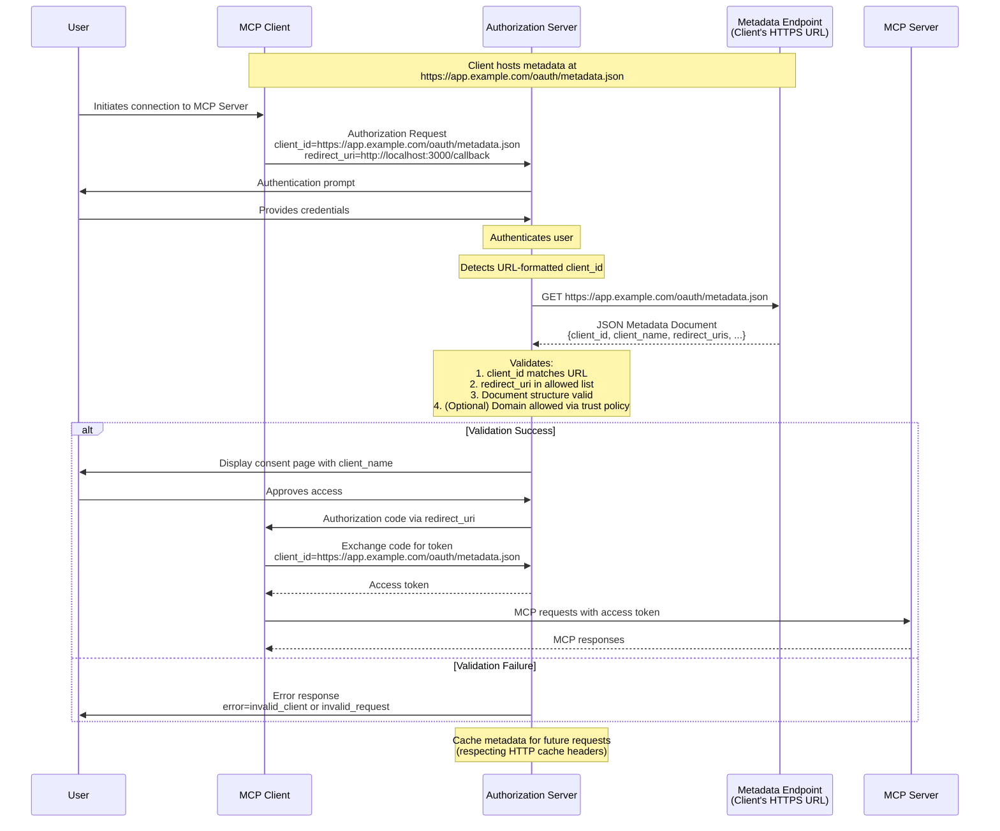

<div id="enable-section-numbers" />

MCP 支持三种客户端注册机制。根据你的场景进行选择：

- **[Client ID Metadata Documents](#client-id-metadata-documents)**：当客户端与服务端没有既有关系时（最常见）
- **[预注册](#pre-registration)**：当客户端与服务端已有关系时
- **[Dynamic Client Registration](#dynamic-client-registration)**：用于向后兼容或特定需求

支持所有选项的客户端**应当**使用以下优先级顺序：

1. 如果客户端拥有服务端的预注册客户端信息，则使用该信息
2. 如果授权服务器表明支持 Client ID Metadata Documents（通过 OAuth Authorization Server Metadata 中的 `client_id_metadata_document_supported`），则使用它们
3. 如果授权服务器支持（通过 OAuth Authorization Server Metadata 中的 `registration_endpoint`），则使用 Dynamic Client Registration 作为回退
4. 如果无其他选项可用，则提示用户输入客户端信息

## Client ID Metadata Documents

MCP 客户端和授权服务器**应当**按 [OAuth Client ID Metadata Document](https://datatracker.ietf.org/doc/html/draft-ietf-oauth-client-id-metadata-document-00) 的规定支持 OAuth Client ID Metadata Documents 进行客户端注册。

这种方法使客户端能够使用 HTTPS URL 作为客户端标识符，其中 URL 指向一个包含客户端元数据的 JSON 文档。这解决了服务端与客户端之间没有既存关系的常见 MCP 场景。

### 实现要求

支持 Client ID Metadata Documents 的 MCP 实现**必须**遵循 [OAuth Client ID Metadata Document](https://datatracker.ietf.org/doc/html/draft-ietf-oauth-client-id-metadata-document-00) 中规定的要求。关键要求包括：

**对于 MCP 客户端：**

- 客户端**必须**按 RFC 要求将其元数据文档托管在 HTTPS URL 上
- `client_id` URL **必须**使用 "https" 方案并包含路径部分，例如 `https://example.com/client.json`
- 元数据文档**必须**至少包含以下属性：`client_id`、`client_name`、`redirect_uris`
- 客户端**必须**确保元数据中的 `client_id` 值与文档 URL 完全一致
- 客户端**可以**将 `private_key_jwt` 用于客户端认证（例如向令牌端点发起请求时），并按 [Client ID Metadata Document 第 6.2 节](https://www.ietf.org/archive/id/draft-ietf-oauth-client-id-metadata-document-00.html#section-6.2)所述进行适当的 JWKS 配置

**对于授权服务器：**

- **应当**在遇到 URL 格式的 client_id 时获取元数据文档
- **必须**校验所获取文档的 `client_id` 与 URL 完全一致
- **应当**在遵循 HTTP 缓存头的前提下缓存元数据
- **必须**将授权请求中出示的重定向 URI 与元数据文档中的重定向 URI 进行校验
- **必须**校验文档结构为有效 JSON 且包含必需字段
- **应当**遵循 [Client ID Metadata Document 第 6 节](https://www.ietf.org/archive/id/draft-ietf-oauth-client-id-metadata-document-00.html#section-6)以及 [Client ID Metadata Document 安全](/docs/mcp/specification/2026-07-28/basic/authorization/security-considerations#client-id-metadata-document-security)中的安全注意事项

### 元数据文档示例

```json
{
  "client_id": "https://app.example.com/oauth/client-metadata.json",
  "client_name": "Example MCP Client",
  "client_uri": "https://app.example.com",
  "logo_uri": "https://app.example.com/logo.png",
  "redirect_uris": [
    "http://127.0.0.1:3000/callback",
    "http://localhost:3000/callback"
  ],
  "grant_types": ["authorization_code"],
  "response_types": ["code"],
  "token_endpoint_auth_method": "none"
}
```

### Client ID Metadata Documents 流程

以下图表说明了使用 Client ID Metadata Documents 时的完整流程：



### 声明 CIMD 支持

授权服务器通过在其 OAuth Authorization Server 元数据中包含以下属性来声明其支持使用 Client ID Metadata Documents 的客户端：

```json
{
  "client_id_metadata_document_supported": true
}
```

MCP 客户端**应当**检查这一能力，并在不可用时**可以**回退到 [Dynamic Client Registration](#dynamic-client-registration)或[预注册](#pre-registration)。

## 预注册

MCP 客户端**应当**支持静态客户端凭据选项，例如由预注册流程提供的凭据。这可以是：

1. 硬编码一个专供 MCP 客户端在与该授权服务器交互时使用的客户端 ID（以及适用的客户端凭据），或
2. 向用户展示一个 UI，允许他们在自行注册 OAuth 客户端后（例如通过服务端托管的配置界面）输入这些详细信息。

## Dynamic Client Registration

<Callout type="warn">
  Dynamic Client Registration 已弃用。新实现应改用
  [Client ID Metadata Documents](#client-id-metadata-documents)。此
  选项仍为与不支持 Client ID Metadata Documents 的授权服务器保持向后
  兼容而保留。
</Callout>

MCP 客户端和授权服务器**可以**支持 OAuth 2.0 Dynamic Client Registration Protocol [RFC7591](https://datatracker.ietf.org/doc/html/rfc7591)，以允许 MCP 客户端在无需用户交互的情况下获取 OAuth 客户端 ID。此选项是为与早期版本的 MCP 授权规范保持向后兼容而列入的。

### 应用类型与重定向 URI 约束

当授权服务器支持 OpenID Connect (OIDC) 和 Dynamic Client Registration 时，它们可能依据 [OpenID Connect Dynamic Client Registration 1.0](https://openid.net/specs/openid-connect-registration-1_0.html)中定义的 `application_type` 参数对重定向 URI 施加额外约束。

MCP 客户端**必须**在 Dynamic Client Registration 期间指定适当的 `application_type`。在 OIDC 下省略它会默认为 `"web"`，这可能与原生风格的重定向 URI 冲突；非 OIDC 服务端会安全地忽略该参数。

- **原生应用**（桌面应用、移动应用、CLI 工具，以及通过 `localhost` 访问的本地托管 Web 应用）**应当**使用 `application_type: "native"`
- **Web 应用**（从非本地主机提供的远程基于浏览器的应用）**应当**使用 `application_type: "web"`

当授权服务器实现 OIDC 时，MCP 客户端**必须**准备好处理因重定向 URI 约束而导致的注册失败。当注册请求被拒绝时，客户端**应当**向用户或开发者呈现有意义的错误。客户端**可以**使用调整后的 `application_type`，或使用符合授权服务器对给定应用类型要求的重定向 URI，重试注册。

## 授权服务器绑定

使用预注册凭据，或持久化通过 Dynamic Client Registration 获取的客户端凭据的客户端，**必须**将这些凭据与签发它们的特定授权服务器相关联，并以授权服务器的 `issuer` 标识符作为键。当授权服务器发生变化时（通过更新的[受保护资源元数据](/docs/mcp/specification/2026-07-28/basic/authorization/authorization-server-discovery#authorization-server-location)检测到），客户端**不得**复用来自不同授权服务器的客户端凭据，并**必须**向新的授权服务器重新注册。

预注册凭据本质上特定于某个授权服务器。如果受保护资源元数据所指示的授权服务器不再与凭据注册时的授权服务器匹配，客户端**应当**呈现错误，而不是静默地尝试使用不匹配的凭据。

基于 Client ID Metadata Documents 的客户端 ID 可跨授权服务器移植，因为它们是自托管的 HTTPS URL，由授权服务器按需解析。当授权服务器发生变化时无需重新注册。
