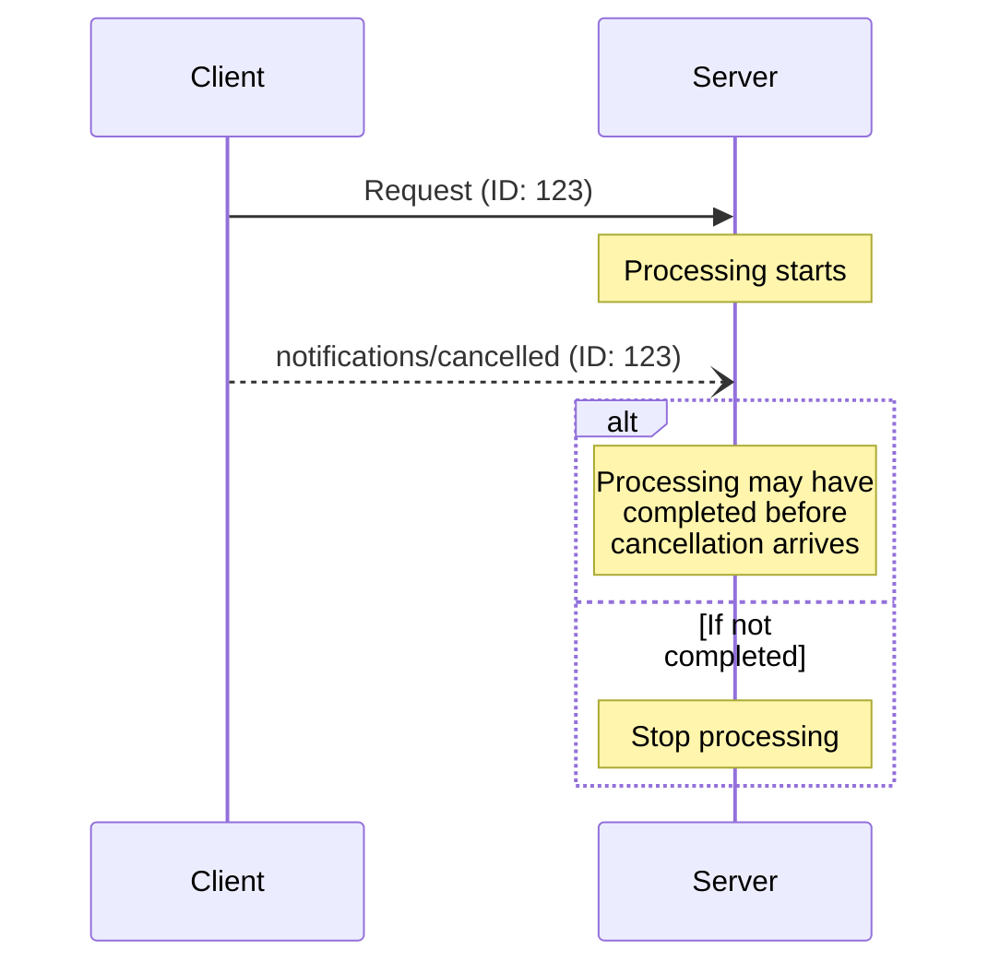

<div id="enable-section-numbers" />

Model Context Protocol (MCP) 通过通知消息支持对进行中请求的可选取消。客户端**应当**发送取消通知，以指示其先前发出的某个请求应被终止。

服务端在拆除某个 `subscriptions/listen` 订阅流时，**必须**发送引用该请求 ID 的 `notifications/cancelled`（见[订阅][subscriptions]）。服务端**不得**为任何其他目的发送 `notifications/cancelled`。

## 取消流程

当客户端想要取消一个进行中的请求时，它发送一条 `notifications/cancelled` 通知，其中包含：

- 要取消的请求的 ID
- 一个可选的原因字符串，可被记录或展示

```json
{
  "jsonrpc": "2.0",
  "method": "notifications/cancelled",
  "params": {
    "requestId": "123",
    "reason": "User requested cancellation"
  }
}
```

## 传输层特定的取消

客户端如何发出取消信号取决于传输层：

- **Streamable HTTP**：关闭 SSE 响应流即为取消信号。服务端**必须**将客户端断开视为对该请求的取消。无需也不期望发送 `notifications/cancelled` 消息。
- **stdio**：没有可按请求关闭的流。客户端**必须**发送引用请求 ID 的 `notifications/cancelled` 通知。

## 超时

实现**应当**为所有发送的请求建立超时，以防止连接挂起和资源耗尽。当请求在超时期内未收到成功或错误响应时，发送方**应当**取消该请求并停止等待响应。如[传输层特定的取消](#transport-specific-cancellation)所述，这意味着：

- **Streamable HTTP**：关闭该请求的响应流，即构成取消。
- **stdio**：发送引用请求 ID 的 `notifications/cancelled` 通知。

SDK 及其他中间件**应当**允许按请求配置这些超时。

在收到与请求对应的[进度通知](/docs/mcp/specification/2026-07-28/basic/patterns/progress)时，实现**可以**选择重置超时计时，因为这表明工作确实在进行。然而，实现**应当**始终强制实施一个最大超时，无论是否收到进度通知，以限制行为异常的客户端或服务端所带来的影响。

## 行为要求

1. 取消通知**必须**仅引用满足以下条件的请求：
   - 先前由客户端发出
   - 被认为仍在进行中
1. 服务端发送的取消通知**必须**引用一个 `subscriptions/listen` 请求，以终止该订阅流
1. 收到取消通知的服务端**应当**：
   - 停止处理被取消的请求
   - 释放相关资源
   - 不为被取消的请求发送响应
1. 服务端**可以**在以下情况下忽略取消通知：
   - 所引用的请求未知
   - 处理已经完成
   - 该请求无法被取消
1. 客户端**应当**忽略此后到达的针对被取消请求的任何响应

## 时序考量

由于网络延迟，取消通知可能在请求处理已经完成之后才到达，甚至可能在响应已经发送之后才到达。

双方**必须**妥善处理这些竞态条件：



## 实现说明

- 双方**应当**记录取消原因以便调试
- 应用 UI **应当**在请求取消时予以指示

## 错误处理

无效的取消通知**应当**被忽略：

- 未知的请求 ID
- 已完成的请求
- 格式错误的通知

这保持了通知“发后即忘”的特性，同时容许异步通信中的竞态条件。

[subscriptions]: /specification/2026-07-28/basic/patterns/subscriptions
