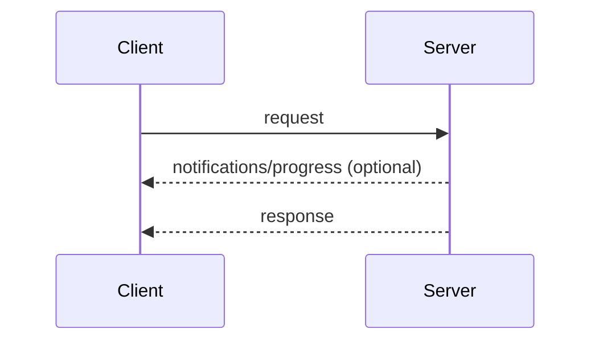
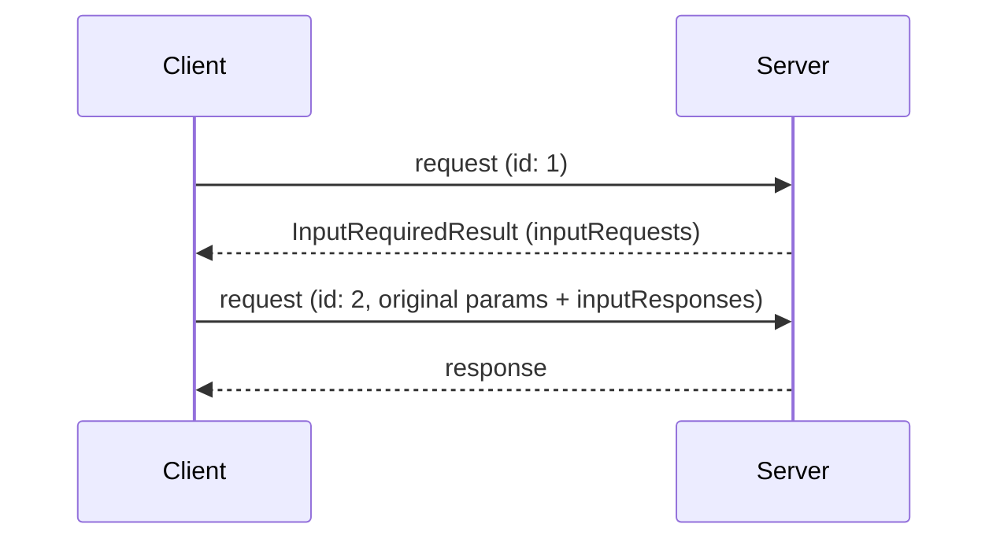
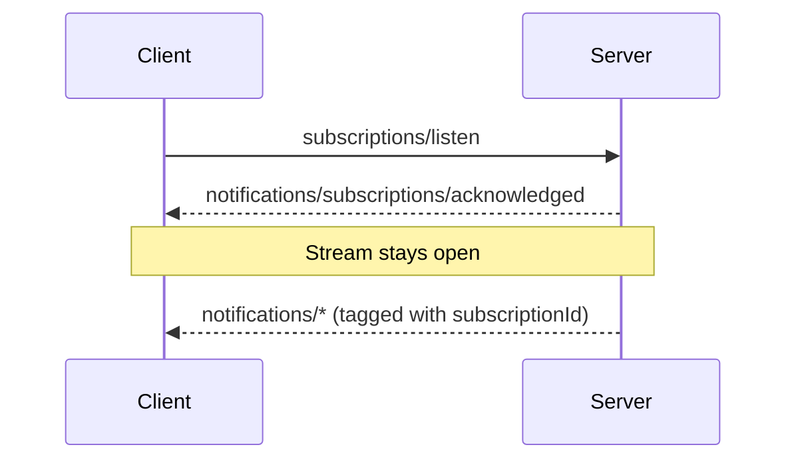

本页定义核心协议的消息模式：客户端与服务端将 JSON-RPC [请求、响应和通知](/docs/mcp/specification/2026-07-28/basic/index#messages)组合成交互的方式。每个[传输层](/docs/mcp/specification/2026-07-28/basic/transports)都承载所有这些模式；传输层之间的差异仅在于消息如何被分帧和投递。

每次交互都由客户端发起：

- **客户端**发送 JSON-RPC _请求_和_通知_。
- **服务端**为每个请求回复一个 JSON-RPC _响应_（结果或错误），其前可选地有作用于该请求的_通知_。

服务端**不得**主动发起 JSON-RPC 请求，客户端也不发送 JSON-RPC 响应。

## 请求与响应

客户端发送请求；服务端以结果或错误作为应答。在请求进行期间，服务端**可以**发送作用于该请求的通知，例如 [`notifications/progress`](/docs/mcp/specification/2026-07-28/basic/patterns/progress) 和 [`notifications/message`](/docs/mcp/specification/2026-07-28/server/utilities/logging)。

## 多轮往返请求

当服务端需要客户端输入（模型抽样、信息征求或根目录）才能完成请求时，它以 [`InputRequiredResult`](/docs/mcp/specification/2026-07-28/basic/patterns/mrtr#inputrequiredresult) 作为应答，客户端则携带匹配的 `inputResponses` 重试该请求。见[多轮往返请求](/docs/mcp/specification/2026-07-28/basic/patterns/mrtr)。

## 订阅与通知

为接收变更通知（列表变更、资源更新），客户端发送 [`subscriptions/listen`](/docs/mcp/specification/2026-07-28/basic/patterns/subscriptions) 请求；其回复是所请求通知类型的长期存续流。流状态的作用域限于该请求：如果底层通道丢失，客户端会重新发起该请求。

## 添加模式

所有核心协议特性都由这些模式构建而成。添加某个模式的协议修订版会在本页上定义它。传输层无需更改即可承载新模式，因为模式完全以请求、响应和通知来表示。
