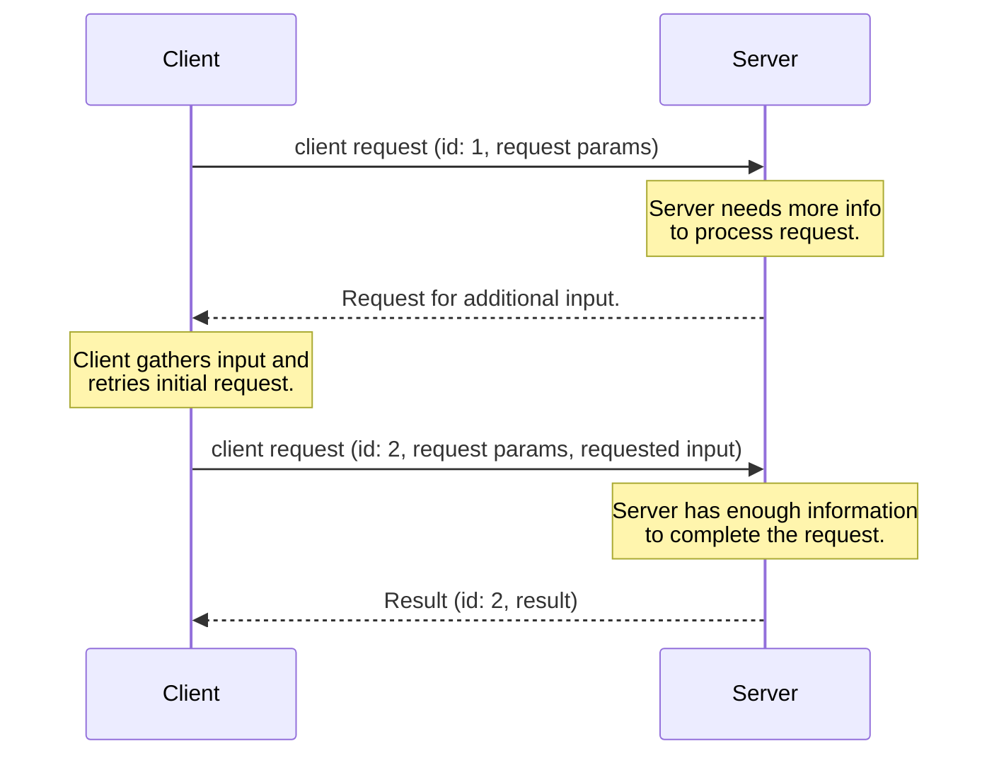
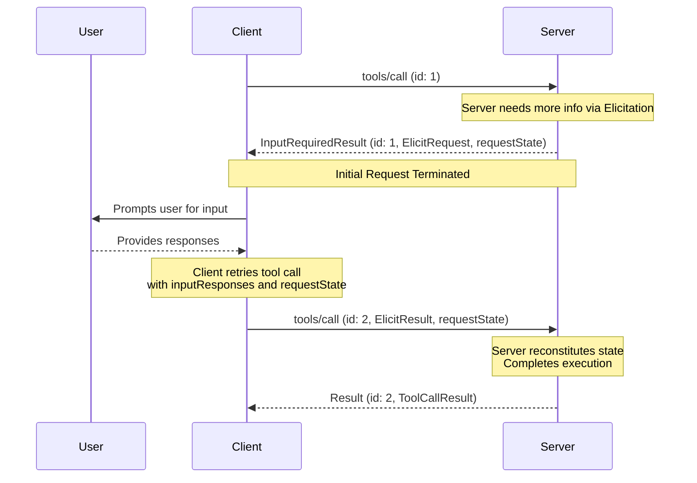

<div id="enable-section-numbers" />

<Callout>
  多轮往返请求（MRTR）在本版本的 MCP 规范中引入。它取代了此前服务端发起请求的方式。服务端**必须**使用 MRTR 模式发送服务端到客户端的请求（如 `roots/list`、`sampling/createMessage` 或 `elicitation/create`）。先前的服务端发起请求模式不再受支持。这是一项破坏性变更。
</Callout>

<Callout>
  为简洁起见，本页的请求示例省略了 `_meta` 请求元数据（`io.modelcontextprotocol/protocolVersion`、`io.modelcontextprotocol/clientInfo` 和 `io.modelcontextprotocol/clientCapabilities`）。每个请求**必须**包含所需的 `_meta` 字段；参见 [`_meta`](/docs/mcp/specification/2026-07-28/basic/index#meta)。
</Callout>

## 多轮往返请求

Model Context Protocol (MCP) 定义了若干种方式，使服务端在处理客户端请求期间向用户请求额外信息（如 `roots/list`、`sampling/createMessage` 或 `elicitation/create`）。**多轮往返请求**模式提供了一种标准化的方式来处理这些服务端请求，无需跨服务端实例共享存储层或有状态负载均衡。

高级流程如下：

1. 客户端向服务端发送初始请求，包含执行操作所需的参数。
1. 服务端判定需要更多信息才能完成请求，并以请求更多输入作为响应。
1. 客户端从用户或其他来源收集所请求的信息，然后重试原始请求，附带额外请求的信息。
1. 服务端判定已有足够信息来完成操作，并以最终结果作为响应。



### 核心类型

此流程在 MCP 中通过以下类型实现。

#### InputRequests

[`InputRequests`](/docs/mcp/specification/2026-07-28/schema#inputrequests) 对象是服务端到客户端请求的映射。键是服务端分配的字符串标识符；值是请求对象（如 [`ElicitRequest`](/docs/mcp/specification/2026-07-28/schema#elicitrequest)、[`CreateMessageRequest`](/docs/mcp/specification/2026-07-28/schema#createmessagerequest) 或 [`ListRootsRequest`](/docs/mcp/specification/2026-07-28/schema#listrootsrequest)）。

```json
{
  "github_login": {
    "method": "elicitation/create",
    "params": {
      "mode": "form",
      "message": "Please provide your GitHub username",
      "requestedSchema": {
        "type": "object",
        "properties": {
          "name": { "type": "string" }
        },
        "required": ["name"]
      }
    }
  },
  "capital_of_france": {
    "method": "sampling/createMessage",
    "params": {
      "messages": [
        {
          "role": "user",
          "content": {
            "type": "text",
            "text": "What is the capital of France?"
          }
        }
      ],
      "systemPrompt": "You are a helpful assistant.",
      "maxTokens": 100
    }
  }
}
```

#### InputResponses

[`InputResponses`](/docs/mcp/specification/2026-07-28/schema#inputresponses) 对象是客户端对服务端请求的响应映射。键与 `InputRequests` 映射中的键对应；值是客户端对每个请求的结果（如 [`ElicitResult`](/docs/mcp/specification/2026-07-28/schema#elicitresult)、[`CreateMessageResult`](/docs/mcp/specification/2026-07-28/schema#createmessageresult) 或 [`ListRootsResult`](/docs/mcp/specification/2026-07-28/schema#listrootsresult)）。

```json
{
  "github_login": {
    "action": "accept",
    "content": {
      "name": "octocat"
    }
  },
  "capital_of_france": {
    "role": "assistant",
    "content": {
      "type": "text",
      "text": "The capital of France is Paris."
    },
    "model": "claude-3-sonnet-20240307",
    "stopReason": "endTurn"
  }
}
```

#### InputRequiredResult

[`InputRequiredResult`](/docs/mcp/specification/2026-07-28/schema#inputrequiredresult) 是 [`Result`](/docs/mcp/specification/2026-07-28/basic#responses) 的一种类型，表示在完成请求前需要额外输入。

- `inputRequests` _（可选）_：一个 [`InputRequests`](/docs/mcp/specification/2026-07-28/schema#inputrequests) 映射，包含服务端发起的、客户端必须满足的请求。
- `requestState` _（可选）_：仅对服务端有意义的不透明字符串。客户端**不得**检查、解析、修改或对其内容做任何假设。

```json
{
  "jsonrpc": "2.0",
  "id": 1,
  "result": {
    "resultType": "input_required",
    "inputRequests": {
      // Elicitation request.
      "github_login": {
        "method": "elicitation/create",
        "params": {
          "mode": "form",
          "message": "Please provide your GitHub username",
          "requestedSchema": {
            "type": "object",
            "properties": {
              "name": { "type": "string" }
            },
            "required": ["name"]
          }
        }
      },
      // Sampling request.
      "capital_of_france": {
        "method": "sampling/createMessage",
        "params": {
          "messages": [
            {
              "role": "user",
              "content": {
                "type": "text",
                "text": "What is the capital of France?"
              }
            }
          ],
          "modelPreferences": {
            "hints": [{ "name": "claude-3-sonnet" }],
            "intelligencePriority": 0.8,
            "speedPriority": 0.5
          },
          "systemPrompt": "You are a helpful assistant.",
          "maxTokens": 100
        }
      }
    },
    "requestState": "AEAD-protected blob"
  }
}
```

### 支持的请求

服务端**可以**在以下客户端请求上发送 `InputRequiredResult` 响应：

| 客户端请求                                                                     | 支持 InputRequiredResult |
| ------------------------------------------------------------------------------ | ------------------------ |
| [`prompts/get`](/docs/mcp/specification/2026-07-28/server/prompts#getting-a-prompt)       | 是                       |
| [`resources/read`](/docs/mcp/specification/2026-07-28/server/resources#reading-resources) | 是                       |
| [`tools/call`](/docs/mcp/specification/2026-07-28/server/tools#calling-tools)             | 是                       |

服务端**不得**在任何其他客户端请求上发送 `InputRequiredResult` 响应。

### 基本工作流程

基本工作流程描述了服务端如何在客户端-服务端请求中请求来自客户端的额外输入。在此示例中，我们使用 `tools/call` 作为客户端请求，但相同的模式适用于上述任何支持的请求。

值得注意的是，它允许服务端在不维护任何服务端状态的情况下请求额外信息。服务端将所需的上下文编码到 `requestState` 字段中，客户端在重试时将其回传。



请注意，每一步中的请求是完全独立的：处理重试的服务端不需要任何超出重试请求中直接存在的信息。

#### 服务端要求（基本工作流程）

1. 服务端**可以**对任何[支持的客户端请求](#supported-requests)响应 `InputRequiredResult`。
1. `InputRequiredResult` **可以**包含 `inputRequests` 字段。
   - `inputRequests` 的键是服务端分配的标识符，**必须**在请求范围内唯一。
   - `inputRequests` 的值是请求对象，**必须**是 [`ElicitRequest`](/docs/mcp/specification/2026-07-28/schema#elicitrequest)、[`CreateMessageRequest`](/docs/mcp/specification/2026-07-28/schema#createmessagerequest) 或 [`ListRootsRequest`](/docs/mcp/specification/2026-07-28/schema#listrootsrequest) 之一。

1. `InputRequiredResult` **可以**包含 `requestState` 字段。如果指定，此字段是仅对服务端有意义的不透明字符串。服务端可以自由选择任何格式编码状态（如 base64 编码的 JSON、加密的 JWT、序列化的二进制）。
1. 如果客户端请求包含 `requestState` 字段，服务端**必须**将 `requestState` 视为攻击者控制的输入。如果 `requestState` 影响授权、资源访问或业务逻辑，服务端**必须**保护其完整性（如 HMAC 或 AEAD）
   并**必须**拒绝未通过验证的状态。仅当篡改仅能导致请求失败时，才可以省略完整性保护。
1. 为防止重放攻击，服务端**应当**在受完整性保护的 `requestState` 载荷中包含以下内容，并在收到时逐一验证：
   - 已认证的主体，拒绝由不同主体出示的状态。
   - 短期有效期（TTL），拒绝在过期后出示的状态。
   - 发起请求的标识符，例如方法名及其显著参数的摘要，拒绝在不匹配的请求上出示的状态。
     <Callout type="warn">
       请注意，这些措施限定了重放窗口并防止跨用户和跨请求的重用，但它们本身并不保证单次使用。对于给定 `requestState` 必须最多被消费一次的服务端（如一次性兑换），**必须**在服务端强制执行该不变性。
     </Callout>

1. 服务端**必须**在每个 `InputRequiredResult` 响应中包含 `inputRequests` 或 `requestState` 中的至少一个。
1. 服务端**不得**发送客户端未在其能力中声明支持的 `inputRequests`。例如，如果客户端未声明支持 `elicitation`，服务端**不得**在 `inputRequests` 字段中包含任何 `elicitation/create` 请求。
1. 服务端**不得**假定客户端会满足 `inputRequests` 或重试原始请求。如果服务端希望反复提示用户输入信息直至获得完成请求所需的内容，**可以**选择在对同一请求的多次尝试中返回 `InputRequiredResult`。

#### 客户端要求（基本工作流程）

1. 如果客户端收到包含 `inputRequests` 字段的 `InputRequiredResult`，客户端**必须**在重试原始请求前构造所请求的输入。如果 `InputRequiredResult` _不_包含 `inputRequests` 字段，客户端**可以**立即重试原始请求。
1. 如果 `InputRequiredResult` 包含 `requestState` 字段，客户端**必须**在重试原始请求时原样回传该字段的确切值。客户端**不得**检查、解析、修改或对 `requestState` 内容做任何假设。如果 `InputRequiredResult` 不包含 `requestState` 字段，客户端**不得**在重试中包含一个。
1. JSON-RPC `id` **必须**在初始请求和重试之间不同，因为它们是独立的请求。
1. `inputRequests` 和 `requestState` 字段仅影响客户端对原始请求的重试。它们**不得**用于客户端可能并行发送的任何其他请求。

### 错误处理

服务端**应当**验证客户端提供的数据是否是有效的 `InputResponses` 对象，以及其中的信息是否能被正确解析。协议错误（格式错误的 JSON、无效的模式、服务端内部错误）**应当**返回带有适当错误码和消息的 JSON-RPC 错误响应。

如果 `InputResponses` 对象中提供了额外的、意外的参数，服务端**应当**忽略任何不认识或不需要的信息。

如果客户端未能发送先前 `InputRequests` 中请求的所有信息，且缺失的信息对服务端处理请求是必要的，服务端**应当**以新的 `InputRequiredResult` 响应，再次请求缺失的信息，而不是返回错误。

### 安全注意事项

由于 `requestState` 会经过客户端传递，恶意或被攻破的客户端可能试图修改它以改变服务端行为、绕过授权检查或破坏服务端逻辑。服务端**必须**按照上述[服务端要求](#server-requirements-basic-workflow)验证请求状态。
