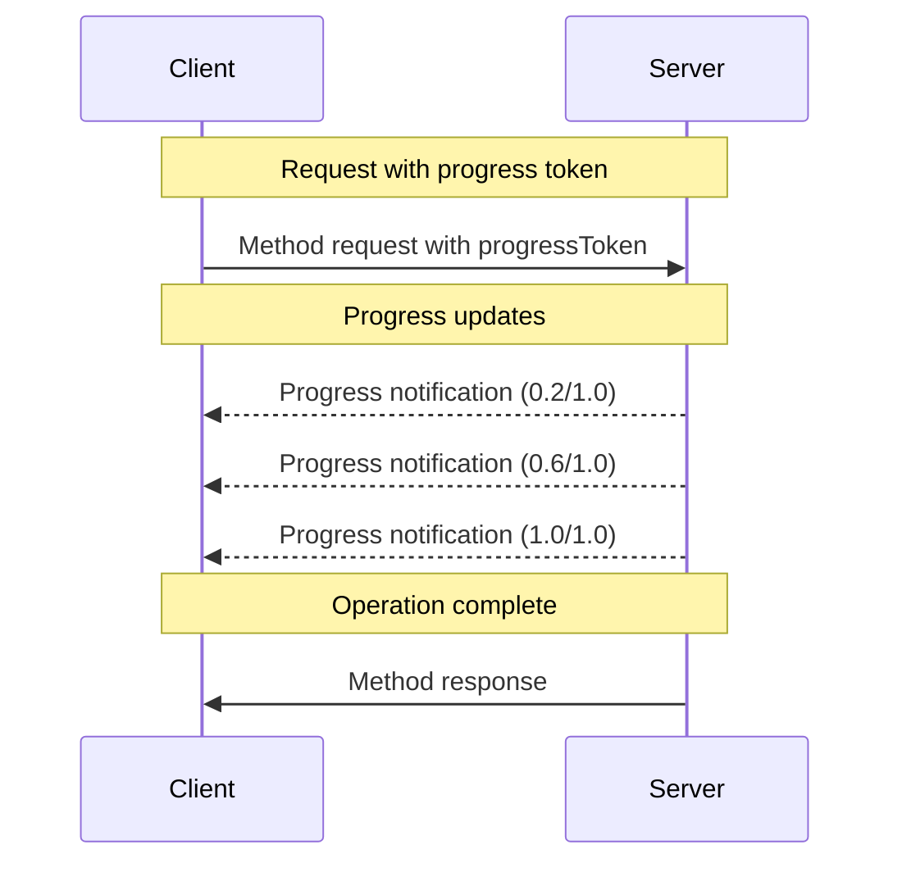

<div id="enable-section-numbers" />

Model Context Protocol (MCP) 通过通知消息支持对长时间运行操作的可选进度跟踪。服务端**可以**发送进度通知，以报告客户端已发出请求的状态。

## 进度流程

当客户端希望_接收_某个请求的进度更新时，它在请求元数据中包含一个 `progressToken`。

- 进度令牌**必须**是字符串或整数值
- 进度令牌可以由客户端以任意方式选择，但在所有活动请求中**必须**唯一。

```json
{
  "jsonrpc": "2.0",
  "id": 1,
  "method": "some_method",
  "params": {
    "_meta": {
      "progressToken": "abc123"
    }
  }
}
```

随后服务端**可以**发送进度通知，其中包含：

- 原始进度令牌
- 当前已完成的进度值
- 可选的 "total" 值
- 可选的 "message" 值

```json
{
  "jsonrpc": "2.0",
  "method": "notifications/progress",
  "params": {
    "progressToken": "abc123",
    "progress": 50,
    "total": 100,
    "message": "Reticulating splines..."
  }
}
```

- `progress` 值**必须**随每条通知递增，即使总量未知。
- `progress` 和 `total` 值**可以**为浮点数。
- `message` 字段**应当**提供相关且人类可读的进度信息。

## 行为要求

1. 进度通知**必须**仅引用满足以下条件的令牌：
   - 在某个活动请求中提供
   - 与某个进行中的操作相关联

2. 收到带进度令牌的请求的服务端**可以**：
   - 选择不发送任何进度通知
   - 以其认为合适的任意频率发送通知
   - 在总量未知时省略 total 值



## 实现说明

- 客户端和服务端**应当**跟踪活动的进度令牌
- 双方**应当**实施速率限制以防止泛洪
- 进度通知**必须**在完成后停止
