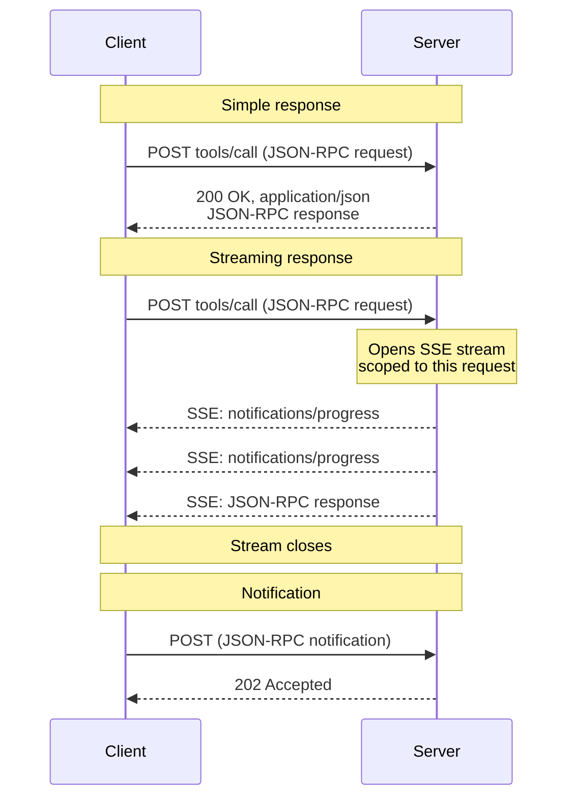
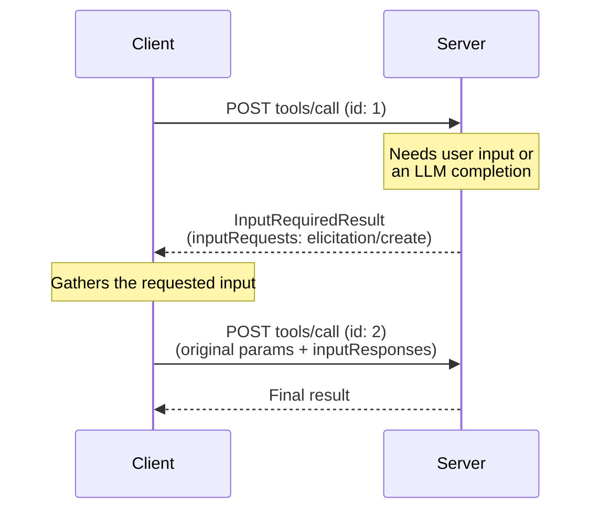
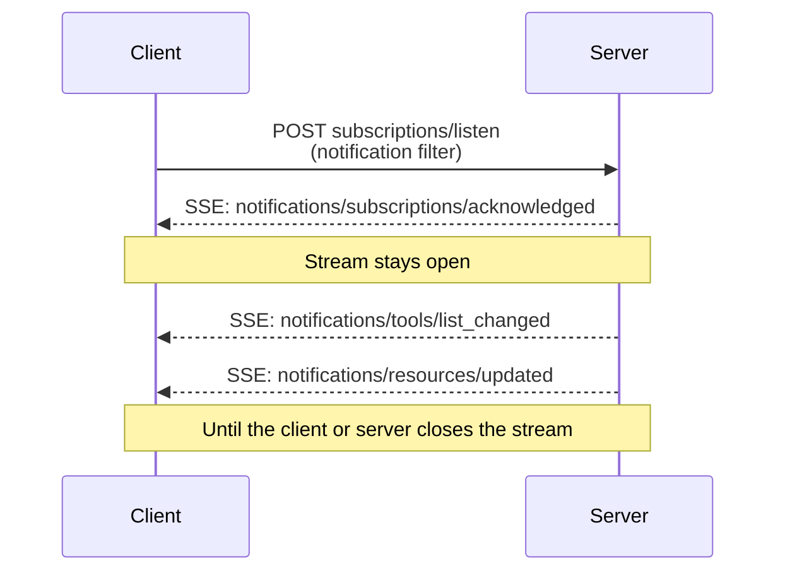

<div id="enable-section-numbers" />

<Callout>

Streamable HTTP 在协议版本 2025-03-26 中引入，用于替代协议版本 2024-11-05 中的 [HTTP+SSE 传输层][http-sse]。

</Callout>

<Callout>

修订版 2026-07-28 更改了 Streamable HTTP 的行为。客户端必须确保正确处理好向后兼容性。变更包括：

- 移除 GET 流端点。
- 移除协议级会话。

参见下文[变更日志](/docs/mcp/specification/2026-07-28/changelog)和[向后兼容](#backward-compatibility)。

</Callout>

在 **Streamable HTTP** 传输层中，服务端作为可以处理多个客户端连接的独立进程运行。概览如下：

- 服务端暴露一个接受 POST 的单一 HTTP 端点（**MCP 端点**）。
- 客户端将每个 JSON-RPC 请求或通知作为其独立的 HTTP POST 发送。
- 服务端以单个 JSON 对象或该请求作用域的 [Server-Sent Events][sse]（SSE）流应答每个请求，流中携带请求相关的通知，随后是最终响应。
- 服务端到客户端的交互（抽样、信息征求、根目录）按照[多轮往返请求（MRTR）][mrtr]（[SEP-2322][sep-2322]）作为输入请求嵌入结果中。
- 长期变更通知（如列表变更和资源更新）通过 [`subscriptions/listen`][subscriptions-listen] 请求的响应流投递。

这些交互的时序图参见[消息流](#message-flow)。

服务端**必须**提供支持 POST 的单一 HTTP 端点路径（下文简称 **MCP 端点**）。例如，这可以是类似 `https://example.com/mcp` 的 URL。

[http-sse]: /specification/2024-11-05/basic/transports#http-with-sse
[sse]: https://en.wikipedia.org/wiki/Server-sent_events

## 安全性与端点

实现 Streamable HTTP 传输层时：

1. 服务端**必须**在所有入站连接上校验 `Origin` 头，以防止 DNS 重绑定攻击。
   - 如果 `Origin` 头存在但无效，服务端**必须**以 HTTP 403 Forbidden 响应。HTTP 响应体**可以**包含一个没有 `id` 的 JSON-RPC _错误响应_。
2. 在本地运行时，服务端**应当**仅绑定到 localhost（127.0.0.1），而不是所有网络接口（0.0.0.0）。
3. 服务端**应当**为所有连接实施适当的身份认证。

没有这些保护措施，攻击者可能利用 DNS 重绑定从远程网站与本地 MCP 服务端交互。

## 发送消息

客户端发送的每条 JSON-RPC 消息**必须**是对 MCP 端点的一次新的 HTTP POST 请求。

1. 客户端**必须**使用 HTTP POST 发送 JSON-RPC 消息。
2. 客户端**必须**包含一个 `Accept` 头，将 `application/json` 和 `text/event-stream` 均列为受支持的内容类型。
3. 客户端**必须**在每次 POST 请求中包含[请求元数据头](#request-metadata)。
4. HTTP POST 的消息体**必须**是单个 JSON-RPC _请求_或_通知_。客户端**不得**发送 JSON-RPC _响应_。
5. 如果消息体是 JSON-RPC _通知_：
   - 如果服务端接受它，服务端**必须**返回 HTTP 状态码 `202 Accepted` 且不带消息体。
   - 如果服务端无法接受它，**必须**返回一个 HTTP 错误状态码（如 `400 Bad Request`）。HTTP 响应体**可以**包含一个没有 `id` 的 JSON-RPC _错误响应_。
6. 如果消息体是 JSON-RPC _请求_，服务端**必须**返回 `Content-Type: application/json`（单个 JSON 对象）或 `Content-Type: text/event-stream`（一个 SSE 响应流）两者之一。客户端**必须**同时支持两者。

<Callout>

本修订版的核心协议未定义 Streamable HTTP 上的客户端到服务器_通知_。核心协议中唯一的客户端发送通知 `notifications/cancelled` 仅用于 [stdio](/docs/mcp/specification/2026-07-28/basic/transports/stdio) 传输层；在 Streamable HTTP 上，关闭 SSE 响应流本身就是取消信号，不期望任何 `notifications/cancelled` 消息（参见[取消][cancellation]）。上述通知规则描述了通知 POST 的传输机制；本修订版未定义通知 POST 的头部要求。

</Callout>

## 接收消息

当服务端返回 SSE 响应流（`Content-Type: text/event-stream`）时：

- 服务端**可以**在最终响应之前发送 JSON-RPC _通知_——例如 [`notifications/progress`][notifications-progress] 或 [`notifications/message`][notifications-message]。这些通知**必须**与发起它的客户端请求相关。
- 服务端**不得**在该流上发送独立的 JSON-RPC _请求_。服务端到客户端的交互（抽样、信息征求、根目录列表）按照 [MRTR][mrtr]（[SEP-2322][sep-2322]）作为输入请求嵌入在 [`InputRequiredResult`][input-required-result] 内，而不是作为独立请求在此流或任何其他流上投递。这与协议版本 `2025-03-26` 至 `2025-11-25` 的 Streamable HTTP 有所不同，在那些版本中服务端可以在 SSE 流上发送此类请求。
- 最终的 JSON-RPC _响应_**应当**终止该流。

长期通知流通过发送 [`subscriptions/listen`][subscriptions-listen] 请求获得。服务端的响应本身就是一个保持打开的 SSE 流，投递客户端选择接收的变更通知（如 `notifications/tools/list_changed` 或 `notifications/resources/updated`）。请求作用域的通知（如 `notifications/progress` 和 `notifications/message`）**不会**在监听流上投递——它们仅在与其相关的请求的响应流上流动。

在发起 SSE 流时，服务端**应当**在 HTTP 响应中包含 `X-Accel-Buffering: no` 头。这会指示反向代理（如 nginx）禁用响应缓冲，确保 SSE 事件立即投递给客户端，而不是暂存在缓冲区中。没有此头，代理可能在发送给客户端之前累积消息，引入不期望的延迟，并可能破坏 SSE 通信的实时性。

<Callout>

对于长期流——特别是 [`subscriptions/listen`][subscriptions-listen] 响应流——鼓励服务端定期发出一个 SSE 注释行（以冒号开头的行，如 `:\r\n`）作为保活信号。这可以防止连接在无通知流动的安静时段被中间件或客户端空闲超时关闭。按照 [SSE 规范][sse]，任何以冒号开头的行都是不携带事件数据的注释；客户端必须忽略此类行，不得将其视为格式错误的输入。

</Callout>

不支持通过 `Last-Event-ID` 恢复 SSE 流。

[notifications-progress]: /specification/2026-07-28/basic/patterns/progress
[notifications-message]: /specification/2026-07-28/server/utilities/logging
[input-required-result]: /specification/2026-07-28/schema#inputrequiredresult
[mrtr]: /specification/2026-07-28/basic/patterns/mrtr
[sep-2322]: /seps/2322-MRTR
[subscriptions-listen]: /specification/2026-07-28/basic/patterns/subscriptions

## 消息流

以下图表说明了单一 MCP 端点上的消息流。

**请求与响应。** 每个请求都是其独立的 POST；服务端按请求选择以单个 JSON 对象还是 SSE 流进行响应：



**服务端到客户端的交互（MRTR）。** 当服务端需要来自客户端的输入——抽样、信息征求或根目录——时，它不会发送自己的 JSON-RPC 请求。它返回包含 `inputRequests` 的 [`InputRequiredResult`][input-required-result]，客户端以匹配的 `inputResponses` 重试原始请求（参见[多轮往返请求][mrtr]）：



**变更通知。** 想要服务端发起的变更通知的客户端通过 [`subscriptions/listen`][subscriptions-listen] 打开一条长期流；响应流保持打开，仅携带客户端选择接收的通知类型：



## 取消

关闭 SSE 响应流**必须**被服务端视为对该请求的取消。由于每个请求都有自己的响应流，传输层断开连接是明确无歧义的。服务端**应当**在可行的情况下尽快停止已取消请求的工作，并**不得**再为其发送任何消息。完整规则参见[取消][cancellation]。

[cancellation]: /specification/2026-07-28/basic/patterns/cancellation

## 请求元数据

Streamable HTTP 传输层将选定的 JSON-RPC 消息体字段镜像到 HTTP 头中，以便中间件（负载均衡器、网关、可观测性工具）可以在不解析消息体的情况下路由和检查请求。

### 协议版本头

每个发送到 MCP 端点的 POST 请求**必须**包含 `MCP-Protocol-Version` 头。

例如：`MCP-Protocol-Version: 2026-07-28`

该头部的值**必须**与请求体 `_meta` 中携带的 `io.modelcontextprotocol/protocolVersion` 字段匹配。如果两者不匹配，服务端**必须**以 `400 Bad Request` 及一个 `HeaderMismatch` JSON-RPC 错误拒绝该请求（参见[服务端校验](#server-validation)）。

如果服务端未实现所请求的协议版本（无论该版本对服务端未知，还是服务端已知但选择不支持），它**必须**以 `400 Bad Request` 及一个列出其受支持版本的 [`UnsupportedProtocolVersionError`][unsupported-version] 响应。协商流程参见[版本管理：协议版本协商][lifecycle-version]。

如果服务端未实现所请求的 RPC 方法，它**必须**以 `404 Not Found` 及一个错误码为 `-32601`（`Method not found`）的 JSON-RPC 错误响应。JSON-RPC 错误体将这种情况与不托管现代 MCP 端点的旧版 [HTTP+SSE][http-sse] 服务端返回的 `404` 区分开来（参见[向后兼容](#backward-compatibility)）。

支持实现早于 `2025-06-18`（未定义 `MCP-Protocol-Version` 头）的协议版本的客户端的服务端，**可以**将省略该头的请求视为协议版本 `2025-03-26`。不支持此类客户端的服务端**必须**按照[服务端校验](#server-validation)拒绝不带该头的请求。

[unsupported-version]: /specification/2026-07-28/schema#unsupportedprotocolversionerror
[lifecycle-version]: /specification/2026-07-28/basic/versioning#protocol-version-negotiation

### 标准请求头

| 头部名称      | 来源字段                  | 必需用于                                                |
| ------------- | ------------------------- | ------------------------------------------------------- |
| `Mcp-Method`  | `method`                  | 所有请求                                                |
| `Mcp-Name`    | `params.name` 或 `params.uri` | `tools/call`、`resources/read`、`prompts/get` 请求 |

这些头部为合规**必需**。

如果 `Mcp-Name` 来源值无法安全地表示为纯 ASCII 头部值，客户端**必须**使用[值编码](#value-encoding)中描述的 Base64 哨兵格式对其进行编码。

**`tools/call` 请求：**

```http
POST /mcp HTTP/1.1
Content-Type: application/json
MCP-Protocol-Version: 2026-07-28
Mcp-Method: tools/call
Mcp-Name: get_weather

{
  "jsonrpc": "2.0",
  "id": 1,
  "method": "tools/call",
  "params": {
    "name": "get_weather",
    "arguments": {
      "location": "Seattle, WA"
    },
    "_meta": {
      "io.modelcontextprotocol/protocolVersion": "2026-07-28",
      "io.modelcontextprotocol/clientInfo": {
        "name": "ExampleClient",
        "version": "1.0.0"
      },
      "io.modelcontextprotocol/clientCapabilities": {}
    }
  }
}
```

**`resources/read` 请求：**

```http
POST /mcp HTTP/1.1
Content-Type: application/json
MCP-Protocol-Version: 2026-07-28
Mcp-Method: resources/read
Mcp-Name: file:///projects/myapp/config.json

{
  "jsonrpc": "2.0",
  "id": 2,
  "method": "resources/read",
  "params": {
    "uri": "file:///projects/myapp/config.json",
    "_meta": {
      "io.modelcontextprotocol/protocolVersion": "2026-07-28",
      "io.modelcontextprotocol/clientInfo": {
        "name": "ExampleClient",
        "version": "1.0.0"
      },
      "io.modelcontextprotocol/clientCapabilities": {}
    }
  }
}
```

### 工具参数的自定义头

MCP 服务端**可以**使用工具 `inputSchema` 中参数的 `x-mcp-header` 扩展属性，将特定工具参数指定为镜像到 HTTP 头中。如何标注工具参数的详情参见[工具定义][tool-definitions]。

虽然 `x-mcp-header` 的使用对服务端是可选的，但客户端**必须**支持此功能。当服务端的工具定义包含 `x-mcp-header` 标注时，合规客户端**必须**将指定的参数值镜像到 HTTP 头中。

[tool-definitions]: /specification/2026-07-28/server/tools#x-mcp-header

#### 模式扩展

`x-mcp-header` 属性指定用于构造头部名称 `Mcp-Param-{name}` 的名称部分。

**对 `x-mcp-header` 值的约束**：

- **不得**为空
- **必须**匹配 HTTP 字段名 token 语法（`1*tchar`，[RFC 9110 第 5.1 节](https://datatracker.ietf.org/doc/html/rfc9110#section-5.1)）
- **不得**包含控制字符，包括回车符（CR，`\r`）或换行符（LF，`\n`）
- **必须**在 `inputSchema` 中的所有 `x-mcp-header` 值中不区分大小写地唯一
- **必须**仅应用于基本类型（整数、字符串、布尔值）的参数。类型为 `number` 的参数不允许。整数值**必须**在 JavaScript 的安全范围内（−2<sup>53</sup>+1 至 2<sup>53</sup>−1）
- **必须**仅应用于从模式根出发_静态可达_的属性：即仅通过 `properties` 键组成的链可到达。该链**不得**经过 `items`（或任何其他数组关键字）、组合关键字（`oneOf`、`anyOf`、`allOf`、`not`）、条件关键字（`if`/`then`/`else`）或 `$ref`。只要链中的每一步都是 `properties` 键，就允许嵌套对象属性。任何其他位置的 `x-mcp-header` 标注都会使该标注——从而也使工具定义——无效。

头部提取定义为读取被标注属性确切属性路径（通向它的 `properties` 键链）处的实例值。如果调用参数中该路径处没有值，则省略该头部。

使用 Streamable HTTP 传输层的客户端**必须**拒绝任何 `x-mcp-header` 值违反这些约束的工具定义。拒绝意味着客户端**必须**将无效工具从 `tools/list` 的结果中排除。客户端拒绝工具定义时**应当**记录警告，包括工具名称和拒绝原因。这确保单个格式错误的工具定义不会阻止其他有效工具被使用。使用其他传输层（如 stdio）的客户端**可以**完全忽略 `x-mcp-header` 标注。

**示例工具定义：**

```json
{
  "name": "execute_sql",
  "description": "Execute SQL on Google Cloud Spanner",
  "inputSchema": {
    "type": "object",
    "properties": {
      "region": {
        "type": "string",
        "description": "The region to execute the query in",
        "x-mcp-header": "Region"
      },
      "query": {
        "type": "string",
        "description": "The SQL query to execute"
      }
    },
    "required": ["region", "query"]
  }
}
```

**生成的 HTTP 请求：**

```http
POST /mcp HTTP/1.1
Content-Type: application/json
MCP-Protocol-Version: 2026-07-28
Mcp-Method: tools/call
Mcp-Name: execute_sql
Mcp-Param-Region: us-west1

{
  "jsonrpc": "2.0",
  "id": 1,
  "method": "tools/call",
  "params": {
    "_meta": {
      "io.modelcontextprotocol/protocolVersion": "2026-07-28",
      "io.modelcontextprotocol/clientInfo": {
        "name": "ExampleClient",
        "version": "1.0.0"
      },
      "io.modelcontextprotocol/clientCapabilities": {}
    },
    "name": "execute_sql",
    "arguments": {
      "region": "us-west1",
      "query": "SELECT * FROM users"
    }
  }
}
```

#### 值编码

客户端**必须**在将参数值包含到 HTTP 头之前对其进行编码，以确保安全传输并防止注入攻击。

**类型转换**：将参数值转换为其字符串表示形式：

- `string`：原样使用该值
- `integer`：转换为十进制字符串表示形式（如 `42`、`-7`）
- `boolean`：转换为小写 `"true"` 或 `"false"`

按照 [RFC 9110][rfc9110-values]，HTTP 头字段值必须由可见 ASCII 字符（0x21-0x7E）、空格（0x20）和水平制表符（0x09）组成。当值无法安全地表示为纯 ASCII 头部值（例如包含非 ASCII 字符、控制字符，或带有前导/尾随空白）时，客户端**必须**对 UTF-8 表示使用以下格式的 Base64 编码：

```text
Mcp-Param-{Name}: =?base64?{Base64EncodedValue}?=
```

相同的编码规则适用于 `Mcp-Name` 头部值。工具和提示词名称仅以 **应当** 级别约束为头部安全字符，因此安全字符集之外的名称（或资源 URI）按以下形式承载：

```text
Mcp-Name: =?base64?{Base64EncodedValue}?=
```

前缀 `=?base64?` 和后缀 `?=` 表示该值为 Base64 编码。这些标记区分大小写，且**必须**完全按所示（小写）出现。需要检查这些值的服务端和中间件**必须**相应地解码它们。特别是，服务端在[服务端校验](#server-validation)期间将编码的 `Mcp-Name` 或 `Mcp-Param-{Name}` 值与请求体中的对应值进行比较之前，**必须**先对其解码。

为避免歧义，客户端**必须**对任何匹配哨兵模式（即以 `=?base64?` 开头并以 `?=` 结尾）的纯 ASCII 值同样进行 Base64 编码。

**编码示例：**

| 原始值               | 原因                 | 编码后的头部值                                        |
| -------------------- | -------------------- | ----------------------------------------------------- |
| `"us-west1"`         | 纯 ASCII             | `Mcp-Param-Region: us-west1`                          |
| `"Hello, 世界"`      | 包含非 ASCII         | `Mcp-Param-Greeting: =?base64?SGVsbG8sIOS4lueVjA==?=` |
| `" padded "`         | 前导/尾随空格        | `Mcp-Param-Text: =?base64?IHBhZGRlZCA=?=`             |
| `"line1\nline2"`     | 包含换行符           | `Mcp-Param-Text: =?base64?bGluZTEKbGluZTI=?=`         |
| `"=?base64?literal?="` | 匹配哨兵模式         | `Mcp-Param-Val: =?base64?PT9iYXNlNjQ/bGl0ZXJhbD89?=`  |

[rfc9110-values]: https://datatracker.ietf.org/doc/html/rfc9110#name-field-values

#### 客户端行为

通过 HTTP 传输层构造 `tools/call` 请求时，客户端**必须**：

1. 从请求体中提取任何标准头的值（如 `method`、`params.name`、`params.uri`）。
2. 向请求追加 `Mcp-Method` 头，并在适用时追加 `Mcp-Name` 头。
3. 检查工具的 `inputSchema` 中标记了 `x-mcp-header` 的属性，并在每个被标注属性的确切属性路径处提取值，在无值存在时省略该头部（参见[模式扩展](#schema-extension)）。
4. 按照[值编码](#value-encoding)规则对值进行编码。
5. 向请求追加 `Mcp-Param-{Name}: {Value}` 头。

如果服务端以 [`HeaderMismatch`](#server-validation) 错误拒绝请求，原因是必需的 `Mcp-Param-*` 头部缺失或不匹配请求体，客户端**应当**调用 `tools/list` 检查工具 `inputSchema` 的变化，然后以适当的头部重试原始请求。

#### 自定义头的服务端行为

不识别 `Mcp-Param-{Name}` 头的中间服务器**必须**转发它并在其他情况下忽略它，按 [HTTP Semantics RFC][http-semantics] 的要求。

服务端**必须**拒绝带有包含无效字符的已识别 `Mcp-Param-{Name}` 头的请求（参见[值编码](#value-encoding)）。

任何处理消息体的服务端**必须**验证编码后的头部值（如果是 Base64 编码则先解码）与请求体中的对应值匹配。如果任何校验失败，服务端**必须**以 `400 Bad Request` HTTP 状态和 JSON-RPC 错误码 `-32020`（`HeaderMismatch`）拒绝请求。

| 场景                                 | 客户端行为                | 服务端行为                                |
| ------------------------------------ | ------------------------- | ----------------------------------------- |
| 提供了参数值                         | 客户端必须包含该头部      | 服务端必须校验头部与消息体匹配            |
| 参数值为 `null`                      | 客户端必须省略该头部      | 服务端不得期望该头部                      |
| 参数不在参数列表中                   | 客户端必须省略该头部      | 服务端不得期望该头部                      |
| 客户端省略头部但值在消息体中         | 不合规客户端              | 服务端必须拒绝该请求                      |

[http-semantics]: https://www.rfc-editor.org/rfc/rfc9110.html#name-field-names

### 大小写敏感性

头部名称（在 [RFC 9110][rfc9110-names] 中称为"字段名"）不区分大小写。客户端和服务端**必须**对头部名称使用不区分大小写的比较。头部_值_（如方法名）区分大小写。

[rfc9110-names]: https://datatracker.ietf.org/doc/html/rfc9110#name-field-names

### 服务端校验

处理请求消息体的服务端**必须**拒绝头部中指定的值与会话请求消息体中对应值不匹配的请求。这可以防止当网络中不同组件依赖不同的真实来源（例如负载均衡器依据头值路由，而 MCP 服务端依据消息体值执行）时出现潜在的安全漏洞。

<Callout>

在校验整型参数值时，服务端**应当**以数值而非字符串方式比较头值与消息体值（例如 `42.0` 和 `42` 视为相等）。

</Callout>

当因头部校验失败而拒绝请求时，服务端**必须**返回 HTTP 状态 `400 Bad Request`，并**必须**包含使用以下错误码的 JSON-RPC 错误响应：

| 错误码   | 名称                                                                    | 描述                                                                                             |
| -------- | ----------------------------------------------------------------------- | ------------------------------------------------------------------------------------------------ |
| `-32020` | [`HeaderMismatch`](/docs/mcp/specification/2026-07-28/schema#headermismatcherror) | HTTP 头与请求消息体中的对应值不匹配，或必需的头部缺失/格式错误。                                 |

该错误码从 MCP 规范为协议定义错误保留的子范围中分配。参见[错误码](/docs/mcp/specification/2026-07-28/basic/index#error-codes)。

**示例错误响应：**

```json
{
  "jsonrpc": "2.0",
  "id": 1,
  "error": {
    "code": -32020,
    "message": "Header mismatch: Mcp-Name header value 'foo' does not match body value 'bar'"
  }
}
```

校验失败的条件包括：

- 必需的标准头（`MCP-Protocol-Version`、`Mcp-Method`、`Mcp-Name`）缺失。
- 头部值与请求消息体中的对应值不匹配。对于允许 Base64 哨兵编码的头部（`Mcp-Name` 和 `Mcp-Param-{Name}`），服务端**必须**在将其与消息体值比较之前先对编码值进行解码（参见[值编码](#value-encoding)）。
- 头部值包含无效字符。

<Callout>

中间件**必须**为校验失败返回适当的 HTTP 错误状态（如 `400 Bad Request`），但不要求返回 JSON-RPC 错误响应。

</Callout>

<Callout>

基于镜像头部实施策略的中间件（如按租户路由或限流）**应当**验证 `MCP-Protocol-Version` 头指示的版本是否要求头-消息体校验。如果版本较旧或头部缺失，中间件**应当**拒绝请求，而不是信任未经验证的头部值。

</Callout>

## 向后兼容

同时支持现代（每请求元数据）MCP 版本和要求 `initialize` 握手的旧版版本的客户端**可以**通过先尝试一个现代请求来检测服务端所处的时代。在收到 `400 Bad Request` 时，客户端**应当**在回退前检查响应体：现代服务端对 [`UnsupportedProtocolVersionError`][unsupported-version]、`MissingRequiredClientCapabilityError` 和头部校验失败也使用 `400`。

- 如果响应体包含一个可识别的现代 JSON-RPC 错误，则该服务端说的是现代版本 MCP——使用其通告的 `supported` 版本重试或修正请求，而不是回退。
- 如果响应体为空或不是可识别的现代 JSON-RPC 错误，则回退到 `initialize`，并以旧版版本继续后续请求。

时代模型及面向实现者的兼容性矩阵参见[版本管理：向后兼容][lifecycle-compat]。

### 更早的 Streamable HTTP 修订版

协议版本 `2025-03-26` 至 [`2025-11-25`](/docs/mcp/specification/2025-11-25/basic/transports) 也使用 Streamable HTTP 传输层，但形式不同：服务端可以通过 `Mcp-Session-Id` 头分配会话（以 HTTP DELETE 终止），客户端可以使用 HTTP GET 打开独立的 SSE 流以接收服务端发起的消息，服务端可以在 SSE 流上发送 JSON-RPC _请求_，并且流可以通过 `Last-Event-ID` 恢复。这些机制均不包含在本修订版中。

仅支持本修订版并收到来自旧客户端此类流量的服务端**应当**按如下方式响应：

- 对 MCP 端点的 HTTP GET 或 DELETE：以 `405 Method Not Allowed` 响应。
- 请求上的 `Mcp-Session-Id` 头：忽略它，并且不签发或回显会话 ID。
- `Last-Event-ID` 头：忽略它；流不可恢复。

需要与说这些协议版本的对端互操作的服务端和客户端，除上述版本协商回退之外，还要实现相应修订版中描述的行为（例如 [2025-11-25：Streamable HTTP](/docs/mcp/specification/2025-11-25/basic/transports#streamable-http)）。

### HTTP+SSE 传输层（2024-11-05）

<Callout type="warn">
  **已弃用**：来自协议版本 2024-11-05 的 [HTTP+SSE 传输层][http-sse] 自协议版本 `2025-03-26` 起已弃用，按照[特性生命周期策略](#)（[SEP-2596](https://github.com/modelcontextprotocol/modelcontextprotocol/pull/2596)）归类为"已弃用"。新实现**不应当**采用它；现有实现**应当**迁移到 [Streamable HTTP](/docs/mcp/specification/2026-07-28/basic/transports/streamable-http)。它将在未来的修订版中具备被移除的资格；参见[已弃用特性注册表](/docs/mcp/specification/2026-07-28/deprecated)。
</Callout>

客户端和服务端可以按如下方式保持与已弃用的 [HTTP+SSE 传输层][http-sse]（来自协议版本 2024-11-05）的向后兼容：

**想要支持旧客户端的服务端**应当：

- 继续托管旧传输层的 SSE 和 POST 两个端点，同时托管为 Streamable HTTP 传输层定义的新的"MCP 端点"。
  - 也可以将旧的 POST 端点与新的 MCP 端点合并，但这可能会引入不必要的复杂性。

**想要支持旧服务端的客户端**应当：

1. 接受用户提供的 MCP 服务端 URL，该 URL 可能指向使用旧传输层或新传输层的服务端。
2. 尝试向服务端 URL POST 一个请求，并带上前文定义的 `Accept` 头：
   - 如果成功，客户端可以假定这是一个支持新 Streamable HTTP 传输层的服务端。
   - 如果它以 HTTP 状态码 `400 Bad Request`、`404 Not Found` 或 `405 Method Not Allowed` 失败，**且**响应体不是一个可识别的现代 JSON-RPC 错误（现代服务端会对不支持的版本、未知方法或头部校验失败返回这种错误）：
     - 向服务端 URL 发出一个 GET 请求，期望这将打开一个 SSE 流，并返回一个 `endpoint` 事件作为第一个事件。
     - 当 `endpoint` 事件到达时，客户端可以假定这是一个运行旧 HTTP+SSE 传输层的服务端，并应在后续所有通信中使用该传输层。

[lifecycle-compat]: /specification/2026-07-28/basic/versioning#backward-compatibility-with-initialization-based-versions