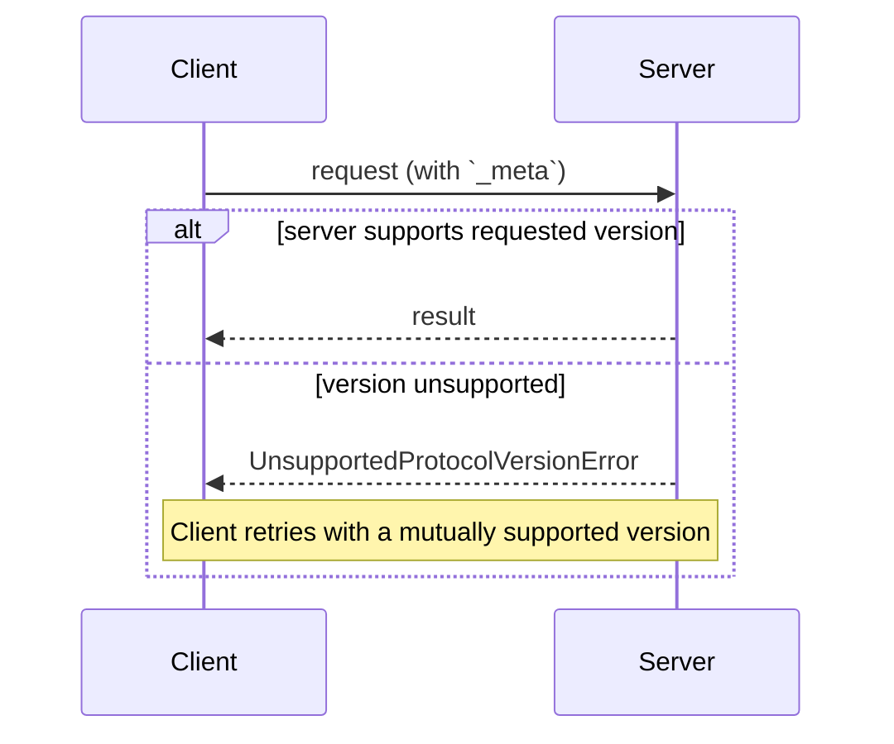

<div id="enable-section-numbers" />

本页定义客户端与服务端如何就它们所使用的协议达成一致：在每个请求上声明的协议版本；通过能力协商的可选扩展；以及与更早的、基于握手的协议修订版之间的互操作。

协议没有协商握手。每个请求都携带其协议版本，服务端独立地接受或拒绝每个请求：



## 术语

本页使用以下术语描述跨协议修订版的互操作：

- **现代（Modern）**：以每请求元数据方式传递版本、身份和能力的协议版本（修订版 `2026-07-28` 及更晚）。
- **旧版（Legacy）**：通过 `initialize` 握手建立会话的协议版本（`2025-11-25` 及更早）。
- **双时代（Dual-era）**：同时支持现代版本和旧版版本的实现。

## 协议版本协商

每个请求都在其 [`_meta`](/docs/mcp/specification/2026-07-28/basic/index#meta) 字段中声明所使用的协议版本。在 HTTP 上，该信息还携带在 [`MCP-Protocol-Version` 头](/docs/mcp/specification/2026-07-28/basic/transports/streamable-http#protocol-version-header)中。

如果服务端未实现所请求的版本（无论该版本对服务端未知，还是服务端已知但选择不支持），它**必须**以 [`UnsupportedProtocolVersionError`](/docs/mcp/specification/2026-07-28/schema#unsupportedprotocolversionerror) 作出响应，列出其确实支持的版本：

```json
{
  "jsonrpc": "2.0",
  "id": 1,
  "error": {
    "code": -32022,
    "message": "Unsupported protocol version",
    "data": {
      "supported": ["2026-07-28", "2025-11-25"],
      "requested": "1900-01-01"
    }
  }
}
```

客户端**应当**从 `supported` 列表中选择一个双方都支持的版本并重试该请求，或者在不兼容版本存在时向用户呈现错误。

服务端**必须**实现 [`server/discover`](/docs/mcp/specification/2026-07-28/server/discover)。客户端**可以**在发送任何其他请求之前调用它以预先了解服务端支持的版本，但并非必须这样：客户端可以自由地内联调用任何 RPC，并在其首选版本不受支持时处理 `UnsupportedProtocolVersionError`。

## 扩展协商

客户端与服务端可以协商对核心协议之外可选[扩展](/docs/mcp/extensions/overview)的支持。扩展在能力的 `extensions` 字段中声明，该字段是一个从扩展标识符到各扩展设置对象的映射。扩展标识符**必须**遵循 [`_meta` 键命名规则](/docs/mcp/specification/2026-07-28/basic/index#meta)，并带有必需的前缀。

以下示例展示了一个客户端声明对标识为 `io.modelcontextprotocol/ui` 的 [MCP Apps 扩展](/docs/mcp/extensions/apps/overview)的支持：

```json
{
  "capabilities": {
    "roots": {},
    "extensions": {
      "io.modelcontextprotocol/ui": {
        "mimeTypes": ["text/html;profile=mcp-app"]
      }
    }
  }
}
```

以下示例展示了对标识为 `io.modelcontextprotocol/tasks` 的 [Tasks 扩展](/docs/mcp/extensions/tasks/overview)的支持：

```json
{
  "capabilities": {
    "tools": {},
    "extensions": {
      "io.modelcontextprotocol/tasks": {}
    }
  }
}
```

每个扩展都指定其设置对象的模式；空对象表示支持但不带额外设置。

如果一方支持某扩展而另一方不支持，支持方**必须**回退到核心协议行为，或以适当的错误拒绝该请求。扩展**应当**记录其预期的回退行为。

## 与基于初始化的版本的向后兼容

希望同时支持[旧版](#terminology)客户端（期望 `initialize` 握手）和[现代](#terminology)客户端（使用每请求元数据）的服务端**可以**同时实现这两种行为。

需要与两种服务端互操作的客户端，通过传输层特定的机制来检测服务端所处的时代，具体规定见各绑定页：

- [stdio](/docs/mcp/specification/2026-07-28/basic/transports/stdio#backward-compatibility)：用 `server/discover` 进行探测，对任何不是被识别的现代错误的错误进行回退。
- [Streamable HTTP](/docs/mcp/specification/2026-07-28/basic/transports/streamable-http#backward-compatibility)：尝试一个现代请求，并在回退前检查 `400 Bad Request` 的响应体。

在两种情况下，一个被识别的现代 JSON-RPC 错误（例如 [`UnsupportedProtocolVersionError`](/docs/mcp/specification/2026-07-28/schema#unsupportedprotocolversionerror)）表明这是现代服务端：客户端应使用受支持的版本重试，而不是回退。其他任何情况都表明这是旧版服务端。

时代判定是服务端的属性，而非单个请求的属性。客户端**应当**在服务端进程（stdio）或源（HTTP）的生命周期内缓存该结果，并**可以**在相同服务端配置重启后持久化该结果；若缓存的假设后续失效，则重新探测。

仅支持[现代](#terminology)版本的服务端**应当**在任何返回给 `initialize` 请求的错误中，于任何传输层上列出其支持的协议版本：旧版客户端没有向前回退机制，此消息可能是它们能够向用户呈现的唯一诊断信息。

### 兼容性矩阵

以下矩阵总结了客户端与服务端各个时代组合的预期结果：

| 客户端   | 服务端   | 结果                                                                                                                                                                                                                                                                                                                                                                                                                                                                                                                                        |
| -------- | -------- | ------------------------------------------------------------------------------------------------------------------------------------------------------------------------------------------------------------------------------------------------------------------------------------------------------------------------------------------------------------------------------------------------------------------------------------------------------------------------------------------------------------------------------------------- |
| 现代     | 现代     | 可用。`server/discover` 为可选；版本不匹配会以 `UnsupportedProtocolVersionError` 呈现，客户端使用双方都支持的版本重试。                                                                                                                                                                                                                                                                                                                                                                                                                     |
| 现代     | 旧版     | 失败。服务端可能以实现定义的错误拒绝请求、保持静默，甚至以旧版语义处理一个时代含义模糊的方法。在 stdio 上，客户端**应当**先发送 `server/discover` 以确定性地失败；随后客户端向用户呈现可操作的错误。                                                                                                                                                                                                                                                                                                                                            |
| 双时代   | 现代     | 可用。stdio 探测返回 `DiscoverResult`（或 `UnsupportedProtocolVersionError`）；在 HTTP 上，首个现代请求成功或返回一个现代错误。客户端保持现代模式。                                                                                                                                                                                                                                                                                                                                                                                          |
| 双时代   | 旧版     | 可用。stdio：探测返回非现代错误或超时，客户端回退到 `initialize`。HTTP：现代请求返回一个不带被识别的现代错误体的 `4xx`，客户端回退到 `initialize`（并可能进一步回退到已弃用的 HTTP+SSE 传输层）。                                                                                                                                                                                                                                                                                                                                                |
| 旧版     | 现代     | 失败。stdio：服务端以 JSON-RPC 错误拒绝 `initialize`；具体错误码由实现定义（`initialize` 是未知方法，且请求也缺少必需的 `_meta` 字段）。HTTP：请求缺少必需的头，并依据[服务端校验](/docs/mcp/specification/2026-07-28/basic/transports/streamable-http#server-validation)以 `400 Bad Request` 被拒绝（使用已弃用 HTTP+SSE 传输层的客户端则在其开头的 `GET` 处失败）。旧版客户端没有向前回退机制。 |
| 旧版     | 双时代   | 可用。服务端响应 `initialize`，并依据协商的旧版修订版为客户端提供服务。                                                                                                                                                                                                                                                                                                                                                                                                                                                                       |
| 旧版     | 旧版     | 依据旧版修订版可用；不在本文档讨论范围内。                                                                                                                                                                                                                                                                                                                                                                                                                                                                                                   |

双时代**服务端**根据客户端如何开启连接来选择其行为：

- 携带现代每请求 `_meta` 的请求将依据本修订版以无状态方式处理。
- `initialize` 请求选择旧版语义，其作用域限定为 stdio 进程（stdio）或会话（HTTP），具体由协商的旧版协议版本规定。

双时代服务端**可以**在同一端点或进程上并发地服务两个时代。
