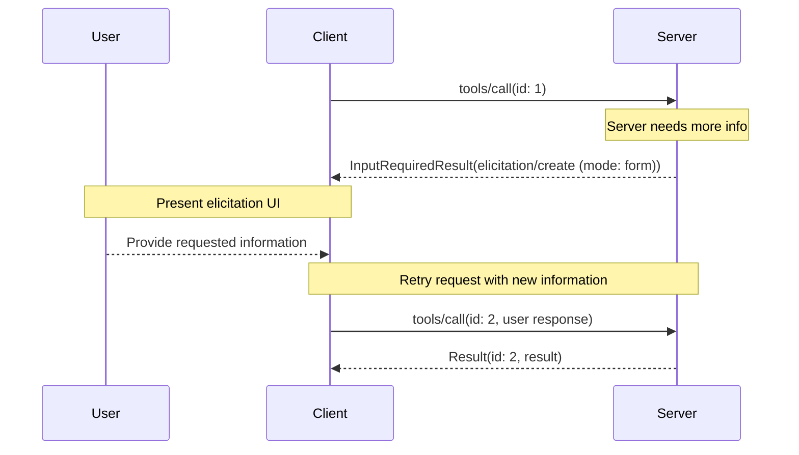
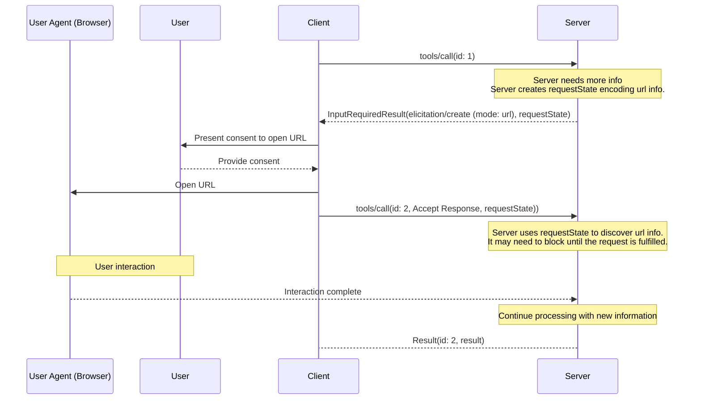
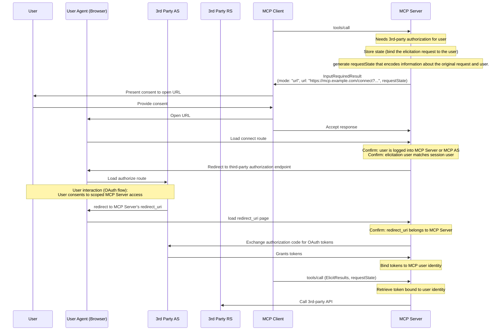

<div id="enable-section-numbers" />

Model Context Protocol（MCP）为服务端提供了一种标准化的方式，使其能在交互过程中通过客户端向用户请求额外
信息。该流程让客户端
能够掌控用户交互和数据共享，同时使服务端能够按需动态收集
必要信息。

征询（Elicitation）支持两种模式：

- **表单模式（Form mode）**：服务端可以使用可选的 JSON 模式来校验响应，从而向用户请求结构化数据
- **URL 模式（URL mode）**：服务端可以将用户引导到外部 URL，以处理_不得_经过 MCP 客户端的敏感交互

## 用户交互模型

MCP 中的征询通过让用户输入
请求在其他 MCP 服务端特性中_嵌套_发生，使服务端能够实现交互式工作流。

实现可以自由地通过任何适合其
需求&mdash;的接口模式来暴露征询，协议本身并不强制任何特定的用户交互
模型。

<Callout type="warn">

出于信任、安全与安全性的考虑：

- 服务端**不得**使用表单模式征询来请求诸如
  密码、API 密钥、访问令牌或支付凭据之类的敏感信息
- 服务端**必须**对涉及此类
  敏感信息的交互使用 [URL 模式](#url-mode-elicitation-requests)

此语境下的"敏感信息"指授予访问权限或
授权交易的机密和凭据。一般的联系或个人信息（如姓名、电子邮件地址、
或用户名）并非一概禁止；是否通过表单模式请求此类数据，由
服务端酌情决定，并受用户审查和拒绝能力的约束。

MCP 客户端**必须**：

- 提供明确指示哪个服务端正在请求信息的 UI
- 尊重用户隐私，并提供清晰的拒绝和取消选项
- 对于表单模式，允许用户在发送前审查和修改其响应
- 对于 URL 模式，在跳转到目标 URL 之前，清晰地显示目标域名/主机并征得用户同意

</Callout>

## 能力（Capabilities）

支持征询的客户端**必须**在每次请求的
`_meta.io.modelcontextprotocol/clientCapabilities` 中声明 `elicitation` 能力：

```json
{
  "_meta": {
    "io.modelcontextprotocol/clientCapabilities": {
      "elicitation": {
        "form": {},
        "url": {}
      }
    }
  }
}
```

为了向后兼容，空的能力对象等同于声明仅支持 `form` 模式：

```jsonc
{
  "_meta": {
    "io.modelcontextprotocol/clientCapabilities": {
      "elicitation": {}, // Equivalent to { "form": {} }
    },
  },
}
```

声明 `elicitation` 能力的客户端**必须**至少支持一种模式（`form` 或 `url`）。

服务端**不得**发送带有客户端不支持的模式（mode）的征询请求。

## 协议消息

### 征询请求

服务端**可以**在处理某个客户端请求的过程中，通过发送包含 `elicitation/create` 请求的 [`InputRequiredResult`](/docs/mcp/specification/2026-07-28/basic/patterns/mrtr#inputrequiredresult)
，向用户请求信息。

所有征询请求**必须**包含以下参数：

| 名称      | 类型   | 选项       | 描述                                                                            |
| --------- | ------ | ------------- | -------------------------------------------------------------------------------------- |
| `mode`    | string | `form`、`url` | 征询的模式。表单模式中为可选项（省略时默认为 `"form"`）。 |
| `message` | string |               | 解释为何需要该交互的可读消息。                     |

`mode` 参数指定征询的类型：

- `"form"`：带内（in-band）结构化数据收集，可选用模式进行校验。数据会暴露给客户端。
- `"url"`：通过 URL 导航进行带外（out-of-band）交互。数据（除 URL 本身外）**不**暴露给客户端。

为了向后兼容，对于表单模式征询请求，服务端**可以**省略 `mode` 字段。客户端**必须**将不带 `mode` 字段的请求视为表单模式。

### 表单模式征询请求

表单模式征询允许服务端直接通过 MCP 客户端收集结构化数据。

表单模式征询请求**必须**指定 `mode: "form"` 或省略 `mode` 字段，并包含以下额外参数：

| 名称              | 类型   | 描述                                                    |
| ----------------- | ------ | -------------------------------------------------------------- |
| `requestedSchema` | object | 定义预期响应结构的 JSON 模式。 |

#### 请求的模式（Requested Schema）

`requestedSchema` 参数允许服务端使用受限的 JSON 模式子集
定义预期响应的结构。

为简化客户端用户体验，表单模式征询模式被限制为仅包含简单属性的扁平对象。

该模式被限制为以下原始类型：

1. **字符串模式（String Schema）**

   ```json
   {
     "type": "string",
     "title": "Display Name",
     "description": "Description text",
     "minLength": 3,
     "maxLength": 50,
     "format": "email",
     "default": "user@example.com"
   }
   ```

   支持的格式：`email`、`uri`、`date`、`date-time`

2. **数字模式（Number Schema）**

   ```json
   {
     "type": "number", // or "integer"
     "title": "Display Name",
     "description": "Description text",
     "minimum": 0,
     "maximum": 100,
     "default": 50
   }
   ```

3. **布尔模式（Boolean Schema）**

   ```json
   {
     "type": "boolean",
     "title": "Display Name",
     "description": "Description text",
     "default": false
   }
   ```

4. **枚举模式（Enum Schema）**

   单选枚举（不带标题）：

   ```json
   {
     "type": "string",
     "title": "Color Selection",
     "description": "Choose your favorite color",
     "enum": ["Red", "Green", "Blue"],
     "default": "Red"
   }
   ```

   单选枚举（带标题）：

   ```json
   {
     "type": "string",
     "title": "Color Selection",
     "description": "Choose your favorite color",
     "oneOf": [
       { "const": "#FF0000", "title": "Red" },
       { "const": "#00FF00", "title": "Green" },
       { "const": "#0000FF", "title": "Blue" }
     ],
     "default": "#FF0000"
   }
   ```

   多选枚举（不带标题）：

   ```json
   {
     "type": "array",
     "title": "Color Selection",
     "description": "Choose your favorite colors",
     "minItems": 1,
     "maxItems": 2,
     "items": {
       "type": "string",
       "enum": ["Red", "Green", "Blue"]
     },
     "default": ["Red", "Green"]
   }
   ```

   多选枚举（带标题）：

   ```json
   {
     "type": "array",
     "title": "Color Selection",
     "description": "Choose your favorite colors",
     "minItems": 1,
     "maxItems": 2,
     "items": {
       "anyOf": [
         { "const": "#FF0000", "title": "Red" },
         { "const": "#00FF00", "title": "Green" },
         { "const": "#0000FF", "title": "Blue" }
       ]
     },
     "default": ["#FF0000", "#00FF00"]
   }
   ```

客户端可以使用此模式来：

1. 生成合适的输入表单
2. 在发送前校验用户输入
3. 为用户提供更好的引导

所有原始类型都支持可选的默认值，以提供合理的起始值。支持默认值的客户端应当用这些值预填表单字段。

请注意，复杂的嵌套结构、对象数组（枚举除外）以及其他高级 JSON 模式特性是刻意不支持的，以简化客户端用户体验。

#### 示例：简单文本请求

**输入请求（在 [`InputRequiredResult.inputRequests`](/docs/mcp/specification/2026-07-28/basic/patterns/mrtr#inputrequests) 内投递）：**

```json
{
  "method": "elicitation/create",
  "params": {
    "mode": "form",
    "message": "Please provide your GitHub username",
    "requestedSchema": {
      "type": "object",
      "properties": {
        "name": {
          "type": "string"
        }
      },
      "required": ["name"]
    }
  }
}
```

**客户端结果（在重试的请求的 `inputResponses` 内返回）：**

```json
{
  "action": "accept",
  "content": {
    "name": "octocat"
  }
}
```

#### 示例：结构化数据请求

**输入请求（在 `InputRequiredResult.inputRequests` 内投递）：**

```json
{
  "method": "elicitation/create",
  "params": {
    "mode": "form",
    "message": "Please provide your contact information",
    "requestedSchema": {
      "type": "object",
      "properties": {
        "name": {
          "type": "string",
          "description": "Your full name"
        },
        "email": {
          "type": "string",
          "format": "email",
          "description": "Your email address"
        },
        "age": {
          "type": "number",
          "minimum": 18,
          "description": "Your age"
        }
      },
      "required": ["name", "email"]
    }
  }
}
```

**客户端结果（在重试的请求的 `inputResponses` 内返回）：**

```json
{
  "action": "accept",
  "content": {
    "name": "Monalisa Octocat",
    "email": "octocat@github.com",
    "age": 30
  }
}
```

### URL 模式征询请求

<Callout>

**新特性：** URL 模式征询在 MCP 规范的 `2025-11-25` 版本中引入。其设计和实现可能会在未来的协议修订版中发生变化。

</Callout>

URL 模式征询使服务端能够将用户引导到外部 URL，以进行不得经过 MCP 客户端的带外交互。这对于认证流程、支付处理以及其他敏感或安全操作至关重要。

URL 模式征询请求**必须**指定 `mode: "url"`、一个 `message`，并包含以下额外参数：

| 名称  | 类型   | 描述                               |
| ----- | ------ | ----------------------------------------- |
| `url` | string | 应引导用户前往的 URL。 |

`url` 参数**必须**包含有效的 URL。

<Callout>
  **重要**：URL 模式征询*不是*用于授权 MCP 客户端访问
  MCP 服务端（那由 [MCP
  授权](../basic/authorization) 处理）。相反，当 MCP
  服务端需要代表用户获取敏感信息或第三方授权时使用它。MCP 客户端的持有者令牌（bearer token）保持不变。该
  客户端的唯一责任是向用户提供关于服务端想让其打开的
  征询 URL 的上下文。
</Callout>

#### 示例：请求敏感数据

此示例展示了一个 URL 模式征询请求，将用户引导到一个安全的 URL，他们可以在那里提供敏感信息（例如 API 密钥）。
同样的请求还可以将用户引导到 OAuth 授权流程或支付流程。唯一的区别在于 URL 和消息。

**输入请求（在 `InputRequiredResult.inputRequests` 内投递）：**

```json
{
  "method": "elicitation/create",
  "params": {
    "mode": "url",
    "url": "https://mcp.example.com/ui/set_api_key",
    "message": "Please provide your API key to continue."
  }
}
```

**客户端结果（在重试的请求的 `inputResponses` 内返回）：**

```json
{
  "action": "accept"
}
```

带有 `action: "accept"` 的响应表示用户已同意该
交互。它并不意味着交互已完成。该交互发生在带外，
客户端不会直接获知其结果。当客户端重试
原始请求时，服务端会从回显的 `requestState`（或其自身
保存的状态）判断带外交互是否已完成，并返回
最终结果，或以另一个 `InputRequiredResult` 作为响应。客户端**应当**提供
手动控件，让用户能够重试或取消原始请求（或以其他方式
继续与客户端交互）。

## 消息流

### 表单模式流程



### URL 模式流程



## 响应动作

征询响应使用三动作模型，以清晰区分不同的用户动作。这些动作同时适用于表单和 URL 征询模式。

```json
{
  "action": "accept", // or "decline" or "cancel"
  "content": {
    "propertyName": "value",
    "anotherProperty": 42
  }
}
```

三种响应动作是：

1. **接受（Accept）**（`action: "accept"`）：用户明确批准并提交了数据
   - 对于表单模式：`content` 字段包含与所请求模式匹配的已提交数据
   - 对于 URL 模式：`content` 字段被省略
   - 示例：用户点击了"提交"、"确定"、"确认"等。

2. **拒绝（Decline）**（`action: "decline"`）：用户明确拒绝请求
   - `content` 字段通常被省略
   - 示例：用户点击了"拒绝"、"谢绝"、"否"等。

3. **取消（Cancel）**（`action: "cancel"`）：用户未做出明确选择即关闭
   - `content` 字段通常被省略
   - 示例：用户关闭了对话框、点击了外部、按了 Escape、浏览器加载失败等。

服务端应当适当地处理每种状态：

- **接受**：处理提交的数据
- **拒绝**：处理明确的拒绝（例如，提供替代方案）
- **取消**：处理关闭（例如，稍后再提示）

## 实现考量

### 有状态性

征询并不要求服务端通过[多轮往返请求](/docs/mcp/specification/2026-07-28/basic/patterns/mrtr#multi-round-trip-requests)机制维护与用户相关的状态。

但是，如果存储了状态，则实现征询的服务端**必须**按照[安全最佳实践](/docs/mcp/tutorials/security/security_best_practices)文档中的准则，将该状态安全地关联到各个用户。具体而言：

- 状态存储**必须**受到保护，防止未授权访问
- 对于远程 MCP 服务端，用户身份**必须**在可能时，从通过 [MCP 授权](../basic/authorization)获取的凭据（例如 `sub` 声明）中派生

<Callout>
  本节中的示例是非规范性（non-normative）的，用于说明征询的潜在
  用途。实现者应在保持安全最佳实践的同时，
  使这些模式适应其特定的需求。
</Callout>

### 针对敏感数据的 URL 模式征询

对于与需要敏感信息（例如凭据、支付信息）的外部 API 交互的服务端，URL 模式征询提供了一种安全机制，使用户可以在不将信息暴露给 MCP 客户端的情况下提供这些信息。

在该模式中:

1. 服务端将用户引导到安全的网页（通过 HTTPS 提供服务）
2. 该页面在用户信任的域名上呈现品牌化的表单 UI
3. 用户直接在安全表单中输入敏感凭据
4. 服务端将凭据安全存储，并绑定到用户的身份
5. 后续的 MCP 请求使用这些存储的凭据进行 API 访问

这种方法确保敏感凭据永远不会经过 LLM 上下文、MCP 客户端或任何中间 MCP 服务端，从而降低通过客户端侧日志记录或其他攻击途径暴露的风险。

### 针对 OAuth 流程的 URL 模式征询

URL 模式征询支持这样一种模式：MCP 服务端作为第三方资源服务器的 OAuth 客户端。
通过 URL 模式征询与外部 API 进行的授权，不同于 [MCP 授权](../basic/authorization)。MCP 服务端**不得**依赖 URL 模式征询来为自身授权用户。

#### 理解两者的区别

- **MCP 授权**：MCP 客户端与 MCP 服务端之间必需的 OAuth 流程（在[授权规范](../basic/authorization)中介绍）
- **外部（第三方）授权**：MCP 服务端与第三方资源服务器之间可选的授权，通过 URL 模式征询发起

在外部授权中，服务端扮演双重角色：

- OAuth 资源服务器（对 MCP 客户端而言）
- OAuth 客户端（对第三方资源服务器而言）

示例场景：

- 一个 MCP 客户端连接到某个 MCP 服务端
- 该 MCP 服务端集成了各种不同的第三方服务
- 当 MCP 客户端调用一个需要访问第三方服务的工具时，MCP 服务端需要该服务的凭据

关键的安全要求是：

1. **第三方凭据不得经过 MCP 客户端传输**：客户端绝不能看到第三方凭据，以保护安全边界
2. **MCP 服务端不得将客户端的凭据用于第三方服务**：那将构成[令牌透传](/docs/mcp/tutorials/security/security_best_practices#token-passthrough)，而这被禁止
3. **用户必须直接授权 MCP 服务端**：交互发生在 MCP 协议之外，不涉及 MCP 客户端
4. **MCP 服务端对令牌负责**：MCP 服务端负责存储和管理通过 URL 模式征询获取的第三方令牌（换言之，MCP 服务端必须是有状态的）。

通过 URL 模式征询获取的凭据，不同于 MCP 客户端使用的 MCP 服务端凭据。MCP 服务端**不得**将通过 URL 模式征询获取的凭据传输给 MCP 客户端。

<Callout>
  如需更多背景信息，请参阅安全最佳实践文档中的[令牌透传
  一节](/docs/mcp/tutorials/security/security_best_practices#token-passthrough)，
  以理解为什么 MCP 服务端不能
  充当透传代理。
</Callout>

#### 实现模式

当通过 URL 模式征询实现外部授权时：

1. MCP 服务端生成一个授权 URL，充当第三方服务的 OAuth 客户端
2. MCP 服务端存储将征询请求与用户身份（绑定）关联起来的内部状态。
3. MCP 服务端向客户端发送一个 URL 模式征询请求，其中的 URL 可以启动授权流程，并带有一个可选的 `requestState`，用于编码有关征询请求和用户的信息（如有需要）。
4. 用户直接与第三方授权服务端完成 OAuth 流程
5. 第三方授权服务端重定向回 MCP 服务端
6. MCP 服务端安全地存储绑定到用户身份的第三方令牌
7. 未来的 MCP 请求可以利用这些存储的令牌，对第三方资源服务器进行 API 访问

以下是该模式可能如何实现的一个非规范性示例：



这种模式在保持清晰安全边界的同时，支持与需要用户授权的第三方服务进行丰富的集成。

## 错误处理

服务端**不应**假定征询请求总会成功，并且**必须**处理用户拒绝或取消征询、或客户端无法处理该请求的情况。

## 安全考量

1. 服务端**必须**将征询请求绑定到客户端和用户身份
1. 客户端**必须**清晰地指示哪个服务端正在请求信息
1. 客户端**应当**实现用户批准控件
1. 客户端**应当**允许用户随时拒绝征询请求
1. 客户端**应当**以使其明确请求了什么信息以及为何请求的方式呈现征询请求

### 安全 URL 处理

发起征询的 MCP 服务端：

1. **不得**在发送给客户端的征询请求的 URL 中包含有关最终用户的敏感信息，包括凭据、个人身份信息等。
2. **不得**提供经预认证即可访问受保护资源的 URL，因为该 URL 可能被恶意客户端用来冒充用户。
3. **不应**在表单模式征询请求的任何字段中包含期望可点击的 URL。
4. **应当**在非开发环境中使用 HTTPS URL。

这些服务端要求确保客户端实现有清晰的规则，以决定何时向用户呈现 URL，从而使客户端侧规则（下文）能够被一致地应用。

实现 URL 模式征询的客户端**必须**谨慎处理 URL，以防止用户在不经意间点击恶意链接。

在处理 URL 模式征询请求时，MCP 客户端：

1. **不得**自动预取该 URL 或其任何元数据。
2. **不得**在未经用户明确同意的情况下打开该 URL。
3. **必须**在征求同意之前向用户展示完整的 URL，以供检查。
4. **必须**以安全的方式打开服务端提供的 URL，该方式不得使客户端或 LLM 能够检查内容或用户输入。
   例如，在 iOS 上 [SFSafariViewController](https://developer.apple.com/documentation/safariservices/sfsafariviewcontroller) 是合适的，但 [WkWebView](https://developer.apple.com/documentation/webkit/wkwebview) 则不合适。
5. **应当**突出显示 URL 的域名，以缓解子域名欺骗。
6. **应当**对有歧义/可疑的 URI（即包含 Punycode 的）给出警告。
7. **不应**在征询请求的任何字段中将 URL 渲染为可点击，但 URL 模式征询请求中的 `url` 字段除外（并遵循上文详述的限制）。

### 识别用户

服务端**不得**依赖客户端提供的用户身份识别而未经服务端验证，因为这可以被伪造。
相反，服务端**应当**遵循[安全最佳实践](/docs/mcp/tutorials/security/security_best_practices)。

非规范性示例：

- 不正确：将 "I am joe@example.com" 之类的用户输入视为权威
- 正确：依靠 [授权](../basic/authorization)来识别用户

### 表单模式安全

1. 服务端**不得**通过表单模式请求敏感信息（密码、API 密钥等）
2. 客户端**应当**根据提供的模式校验所有响应
3. 服务端**应当**校验所接收的数据与所请求的模式匹配

#### 网络钓鱼（Phishing）

URL 模式征询会返回一个 URL，攻击者可将其发送给受害者。MCP 服务端在接受信息之前**必须**验证打开该 URL 的用户身份。

通常身份验证是通过利用 [MCP 授权服务端](../basic/authorization)来识别用户，在浏览器中通过会话 cookie 或等价机制完成。

例如，URL 模式征询可用于执行 OAuth 流程，其中服务端充当另一个资源服务器的 OAuth 客户端。若无适当的缓解措施，则可能出现以下网络钓鱼攻击：

1. 连接到良性服务端的恶意用户（Alice）触发一次征询请求
2. 该良性服务端生成一个授权 URL，充当第三方授权服务端的 OAuth 客户端
3. Alice 的客户端显示该 URL 并请求同意
4. 不是点击该链接，而是 Alice 诱骗同一良性服务端的受害者用户（Bob）点击它
5. Bob 打开该链接并完成授权，以为自己在授权其与良性服务端的连接
6. 良性服务端收到来自第三方授权服务端的回调/重定向，并假定这是 Alice 的请求
7. 第三方服务端的令牌被绑定到 Alice 的会话和身份，而非 Bob 的，从而导致账户接管

为防止这种攻击，服务端**必须**确保发起征询请求的用户（通过 MCP 客户端访问服务端的最终用户）与完成授权流程的用户是同一人。

实现这一点的方法有很多，最佳方式取决于具体的实现。

作为一个常见、非规范性的示例，考虑 MCP 服务端可通过 Web 访问并希望执行第三方授权码流程的情况。
为防止网络钓鱼攻击，服务端会创建一个指向 `https://mcp.example.com/connect?...` 的 URL 模式征询，而不是第三方授权端点。
这个"连接 URL"必须确保打开该页面的用户，与为其生成征询的用户是同一人。
例如，它可以检查用户具有有效的会话 cookie，并且该会话 cookie 对应用户与使用 MCP 客户端生成 URL 模式征询的用户相同。
这可以通过将 MCP 服务端授权服务器的权威主题（`sub` 声明）与会话 cookie 的主题进行比较来实现。
一旦该页面确认是同一用户，它就可以将用户发送到 `https://example.com/authorize?...` 处的第三方授权服务端，在那里完成正常的 OAuth 流程。

在其他情况下，服务端可能无法通过 Web 访问，也可能无法使用会话 cookie 来识别用户。
在这种情况下，服务端必须使用不同的机制来确认，打开征询 URL 的用户就是为其生成征询的用户。

在所有实现中，服务端**必须**确保用于确定用户身份的机制，能够抵御攻击者篡改征询 URL 的攻击。