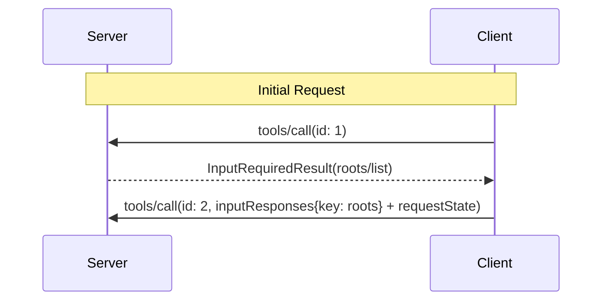

<div id="enable-section-numbers" />

<Callout type="warn">
  **已弃用**：Roots 特性自协议版本
  `2026-07-28` 起被弃用
  （[SEP-2577](https://github.com/modelcontextprotocol/modelcontextprotocol/pull/2577)）。
  根据[特性生命周期策略](#)，它在本修订版发布之后仍将
  在规范中保留至少十二个月，
  然后才具备被移除的资格。新的实现**不应**采用它；现有实现**应当**迁移到通过工具参数、资源 URI 或服务端配置传递目录
  或文件的方式。参见
  [已弃用特性注册表](/docs/mcp/specification/2026-07-28/deprecated)。
</Callout>

Model Context Protocol（MCP）为客户端提供了一种标准化的方式，将文件系统"根（roots）"暴露给
服务端。根让服务端了解客户端认为相关的目录和文件，
以便服务端能够相应地将操作聚焦于其上。它们是
信息性的引导，而非访问控制机制。协议并不
强制要求服务端保持在根的范围之内。服务端可以从支持该特性的
客户端请求根的列表。

## 用户交互模型

MCP 中的根通常通过工作区或项目配置界面暴露。

例如，实现可以提供工作区/项目选择器，让用户
选择服务端应有权访问的目录和文件。这可以与
从版本控制系统或项目文件中进行自动工作区检测相结合。

然而，实现可以自由地通过任何适合其
需求&mdash;的接口模式来暴露根，协议本身并不强制任何特定的用户交互
模型。

## 能力（Capabilities）

支持根的客户端**必须**在每次请求的
`_meta.io.modelcontextprotocol/clientCapabilities` 中声明 `roots` 能力：

```json
{
  "_meta": {
    "io.modelcontextprotocol/clientCapabilities": {
      "roots": {}
    }
  }
}
```

## 协议消息

### 列出根

在处理客户端请求期间，服务端发送一个包含 `roots/list` 请求的 `InputRequiredResult`
来获取根：

**输入请求（在 [`InputRequiredResult.inputRequests`](/docs/mcp/specification/2026-07-28/basic/patterns/mrtr#inputrequests) 内投递）：**

```json
{
  "method": "roots/list"
}
```

**客户端结果（在重试的请求的 `inputResponses` 内返回）：**

```json
{
  "roots": [
    {
      "uri": "file:///home/user/projects/myproject",
      "name": "My Project"
    }
  ]
}
```

## 消息流



## 数据类型

### 根（Root）

根定义包含：

- `uri`：根的唯一标识符。在当前
  规范中，它**必须**是一个 `file://` URI。
- `name`：用于显示目的的可选人类可读名称。

不同使用场景的根示例：

#### 项目目录

```json
{
  "uri": "file:///home/user/projects/myproject",
  "name": "My Project"
}
```

#### 多个仓库

```json
[
  {
    "uri": "file:///home/user/repos/frontend",
    "name": "Frontend Repository"
  },
  {
    "uri": "file:///home/user/repos/backend",
    "name": "Backend Repository"
  }
]
```

## 错误处理

如果发生错误，客户端无需带着错误消息重放初始调用，
因为在 `InputRequiredResult` 模式下服务端并不会等待响应。

## 安全考量

1. 客户端**必须**：
   - 只暴露带有适当权限的根
   - 校验所有根 URI，以防止路径遍历
   - 实施适当的访问控制
   - 监控根的可访问性

2. 服务端**应当**：
   - 处理根变得不可用的情况
   - 在操作期间尊重根边界
   - 根据所提供的根校验所有路径

## 实现指南

1. 客户端**应当**：
   - 在向服务端暴露根之前，提示用户征得同意
   - 为根管理提供清晰的用户界面
   - 在暴露之前校验根的可访问性
   - 监控根的变更

2. 服务端**应当**：
   - 在使用前检查根能力
   - 在操作中尊重根边界
   - 适当地缓存根信息