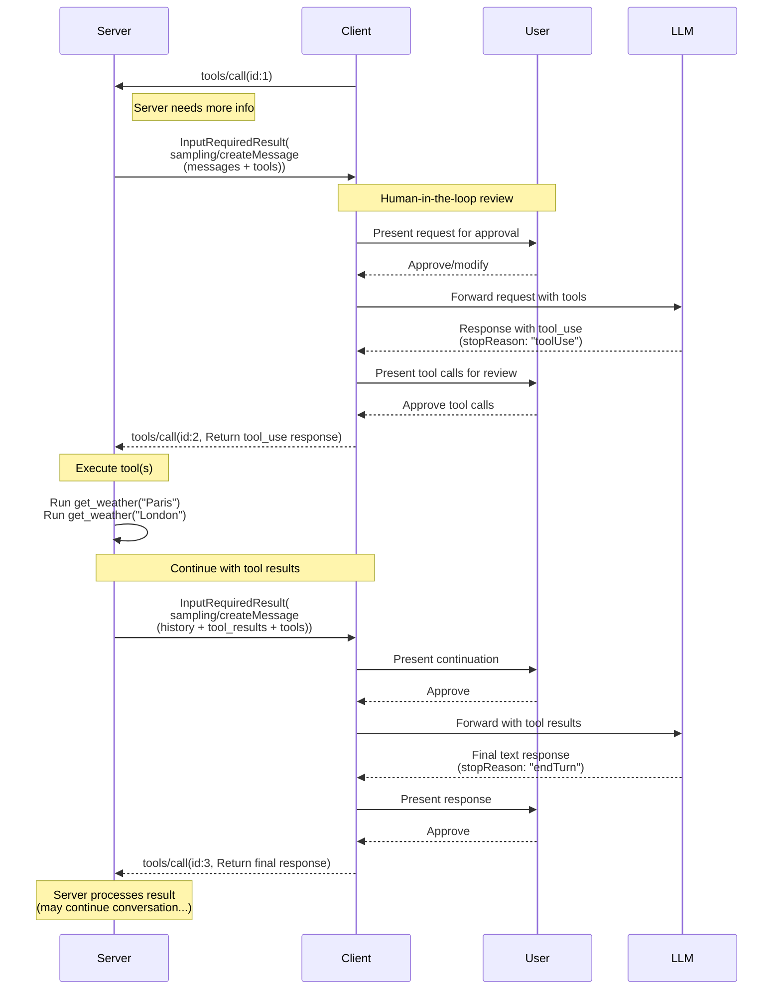
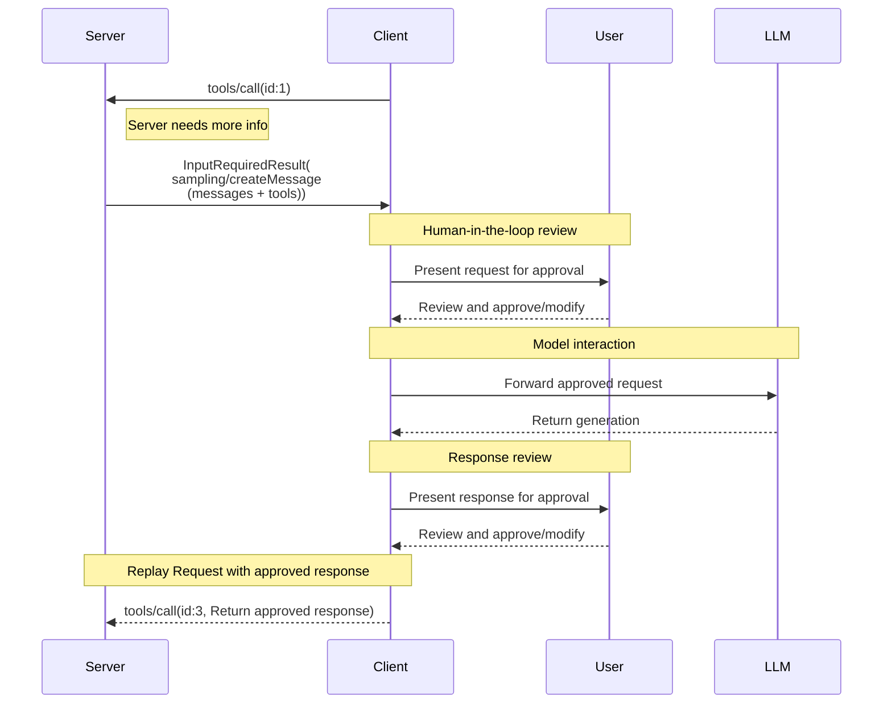

<div id="enable-section-numbers" />

<Callout type="warn">
  **已弃用**：Sampling 特性自协议版本
  `2026-07-28` 起被弃用
  （[SEP-2577](https://github.com/modelcontextprotocol/modelcontextprotocol/pull/2577)）。
  根据[特性生命周期策略](#)，它在本修订版发布之后仍将
  在规范中保留至少十二个月，
  然后才具备被移除的资格。新的实现**不应**采用它；现有实现**应当**迁移到直接与
  LLM 提供方 API 集成的方式。参见[已弃用特性
  注册表](/docs/mcp/specification/2026-07-28/deprecated)。
</Callout>

Model Context Protocol（MCP）为服务端提供了一种标准化的方式，通过客户端向语言模型请求 LLM
抽取（sampling，即"补全"或"生成"）。该流程
让客户端能够掌控模型访问、选择和权限，
同时使服务端能够利用 AI 能力&mdash;而无需服务端持有任何 API 密钥。
服务端可以请求基于文本、音频或图像的交互，并可以选择在其提示词中包含来自 MCP 服务端的上下文。

## 用户交互模型

MCP 中的模型抽样通过让 LLM 调用在其他 MCP 服务端特性中_嵌套_发生，使服务端能够实现智能体（agentic）行为。

实现可以自由地通过任何适合其
需求&mdash;的接口模式来暴露模型抽样，协议本身并不强制任何特定的用户交互
模型。

<Callout type="warn">

出于信任、安全与安全性的考虑，**应当**始终
有一个有能力拒绝模型抽样请求的人类处于回路中。

应用**应当**：

- 提供 UI，使审查模型抽样请求变得简单直观
- 允许用户在发送前查看和编辑提示词
- 在投递前展示生成的响应以供审查

</Callout>

## 模型抽样中的工具

服务端可以在其模型抽样请求中提供一个 `tools` 数组和可选的 `toolChoice` 配置，以请求客户端的 LLM 在抽样期间使用工具。`tools` 数组中的工具定义的作用域仅限于该抽样请求——它们不需要与已注册的工具对应。这使得服务端能够实现智能体行为，即 LLM 可以调用特别指定的工具、接收结果并在单个抽样请求流程内继续对话。

**必须**声明对此能力的支持，才会收到支持工具的模型抽样请求。具体而言，只有通过 `sampling.tools` 能力声明了工具使用支持的客户端，服务端**不得**向未通过 `sampling.tools` 能力声明工具使用支持的客户端发送支持工具的模型抽样请求。

## 能力（Capabilities）

支持模型抽样的客户端**必须**在每次请求的
`_meta.io.modelcontextprotocol/clientCapabilities` 中声明 `sampling` 能力：

**基础模型抽样：**

```json
{
  "_meta": {
    "io.modelcontextprotocol/clientCapabilities": {
      "sampling": {}
    }
  }
}
```

**带工具使用支持：**

```json
{
  "_meta": {
    "io.modelcontextprotocol/clientCapabilities": {
      "sampling": {
        "tools": {}
      }
    }
  }
}
```

**带上下文包含支持（已弃用）：**

```json
{
  "_meta": {
    "io.modelcontextprotocol/clientCapabilities": {
      "sampling": {
        "context": {}
      }
    }
  }
}
```

<Callout>
  `includeContext` 参数的取值 `"thisServer"` 和 `"allServers"` 在
  [特性生命周期
  策略](#)下已被弃用
  （[SEP-2596](https://github.com/modelcontextprotocol/modelcontextprotocol/pull/2596)）；
  它们将不晚于 Sampling 特性本身被移除。服务端
  **应当**避免使用这些取值（例如，由于 `includeContext` 默认为 `"none"`，
  可以直接省略它），并且**不应**使用它们，除非客户端
  声明了 `sampling.context` 能力。参见[已弃用特性
  注册表](/docs/mcp/specification/2026-07-28/deprecated)。
</Callout>

## 协议消息

### 创建消息

要在一个客户端请求的处理期间请求一次语言模型生成，服务端发送一个包含 `sampling/createMessage` 请求的 `InputRequiredResult`：

**输入请求（在 [`InputRequiredResult.inputRequests`](/docs/mcp/specification/2026-07-28/basic/patterns/mrtr#inputrequests) 内投递）：**

```json
{
  "method": "sampling/createMessage",
  "params": {
    "messages": [
      {
        "role": "user",
        "content": {
          "type": "text",
          "text": "What is the capital of France?"
        }
      }
    ],
    "modelPreferences": {
      "hints": [
        {
          "name": "claude-3-sonnet"
        }
      ],
      "costPriority": 0.3,
      "intelligencePriority": 0.8,
      "speedPriority": 0.5
    },
    "temperature": 0.1,
    "systemPrompt": "You are a helpful assistant.",
    "includeContext": "thisServer",
    "maxTokens": 100
  }
}
```

**客户端结果（在重试的请求的 `inputResponses` 内返回）：**

```json
{
  "role": "assistant",
  "content": {
    "type": "text",
    "text": "The capital of France is Paris."
  },
  "model": "claude-3-sonnet-20240307",
  "stopReason": "endTurn"
}
```

### 带工具的模型抽样

下图展示了带工具的模型抽样的完整流程，包括多轮工具循环：



要请求带工具使用能力的 LLM 生成，服务端在请求中包含 `tools` 和可选的 `toolChoice`：

**输入请求（服务端 -> 客户端，在 `InputRequiredResult.inputRequests` 内投递）：**

```json
{
  "method": "sampling/createMessage",
  "params": {
    "messages": [
      {
        "role": "user",
        "content": {
          "type": "text",
          "text": "What's the weather like in Paris and London?"
        }
      }
    ],
    "tools": [
      {
        "name": "get_weather",
        "description": "Get current weather for a city",
        "inputSchema": {
          "type": "object",
          "properties": {
            "city": {
              "type": "string",
              "description": "City name"
            }
          },
          "required": ["city"]
        }
      }
    ],
    "toolChoice": {
      "mode": "auto"
    },
    "maxTokens": 1000
  }
}
```

**客户端结果（客户端 -> 服务端，在重试的请求的 `inputResponses` 内返回）：**

```json
{
  "role": "assistant",
  "content": [
    {
      "type": "tool_use",
      "id": "call_abc123",
      "name": "get_weather",
      "input": {
        "city": "Paris"
      }
    },
    {
      "type": "tool_use",
      "id": "call_def456",
      "name": "get_weather",
      "input": {
        "city": "London"
      }
    }
  ],
  "model": "claude-3-sonnet-20240307",
  "stopReason": "toolUse"
}
```

### 多轮工具循环

在收到 LLM 的工具使用请求后，服务端通常：

1. 执行所请求的工具使用。
2. 发送一个新的、附加了工具结果的抽样请求
3. 接收 LLM 的响应（其中可能包含新的工具使用）
4. 根据需要多次重复（服务端可能会限制最大迭代次数，例如在最后一次迭代时传入 `toolChoice: {mode: "none"}` 以强制得到最终结果）

**带工具结果的后续输入请求（服务端 -> 客户端，在 `InputRequiredResult.inputRequests` 内投递）：**

```json
{
  "method": "sampling/createMessage",
  "params": {
    "messages": [
      {
        "role": "user",
        "content": {
          "type": "text",
          "text": "What's the weather like in Paris and London?"
        }
      },
      {
        "role": "assistant",
        "content": [
          {
            "type": "tool_use",
            "id": "call_abc123",
            "name": "get_weather",
            "input": { "city": "Paris" }
          },
          {
            "type": "tool_use",
            "id": "call_def456",
            "name": "get_weather",
            "input": { "city": "London" }
          }
        ]
      },
      {
        "role": "user",
        "content": [
          {
            "type": "tool_result",
            "toolUseId": "call_abc123",
            "content": [
              {
                "type": "text",
                "text": "Weather in Paris: 18°C, partly cloudy"
              }
            ]
          },
          {
            "type": "tool_result",
            "toolUseId": "call_def456",
            "content": [
              {
                "type": "text",
                "text": "Weather in London: 15°C, rainy"
              }
            ]
          }
        ]
      }
    ],
    "tools": [
      {
        "name": "get_weather",
        "description": "Get current weather for a city",
        "inputSchema": {
          "type": "object",
          "properties": {
            "city": { "type": "string" }
          },
          "required": ["city"]
        }
      }
    ],
    "maxTokens": 1000
  }
}
```

**最终客户端结果（客户端 -> 服务端，在重试的请求的 `inputResponses` 内返回）：**

```json
{
  "role": "assistant",
  "content": {
    "type": "text",
    "text": "Based on the current weather data:\n\n- **Paris**: 18°C and partly cloudy - quite pleasant!\n- **London**: 15°C and rainy - you'll want an umbrella.\n\nParis has slightly warmer and drier conditions today."
  },
  "model": "claude-3-sonnet-20240307",
  "stopReason": "endTurn"
}
```

## 消息内容约束

### 工具结果消息

当用户消息包含工具结果（type: "tool_result"）时，它**必须**仅包含工具结果。在同一消息中混合工具结果与其他内容类型（text、image、audio）是不允许的。

该约束确保与为工具结果使用专用角色的提供方 API（例如 OpenAI 的 "tool" 角色、Gemini 的 "function" 角色）兼容。

**有效 - 单个工具结果：**

```json
{
  "role": "user",
  "content": {
    "type": "tool_result",
    "toolUseId": "call_123",
    "content": [{ "type": "text", "text": "Result data" }]
  }
}
```

**有效 - 多个工具结果：**

```json
{
  "role": "user",
  "content": [
    {
      "type": "tool_result",
      "toolUseId": "call_123",
      "content": [{ "type": "text", "text": "Result 1" }]
    },
    {
      "type": "tool_result",
      "toolUseId": "call_456",
      "content": [{ "type": "text", "text": "Result 2" }]
    }
  ]
}
```

**无效 - 混合内容：**

```json
{
  "role": "user",
  "content": [
    {
      "type": "text",
      "text": "Here are the results:"
    },
    {
      "type": "tool_result",
      "toolUseId": "call_123",
      "content": [{ "type": "text", "text": "Result data" }]
    }
  ]
}
```

### 工具使用与结果的平衡

在模型抽样中使用工具时，每个包含 `ToolUseContent` 块的助手消息**必须**后跟一条完全由 `ToolResultContent` 块组成的用户消息，每个工具使用（例如带 `id: $id`）都要在进入任何其他消息之前，由对应的工具结果（带 `toolUseId: $id`）匹配。

该要求确保：

- 工具使用总是在对话继续之前被解决
- 提供方 API 可以并发处理多个工具使用并并行获取其结果
- 对话保持一致的请求-响应模式

**有效序列示例：**

1. 用户消息："巴黎和伦敦的天气怎么样？"
2. 助手消息：`ToolUseContent`（`id: "call_abc123", name: "get_weather", input: {city: "Paris"}`）+ `ToolUseContent`（`id: "call_def456", name: "get_weather", input: {city: "London"}`）
3. 用户消息：`ToolResultContent`（`toolUseId: "call_abc123", content: "18°C, partly cloudy"`）+ `ToolResultContent`（`toolUseId: "call_def456", content: "15°C, rainy"`）
4. 助手消息：比较两个城市天气的文本响应

**无效序列 - 缺少工具结果：**

1. 用户消息："巴黎和伦敦的天气怎么样？"
2. 助手消息：`ToolUseContent`（`id: "call_abc123", name: "get_weather", input: {city: "Paris"}`）+ `ToolUseContent`（`id: "call_def456", name: "get_weather", input: {city: "London"}`）
3. 用户消息：`ToolResultContent`（`toolUseId: "call_abc123", content: "18°C, partly cloudy"`）← 缺少 call_def456 的结果
4. 助手消息：文本响应（无效 - 并非所有工具使用都已解决）

## 跨 API 兼容性

模型抽样规范旨在跨多个 LLM 提供方 API（Claude、OpenAI、Gemini 等）工作。实现兼容性的关键设计决策：

### 消息角色

MCP 使用两种角色："user" 和 "assistant"。

工具使用请求在 CreateMessageResult 中发送，并带有 "assistant" 角色。
工具结果以 "user" 角色在消息中发送回。
包含工具结果的消息不能包含其他类型的内容。

### 工具选择模式

`CreateMessageRequest.params.toolChoice` 控制模型的工具使用能力：

- `{mode: "auto"}`：模型决定是否使用工具（默认）
- `{mode: "required"}`：模型在完成之前**必须**至少使用一个工具
- `{mode: "none"}`：模型**不得**使用任何工具

### 并行工具使用

MCP 允许模型并行发出多个工具使用请求（返回一个 `ToolUseContent` 数组）。所有主流提供方 API 都支持这一点：

- **Claude**：原生支持并行工具使用
- **OpenAI**：支持并行工具调用（可以通过 `parallel_tool_calls: false` 禁用）
- **Gemini**：原生支持并行函数调用

封装支持禁用并行工具使用的提供方的实现，**可以**将其作为扩展来暴露，但它不属于 MCP 核心规范的一部分。

## 消息流



## 数据类型

### 消息

抽样消息**必须**包含一个取值为 `"user"` 或 `"assistant"` 的 `role` 字段；以及
一个表示消息数据的 `content` 字段。

抽样请求中的消息列表**不应**在
单独的请求之间保留。

`content` 字段可以包含：

#### 文本内容

```json
{
  "type": "text",
  "text": "The message content"
}
```

#### 图片内容

```json
{
  "type": "image",
  "data": "base64-encoded-image-data",
  "mimeType": "image/jpeg"
}
```

#### 音频内容

```json
{
  "type": "audio",
  "data": "base64-encoded-audio-data",
  "mimeType": "audio/wav"
}
```

### 模型偏好

MCP 中的模型选择需要仔细的抽象，因为服务端和客户端可能使用
不同的 AI 提供方，且模型种类各异。服务端不能简单地按名称请求
某个特定模型，因为该客户端可能无法访问那个确切的模型，或者可能
倾向于使用另一个提供方的等价模型。

为解决这个问题，MCP 实现了一个偏好系统，将抽象的
能力优先级与可选的模型提示（hints）结合在一起：

#### 能力优先级

服务端通过三个归一化的优先级值（0-1）来表达其需求：

- `costPriority`：最小化成本有多重要？值越高，越偏好更便宜的模型。
- `speedPriority`：低延迟有多重要？值越高，越偏好更快的模型。
- `intelligencePriority`：高级能力有多重要？值越高，越偏好
  能力更强的模型。

#### 模型提示（Hints）

虽然优先级有助于根据特性选择模型，但 `hints` 允许服务端
建议特定的模型或模型系列：

- 提示被视为可以灵活匹配模型名称的子串
- 多个提示按偏好顺序进行评估
- 客户端**可以**将提示映射到不同提供方的等价模型
- 提示是建议性的&mdash;最终模型选择由客户端作出

例如：

```json
{
  "hints": [
    { "name": "claude-3-sonnet" }, // Prefer Sonnet-class models
    { "name": "claude" } // Fall back to any Claude model
  ],
  "costPriority": 0.3, // Cost is less important
  "speedPriority": 0.8, // Speed is very important
  "intelligencePriority": 0.5 // Moderate capability needs
}
```

客户端处理这些偏好，从其可用
选项中选出合适的模型。例如，如果客户端无法访问 Claude 模型但有 Gemini，
它可能会基于相似的能力将 sonnet 提示映射到 `gemini-1.5-pro`。

### 系统提示词

可选的 `systemPrompt` 字段允许服务端请求特定的系统提示词。
客户端**可以**修改或忽略此字段，而无需将此告知服务端。

### 上下文包含

`includeContext` 参数指定客户端被期望
在其响应中包含的上下文信息：

- `"none"`：不包含额外上下文。
- `"thisServer"`：包含来自请求方服务端的上下文。
- `"allServers"`：包含来自所有已连接 MCP 服务端的上下文。

`"thisServer"` 和 `"allServers"` 取值已被弃用；参见
[能力（Capabilities）](#capabilities)。

客户端**可以**修改或忽略此字段，而无需将此告知服务端。
例如，客户端可以判断在某个特定请求中遵循此字段
将需要与服务端共享敏感信息，从而相应地约束其响应。

### 抽样参数

LLM 抽样可以通过以下参数进行微调：

- `temperature`：控制模型响应中的随机性。值越高随机性越高，值越低输出越稳定。有效范围取决于模型提供方。
- `maxTokens`：要生成的最大 token 数；必填。
- `stopSequences`：停止生成的序列数组。
- `metadata`：额外的提供方特有参数。

客户端**必须**遵守 `maxTokens` 参数。

客户端**可以**修改或忽略 `temperature`、`stopSequences` 和 `metadata`。例如
，客户端可能使用一个不支持这些参数中的一项或多项的模型，
因此无法利用它们。

### 结果字段

抽样结果将包含以下字段：

- `role`：消息角色；参见[消息（Messages）](#messages)。
- `content`：消息内容。它可以是：
  - 当响应仅包含一个内容块（例如单个文本响应）时，为一个单一的内容块。
  - 当响应包含一个或多个内容块（例如多个工具使用或混合内容）时，为一个内容块数组。

  内容块类型参见[消息（Messages）](#messages)。

- `model`：生成该消息的模型名称。
- `stopReason`：抽样停止的原因（如果已知）。规范定义了以下（非穷尽的）停止原因，尽管实现**可以**提供其自己的任意值：
  - `"endTurn"`：参与方正在将对话让渡给另一方。
  - `"stopSequence"`：消息生成遇到其中一个请求的 `stopSequences`。
  - `"maxTokens"`：达到了 token 限制。
  - `"toolUse"`：模型想要使用一个或多个工具。

## 错误处理

如果发生错误或用户拒绝抽样请求，客户端无需带着
错误消息重放初始调用，因为在 `InputRequiredResult` 模式下服务端并不会等待响应。

## 安全考量

1. 客户端**应当**实现用户批准控件
2. 双方**应当**校验消息内容
3. 客户端**应当**尊重模型偏好提示
4. 客户端**应当**实现速率限制
5. 双方**必须**适当地处理敏感数据

当模型抽样中使用工具时，还适用额外的安全考量：

6. 服务端**必须**确保在回复 `stopReason: "toolUse"` 时，每个 `ToolUseContent` 项都对应一个带匹配 `toolUseId` 的 `ToolResultContent` 项，并且该用户消息仅包含工具结果（没有其他内容类型）
7. 双方**应当**为工具循环实现迭代限制