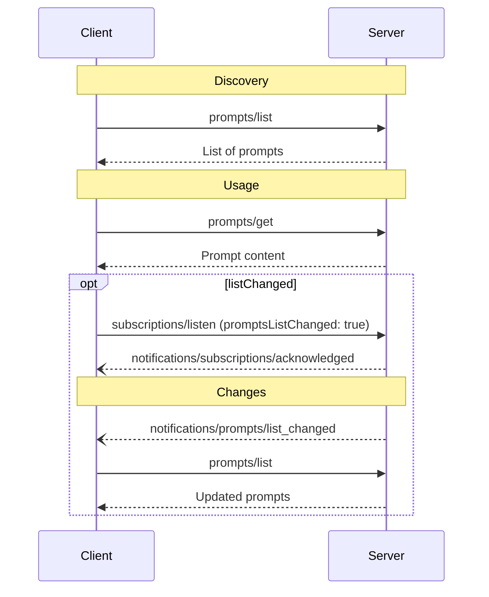

<div id="enable-section-numbers" />

模型上下文协议（MCP）为服务端向客户端暴露提示词模板提供了一种标准化方式。提示词允许服务端提供用于与语言模型交互的结构化消息和指令。客户端可以发现可用的提示词，获取其内容，并提供参数进行自定义。

<Callout>
  为简洁起见，本页中的请求示例省略了 `_meta` 请求元数据（`io.modelcontextprotocol/protocolVersion`、`io.modelcontextprotocol/clientInfo` 和 `io.modelcontextprotocol/clientCapabilities`）。每个请求**必须**包含所需的 `_meta` 字段；参见 [`_meta`](/docs/mcp/specification/2026-07-28/basic/index#meta)。
</Callout>

## 用户交互模型

提示词被设计为**用户控制**的，即它们从服务端暴露给客户端的意图是让用户能够明确地选择使用。这指的是由谁决定何时使用提示词，而不是由谁编写其内容。提示词的内容由服务端定义。

通常，提示词通过用户界面中用户主动发起的命令来触发，这使用户能够自然地发现并调用可用的提示词。

例如，作为斜杠命令：


不过，实现者可以自由地通过任何适合自身需求的界面模式来展示提示词——协议本身并不强制规定任何特定的用户交互模型。

## 能力

支持提示词的服务端**必须**在其 [`DiscoverResult`](/docs/mcp/specification/2026-07-28/schema#discoverresult) 中声明 `prompts` 能力：

```json
{
  "capabilities": {
    "prompts": {
      "listChanged": true
    }
  }
}
```

`listChanged` 表示当可用提示词列表发生变化时，服务端是否会发送通知。

声明了 `prompts` 能力的服务端**必须**使用当前对请求客户端可用的提示词集合来响应 `prompts/list` 请求。该集合**可以**为空，并且**可以**随时间变化（参见[列表变更通知](#list-changed-notification)），但**不得**因连接不同而不同，也不得因连接上的其他请求产生的副作用而变化。该集合**可以**根据请求中提供的授权而变化——例如，仅返回调用方被授予的权限范围所允许的提示词——因为凭据是按请求输入的，而非连接状态。

## 协议消息

### 列举提示词

要获取可用的提示词，客户端会发送 `prompts/list` 请求。该操作支持[分页](/docs/mcp/specification/2026-07-28/server/utilities/pagination)和[缓存](/docs/mcp/specification/2026-07-28/server/utilities/caching)。

**请求：**

```json
{
  "jsonrpc": "2.0",
  "id": 1,
  "method": "prompts/list",
  "params": {
    "cursor": "optional-cursor-value"
  }
}
```

**响应：**

```json
{
  "jsonrpc": "2.0",
  "id": 1,
  "result": {
    "resultType": "complete",
    "prompts": [
      {
        "name": "code_review",
        "title": "Request Code Review",
        "description": "Asks the LLM to analyze code quality and suggest improvements",
        "arguments": [
          {
            "name": "code",
            "description": "The code to review",
            "required": true
          }
        ],
        "icons": [
          {
            "src": "https://example.com/review-icon.svg",
            "mimeType": "image/svg+xml",
            "sizes": ["any"]
          }
        ]
      }
    ],
    "nextCursor": "next-page-cursor",
    "ttlMs": 600000,
    "cacheScope": "public"
  }
}
```

### 获取提示词

要获取特定提示词，客户端会发送 `prompts/get` 请求。参数可以通过[补全 API](/docs/mcp/specification/2026-07-28/server/utilities/completion) 自动补全。

**请求：**

```json
{
  "jsonrpc": "2.0",
  "id": 2,
  "method": "prompts/get",
  "params": {
    "name": "code_review",
    "arguments": {
      "code": "def hello():\n    print('world')"
    }
  }
}
```

**响应：**

```json
{
  "jsonrpc": "2.0",
  "id": 2,
  "result": {
    "resultType": "complete",
    "description": "Code review prompt",
    "messages": [
      {
        "role": "user",
        "content": {
          "type": "text",
          "text": "Please review this Python code:\ndef hello():\n    print('world')"
        }
      }
    ]
  }
}
```

服务端**可以**使用 [`InputRequiredResult`](/docs/mcp/specification/2026-07-28/basic/patterns/mrtr#inputrequiredresult) 响应 `prompts/get`，以指示在解析提示词之前还需要额外的输入。这遵循[多轮往返请求](/docs/mcp/specification/2026-07-28/basic/patterns/mrtr#multi-round-trip-requests)机制。当重试请求时，客户端会在请求参数中包含 `inputResponses`，以及在服务端提供时包含 `requestState`。

### 列表变更通知

当可用提示词列表发生变化时，声明了 `listChanged` 能力的服务端**应当**向已打开设置了 `promptsListChanged: true` 的 [`subscriptions/listen`](/docs/mcp/specification/2026-07-28/basic/patterns/subscriptions) 流的客户端发送通知：

```json
{
  "jsonrpc": "2.0",
  "method": "notifications/prompts/list_changed"
}
```

## 消息流程



## 数据类型

### Prompt

提示词定义包含：

- `name`：提示词的唯一标识符
- `title`：可选的、供展示用的人类可读提示词名称。
- `description`：可选的人类可读描述
- `icons`：可选的、用于在用户界面中展示的图标数组
- `arguments`：可选的、用于自定义的参数列表

### PromptMessage

提示词中的消息可包含：

- `role`：取值 "user" 或 "assistant"，用于指示说话者
- `content`：以下内容类型之一：

<Callout>
  提示词消息中的所有内容类型都支持可选的[批注](/docs/mcp/specification/2026-07-28/server/resources#annotations)，用于提供关于受众、优先级和修改时间的元数据。
</Callout>

#### 文本内容

文本内容表示纯文本消息：

```json
{
  "type": "text",
  "text": "The text content of the message"
}
```

这是自然语言交互中最常用的内容类型。

#### 图像内容

图像内容允许在消息中包含视觉信息：

```json
{
  "type": "image",
  "data": "base64-encoded-image-data",
  "mimeType": "image/png"
}
```

图像数据**必须**进行 base64 编码并包含有效的 MIME 类型。这支持视觉上下文重要的多模态交互。

#### 音频内容

音频内容允许在消息中包含音频信息：

```json
{
  "type": "audio",
  "data": "base64-encoded-audio-data",
  "mimeType": "audio/wav"
}
```

音频数据必须进行 base64 编码并包含有效的 MIME 类型。这支持音频上下文重要的多模态交互。

#### 资源链接

提示词消息**可以**包含指向[资源](/docs/mcp/specification/2026-07-28/server/resources)的链接，以在不直接嵌入资源内容的情况下提供额外的上下文或数据。在这种情况下，提示词消息会返回一个可由客户端获取的 URI：

```json
{
  "type": "resource_link",
  "uri": "file:///project/src/main.rs",
  "name": "main.rs",
  "description": "Primary application entry point",
  "mimeType": "text/x-rust"
}
```

资源链接与常规资源一样支持相同的[资源批注](/docs/mcp/specification/2026-07-28/server/resources#annotations)，以帮助客户端理解如何使用它们。

#### 内嵌资源

内嵌资源允许在消息中直接引用服务端资源：

```json
{
  "type": "resource",
  "resource": {
    "uri": "resource://example",
    "mimeType": "text/plain",
    "text": "Resource content"
  }
}
```

资源可以包含文本或二进制（blob）数据，并且**必须**包含：

- 有效的资源 URI
- 适当的 MIME 类型
- 文本内容或 base64 编码的 blob 数据

内嵌资源使提示词能够将服务端管理的内容（如文档、代码示例或其他参考资料）无缝地直接整合到对话流程中。

## 错误处理

服务端**应当**对常见失败情况返回标准的 JSON-RPC 错误：

- 无效的提示词名称：`-32602`（参数无效）
- 缺少必需的参数：`-32602`（参数无效）
- 内部错误：`-32603`（内部错误）

## 实现注意事项

1. 服务端**应当**在处理之前验证提示词参数
2. 客户端**应当**处理大型提示词列表的分页
3. 双方**应当**遵循能力协商

## 安全

实现**必须**仔细验证所有提示词的输入和输出，以防止注入攻击或对资源的未授权访问。