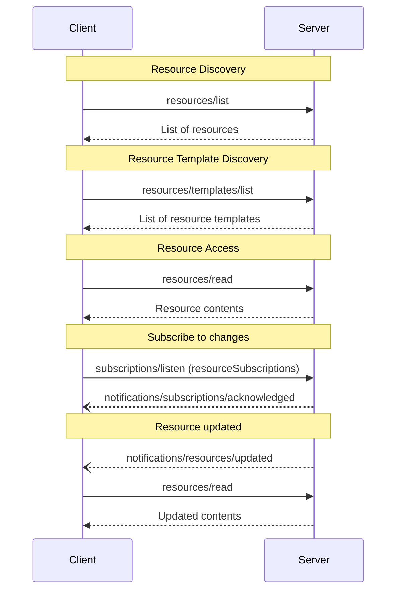

<div id="enable-section-numbers" />

模型上下文协议（MCP）为服务端向客户端暴露资源提供了一种标准化方式。资源允许服务端共享为语言模型提供上下文的数据，例如文件、数据库模式或应用特定的信息。每个资源都由 [URI](https://datatracker.ietf.org/doc/html/rfc3986) 唯一标识。

<Callout>
  为简洁起见，本页中的请求示例省略了 `_meta` 请求元数据（`io.modelcontextprotocol/protocolVersion`、`io.modelcontextprotocol/clientInfo` 和 `io.modelcontextprotocol/clientCapabilities`）。每个请求**必须**包含所需的 `_meta` 字段；参见 [`_meta`](/docs/mcp/specification/2026-07-28/basic/index#meta)。
</Callout>

## 用户交互模型

MCP 中的资源被设计为**应用驱动**的，由宿主应用根据自身需求决定如何整合上下文。

例如，应用可以：

- 通过 UI 元素以树形或列表视图展示资源，供明确选择
- 允许用户搜索和筛选可用资源
- 基于启发式规则或 AI 模型的选择，实现自动上下文包含


不过，实现可以自由地通过任何适合自身需求的界面模式来展示资源——协议本身并不强制规定任何特定的用户交互模型。

## 能力

支持资源的服务端**必须**声明 `resources` 能力：

```json
{
  "capabilities": {
    "resources": {
      "listChanged": true,
      "subscribe": true
    }
  }
}
```

该能力支持两个可选特性：

- `listChanged`：当可用资源列表发生变化时，服务端是否会发送通知。
- `subscribe`：对于通过 subscriptions/listen 使用 resourceSubscriptions 过滤器请求的资源，服务端是否支持特定于资源的更新通知。

服务端可以独立地、同时地或两者都不宣传这些特性。

既不支持 `listChanged` 也不支持 `subscribe` 的服务端可以省略它：

```json
{
  "capabilities": {
    "resources": {}
  }
}
```

声明了 `resources` 能力的服务端**必须**使用当前对请求客户端可用的资源集合来响应 `resources/list` 请求。该集合**可以**为空，并且**可以**随时间变化（参见[列表变更通知](#list-changed-notification)），但**不得**因连接不同而不同，也不得因连接上的其他请求产生的副作用而变化。该集合**可以**根据请求中提供的授权而变化——例如，仅返回调用方被授予的权限范围所允许的资源——因为凭据是按请求输入的，而非连接状态。

## 协议消息

### 列举资源

要发现可用资源，客户端会发送 `resources/list` 请求。该操作支持[分页](/docs/mcp/specification/2026-07-28/server/utilities/pagination)和[缓存](/docs/mcp/specification/2026-07-28/server/utilities/caching)。

**请求：**

```json
{
  "jsonrpc": "2.0",
  "id": 1,
  "method": "resources/list",
  "params": {
    "cursor": "optional-cursor-value"
  }
}
```

**响应：**

```json
{
  "jsonrpc": "2.0",
  "id": 1,
  "result": {
    "resultType": "complete",
    "resources": [
      {
        "uri": "file:///project/src/main.rs",
        "name": "main.rs",
        "title": "Rust Software Application Main File",
        "description": "Primary application entry point",
        "mimeType": "text/x-rust",
        "icons": [
          {
            "src": "https://example.com/rust-file-icon.png",
            "mimeType": "image/png",
            "sizes": ["48x48"]
          }
        ]
      }
    ],
    "nextCursor": "next-page-cursor",
    "ttlMs": 300000,
    "cacheScope": "public"
  }
}
```

### 读取资源

要获取资源内容，客户端会发送 `resources/read` 请求。该操作支持[缓存](/docs/mcp/specification/2026-07-28/server/utilities/caching)。

**请求：**

```json
{
  "jsonrpc": "2.0",
  "id": 2,
  "method": "resources/read",
  "params": {
    "uri": "file:///project/src/main.rs"
  }
}
```

**响应：**

```json
{
  "jsonrpc": "2.0",
  "id": 2,
  "result": {
    "resultType": "complete",
    "contents": [
      {
        "uri": "file:///project/src/main.rs",
        "mimeType": "text/x-rust",
        "text": "fn main() {\n    println!(\"Hello world!\");\n}"
      }
    ],
    "ttlMs": 60000,
    "cacheScope": "private"
  }
}
```

服务端**可以**在响应单个 `resources/read` 请求时返回多个资源内容。例如，当读取目录资源时，服务端可以返回多个文件的内容。

服务端**可以**使用 [`InputRequiredResult`](/docs/mcp/specification/2026-07-28/basic/patterns/mrtr#inputrequiredresult) 响应 `resources/read`，以指示在读取资源之前还需要额外的输入。这遵循[多轮往返请求](/docs/mcp/specification/2026-07-28/basic/patterns/mrtr#multi-round-trip-requests)机制。当重试请求时，客户端会在请求参数中包含 `inputResponses`，以及在服务端提供时包含 `requestState`。

或者，如果 `uri` 的方案是 `https://`，客户端可以直接从网络上获取该资源。更多信息请参阅[常见 URI 方案章节](#https%3A%2F%2F)。

### 资源模板

资源模板允许服务端使用 [URI 模板](https://datatracker.ietf.org/doc/html/rfc6570) 暴露带参数的资源。参数可以通过[补全 API](/docs/mcp/specification/2026-07-28/server/utilities/completion) 自动补全。该操作支持[分页](/docs/mcp/specification/2026-07-28/server/utilities/pagination)和[缓存](/docs/mcp/specification/2026-07-28/server/utilities/caching)。

**请求：**

```json
{
  "jsonrpc": "2.0",
  "id": 3,
  "method": "resources/templates/list",
  "params": {
    "cursor": "optional-cursor-value"
  }
}
```

**响应：**

```json
{
  "jsonrpc": "2.0",
  "id": 3,
  "result": {
    "resultType": "complete",
    "resourceTemplates": [
      {
        "uriTemplate": "file:///{path}",
        "name": "Project Files",
        "title": "📁 Project Files",
        "description": "Access files in the project directory",
        "mimeType": "application/octet-stream",
        "icons": [
          {
            "src": "https://example.com/folder-icon.png",
            "mimeType": "image/png",
            "sizes": ["48x48"]
          }
        ]
      }
    ],
    "nextCursor": "next-page-cursor",
    "ttlMs": 300000,
    "cacheScope": "public"
  }
}
```

### 列表变更通知

当可用资源列表发生变化时，声明了 `listChanged` 能力的服务端**应当**发送通知：

```json
{
  "jsonrpc": "2.0",
  "method": "notifications/resources/list_changed"
}
```

### 订阅

客户端通过发送在 `notifications.resourceSubscriptions` 中列出资源 URI 的 [`subscriptions/listen`][subscriptions-listen] 请求，来订阅特定资源的变更通知。每当被监听的资源发生变化时，服务端都会在生成的流上发送 `notifications/resources/updated`。

```json
{
  "jsonrpc": "2.0",
  "method": "notifications/resources/updated",
  "params": {
    "_meta": { "io.modelcontextprotocol/subscriptionId": 4 },
    "uri": "file:///project/src/main.rs"
  }
}
```

完整的协议机制（确认、`subscriptionId` 关联和取消）参见[订阅][subscriptions]。

[subscriptions-listen]: /specification/2026-07-28/schema#subscriptionslistenrequest
[subscriptions]: /specification/2026-07-28/basic/patterns/subscriptions

## 消息流程



## 数据类型

### Resource

资源定义包含：

- `uri`：资源的唯一标识符
- `name`：资源的名称。
- `title`：可选的、供展示用的人类可读资源名称。
- `description`：可选的描述
- `icons`：可选的、用于在用户界面中展示的图标数组
- `mimeType`：可选的 MIME 类型
- `size`：可选的以字节为单位的体积

### 资源内容

资源可以包含文本或二进制数据：

#### 文本内容

```json
{
  "uri": "file:///example.txt",
  "mimeType": "text/plain",
  "text": "Resource content"
}
```

#### 二进制内容

```json
{
  "uri": "file:///example.png",
  "mimeType": "image/png",
  "blob": "base64-encoded-data"
}
```

### 批注

资源、资源模板和内容块支持可选的批注，用于向客户端提供关于如何使用或展示资源的提示：

- **`audience`**：一个数组，指示此资源的目标受众。有效值为 `"user"` 和 `"assistant"`。例如，`["user", "assistant"]` 表示对两者都有用的内容。
- **`priority`**：一个 0.0 到 1.0 之间的数字，指示此资源的重要性。值为 1 表示"最重要"（实际上是必需的），而 0 表示"最不重要"（完全可选）。
- **`lastModified`**：一个 ISO 8601 格式的时间戳，指示资源的最后修改时间（例如，`"2025-01-12T15:00:58Z"`）。

带批注的资源示例：

```json
{
  "uri": "file:///project/README.md",
  "name": "README.md",
  "title": "Project Documentation",
  "mimeType": "text/markdown",
  "annotations": {
    "audience": ["user"],
    "priority": 0.8,
    "lastModified": "2025-01-12T15:00:58Z"
  }
}
```

客户端可以使用这些批注来：

- 根据目标受众筛选资源
- 确定在上下文中优先包含哪些资源
- 展示修改时间或按最近时间排序

## 常见 URI 方案

协议定义了几种标准的 URI 方案。此列表并非详尽无遗——实现始终可以自由使用额外的自定义 URI 方案。

### https://

用于表示网络上可用的资源。

只有当客户端能够自行直接从网络获取并加载资源时——也就是说，客户端不需要通过 MCP 服务端读取该资源——服务端**应当**才使用此方案。

对于其他用例，服务端**应当**优先使用其他 URI 方案，或定义自定义方案，即使服务端本身将通过互联网下载资源内容。

### file://

用于标识行为类似文件系统的资源。不过，这些资源不需要映射到实际的物理文件系统。

MCP 服务端**可以**使用 [XDG MIME 类型](https://specifications.freedesktop.org/shared-mime-info-spec/0.14/ar01s02.html#id-1.3.14)（如 `inode/directory`）标识 file:// 资源，以表示那些原本没有标准 MIME 类型的非常规文件（例如目录）。

### git://

Git 版本控制集成。

### 自定义 URI 方案

自定义 URI 方案**必须**遵循 [RFC3986](https://datatracker.ietf.org/doc/html/rfc3986)，并考虑上述指导说明。

## 错误处理

如果所请求的资源不存在，服务端**必须**返回代码为 `-32602`（参数无效）的 JSON-RPC 错误。对于内部错误，服务端**应当**返回 `-32603`。

为了向后兼容，客户端**应当**也将 `-32002` 视为资源未找到错误，因为早期协议版本使用了这个代码。

对于不存在的资源，服务端**不得**返回空的 `contents` 数组。空数组是含糊的——它可能表示资源存在但没有内容，或者表示资源根本不存在。

错误示例：

```json
{
  "jsonrpc": "2.0",
  "id": 5,
  "error": {
    "code": -32602,
    "message": "Resource not found",
    "data": {
      "uri": "file:///nonexistent.txt"
    }
  }
}
```

## 安全注意事项

1. 服务端**必须**验证所有资源 URI
2. 对敏感资源**应当**实施访问控制
3. 二进制数据**必须**进行正确的编码
4. 在执行操作之前**应当**检查资源权限
5. 在提供 `file://` 资源时，服务端**必须**清理文件路径以防止目录遍历攻击