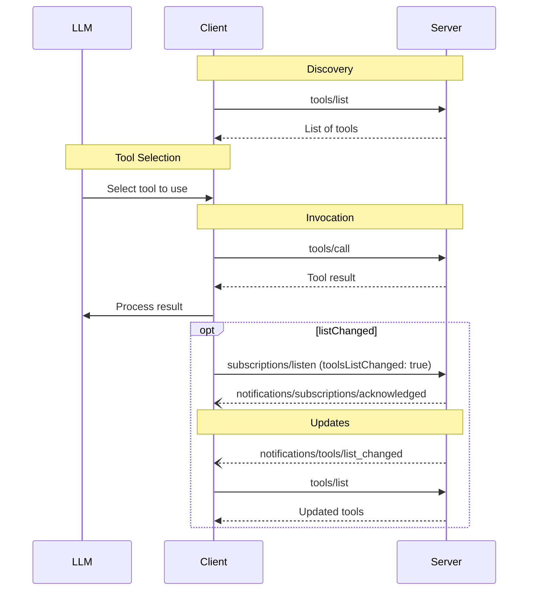

<div id="enable-section-numbers" />

模型上下文协议（MCP）允许服务端暴露可由语言模型调用的工具。工具使模型能够与外部系统交互，例如查询数据库、调用 API 或执行计算。每个工具都由名称唯一标识，并包含描述其模式（schema）的元数据。

<Callout>
  为简洁起见，本页中的请求示例省略了 `_meta` 请求元数据（`io.modelcontextprotocol/protocolVersion`、`io.modelcontextprotocol/clientInfo` 和 `io.modelcontextprotocol/clientCapabilities`）。每个请求**必须**包含所需的 `_meta` 字段；参见 [`_meta`](/docs/mcp/specification/2026-07-28/basic/index#meta)。
</Callout>

## 用户交互模型

MCP 中的工具被设计为**模型控制**的，也就是说，语言模型可以基于其上下文理解以及用户的提示词来自动发现和调用工具。

不过，实现可以自由地通过任何适合自身需求的界面模式来展示工具——协议本身并不强制规定任何特定的用户交互模型。

<Callout type="warn">

出于信任、安全和保障的考虑，**应当**始终保持人工介入，使其具备拒绝工具调用的能力。

应用**应当**：

- 提供 UI，明确展示正在向 AI 模型暴露哪些工具
- 在工具被调用时插入清晰的视觉指示
- 向用户呈现操作确认提示，以确保有人工介入

</Callout>

## 能力

支持工具的服务端**必须**声明 `tools` 能力：

```json
{
  "capabilities": {
    "tools": {
      "listChanged": true
    }
  }
}
```

`listChanged` 表示当可用工具列表发生变化时，服务端是否会发送通知。

声明了 `tools` 能力的服务端**必须**使用当前对请求客户端可用的工具集合来响应 `tools/list` 请求。该集合**可以**为空，并且**可以**随时间变化（参见[列表变更通知](#list-changed-notification)），但**不得**因连接不同而不同，也不得因连接上的其他请求产生的副作用而变化。该集合**可以**根据请求中提供的授权而变化——例如，仅返回调用方被授予的权限范围所允许的工具——因为凭据是按请求输入的，而非连接状态。

服务端**应当**以确定性顺序返回工具（即当底层工具集合未变化时，各请求返回的顺序相同）。确定性排序使客户端能够可靠地缓存工具列表，并在工具被包含到模型上下文中时提高 LLM 提示缓存命中率。

## 协议消息

### 列举工具

要发现可用工具，客户端会发送 `tools/list` 请求。该操作支持[分页](/docs/mcp/specification/2026-07-28/server/utilities/pagination)和[缓存](/docs/mcp/specification/2026-07-28/server/utilities/caching)。

**请求：**

```json
{
  "jsonrpc": "2.0",
  "id": 1,
  "method": "tools/list",
  "params": {
    "cursor": "optional-cursor-value"
  }
}
```

**响应：**

```json
{
  "jsonrpc": "2.0",
  "id": 1,
  "result": {
    "resultType": "complete",
    "tools": [
      {
        "name": "get_weather",
        "title": "Weather Information Provider",
        "description": "Get current weather information for a location",
        "inputSchema": {
          "type": "object",
          "properties": {
            "location": {
              "type": "string",
              "description": "City name or zip code"
            }
          },
          "required": ["location"]
        },
        "icons": [
          {
            "src": "https://example.com/weather-icon.png",
            "mimeType": "image/png",
            "sizes": ["48x48"]
          }
        ]
      }
    ],
    "nextCursor": "next-page-cursor",
    "ttlMs": 300000,
    "cacheScope": "public"
  }
}
```

### 调用工具

要调用工具，客户端会发送 `tools/call` 请求：

**请求：**

```json
{
  "jsonrpc": "2.0",
  "id": 2,
  "method": "tools/call",
  "params": {
    "name": "get_weather",
    "arguments": {
      "location": "New York"
    }
  }
}
```

**响应：**

```json
{
  "jsonrpc": "2.0",
  "id": 2,
  "result": {
    "resultType": "complete",
    "content": [
      {
        "type": "text",
        "text": "Current weather in New York:\nTemperature: 72°F\nConditions: Partly cloudy"
      }
    ],
    "isError": false
  }
}
```

### 需要输入的工具结果

服务端**可以**使用 [`InputRequiredResult`](/docs/mcp/specification/2026-07-28/basic/patterns/mrtr#inputrequiredresult) 响应 `tools/call`，以指示在完成工具调用之前还需要额外的输入。这遵循[多轮往返请求](/docs/mcp/specification/2026-07-28/basic/patterns/mrtr#multi-round-trip-requests)机制。

当携带输入响应重试请求时，客户端会在请求参数中包含 `inputResponses`，以及在服务端提供时包含 `requestState`：

**需要输入的响应：**

```json
{
  "jsonrpc": "2.0",
  "id": 2,
  "result": {
    "resultType": "input_required",
    "inputRequests": {
      "github_login": {
        "method": "elicitation/create",
        "params": {
          "mode": "form",
          "message": "Please provide your GitHub username",
          "requestedSchema": {
            "type": "object",
            "properties": {
              "name": { "type": "string" }
            },
            "required": ["name"]
          }
        }
      }
    },
    "requestState": "eyJsb2NhdGlvbiI6Ik5ldyBZb3JrIn0..."
  }
}
```

**携带输入响应重试：**

```json
{
  "jsonrpc": "2.0",
  "id": 3,
  "method": "tools/call",
  "params": {
    "name": "get_weather",
    "arguments": {
      "location": "New York"
    },
    "inputResponses": {
      "github_login": {
        "action": "accept",
        "content": {
          "name": "octocat"
        }
      }
    },
    "requestState": "eyJsb2NhdGlvbiI6Ik5ldyBZb3JrIn0..."
  }
}
```

请注意，初始请求和重试请求之间的 JSON-RPC `id`**必须**不同。

### 列表变更通知

当可用工具列表发生变化时，声明了 `listChanged` 能力的服务端**应当**向已打开设置了 `toolsListChanged: true` 的 [`subscriptions/listen`](/docs/mcp/specification/2026-07-28/basic/patterns/subscriptions) 流的客户端发送通知：

```json
{
  "jsonrpc": "2.0",
  "method": "notifications/tools/list_changed"
}
```

## 消息流程



## 数据类型

### Tool

工具定义包含：

- `name`：工具的唯一标识符
- `title`：可选的、供展示用的人类可读工具名称。
- `description`：人类可读的功能描述
- `icons`：可选的、用于在用户界面中展示的图标数组
- `inputSchema`：定义预期参数的 JSON Schema
  - 遵循 [JSON Schema 使用指南](/docs/mcp/specification/2026-07-28/basic#json-schema-usage)
  - 如果未提供 `$schema` 字段，则默认为 2020-12
  - **必须**是有效的 JSON Schema 对象（不能为 `null`）
  - 对于没有参数的工具，使用以下有效方式之一：
    - `{ "type": "object", "additionalProperties": false }` - **推荐**：明确只接受空对象
    - `{ "type": "object" }` - 接受任何对象（包括带属性的对象）
  - 属性**可以**包含 [`x-mcp-header`](#x-mcp-header) 批注，以将参数值作为 HTTP 请求头暴露
- `outputSchema`：可选的、定义预期输出结构的 JSON Schema
  - 遵循 [JSON Schema 使用指南](/docs/mcp/specification/2026-07-28/basic#json-schema-usage)
  - 如果未提供 `$schema` 字段，则默认为 2020-12
- `annotations`：可选的、描述工具行为的属性

<Callout type="warn">
  出于信任、安全和保障的考虑，客户端**必须**将工具批注视为不可信数据，除非它们来自可信的服务端。
</Callout>

#### 工具名称

- 工具名称的长度**应当**在 1 到 128 个字符之间（含两端）。
- 工具名称**应当**被视为区分大小写的。
- 以下**应当**是仅允许的字符：大写和小写 ASCII 字母（A-Z、a-z）、数字（0-9）、下划线（\_）、连字符（-）和点（.）
- 工具名称**不得**包含空格、逗号或其他特殊字符。
- 工具名称**应当**在单个服务端内唯一。
- 有效工具名称示例：
  - `getUser`
  - `DATA_EXPORT_v2`
  - `admin.tools.list`

<Callout>

工具名称的唯一性仅局限于单个服务端。从多个服务端聚合工具的客户端或代理**可以**会遭遇命名冲突（例如，两个服务端各自暴露一个 `search` 工具），并且**应当**实现一种消歧策略，例如在工具名称前加上服务端标识符作为前缀。

服务端的 `name`（来自 `serverInfo`）不保证在服务端之间唯一，因此**不得**依赖它来进行消歧。

</Callout>

#### x-mcp-header

`x-mcp-header` 扩展属性允许服务端在使用[流式 HTTP 传输](/docs/mcp/specification/2026-07-28/basic/transports/streamable-http#custom-headers-from-tool-parameters)时，将特定的工具参数镜像到 HTTP 请求头中。这使网络中间件（负载均衡器、代理、WAF）能够在不解析请求体的情况下，根据参数值路由和处理请求。

`x-mcp-header` 属性直接放置在要被镜像的属性的 JSON Schema 中。其值指定生成的 `Mcp-Param-{name}` HTTP 请求头的名称部分。

**对 `x-mcp-header` 值的约束：**

- **不得**为空
- **必须**符合 HTTP 字段名 token 语法（`1*tchar`，[RFC 9110 第 5.1 节](https://datatracker.ietf.org/doc/html/rfc9110#section-5.1)）
- **不得**包含控制字符，包括回车符（CR，`\r`）或换行符（LF，`\n`）
- **必须**在 `inputSchema` 中的所有 `x-mcp-header` 值之间不区分大小写地保持唯一
- **必须**仅应用于基本类型（integer、string、boolean）的参数。不允许使用类型为 `number` 的参数。整数值**必须**在使用 IEEE754 双精度浮点数表示的整数的安全范围内（−2<sup>53</sup>+1 至 2<sup>53</sup>−1）
- **必须**仅应用于从模式根节点_静态可达_的属性，如[工具参数中的自定义请求头](/docs/mcp/specification/2026-07-28/basic/transports/streamable-http#custom-headers-from-tool-parameters)所定义，该部分还定义了如何从调用参数中提取请求头值

使用流式 HTTP 传输的客户端**必须**拒绝任何 `x-mcp-header` 值违反这些约束的工具定义。拒绝意味着客户端**必须**将无效的工具从 `tools/list` 的结果中排除。客户端在拒绝工具定义时**应当**记录一条警告，包括工具名称和被拒绝的原因。这确保单个格式错误的工具定义不会阻止其他有效工具被使用。使用其他传输（例如 stdio）的客户端**可以**完全忽略 `x-mcp-header` 批注。

**带 `x-mcp-header` 的工具定义示例：**

```json
{
  "name": "execute_sql",
  "description": "Execute SQL on Google Cloud Spanner",
  "inputSchema": {
    "type": "object",
    "properties": {
      "region": {
        "type": "string",
        "description": "The region to execute the query in",
        "x-mcp-header": "Region"
      },
      "query": {
        "type": "string",
        "description": "The SQL query to execute"
      }
    },
    "required": ["region", "query"]
  }
}
```

在此示例中，当工具以 `"region": "us-west1"` 被调用时，客户端会将请求头 `Mcp-Param-Region: us-west1` 添加到 HTTP 请求中。

<Callout type="warn">

服务端开发者**不得**使用 `x-mcp-header` 标记敏感参数（密码、API 密钥、token、PII），因为请求头值对网络中间件可见。

</Callout>

### 工具结果

工具结果可以包含[**结构化**](#structured-content)或**非结构化**内容。

**非结构化**内容在结果的 `content` 字段中返回，并且可以包含多个不同类型的内容项：

<Callout>
  所有内容类型（文本、图像、音频、资源链接和内嵌资源）都支持可选的[批注](/docs/mcp/specification/2026-07-28/server/resources#annotations)，用于提供关于受众、优先级和修改时间的元数据。这与资源和提示词使用的批注格式相同。
</Callout>

#### 文本内容

```json
{
  "type": "text",
  "text": "Tool result text"
}
```

#### 图像内容

```json
{
  "type": "image",
  "data": "base64-encoded-data",
  "mimeType": "image/png",
  "annotations": {
    "audience": ["user"],
    "priority": 0.9
  }
}
```

#### 音频内容

```json
{
  "type": "audio",
  "data": "base64-encoded-audio-data",
  "mimeType": "audio/wav"
}
```

#### 资源链接

工具**可以**返回指向[资源](/docs/mcp/specification/2026-07-28/server/resources)的链接，以提供额外的上下文或数据。在这种情况下，工具会返回一个客户端可以订阅或获取的 URI：

```json
{
  "type": "resource_link",
  "uri": "file:///project/src/main.rs",
  "name": "main.rs",
  "description": "Primary application entry point",
  "mimeType": "text/x-rust"
}
```

资源链接与常规资源一样支持相同的[资源批注](/docs/mcp/specification/2026-07-28/server/resources#annotations)，以帮助客户端理解如何使用它们。

<Callout>
  工具返回的资源链接不保证会出现在 `resources/list` 请求的结果中。
</Callout>

#### 内嵌资源

[资源](/docs/mcp/specification/2026-07-28/server/resources)**可以**使用合适的 [URI 方案](./resources#common-uri-schemes)进行内嵌，以提供额外的上下文或数据。使用内嵌资源的服务端**应当**实现 `resources` 能力：

```json
{
  "type": "resource",
  "resource": {
    "uri": "file:///project/src/main.rs",
    "mimeType": "text/x-rust",
    "text": "fn main() {\n    println!(\"Hello world!\");\n}",
    "annotations": {
      "audience": ["user", "assistant"],
      "priority": 0.7,
      "lastModified": "2025-05-03T14:30:00Z"
    }
  }
}
```

内嵌资源与常规资源一样支持相同的[资源批注](/docs/mcp/specification/2026-07-28/server/resources#annotations)，以帮助客户端理解如何使用它们。

#### 结构化内容

**结构化**内容作为 JSON 值在结果的 `structuredContent` 字段中返回。这可以是符合工具 `outputSchema`（如果定义了的话）的任何 JSON 值（对象、数组、字符串、数字、布尔值或 null）。

为了向后兼容，返回结构化内容的工具**应当**同时在 TextContent 块中返回序列化的 JSON。

<Callout>

`structuredContent` 是服务端生成的结果数据，与 LLM 的"结构化输出"（受模式约束的模型生成）无关。

</Callout>

#### 输出模式

工具还可以提供输出模式以验证结构化结果。如果提供了输出模式：

- 服务端**必须**提供符合此模式的结构化结果。
- 客户端**应当**根据此模式验证结构化结果。

带输出模式的工具示例：

```json
{
  "name": "get_weather_data",
  "title": "Weather Data Retriever",
  "description": "Get current weather data for a location",
  "inputSchema": {
    "type": "object",
    "properties": {
      "location": {
        "type": "string",
        "description": "City name or zip code"
      }
    },
    "required": ["location"]
  },
  "outputSchema": {
    "type": "object",
    "properties": {
      "temperature": {
        "type": "number",
        "description": "Temperature in celsius"
      },
      "conditions": {
        "type": "string",
        "description": "Weather conditions description"
      },
      "humidity": {
        "type": "number",
        "description": "Humidity percentage"
      }
    },
    "required": ["temperature", "conditions", "humidity"]
  }
}
```

此工具的有效响应示例：

```json
{
  "jsonrpc": "2.0",
  "id": 5,
  "result": {
    "resultType": "complete",
    "content": [
      {
        "type": "text",
        "text": "{\"temperature\": 22.5, \"conditions\": \"Partly cloudy\", \"humidity\": 65}"
      }
    ],
    "structuredContent": {
      "temperature": 22.5,
      "conditions": "Partly cloudy",
      "humidity": 65
    }
  }
}
```

带数组输出模式的工具示例：

```json
{
  "name": "list_users",
  "title": "User List",
  "description": "Returns a list of all users",
  "inputSchema": {
    "type": "object",
    "properties": {}
  },
  "outputSchema": {
    "type": "array",
    "items": {
      "type": "object",
      "properties": {
        "id": { "type": "string" },
        "name": { "type": "string" },
        "email": { "type": "string" }
      },
      "required": ["id", "name", "email"]
    }
  }
}
```

带数组输出的工具的有效响应示例：

```json
{
  "jsonrpc": "2.0",
  "id": 6,
  "result": {
    "resultType": "complete",
    "content": [
      {
        "type": "text",
        "text": "Found 2 users: Alice (alice@example.com) and Bob (bob@example.com)."
      }
    ],
    "structuredContent": [
      { "id": "1", "name": "Alice", "email": "alice@example.com" },
      { "id": "2", "name": "Bob", "email": "bob@example.com" }
    ]
  }
}
```

提供输出模式可帮助客户端和 LLM 以如下方式理解和正确处理结构化工具输出：

- 支持对响应进行严格的模式验证
- 提供类型信息，以便更好地与编程语言集成
- 指导客户端和 LLM 正确解析和利用返回的数据
- 支持更好的文档和开发者体验

### 模式示例

#### 使用默认 2020-12 模式的工具：

```json
{
  "name": "calculate_sum",
  "description": "Add two numbers",
  "inputSchema": {
    "type": "object",
    "properties": {
      "a": { "type": "number" },
      "b": { "type": "number" }
    },
    "required": ["a", "b"]
  }
}
```

#### 使用显式 draft-07 模式的工具：

```json
{
  "name": "calculate_sum",
  "description": "Add two numbers",
  "inputSchema": {
    "$schema": "http://json-schema.org/draft-07/schema#",
    "type": "object",
    "properties": {
      "a": { "type": "number" },
      "b": { "type": "number" }
    },
    "required": ["a", "b"]
  }
}
```

#### 没有参数的工具：

```json
{
  "name": "get_current_time",
  "description": "Returns the current server time",
  "inputSchema": {
    "type": "object",
    "additionalProperties": false
  }
}
```

## 有状态工具

<Callout>

本节是针对工具设计的非规范性指导。协议没有状态句柄的概念；从线路（wire）的角度来看，句柄只是工具结果中的一个普通字符串，以及后续工具调用中的一个普通参数。

</Callout>

MCP 没有协议级的会话，因此服务端无法依赖隐式的逐连接状态将一个工具调用与下一个工具调用关联起来。需要在多次调用之间维持状态的服务端——如购物车、打开的浏览器上下文、数据库事务——应当通过从创建工具返回显式句柄，并在后续调用中接受该句柄作为参数来实现。

例如，管理购物车的服务端可以暴露：

```jsonc
// → tools/call
{ "name": "create_basket", "arguments": {} }

// ← result
{
  "content": [{ "type": "text", "text": "Created basket bsk_a1b2c3" }],
  "structuredContent": { "basket_id": "bsk_a1b2c3" }
}

// → tools/call
{
  "name": "add_item",
  "arguments": { "basket_id": "bsk_a1b2c3", "sku": "..." }
}
```

模型负责将 `basket_id` 带到后续调用中；服务端在该键下存储购物车内容，并在每次调用时查找。

在设计句柄时，服务端应考虑：

- **授权（Authorization）。**对于已认证的服务端，句柄是一个名称，而不是一种能力。服务端应在每次调用时根据句柄验证调用方的授权。对于未认证的服务端，句柄必然是持有者（bearer）token，应使用足够的熵生成（例如 UUIDv4），并赋予有边界的使用期限。
- **不透明性（Opacity）。**编码了内部结构的句柄会招致解析或猜测；不透明的标识符则不会。
- **使用期限（Lifetime）。**由于句柄的生命周期超过任何单个连接，服务端的保留策略应在创建工具的描述中说明（例如，"购物车在 24 小时无活动后过期"），以便模型在决定创建状态时能看到。
- **过期错误（Expiry errors）。**对已过期或未知句柄的调用应返回说明情况的工具执行错误，以便模型通过创建新句柄来恢复。

## 错误处理

工具使用两种错误报告机制：

1. **协议错误**表示请求结构本身存在问题，这类问题模型不太可能自行修复：
   - 未知的工具
   - 格式错误的请求（不满足 [CallToolRequest 模式](/docs/mcp/specification/2026-07-28/schema#calltoolrequest)的请求）
   - 服务端错误

   它们以标准 JSON-RPC 错误的形式返回：

   ```json
   {
     "jsonrpc": "2.0",
     "id": 3,
     "error": {
       "code": -32602,
       "message": "Unknown tool: invalid_tool_name"
     }
   }
   ```

2. **工具执行错误**包含可操作的反馈，语言模型可以利用这些反馈自我纠正，并以调整后的参数重试：
   - API 故障
   - 输入验证错误（例如，日期格式错误、数值超出范围）
   - 业务逻辑错误

   它们在工具结果中以 `isError: true` 报告：

   ```json
   {
     "jsonrpc": "2.0",
     "id": 4,
     "result": {
       "resultType": "complete",
       "content": [
         {
           "type": "text",
           "text": "Invalid departure date: must be in the future. Current date is 08/08/2025."
         }
       ],
       "isError": true
     }
   }
   ```

客户端**可以**将协议错误提供给语言模型，尽管这些错误不太可能带来成功的恢复。客户端**应当**将工具执行错误提供给语言模型，以实现自我纠正。

## 安全注意事项

1. 服务端**必须**：
   - 验证所有工具输入
   - 实施适当的访问控制
   - 对工具调用进行速率限制
   - 清理工具输出

2. 客户端**应当**：
   - 对敏感操作请求用户确认
   - 在调用服务端之前向用户展示工具输入，以避免恶意或意外的数据泄露
   - 在将工具结果传递给 LLM 之前进行验证
   - 在根据 `inputSchema` 和 `outputSchema` 验证工具输入和输出时，遵循 [`$ref` 解析要求](/docs/mcp/specification/2026-07-28/basic/index#ref-resolution)
   - 为工具调用实现超时机制
   - 记录工具使用情况以供审计