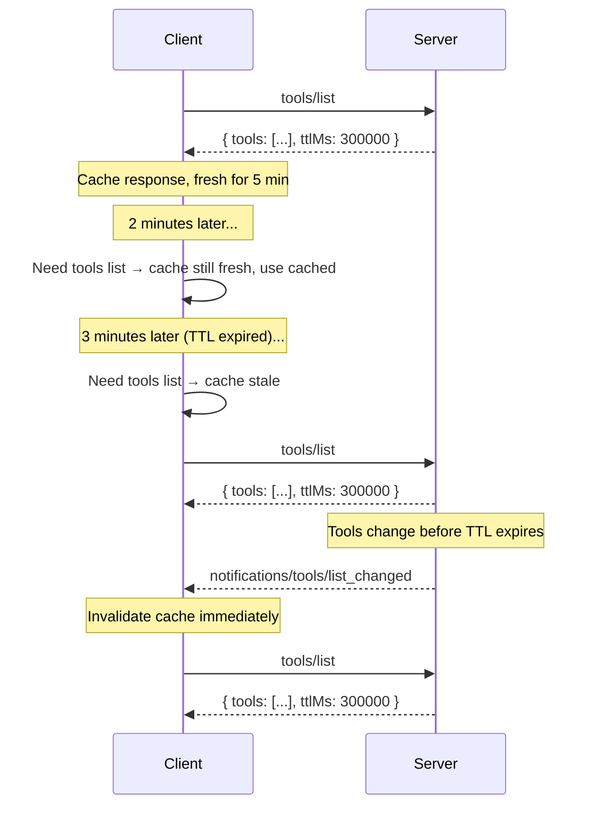

<div id="enable-section-numbers" />

模型上下文协议（MCP）支持对部分结果进行缓存。这使客户端能够缓存响应并减少不必要的重复获取。缓存与[变更通知](#interaction-with-notifications)是互补的——两种机制可以共存。

## 可缓存的结果

对于以下操作返回的 `resultType: "complete"` 结果，服务端必须包含缓存提示：

- `server/discover`
- `tools/list`
- `prompts/list`
- `resources/list`
- `resources/templates/list`
- `resources/read`

带 `resultType: "input_required"` 的中间结果（参见[多轮往返请求](/docs/mcp/specification/2026-07-28/basic/patterns/mrtr)）不可缓存，也不携带缓存提示。

## 缓存键

缓存响应由请求方法以及影响结果的请求参数标识（例如，`resources/read` 的 `uri`，或分页列表请求的 `cursor`）。对于方法或参数与产生该缓存响应的请求不同的请求，客户端**不得**提供该缓存响应。

通过[多轮往返请求](/docs/mcp/specification/2026-07-28/basic/patterns/mrtr)机制重试请求所产生的结果——即携带 `inputResponses` 或 `requestState` 的请求——**不得**被缓存，因为它们依赖于不属于缓存键的输入。

## 可缓存模型

MCP 中的可缓存结果使用两个字段向客户端提供缓存提示：

- <b>生存时间（TTL）字段</b>，`ttlMs` 是一个以毫秒为单位的整数值，指定客户端在多大时间内可以将结果视为新鲜的。
- <b>缓存范围字段</b>，`cacheScope` 指示缓存响应的预期范围，取值为 `"public"` 或 `"private"`。

### 生存时间（TTL）字段

`ttlMs` 字段是来自服务端的提示，指示客户端在多大时间内（以毫秒为单位）可以将结果视为新鲜的。其语义与 HTTP 的 `Cache-Control: max-age` 类似。

- 如果 `ttlMs` 为 `0`，则响应**应当**被视为立即失效。客户端可以在每次需要结果时重新获取。
- 如果 `ttlMs` 为正数，客户端**应当**在收到响应后的该时间段内将结果视为新鲜的。
- 如果未提供 `ttlMs`，客户端**应当**假定默认值为 `0`（立即失效），并依赖自身的缓存启发式规则或通知。这种情况只应出现在较旧版本的服务端中。
- 如果 `ttlMs` 为负数，客户端**应当**忽略它并将其视为 `0`。

服务端**必须**提供 `>= 0` 的 `ttlMs` 值。

<Callout>
  TTL 是**新鲜度提示**，而非保证。服务端可以在 TTL 到期之前更改底层数据。TTL 告诉客户端可以在合理的时间内避免重新获取数据，而不是数据保证保持不变的时间。
</Callout>

#### 新鲜度计算

客户端记录收到响应时的本地时间（`t_received`）。在以下条件下，响应被视为**新鲜的**：

```
now < t_received + ttlMs
```

一旦 TTL 到期，响应即为**失效的**，客户端**应当**在下次访问时重新获取。

客户端**不得**将 TTL 视为触发自动后台重新获取的轮询间隔。TTL 是一个新鲜度提示：客户端在需要数据时检查新鲜度，并且仅在失效时重新获取。确实选择轮询的实现**必须**采用抖动（jitter）和退避（backoff）策略。

如果客户端有理由相信数据已发生变化，则**可以**在 TTL 到期前重新获取（例如，在工具调用时收到意外错误，表明方法未找到或参数无效）。

如果重新获取期间发生错误（例如网络问题、服务端宕机），客户端**可以**提供失效的响应。

### 缓存范围字段

`cacheScope` 字段控制谁可以缓存响应，类似于 HTTP 的 `Cache-Control: public` 与 `Cache-Control: private` 之别。

| 值          | 含义                                                                                                                                                                                                                                                                              |
| ----------- | --------------------------------------------------------------------------------------------------------------------------------------------------------------------------------------------------------------------------------------------------------------------------------- |
| `"public"`  | 响应不包含用户特定数据。任何客户端、共享网关或缓存代理**可以**存储缓存响应并向任何用户提供。                                                                                                                                                                                   |
| `"private"` | 响应包含不应在调用方之间共享的私有数据。缓存响应**可以**在同一授权上下文中重用。缓存**不得**跨授权上下文共享（例如，不同的访问令牌需要不同的缓存）。                                                                                                                        |

#### 选择缓存范围

- **`"public"`** 适用于对所有用户都相同的工具、提示词和资源模板列表。
- **`"private"`** 适用于依赖已认证用户的 `resources/read` 结果，或随用户而变化的筛选列表结果。

## 与通知的交互

TTL 与服务端推送的通知是互补的：

- 服务端**可以**提供 `ttlMs`，而不在其能力中声明 `listChanged: true`。在这种情况下，客户端完全依赖基于 TTL 的新鲜度。
- 服务端**可以**同时声明 `listChanged: true`**并**提供 `ttlMs`。在这种情况下，客户端可以利用 TTL 避免在通知之间进行不必要的重新获取，而通知则充当立即失效的信号。

当缓存响应仍然新鲜时收到相关通知，该通知会**使**缓存响应**失效**，其应立即被视为失效的。



## 与分页的交互

当列表结果被[分页](/docs/mcp/specification/2026-07-28/server/utilities/pagination)时，每一页都是一个可独立缓存的响应——这与 HTTP `Cache-Control` 对待分页资源的方式一致。

- 每个页面响应都携带自己的 `ttlMs` 值。每个页面的新鲜度计时从该页面被接收时开始。
- 服务端**可以**在不同页面上返回不同的 `ttlMs` 值（例如，对稳定列表的前几页给予更长的 TTL，对最后一页给予更短的 TTL）。
- 当缓存的页面到期时，客户端**应当**使用其 cursor 重新获取该页面。
- 没有跨页面的一致性保证。如果在页面获取之间底层数据发生变化，客户端可能会观察到重复或缺口。
- 需要完整列表一致快照的客户端**应当**从头重新获取（不带 cursor）。
- 如果 cursor 变得无效（例如，服务端对先前有效的 cursor 返回错误），客户端**应当**丢弃所有缓存的页面并从开头重新获取。

对于给定的列表请求，服务端**必须**对所有响应页面应用相同的 `cacheScope`。例如，如果 `tools/list` 响应的第一页具有 `cacheScope: "private"`，则该请求的所有后续页面**必须**也是 `"private"`。

## 安全注意事项

`cacheScope` 取值为 `"public"` 表示响应不包含用户特定数据，可以安全共享。服务端必须意识到，即使结果来自已认证的端点，带 `"public"` `cacheScope` 的响应也可能在调用方之间共享。例如，带 `"public"` `cacheScope` 的已认证 `tools/list` 调用结果可能会被客户端缓存，并可能在初始请求的授权上下文之外共享。（即，不同的访问令牌可以利用同一个缓存。）

服务端实现者：

- 应确保 `cacheScope` 正确反映原语的预期可见性。
- 必须实施适当的按原语访问控制，并且不得仅依赖 `cacheScope` 来防止对原语的未授权访问。