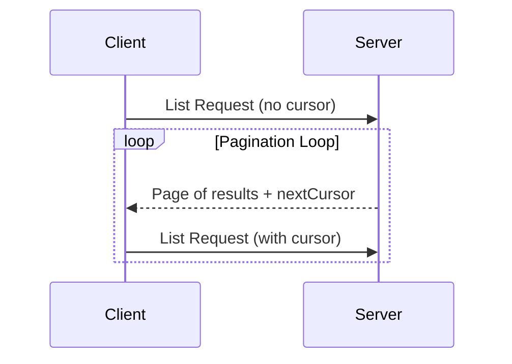

<div id="enable-section-numbers" />

模型上下文协议（MCP）支持对可能返回大量结果集的列表操作进行分页。分页允许服务端以小批量方式返回结果，而不是一次性全部返回。

在通过互联网连接外部服务时，分页尤为重要，但它对本地集成也很有用，可以避免大数据集带来的性能问题。

<Callout>
  为简洁起见，本页中的请求示例省略了 `_meta` 请求元数据（`io.modelcontextprotocol/protocolVersion`、`io.modelcontextprotocol/clientInfo` 和 `io.modelcontextprotocol/clientCapabilities`）。每个请求**必须**包含所需的 `_meta` 字段；参见 [`_meta`](/docs/mcp/specification/2026-07-28/basic/index#meta)。
</Callout>

## 分页模型

MCP 中的分页使用不透明的、基于 cursor 的方式，而不是编号的页码。

- **cursor** 是不透明的字符串 token，表示在结果集中的位置
- **页面大小**由服务端决定，客户端**不得**假定固定的页面大小

## 响应格式

当服务端发送包含以下内容的**响应**时，分页即开始：

- 当前页的结果
- 可选的 `nextCursor` 字段（如果还有更多结果）

```json
{
  "jsonrpc": "2.0",
  "id": "123",
  "result": {
    "resultType": "complete",
    "resources": [...],
    "nextCursor": "eyJwYWdlIjogM30=",
    "ttlMs": 300000,
    "cacheScope": "public"
  }
}
```

## 请求格式

收到 cursor 后，客户端可以通过发出包含该 cursor 的请求来_继续_分页：

```json
{
  "jsonrpc": "2.0",
  "id": "124",
  "method": "resources/list",
  "params": {
    "cursor": "eyJwYWdlIjogMn0="
  }
}
```

## 分页流程



## 支持分页的操作

以下 MCP 操作支持分页：

- `resources/list` - 列举可用资源
- `resources/templates/list` - 列举资源模板
- `prompts/list` - 列举可用提示词
- `tools/list` - 列举可用工具

## 实施指南

1. 服务端**应当**：
   - 提供稳定的 cursor
   - 优雅地处理无效的 cursor

2. 客户端**应当**：
   - 将缺失的 `nextCursor` 视为结果结束
   - 同时支持分页和非分页流程

3. 客户端**必须**将 cursor 视为不透明的 token：
   - 不要对 cursor 的格式做任何假设
   - 不要尝试解析或修改 cursor
   - 除判断是否提供了非 null 值之外，不要基于 cursor 值做任何判定（例如，空字符串是有效的 cursor，因此**不得**被当作结果结束）

## 错误处理

无效的 cursor**应当**产生代码为 -32602（参数无效）的错误。