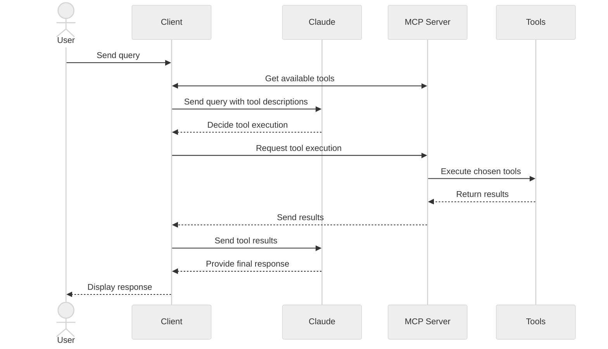

在本教程中，您将学习如何构建一个由 LLM 驱动的聊天机器人客户端，用于连接 MCP 服务器。

在开始之前，建议您先完成我们的[构建 MCP 服务器](/docs/mcp/develop/build-server)教程，以便理解客户端与服务器之间的通信方式。

<Tabs items={['Python', 'TypeScript', 'Java', 'Kotlin', 'C#', 'Ruby', 'Rust']}>

<Tab>

[您可以在这里找到本教程的完整代码。](https://github.com/modelcontextprotocol/quickstart-resources/tree/main/mcp-client-python)

## 系统要求

开始之前，请确保您的系统满足以下要求：

- Mac 或 Windows 计算机
- 已安装最新版本的 Python
- 已安装最新版本的 `uv`
- 您必须使用 Python MCP SDK 2.0.0 或更高版本

## 设置您的环境

首先，使用 `uv` 创建一个新的 Python 项目：

```bash macOS/Linux
# Create project directory
uv init mcp-client
cd mcp-client

# Create virtual environment
uv venv

# Activate virtual environment
source .venv/bin/activate

# Install required packages
uv add mcp anthropic python-dotenv

# Remove boilerplate files
rm main.py

# Create our main file
touch client.py
```

```powershell Windows
# Create project directory
uv init mcp-client
cd mcp-client

# Create virtual environment
uv venv

# Activate virtual environment
.venv\Scripts\activate

# Install required packages
uv add mcp anthropic python-dotenv

# Remove boilerplate files
del main.py

# Create our main file
new-item client.py
```


## 设置您的 API 密钥

您需要一个来自 [Anthropic Console](https://console.anthropic.com/settings/keys) 的 Anthropic API 密钥。

创建一个 `.env` 文件来存储它：

```bash
echo "ANTHROPIC_API_KEY=your-api-key-goes-here" > .env
```

将 `.env` 添加到您的 `.gitignore`：

```bash
echo ".env" >> .gitignore
```

<Callout type="warn">

请务必保证您的 `ANTHROPIC_API_KEY` 安全！

</Callout>

## 创建客户端

### 导入与设置

首先，让我们设置好导入语句，以及文件其余部分共享的组件：

```python
import asyncio
import sys

from mcp import Client, StdioServerParameters
from mcp.client.stdio import stdio_client
from mcp_types import TextContent

from anthropic import Anthropic
from dotenv import load_dotenv

load_dotenv()  # load environment variables from .env

MODEL = "claude-opus-5"
anthropic = Anthropic()
```

`Client` 是您的程序与服务器通信所经由的唯一对象。列出工具、调用某个工具、读取资源：每一项都是它上面的一个方法。

### 服务器连接管理

接下来，我们来确定给定服务器脚本应启动哪个进程：

```python
def server_params(server_script_path: str) -> StdioServerParameters:
    """Describe the subprocess that runs an MCP server

    Args:
        server_script_path: Path to the server script (.py or .js)
    """
    if server_script_path.endswith(".py"):
        command = "python"
    elif server_script_path.endswith(".js"):
        command = "node"
    else:
        raise ValueError("Server script must be a .py or .js file")

    return StdioServerParameters(command=command, args=[server_script_path])
```

`StdioServerParameters` 是配置，而非连接。`stdio_client()` 会将它转换为 stdio 传输，而 `Client` 在进入其 `async with` 代码块时会打开该传输。我们会在 `main()` 中同时完成这两步。

### 查询处理逻辑

现在让我们添加处理查询和工具调用的核心功能：

```python
async def process_query(client: Client, query: str) -> str:
    """Process a query using Claude and available tools"""
    messages = [
        {
            "role": "user",
            "content": query
        }
    ]

    tool_list = await client.list_tools()
    available_tools = [{
        "name": tool.name,
        "description": tool.description,
        "input_schema": tool.input_schema
    } for tool in tool_list.tools]

    # Initial Claude API call
    response = anthropic.messages.create(
        model=MODEL,
        max_tokens=1000,
        messages=messages,
        tools=available_tools
    )

    # Process response and handle tool calls
    final_text = []
    tool_results = []

    for content in response.content:
        if content.type == 'text':
            final_text.append(content.text)
        elif content.type == 'tool_use':
            tool_name = content.name
            tool_args = content.input

            # Execute tool call
            result = await client.call_tool(tool_name, tool_args)
            final_text.append(f"[Calling tool {tool_name} with args {tool_args}]")

            tool_results.append({
                "type": "tool_result",
                "tool_use_id": content.id,
                "content": "\n".join(
                    block.text
                    for block in result.content
                    if isinstance(block, TextContent)
                ),
                "is_error": result.is_error
            })

    if tool_results:
        messages.append({"role": "assistant", "content": response.content})
        messages.append({"role": "user", "content": tool_results})

        # Get next response from Claude
        response = anthropic.messages.create(
            model=MODEL,
            max_tokens=1000,
            messages=messages,
            tools=available_tools
        )

        for content in response.content:
            if content.type == 'text':
                final_text.append(content.text)

    return "\n".join(final_text)
```

`call_tool` 返回一个 `CallToolResult`。它的 `content` 是块（block）组成的列表，因此我们在读取 `.text` 之前先收窄到 `TextContent`。抛出异常的工具不会在这里抛出：它们会以 `is_error` 标记来应答，而将这个标记传递下去能让 Claude 读取消息并尝试其他方案。

### 交互式聊天界面

现在我们来添加聊天循环：

```python
async def chat_loop(client: Client) -> None:
    """Run an interactive chat loop"""
    print("\nMCP Client Started!")
    print("Type your queries or 'quit' to exit.")

    while True:
        try:
            query = (await asyncio.to_thread(input, "\nQuery: ")).strip()
        except EOFError:
            break

        if query.lower() == 'quit':
            break

        try:
            response = await process_query(client, query)
            print("\n" + response)
        except Exception as e:
            print(f"\nError: {e}")
```

`input()` 会阻塞，因此它运行在worker线程上。这样可以在您输入时保持事件循环空闲，以便服务连接。

### 主入口点

最后，我们来添加主执行逻辑：

```python
async def main() -> None:
    if len(sys.argv) < 2:
        print("Usage: python client.py <path_to_server_script>")
        sys.exit(1)

    async with Client(stdio_client(server_params(sys.argv[1]))) as client:
        tool_list = await client.list_tools()
        tool_names = [tool.name for tool in tool_list.tools]
        print("\nConnected to server with tools:", tool_names)

        await chat_loop(client)


if __name__ == "__main__":
    asyncio.run(main())
```

那个 `async with` 就是整个连接生命周期。进入它会启动服务器并与其协商协议版本；离开时会断开连接并关闭子进程。没有任何需要手动关闭的东西。

您可以[在这里](https://github.com/modelcontextprotocol/quickstart-resources/blob/main/mcp-client-python/client.py)找到完整的 `client.py` 文件。

## 关键组件解析

### 1. 客户端初始化

- 单个 `Client` 承载连接，而 `async with` 是它的完整生命周期
- 没有需要调用的 connect/close 配对，之后也无需清理任何内容
- 配置 Anthropic 客户端，用于与 Claude 交互

### 2. 服务器连接

- 支持 Python 和 Node.js 服务器
- 校验服务器脚本类型
- 将服务器作为子进程启动，并通过 stdio 与之通信
- 连接打开后列出可用的工具

### 3. 查询处理

- 维护对话上下文
- 处理 Claude 的响应和工具调用
- 管理 Claude 与工具之间的消息流
- 将结果合并为连贯的响应

### 4. 交互式界面

- 提供简单的命令行界面
- 处理用户输入并显示响应
- 包含基本的错误处理
- 支持顺利退出

### 5. 资源管理

- 离开 `async with` 代码块会断开连接并关闭服务器子进程
- 失败的查询会被报告，而不会结束会话
- 输入 `quit` 或关闭标准输入可干净地退出

## 常见的自定义点

1. **工具处理**
   - 修改 `process_query()` 以处理特定类型的工具
   - 为工具调用添加自定义错误处理
   - 实现特定于工具的输出格式

2. **响应处理**
   - 自定义工具结果的格式化方式
   - 添加响应过滤或转换
   - 实现自定义日志记录

3. **用户界面**
   - 添加 GUI 或 Web 界面
   - 实现丰富的控制台输出
   - 添加命令历史或自动补全

## 运行客户端

要使用任何 MCP 服务器运行您的客户端：

```bash
uv run client.py path/to/server.py # python server
uv run client.py path/to/build/index.js # node server
```

<Callout>

如果您要继续[服务器快速入门中的天气教程](https://github.com/modelcontextprotocol/quickstart-resources/tree/main/weather-server-python)，您的命令可能看起来像这样：`python client.py .../quickstart-resources/weather-server-python/weather.py`

</Callout>

客户端将：

1. 连接到指定的服务器
2. 列出可用的工具
3. 启动一个交互式聊天会话，您可以在其中：
   - 输入查询
   - 查看工具执行
   - 获取 Claude 的响应

以下是在连接到服务器快速入门中的天气服务器时应呈现的效果示例：


## 工作原理

当您提交查询时：

1. 客户端从服务器获取可用工具列表
2. 您的查询连同工具描述一起发送给 Claude
3. Claude 决定使用哪些工具（如果有的话）
4. 客户端通过服务器执行所请求的工具调用
5. 结果发送回 Claude
6. Claude 提供自然语言响应
7. 响应显示给您

## 最佳实践

1. **错误处理**
   - 检查 `result.is_error`，而不是期望失败的工具抛出异常
   - 提供有意义的错误消息
   - 优雅地处理连接问题

2. **资源管理**
   - 让 `async with` 代码块拥有连接
   - 只要您需要服务器，就保持连接打开
   - 处理服务器断开连接

3. **安全**
   - 将 API 密钥安全地存储在 `.env` 中
   - 校验服务器响应
   - 谨慎对待工具权限

4. **工具名称**
   - 可以根据[此处](/docs/mcp/specification/2026-07-28/server/tools#tool-names)指定的格式校验工具名称
   - 如果工具名称符合指定格式，它就不应被 MCP 客户端拒绝校验

## 故障排查

### 服务器路径问题

- 仔细检查服务器脚本的路径是否正确
- 如果相对路径不生效，请使用绝对路径
- 对于 Windows 用户，请确保在路径中使用正斜杠（/）或转义的反斜杠（\\）
- 验证服务器文件的扩展名是否正确（Python 为 .py，Node.js 为 .js）

正确路径用法示例：

```bash
# Relative path
uv run client.py ./server/weather.py

# Absolute path
uv run client.py /Users/username/projects/mcp-server/weather.py

# Windows path (either format works)
uv run client.py C:/projects/mcp-server/weather.py
uv run client.py C:\\projects\\mcp-server\\weather.py
```

### 响应耗时

- 第一个响应可能需要长达 30 秒才能返回
- 这是正常的，会在以下过程中发生：
  - 服务器初始化
  - Claude 处理查询
  - 工具正在执行
- 后续响应通常更快
- 不要在此初始等待期间中断进程

### 常见错误消息

如果您看到：

- `FileNotFoundError`：检查您的服务器路径
- `Connection refused`：确保服务器正在运行且路径正确
- `Tool execution failed`：验证工具所需的环境变量是否已设置
- `Timeout error`：考虑提高 `Client` 上的 `read_timeout_seconds`

</Tab>

<Tab>

[您可以在这里找到本教程的完整代码。](https://github.com/modelcontextprotocol/quickstart-resources/tree/main/mcp-client-typescript)

## 系统要求

开始之前，请确保您的系统满足以下要求：

- Mac 或 Windows 计算机
- 已安装 Node.js 20 或更高版本
- 已安装最新版本的 `npm`
- Anthropic API 密钥（Claude）

## 设置您的环境

首先，让我们创建并设置我们的项目：

```bash macOS/Linux
# Create project directory
mkdir mcp-client-typescript
cd mcp-client-typescript

# Initialize npm project
npm init -y

# Install dependencies
npm install @anthropic-ai/sdk @modelcontextprotocol/client dotenv

# Install dev dependencies
npm install -D @types/node typescript

# Create source file
touch index.ts
```

```powershell Windows
# Create project directory
md mcp-client-typescript
cd mcp-client-typescript

# Initialize npm project
npm init -y

# Install dependencies
npm install @anthropic-ai/sdk @modelcontextprotocol/client dotenv

# Install dev dependencies
npm install -D @types/node typescript

# Create source file
new-item index.ts
```


更新您的 `package.json`，设置 `type: "module"` 和一个构建脚本：

```json package.json
{
  "type": "module",
  "scripts": {
    "build": "tsc && chmod 755 build/index.js"
  }
}
```

在项目根目录创建一个 `tsconfig.json`：

```json tsconfig.json
{
  "compilerOptions": {
    "target": "ES2022",
    "module": "Node16",
    "moduleResolution": "Node16",
    "types": ["node"],
    "outDir": "./build",
    "rootDir": "./",
    "strict": true,
    "esModuleInterop": true,
    "skipLibCheck": true,
    "forceConsistentCasingInFileNames": true
  },
  "include": ["index.ts"],
  "exclude": ["node_modules"]
}
```

## 设置您的 API 密钥

您需要一个来自 [Anthropic Console](https://console.anthropic.com/settings/keys) 的 Anthropic API 密钥。

创建一个 `.env` 文件来存储它：

```bash
echo "ANTHROPIC_API_KEY=<your key here>" > .env
```

将 `.env` 添加到您的 `.gitignore`：

```bash
echo ".env" >> .gitignore
```

<Callout type="warn">

请务必保证您的 `ANTHROPIC_API_KEY` 安全！

</Callout>

## 创建客户端

### 基本客户端结构

首先，让我们在 `index.ts` 中设置导入语句并创建基本的客户端类：

```typescript
import { Anthropic } from "@anthropic-ai/sdk";
import {
  MessageParam,
  Tool,
} from "@anthropic-ai/sdk/resources/messages/messages.mjs";
import { Client } from "@modelcontextprotocol/client";
import { StdioClientTransport } from "@modelcontextprotocol/client/stdio";
import readline from "readline/promises";
import dotenv from "dotenv";

dotenv.config();

const ANTHROPIC_API_KEY = process.env.ANTHROPIC_API_KEY;
if (!ANTHROPIC_API_KEY) {
  throw new Error("ANTHROPIC_API_KEY is not set");
}

class MCPClient {
  private mcp: Client;
  private anthropic: Anthropic;
  private transport: StdioClientTransport | null = null;
  private tools: Tool[] = [];

  constructor() {
    this.anthropic = new Anthropic({
      apiKey: ANTHROPIC_API_KEY,
    });
    this.mcp = new Client({ name: "mcp-client-cli", version: "1.0.0" });
  }
  // methods will go here
}
```

### 服务器连接管理

接下来，我们来实现连接到 MCP 服务器的方法：

```typescript
async connectToServer(serverScriptPath: string) {
  try {
    const isJs = serverScriptPath.endsWith(".js");
    const isPy = serverScriptPath.endsWith(".py");
    if (!isJs && !isPy) {
      throw new Error("Server script must be a .js or .py file");
    }
    const command = isPy
      ? process.platform === "win32"
        ? "python"
        : "python3"
      : process.execPath;

    this.transport = new StdioClientTransport({
      command,
      args: [serverScriptPath],
    });
    await this.mcp.connect(this.transport);

    const toolsResult = await this.mcp.listTools();
    this.tools = toolsResult.tools.map((tool) => {
      return {
        name: tool.name,
        description: tool.description,
        input_schema: tool.inputSchema,
      };
    });
    console.log(
      "Connected to server with tools:",
      this.tools.map(({ name }) => name)
    );
  } catch (e) {
    console.log("Failed to connect to MCP server: ", e);
    throw e;
  }
}
```

### 查询处理逻辑

现在让我们添加处理查询和工具调用的核心功能：

```typescript
async processQuery(query: string) {
  const messages: MessageParam[] = [
    {
      role: "user",
      content: query,
    },
  ];

  const response = await this.anthropic.messages.create({
    model: "claude-opus-5",
    max_tokens: 1000,
    messages,
    tools: this.tools,
  });

  const finalText = [];

  for (const content of response.content) {
    if (content.type === "text") {
      finalText.push(content.text);
    } else if (content.type === "tool_use") {
      const toolName = content.name;
      const toolArgs = content.input as { [x: string]: unknown } | undefined;

      const result = await this.mcp.callTool({
        name: toolName,
        arguments: toolArgs,
      });
      finalText.push(
        `[Calling tool ${toolName} with args ${JSON.stringify(toolArgs)}]`
      );

      messages.push({
        role: "user",
        content: result.content
          .filter((block) => block.type === "text")
          .map((block) => block.text)
          .join("\n"),
      });

      const response = await this.anthropic.messages.create({
        model: "claude-opus-5",
        max_tokens: 1000,
        messages,
      });

      finalText.push(
        response.content[0].type === "text" ? response.content[0].text : ""
      );
    }
  }

  return finalText.join("\n");
}
```

### 交互式聊天界面

现在我们来添加聊天循环和清理功能：

```typescript
async chatLoop() {
  const rl = readline.createInterface({
    input: process.stdin,
    output: process.stdout,
  });

  try {
    console.log("\nMCP Client Started!");
    console.log("Type your queries or 'quit' to exit.");

    while (true) {
      const message = await rl.question("\nQuery: ");
      if (message.toLowerCase() === "quit") {
        break;
      }
      const response = await this.processQuery(message);
      console.log("\n" + response);
    }
  } finally {
    rl.close();
  }
}

async cleanup() {
  await this.mcp.close();
}
```

### 主入口点

最后，我们来添加主执行逻辑：

```typescript
async function main() {
  if (process.argv.length < 3) {
    console.log("Usage: node index.ts <path_to_server_script>");
    return;
  }
  const mcpClient = new MCPClient();
  try {
    await mcpClient.connectToServer(process.argv[2]);
    await mcpClient.chatLoop();
  } catch (e) {
    console.error("Error:", e);
    await mcpClient.cleanup();
    process.exit(1);
  } finally {
    await mcpClient.cleanup();
    process.exit(0);
  }
}

main();
```

## 运行客户端

要使用任何 MCP 服务器运行您的客户端：

```bash
# Build TypeScript
npm run build

# Run the client
node build/index.js path/to/server.py # python server
node build/index.js path/to/build/index.js # node server
```

<Callout>

如果您要继续[服务器快速入门中的天气教程](https://github.com/modelcontextprotocol/quickstart-resources/tree/main/weather-server-typescript)，您的命令可能看起来像这样：`node build/index.js .../quickstart-resources/weather-server-typescript/build/index.js`

</Callout>

**客户端将：**

1. 连接到指定的服务器
2. 列出可用的工具
3. 启动一个交互式聊天会话，您可以在其中：
   - 输入查询
   - 查看工具执行
   - 获取 Claude 的响应

## 工作原理

当您提交查询时：

1. 客户端从服务器获取可用工具列表
2. 您的查询连同工具描述一起发送给 Claude
3. Claude 决定使用哪些工具（如果有的话）
4. 客户端通过服务器执行所请求的工具调用
5. 结果发送回 Claude
6. Claude 提供自然语言响应
7. 响应显示给您

## 最佳实践

1. **错误处理**
   - 利用 TypeScript 的类型系统更好地检测错误
   - 将工具调用包裹在 try-catch 代码块中
   - 提供有意义的错误消息
   - 优雅地处理连接问题

2. **安全**
   - 将 API 密钥安全地存储在 `.env` 中
   - 校验服务器响应
   - 谨慎对待工具权限

## 故障排查

### 服务器路径问题

- 仔细检查服务器脚本的路径是否正确
- 如果相对路径不生效，请使用绝对路径
- 对于 Windows 用户，请确保在路径中使用正斜杠（/）或转义的反斜杠（\\）
- 验证服务器文件的扩展名是否正确（Node.js 为 .js，Python 为 .py）

正确路径用法示例：

```bash
# Relative path
node build/index.js ./server/build/index.js

# Absolute path
node build/index.js /Users/username/projects/mcp-server/build/index.js

# Windows path (either format works)
node build/index.js C:/projects/mcp-server/build/index.js
node build/index.js C:\\projects\\mcp-server\\build\\index.js
```

### 响应耗时

- 第一个响应可能需要长达 30 秒才能返回
- 这是正常的，会在以下过程中发生：
  - 服务器初始化
  - Claude 处理查询
  - 工具正在执行
- 后续响应通常更快
- 不要在此初始等待期间中断进程

### 常见错误消息

如果您看到：

- `Error: Cannot find module`：检查您的构建文件夹，确保 TypeScript 编译成功
- `Connection refused`：确保服务器正在运行且路径正确
- `Tool execution failed`：验证工具所需的环境变量是否已设置
- `ANTHROPIC_API_KEY is not set`：检查您的 .env 文件和环境变量
- `TypeError`：确保您为工具参数使用了正确的类型
- `BadRequestError`：确保您有足够的额度来访问 Anthropic API

</Tab>

<Tab>

<Callout>

这是一个基于 Spring AI MCP 自动配置和 boot 启动器的快速入门演示。
要了解如何手动创建同步和异步 MCP 客户端，请参阅 [Java SDK Client](https://java.sdk.modelcontextprotocol.io/) 文档。

</Callout>

本示例演示如何构建一个将 Spring AI 的模型上下文协议（MCP）与 [Brave Search MCP Server](https://github.com/modelcontextprotocol/servers-archived/tree/main/src/brave-search) 相结合的交互式聊天机器人。该应用创建了一个由 Anthropic 的 Claude AI 模型驱动的对话界面，能够通过 Brave Search 执行互联网搜索，从而实现与实时 Web 数据的自然语言交互。
[您可以在这里找到本教程的完整代码。](https://github.com/spring-projects/spring-ai-examples/tree/main/model-context-protocol/web-search/brave-chatbot)

## 系统要求

开始之前，请确保您的系统满足以下要求：

- Java 17 或更高版本
- Maven 3.6+
- npx 包管理器
- Anthropic API 密钥（Claude）
- Brave Search API 密钥

## 设置您的环境

1. 安装 npx（Node 包执行器）：
   首先，请确保已安装 [npm](https://docs.npmjs.com/downloading-and-installing-node-js-and-npm)，
   然后运行：

   ```bash
   npm install -g npx
   ```

2. 克隆仓库：

   ```bash
   git clone https://github.com/spring-projects/spring-ai-examples.git
   cd model-context-protocol/web-search/brave-chatbot
   ```

3. 设置您的 API 密钥：

   ```bash
   export ANTHROPIC_API_KEY='your-anthropic-api-key-here'
   export BRAVE_API_KEY='your-brave-api-key-here'
   ```

4. 构建应用：

   ```bash
   ./mvnw clean install
   ```

5. 使用 Maven 运行应用：
   ```bash
   ./mvnw spring-boot:run
   ```

<Callout type="warn">

请务必保证您的 `ANTHROPIC_API_KEY` 和 `BRAVE_API_KEY` 密钥安全！

</Callout>

## 工作原理

该应用通过几个组件将 Spring AI 与 Brave Search MCP 服务器集成在一起：

### MCP 客户端配置

1. pom.xml 中所需的依赖：

```xml
<dependency>
    <groupId>org.springframework.ai</groupId>
    <artifactId>spring-ai-starter-mcp-client</artifactId>
</dependency>
<dependency>
    <groupId>org.springframework.ai</groupId>
    <artifactId>spring-ai-starter-model-anthropic</artifactId>
</dependency>
```

2. 应用属性（application.yml）：

```yml
spring:
  ai:
    mcp:
      client:
        enabled: true
        name: brave-search-client
        version: 1.0.0
        type: SYNC
        request-timeout: 20s
        stdio:
          root-change-notification: true
          servers-configuration: classpath:/mcp-servers-config.json
        toolcallback:
          enabled: true
    anthropic:
      api-key: ${ANTHROPIC_API_KEY}
```

这会激活 `spring-ai-starter-mcp-client`，根据提供的服务器配置创建一个或多个 `McpClient`。
`spring.ai.mcp.client.toolcallback.enabled=true` 属性启用工具回调机制，自动将所有 MCP 工具注册为 Spring AI 工具。
默认情况下它是禁用的。

3. MCP 服务器配置（`mcp-servers-config.json`）：

```json
{
  "mcpServers": {
    "brave-search": {
      "command": "npx",
      "args": ["-y", "@modelcontextprotocol/server-brave-search"],
      "env": {
        "BRAVE_API_KEY": "<PUT YOUR BRAVE API KEY>"
      }
    }
  }
}
```

### 聊天实现

聊天机器人使用 Spring AI 的 ChatClient 与 MCP 工具集成实现：

```java
var chatClient = chatClientBuilder
    .defaultSystem("You are useful assistant, expert in AI and Java.")
    .defaultToolCallbacks((Object[]) mcpToolAdapter.toolCallbacks())
    .defaultAdvisors(new MessageChatMemoryAdvisor(new InMemoryChatMemory()))
    .build();
```

关键特性：

- 使用 Claude AI 模型进行自然语言理解
- 通过 MCP 集成 Brave Search，实现实时网络搜索能力
- 使用 InMemoryChatMemory 维护会话记忆
- 作为交互式命令行应用运行

### 构建并运行

```bash
./mvnw clean install
java -jar ./target/ai-mcp-brave-chatbot-0.0.1-SNAPSHOT.jar
```

或

```bash
./mvnw spring-boot:run
```

应用将启动一个交互式聊天会话，您可以在此提问。当聊天机器人需要从互联网查找信息来回答您的查询时，它会使用 Brave Search。

聊天机器人可以：

- 使用其内置知识回答问题
- 在需要时使用 Brave Search 执行网络搜索
- 记住对话中先前消息的上下文
- 综合多个来源的信息提供全面的答案

### 高级配置

MCP 客户端支持额外的配置选项：

- 通过 `McpClientCustomizer<McpClient.SyncSpec>` 或 `McpClientCustomizer<McpClient.AsyncSpec>` Bean 进行客户端自定义
- 支持多种传输类型的多客户端：`STDIO` 和 Streamable HTTP
- 与 Spring AI 的工具执行框架集成
- 自动的客户端初始化和生命周期管理

要通过 Streamable HTTP 连接到远程 MCP 服务器，请配置一个连接 URL：

```properties
spring.ai.mcp.client.streamable-http.connections.server1.url=http://localhost:8080
```

对于基于 WebFlux 的应用，您可以改用 WebFlux 启动器：

```xml
<dependency>
    <groupId>org.springframework.ai</groupId>
    <artifactId>spring-ai-starter-mcp-client-webflux</artifactId>
</dependency>
```

这提供了类似的功能，但使用基于 WebFlux 的 Streamable HTTP 传输实现，推荐用于生产部署。

</Tab>

<Tab>

[您可以在这里找到本教程的完整代码。](https://github.com/modelcontextprotocol/kotlin-sdk/tree/main/samples/kotlin-mcp-client)

## 系统要求

开始之前，请确保您的系统满足以下要求：

- JDK 11 或更高版本
- Anthropic API 密钥（Claude）

## 设置您的环境

首先，如果您还没有安装 `java` 和 `gradle`，请先安装它们。
您可以从[官方 Oracle JDK 网站](https://www.oracle.com/java/technologies/downloads/)下载 `java`。
验证您的 `java` 安装：

```bash
java --version
```

现在，让我们创建并设置我们的项目：

```bash macOS/Linux
# Create a new directory for our project
mkdir kotlin-mcp-client
cd kotlin-mcp-client

# Initialize a new kotlin project
gradle init
```

```powershell Windows
# Create a new directory for our project
md kotlin-mcp-client
cd kotlin-mcp-client
# Initialize a new kotlin project
gradle init
```


运行 `gradle init` 后，选择 **Application** 作为项目类型，**Kotlin** 作为编程语言。

或者，您也可以使用 [IntelliJ IDEA 项目向导](https://kotlinlang.org/docs/jvm-get-started.html)创建 Kotlin 应用。

创建项目后，将您的 `build.gradle.kts` 内容替换为：

```kotlin build.gradle.kts
// Check latest versions at https://github.com/modelcontextprotocol/kotlin-sdk/releases
val mcpVersion = "0.9.0"
val ktorVersion = "3.2.3"
val anthropicVersion = "2.15.0"
val slf4jVersion = "2.0.17"

plugins {
    kotlin("jvm") version "2.3.20"
    id("com.gradleup.shadow") version "8.3.9"
    application
}

application {
    mainClass.set("MainKt")
}

dependencies {
    implementation("io.modelcontextprotocol:kotlin-sdk:$mcpVersion")
    implementation("io.ktor:ktor-client-cio:$ktorVersion")
    implementation("com.anthropic:anthropic-java:$anthropicVersion")
    implementation("org.slf4j:slf4j-simple:$slf4jVersion")
}
```

验证所有内容是否正确设置：

```bash
./gradlew build
```

## 设置您的 API 密钥

您需要一个来自 [Anthropic Console](https://console.anthropic.com/settings/keys) 的 Anthropic API 密钥。

设置您的 API 密钥：

```bash
export ANTHROPIC_API_KEY='your-anthropic-api-key-here'
```

<Callout type="warn">

请务必保证您的 `ANTHROPIC_API_KEY` 安全！

</Callout>

## 创建客户端

### 基本客户端结构

首先，让我们创建基本的客户端类：

```kotlin
class MCPClient(apiKey: String) : AutoCloseable {
    private val anthropic = AnthropicOkHttpClient.builder()
        .apiKey(apiKey)
        .build()

  private val mcp: Client = Client(
        clientInfo = Implementation(name = "mcp-client-cli", version = "1.0.0")
  )
    private var serverProcess: Process? = null
    private lateinit var tools: List<ToolUnion>

    // methods will go here

    override fun close() {
        runBlocking {
            mcp.close()
        }
        serverProcess?.destroy()
        anthropic.close()
    }
}
```

### 服务器连接管理

接下来，我们来实现连接到 MCP 服务器的方法：

```kotlin
suspend fun connectToServer(serverScriptPath: String) {
    val command = buildList {
        when (serverScriptPath.substringAfterLast(".")) {
            "js" -> add("node")
            "py" -> add(if (System.getProperty("os.name").lowercase().contains("win")) "python" else "python3")
            "jar" -> addAll(listOf("java", "-jar"))
            else -> throw IllegalArgumentException("Server script must be a .js, .py or .jar file")
        }
        add(serverScriptPath)
    }

    val process = ProcessBuilder(command).start()
    serverProcess = process

    val transport = StdioClientTransport(
        input = process.inputStream.asSource().buffered(),
        output = process.outputStream.asSink().buffered(),
    )

    mcp.connect(transport)

    val toolsResult = mcp.listTools()
    tools = toolsResult.tools.map { tool ->
        ToolUnion.ofTool(
            Tool.builder()
                .name(tool.name)
                .description(tool.description ?: "")
                .inputSchema(
                    Tool.InputSchema.builder()
                        .type(JsonValue.from(tool.inputSchema.type))
                        .properties(tool.inputSchema.properties?.toJsonValue() ?: EmptyJsonObject.toJsonValue())
                        .putAdditionalProperty("required", JsonValue.from(tool.inputSchema.required))
                        .build(),
                )
                .build(),
        )
    }
    println("Connected to server with tools: ${tools.joinToString(", ") { it.tool().get().name() }}")
}
```

<Accordion title="JsonObject.toJsonValue() 辅助方法">

该辅助方法使用 Jackson 将 kotlinx.serialization 的 `JsonObject` 转换为 Anthropic SDK 的 `JsonValue`：

```kotlin
private fun JsonObject.toJsonValue(): JsonValue {
    val mapper = ObjectMapper()
    val node = mapper.readTree(this.toString())
    return JsonValue.fromJsonNode(node)
}
```

</Accordion>

### 查询处理逻辑

现在让我们添加处理查询和工具调用的核心功能：

```kotlin
suspend fun processQuery(query: String): String {
    val messages = mutableListOf(
        MessageParam.builder()
            .role(MessageParam.Role.USER)
            .content(query)
            .build(),
    )

    val response = anthropic.messages().create(
        MessageCreateParams.builder()
            .model("claude-opus-5")
            .maxTokens(1024)
            .messages(messages)
            .tools(tools)
            .build(),
    )

    val finalText = mutableListOf<String>()
    response.content().forEach { content ->
        when {
            content.isText() -> finalText.add(content.text().get().text())

            content.isToolUse() -> {
                val toolName = content.toolUse().get().name()
                val toolArgs =
                    content.toolUse().get()._input().convert(object : TypeReference<Map<String, JsonValue>>() {})

                val result = mcp.callTool(
                    name = toolName,
                    arguments = toolArgs ?: emptyMap(),
                )
                finalText.add("[Calling tool $toolName with args $toolArgs]")

                messages.add(
                    MessageParam.builder()
                        .role(MessageParam.Role.USER)
                        .content(
                            result.content
                                .filterIsInstance<TextContent>()
                                .joinToString("\n") { it.text }
                        )
                        .build(),
                )

                val aiResponse = anthropic.messages().create(
                    MessageCreateParams.builder()
                        .model("claude-opus-5")
                        .maxTokens(1024)
                        .messages(messages)
                        .build(),
                )

                finalText.add(aiResponse.content().first().text().get().text())
            }
        }
    }

    return finalText.joinToString("\n")
}
```

### 交互式聊天

我们来添加聊天循环：

```kotlin
suspend fun chatLoop() {
    println("\nMCP Client Started!")
    println("Type your queries or 'quit' to exit.")

    while (true) {
        print("\nQuery: ")
        val message = readlnOrNull() ?: break
        if (message.trim().lowercase() == "quit") break

        try {
            val response = processQuery(message)
            println("\n$response")
        } catch (e: Exception) {
            println("\nError: ${e.message}")
        }
    }
}
```

### 主入口点

最后，我们来添加主执行函数：

```kotlin
fun main(args: Array<String>) = runBlocking {
    require(args.isNotEmpty()) { "Usage: java -jar <path> <path_to_server_script>" }

    val apiKey = System.getenv("ANTHROPIC_API_KEY")
    require(!apiKey.isNullOrBlank()) { "ANTHROPIC_API_KEY environment variable is not set" }

    val client = MCPClient(apiKey)
    client.use {
        client.connectToServer(args.first())
        client.chatLoop()
    }
}
```

## 运行客户端

要使用任何 MCP 服务器运行您的客户端：

```bash
./gradlew build

# Run the client
java -jar build/libs/kotlin-mcp-client-0.1.0-all.jar path/to/server.jar # JVM server
java -jar build/libs/kotlin-mcp-client-0.1.0-all.jar path/to/server.py  # Python server
java -jar build/libs/kotlin-mcp-client-0.1.0-all.jar path/to/build/index.js # Node server
```

或者，您也可以直接使用 Gradle 运行：

```bash
./gradlew run --args="path/to/server.jar"
```

<Callout>

如果您要继续服务器快速入门中的天气教程，您的命令可能看起来像这样：`java -jar build/libs/kotlin-mcp-client-0.1.0-all.jar .../samples/weather-stdio-server/build/libs/weather-stdio-server-0.1.0-all.jar`

</Callout>

**客户端将：**

1. 连接到指定的服务器
2. 列出可用的工具
3. 启动一个交互式聊天会话，您可以在其中：
   - 输入查询
   - 查看工具执行
   - 获取 Claude 的响应

## 工作原理

以下是高层级的工作流示意：



当您提交查询时：

1. 客户端从服务器获取可用工具列表
2. 您的查询连同工具描述一起发送给 Claude
3. Claude 决定使用哪些工具（如果有的话）
4. 客户端通过服务器执行所请求的工具调用
5. 结果发送回 Claude
6. Claude 提供自然语言响应
7. 响应显示给您

## 最佳实践

1. **错误处理**
   - 利用 Kotlin 的类型系统显式地对错误进行建模
   - 在可能抛出异常的情况下，将外部工具和 API 调用包裹在 `try-catch` 代码块中
   - 提供清晰而有意义的错误消息
   - 优雅地处理网络超时和连接问题

2. **安全**
   - 将 API 密钥和机密安全地存储在 `local.properties`、环境变量或密钥管理器中
   - 校验所有外部响应，避免意外或不安全的数据使用
   - 使用工具时谨慎对待权限和信任边界

3. **环境**
   - 通过环境变量设置 `ANTHROPIC_API_KEY`，而不是硬编码
   - 在本地开发中使用带有适当 `.gitignore` 规则的 `.env` 文件

## 故障排查

### 服务器路径问题

- 仔细检查服务器脚本的路径是否正确
- 如果相对路径不生效，请使用绝对路径
- 对于 Windows 用户，请确保在路径中使用正斜杠（/）或转义的反斜杠（\\）
- 确保所需的运行时已安装（Java 对应 java，Node.js 对应 npm，Python 对应 uv）
- 验证服务器文件的扩展名是否正确（Java 为 .jar，Node.js 为 .js，Python 为 .py）

正确路径用法示例：

```bash
# Relative path
java -jar build/libs/client.jar ./server/build/libs/server.jar

# Absolute path
java -jar build/libs/client.jar /Users/username/projects/mcp-server/build/libs/server.jar

# Windows path (either format works)
java -jar build/libs/client.jar C:/projects/mcp-server/build/libs/server.jar
java -jar build/libs/client.jar C:\\projects\\mcp-server\\build\\libs\\server.jar
```

### 构建问题

- 使用 `./gradlew build` 或 `./gradlew shadowJar`（而不是 `./gradlew jar`）来创建包含所有依赖的 shadow JAR
- 如果出现 JDK 版本错误，请确保您安装的 JDK 版本与 `build.gradle.kts` 中的 `jvmToolchain` 设置相同或更高

### 响应耗时

- 第一个响应可能需要长达 30 秒才能返回
- 这是正常的，会在以下过程中发生：
  - 服务器初始化
  - Claude 处理查询
  - 工具正在执行
- 后续响应通常更快
- 不要在此初始等待期间中断进程

### 常见错误消息

如果您看到：

- `Connection refused`：确保服务器正在运行且路径正确
- `Tool execution failed`：验证工具所需的环境变量是否已设置
- `ANTHROPIC_API_KEY is not set`：检查您的环境变量

</Tab>

<Tab>

[您可以在这里找到本教程的完整代码。](https://github.com/modelcontextprotocol/csharp-sdk/tree/main/samples/QuickstartClient)

## 系统要求

开始之前，请确保您的系统满足以下要求：

- .NET 8.0 或更高版本
- Anthropic API 密钥（Claude）
- Windows、Linux 或 macOS

## 设置您的环境

首先，创建一个新的 .NET 项目：

```bash
dotnet new console -n QuickstartClient
cd QuickstartClient
```

然后，向您的项目添加所需的依赖：

```bash
dotnet add package ModelContextProtocol --prerelease
dotnet add package Anthropic.SDK
dotnet add package Microsoft.Extensions.Hosting
dotnet add package Microsoft.Extensions.AI
```

## 设置您的 API 密钥

您需要一个来自 [Anthropic Console](https://console.anthropic.com/settings/keys) 的 Anthropic API 密钥。

```bash
dotnet user-secrets init
dotnet user-secrets set "ANTHROPIC_API_KEY" "<your key here>"
```

## 创建客户端

### 基本客户端结构

首先，让我们在 `Program.cs` 文件中设置基本的客户端类：

```csharp
using Anthropic.SDK;
using Microsoft.Extensions.AI;
using Microsoft.Extensions.Configuration;
using Microsoft.Extensions.Hosting;
using ModelContextProtocol.Client;
using ModelContextProtocol.Protocol.Transport;

var builder = Host.CreateApplicationBuilder(args);

builder.Configuration
    .AddEnvironmentVariables()
    .AddUserSecrets<Program>();
```

这会创建 .NET 控制台应用的雏形，能够从用户机密（user secrets）中读取 API 密钥。

接下来，我们将设置 MCP 客户端：

```csharp
var (command, arguments) = GetCommandAndArguments(args);

var clientTransport = new StdioClientTransport(new()
{
    Name = "Demo Server",
    Command = command,
    Arguments = arguments,
});

await using var mcpClient = await McpClient.CreateAsync(clientTransport);

var tools = await mcpClient.ListToolsAsync();
foreach (var tool in tools)
{
    Console.WriteLine($"Connected to server with tools: {tool.Name}");
}
```

在 `Program.cs` 文件的末尾添加此函数：

```csharp
static (string command, string[] arguments) GetCommandAndArguments(string[] args)
{
    return args switch
    {
        [var script] when script.EndsWith(".py") => ("python", args),
        [var script] when script.EndsWith(".js") => ("node", args),
        [var script] when Directory.Exists(script) || (File.Exists(script) && script.EndsWith(".csproj")) => ("dotnet", ["run", "--project", script, "--no-build"]),
        _ => throw new NotSupportedException("An unsupported server script was provided. Supported scripts are .py, .js, or .csproj")
    };
}
```

这会创建一个 MCP 客户端，用于连接到通过命令行参数提供的服务器。然后它会列出已连接服务器上的可用工具。

### 查询处理逻辑

现在让我们添加处理查询和工具调用的核心功能：

```csharp
using var anthropicClient = new AnthropicClient(new APIAuthentication(builder.Configuration["ANTHROPIC_API_KEY"]))
    .Messages
    .AsBuilder()
    .UseFunctionInvocation()
    .Build();

var options = new ChatOptions
{
    MaxOutputTokens = 1000,
    ModelId = "claude-opus-5",
    Tools = [.. tools]
};

Console.ForegroundColor = ConsoleColor.Green;
Console.WriteLine("MCP Client Started!");
Console.ResetColor();

PromptForInput();
while(Console.ReadLine() is string query && !"exit".Equals(query, StringComparison.OrdinalIgnoreCase))
{
    if (string.IsNullOrWhiteSpace(query))
    {
        PromptForInput();
        continue;
    }

    await foreach (var message in anthropicClient.GetStreamingResponseAsync(query, options))
    {
        Console.Write(message);
    }
    Console.WriteLine();

    PromptForInput();
}

static void PromptForInput()
{
    Console.WriteLine("Enter a command (or 'exit' to quit):");
    Console.ForegroundColor = ConsoleColor.Cyan;
    Console.Write("> ");
    Console.ResetColor();
}
```

## 关键组件解析

### 1. 客户端初始化

- 客户端使用 `McpClient.CreateAsync()` 初始化，它会设置传输类型和用于运行服务器的命令。

### 2. 服务器连接

- 支持 Python、Node.js 和 .NET 服务器。
- 使用参数中指定的命令启动服务器。
- 配置为使用 stdio 与服务器通信。
- 初始化会话和可用工具。

### 3. 查询处理

- 利用 [Microsoft.Extensions.AI](https://learn.microsoft.com/dotnet/ai/ai-extensions) 构建聊天客户端。
- 将 `IChatClient` 配置为自动进行工具（函数）调用。
- 客户端读取用户输入并将其发送到服务器。
- 服务器处理查询并返回响应。
- 响应显示给用户。

## 运行客户端

要使用任何 MCP 服务器运行您的客户端：

```bash
dotnet run -- path/to/server.csproj # dotnet server
dotnet run -- path/to/server.py # python server
dotnet run -- path/to/server.js # node server
```

<Callout>

如果您要继续服务器快速入门中的天气教程，您的命令可能看起来像这样：`dotnet run -- path/to/QuickstartWeatherServer`。

</Callout>

客户端将：

1. 连接到指定的服务器
2. 列出可用的工具
3. 启动一个交互式聊天会话，您可以在其中：
   - 输入查询
   - 查看工具执行
   - 获取 Claude 的响应
4. 完成后退出会话

以下是在连接到天气服务器快速入门时应呈现的效果示例：


</Tab>

<Tab>

[您可以在这里找到本教程的完整代码。](https://github.com/modelcontextprotocol/quickstart-resources/tree/main/mcp-client-ruby)

## 系统要求

开始之前，请确保您的系统满足以下要求：

- Mac 或 Windows 计算机
- 已安装 Ruby 3.2.0 或更高版本（由 [Anthropic SDK](https://github.com/anthropics/anthropic-sdk-ruby) 要求）
- Anthropic API 密钥（Claude）

## 设置您的环境

首先，创建一个新的 Ruby 项目：

```bash macOS/Linux
# Create project directory
mkdir mcp-client
cd mcp-client

# Create a Gemfile
bundle init

# Add required dependencies
bundle add anthropic base64 dotenv mcp

# Create our main file
touch client.rb
```

```powershell Windows
# Create project directory
mkdir mcp-client
cd mcp-client

# Create a Gemfile
bundle init

# Add required dependencies
bundle add anthropic base64 dotenv mcp

# Create our main file
new-item client.rb
```


## 设置您的 API 密钥

您需要一个来自 [Anthropic Console](https://console.anthropic.com/settings/keys) 的 Anthropic API 密钥。

创建一个 `.env` 文件来存储它：

```bash
echo "ANTHROPIC_API_KEY=your-api-key-goes-here" > .env
```

将 `.env` 添加到您的 `.gitignore`：

```bash
echo ".env" >> .gitignore
```

<Callout type="warn">

请务必保证您的 `ANTHROPIC_API_KEY` 安全！

</Callout>

## 创建客户端

### 基本客户端结构

首先，让我们设置所需的 require 语句并创建基本的客户端类：

```ruby
require "anthropic"
require "dotenv/load"
require "json"
require "mcp"

class MCPClient
  ANTHROPIC_MODEL = "claude-opus-5"

  def initialize
    @mcp_client = nil
    @transport = nil
    @anthropic_client = nil
  end

  # methods will go here
end
```

### 服务器连接管理

接下来，我们来实现连接到 MCP 服务器的方法：

```ruby
def connect_to_server(server_script_path)
  command = case File.extname(server_script_path)
  when ".rb"
    "ruby"
  when ".py"
    "python3"
  when ".js"
    "node"
  else
    raise ArgumentError, "Server script must be a .rb, .py, or .js file."
  end

  @transport = MCP::Client::Stdio.new(command: command, args: [server_script_path])
  @mcp_client = MCP::Client.new(transport: @transport)
  @mcp_client.connect

  tool_names = @mcp_client.tools.map(&:name)
  puts "\nConnected to server with tools: #{tool_names}"
end
```

### 查询处理逻辑

现在让我们添加处理查询和工具调用的核心功能：

```ruby
private

def process_query(query)
  messages = [{ role: "user", content: query }]

  available_tools = @mcp_client.tools.map do |tool|
    { name: tool.name, description: tool.description, input_schema: tool.input_schema }
  end

  # Initial Claude API call.
  response = chat(messages, tools: available_tools)

  # Process response and handle tool calls.
  if response.content.any?(Anthropic::Models::ToolUseBlock)
    assistant_content = response.content.filter_map do |content_block|
      case content_block
      when Anthropic::Models::TextBlock
        { type: "text", text: content_block.text }
      when Anthropic::Models::ToolUseBlock
        { type: "tool_use", id: content_block.id, name: content_block.name, input: content_block.input }
      end
    end
    messages << { role: "assistant", content: assistant_content }
  end

  response.content.each_with_object([]) do |content, response_parts|
    case content
    when Anthropic::Models::TextBlock
      response_parts << content.text
    when Anthropic::Models::ToolUseBlock
      # Execute tool call via MCP.
      result = @mcp_client.call_tool(name: content.name, arguments: content.input)
      response_parts << "[Calling tool #{content.name} with args #{content.input.to_json}]"

      tool_result_content = result.dig("result", "content")
      result_text = if tool_result_content.is_a?(Array)
        tool_result_content.filter_map { |content_item| content_item["text"] }.join("\n")
      else
        tool_result_content.to_s
      end

      messages << {
        role: "user",
        content: [{
          type: "tool_result",
          tool_use_id: content.id,
          content: result_text
        }]
      }

      # Get next response from Claude.
      response = chat(messages)

      response.content.each do |content_block|
        response_parts << content_block.text if content_block.is_a?(Anthropic::Models::TextBlock)
      end
    end
  end.join("\n")
end

def chat(messages, tools: nil)
  params = { model: ANTHROPIC_MODEL, max_tokens: 1000, messages: messages }
  params[:tools] = tools if tools

  anthropic_client.messages.create(**params)
end

def anthropic_client
  @anthropic_client ||= Anthropic::Client.new(api_key: ENV["ANTHROPIC_API_KEY"])
end
```

### 交互式聊天界面

现在我们来添加聊天循环和清理功能：

```ruby
def chat_loop
  puts <<~MESSAGE
    MCP Client Started!
    Type your queries or 'quit' to exit.
  MESSAGE

  loop do
    print "\nQuery: "
    line = $stdin.gets
    break if line.nil?

    query = line.chomp.strip
    break if query.downcase == "quit"
    next if query.empty?

    begin
      response = process_query(query)
      puts "\n#{response}"
    rescue => e
      puts "\nError: #{e.message}"
    end
  end
end

def cleanup
  @transport&.close
end
```

### 主入口点

最后，我们来添加主执行逻辑：

```ruby
if ARGV.empty?
  puts "Usage: ruby client.rb <path_to_server_script>"
  exit 1
end

client = MCPClient.new

begin
  client.connect_to_server(ARGV[0])

  api_key = ENV["ANTHROPIC_API_KEY"]
  if api_key.nil? || api_key.empty?
    puts <<~MESSAGE
      No ANTHROPIC_API_KEY found. To query these tools with Claude, set your API key:
        export ANTHROPIC_API_KEY=your-api-key-here
    MESSAGE
    exit
  end

  client.chat_loop
rescue => e
  puts "Error: #{e.message}"
  exit 1
ensure
  client.cleanup
end
```

您可以[在这里](https://github.com/modelcontextprotocol/quickstart-resources/blob/main/mcp-client-ruby/client.rb)找到完整的 `client.rb` 文件。

## 关键组件解析

### 1. 客户端初始化

- `MCPClient` 类以 nil 引用初始化，供延迟设置使用
- Anthropic 客户端通过 `anthropic_client` 方法进行延迟初始化
- 使用 `dotenv` 从 `.env` 加载环境变量

### 2. 服务器连接

- 支持 Ruby、Python 和 Node.js 服务器
- 使用 `File.extname` 确定服务器脚本类型
- 使用 `MCP::Client::Stdio` 进行 stdio 传输
- 初始化 MCP 客户端并列出可用的工具

### 3. 查询处理

- 将 MCP 工具映射为 Anthropic 工具格式（`name`、`description`、`input_schema`）
- 使用 `Anthropic::Models::TextBlock` 和 `Anthropic::Models::ToolUseBlock` 进行模式匹配
- 在遍历工具调用之前，先构建一次助手内容
- 通过 `@mcp_client.call_tool` 执行工具调用
- 使用 `chat` 辅助方法封装 Anthropic API 调用
- 使用 `result.dig("result", "content")` 提取工具结果内容
- 将工具结果传回 Claude，以获得最终响应

### 4. 交互式界面

- 提供简单的命令行界面
- 处理用户输入并显示响应
- 跳过空查询
- 包含基本的错误处理

### 5. 资源管理

- 通过 `begin`...`ensure` 正确清理传输
- 顶层 `rescue` 用于错误处理
- 在服务器连接后进行 API 密钥验证

## 运行客户端

要使用任何 MCP 服务器运行您的客户端：

```bash
bundle exec ruby client.rb path/to/server.rb # ruby server
bundle exec ruby client.rb path/to/server.py # python server
bundle exec ruby client.rb path/to/build/index.js # node server
```

<Callout>

如果您要继续[服务器快速入门中的天气教程](https://github.com/modelcontextprotocol/quickstart-resources/tree/main/weather-server-ruby)，您的命令可能看起来像这样：`bundle exec ruby client.rb /path/to/weather-server-ruby/weather.rb`

</Callout>

客户端将：

1. 连接到指定的服务器
2. 列出可用的工具
3. 启动一个交互式聊天会话，您可以在其中：
   - 输入查询
   - 查看工具执行
   - 获取 Claude 的响应

## 工作原理

当您提交查询时：

1. 客户端从服务器获取可用工具列表
2. 您的查询连同工具描述一起发送给 Claude
3. Claude 决定使用哪些工具（如果有的话）
4. 客户端通过服务器执行所请求的工具调用
5. 结果发送回 Claude
6. Claude 提供自然语言响应
7. 响应显示给您

## 最佳实践

1. **错误处理**
   - 将工具调用包裹在 `begin`...`rescue` 代码块中
   - 提供有意义的错误消息
   - 优雅地处理连接问题

2. **资源管理**
   - 使用完毕后始终关闭传输
   - 使用 `begin`...`ensure` 进行正确的清理
   - 处理服务器断开连接

3. **安全**
   - 将 API 密钥安全地存储在 `.env` 中
   - 校验服务器响应
   - 谨慎对待工具权限

4. **工具名称**
   - 可以根据[此处](/docs/mcp/specification/2026-07-28/server/tools#tool-names)指定的格式校验工具名称
   - 如果工具名称符合指定格式，它就不应被 MCP 客户端拒绝校验

## 故障排查

### 服务器路径问题

- 仔细检查服务器脚本的路径是否正确
- 如果相对路径不生效，请使用绝对路径
- 对于 Windows 用户，请确保在路径中使用正斜杠（/）或转义的反斜杠（\\）
- 验证服务器文件的扩展名是否正确（Python 为 .py，Node.js 为 .js，Ruby 为 .rb）

正确路径用法示例：

```bash
# Relative path
bundle exec ruby client.rb ./server/weather.rb

# Absolute path
bundle exec ruby client.rb /Users/username/projects/mcp-server/weather.rb

# Windows path (either format works)
bundle exec ruby client.rb C:/projects/mcp-server/weather.rb
bundle exec ruby client.rb C:\\projects\\mcp-server\\weather.rb
```

### 响应耗时

- 第一个响应可能需要长达 30 秒才能返回
- 这是正常的，会在以下过程中发生：
  - 服务器初始化
  - Claude 处理查询
  - 工具正在执行
- 后续响应通常更快
- 不要在此初始等待期间中断进程

### 常见错误消息

如果您看到：

- `Errno::ENOENT`：检查您的服务器路径，并确保命令（`ruby`、`python3`、`node`）可用
- `Connection refused`：确保服务器正在运行且路径正确
- `Tool execution failed`：验证工具所需的环境变量是否已设置
- `Anthropic::Errors::AuthenticationError`：检查您的 `.env` 文件中是否有有效的 `ANTHROPIC_API_KEY`

</Tab>

<Tab>

[您可以在这里找到本教程的完整代码。](https://github.com/modelcontextprotocol/quickstart-resources/tree/main/mcp-client-rust)

## 系统要求

开始之前，请确保您的 Linux 系统满足以下要求：

- [Rust 和 Cargo](https://www.rust-lang.org/tools/install) 的最新稳定版本
- Anthropic API 密钥（Claude）
- 一个要连接的 Python、Node.js 或可执行 MCP 服务器

## 设置您的环境

首先，创建一个新的 Rust 项目：

```bash
cargo new mcp-client-rust
cd mcp-client-rust
```

将 `Cargo.toml` 的内容替换为以下内容：

```toml Cargo.toml
[package]
name = "mcp-client-rust"
version = "0.1.0"
edition = "2024"

[dependencies]
anyhow = "1.0.100"
genai = "0.4.2"
rmcp = { version = "0.8.0", features = ["server", "client", "transport-io", "transport-child-process"] }
tokio = { version = "1.47.1", features = ["full"] }
tracing = "0.1.41"
tracing-subscriber = { version = "0.3", features = ["env-filter"] }
serde_json = "1.0.128"
dotenvy = "0.15.7"
reqwest = "0.12.23"
```

[`rmcp`](https://github.com/modelcontextprotocol/rust-sdk) crate 提供了 Rust MCP SDK 和子进程传输。本示例使用 [`genai`](https://github.com/jeremychone/rust-genai) crate 向 Claude 发送请求，并在模型请求中表示工具。

## 设置您的 API 密钥

您需要一个来自 [Anthropic Console](https://console.anthropic.com/settings/keys) 的 Anthropic API 密钥。

创建一个 `.env` 文件来存储它：

```bash
echo "ANTHROPIC_API_KEY=your-api-key-goes-here" > .env
```

将 `.env` 添加到您的 `.gitignore`：

```bash
echo ".env" >> .gitignore
```

<Callout type="warn">

请务必保证您的 `ANTHROPIC_API_KEY` 安全！

</Callout>

## 创建客户端

打开 `src/main.rs`，并在完成以下各节时替换其内容。

### 导入与客户端结构

首先，添加导入语句、模型常量和基本客户端结构：

```rust
use anyhow::{Context, Result, bail};
use genai::Client;
use genai::chat::{
    ChatMessage, ChatRequest, ChatResponse, ContentPart, Tool as GenaiTool, ToolResponse,
};
use rmcp::model::{CallToolRequestParam, Tool as McpTool};
use rmcp::service::{RoleClient, RunningService, ServiceExt};
use rmcp::transport::TokioChildProcess;
use serde_json::Value;
use tokio::io::{self, AsyncBufReadExt, BufReader};
use tokio::process::Command;

const MODEL_ANTHROPIC: &str = "claude-opus-5";

struct MCPClient {
    anthropic: Client,
    session: Option<RunningService<RoleClient, ()>>,
    tools: Vec<GenaiTool>,
}
```

客户端保存模型 API 客户端、活动的 MCP 会话，以及已连接服务器公布的工具。

### 客户端初始化

接下来，初始化模型客户端，并从无 MCP 会话和工具开始：

```rust
impl MCPClient {
    fn new() -> Result<Self> {
        Ok(MCPClient {
            anthropic: Client::default(),
            session: None,
            tools: Vec::new(),
        })
    }

    // Additional methods will go here.
}
```

`genai::Client::default()` 在发送请求时会读取 `ANTHROPIC_API_KEY` 环境变量。

### 服务器连接管理

在 `impl MCPClient` 代码块内添加此方法：

```rust
async fn connect_to_server(&mut self, server_args: &[String]) -> Result<()> {
    if self.session.is_some() {
        bail!("Client is already connected to a server");
    }

    let mut command = Command::new(&server_args[0]);
    command.args(&server_args[1..]);

    let process = TokioChildProcess::new(command)
        .with_context(|| format!("Failed to spawn server process for {:?}", server_args))?;

    let session = ().serve(process).await?;

    let rmcp_tools = session
        .list_all_tools()
        .await
        .context("Unable to list tools from server")?;

    let tool_names: Vec<String> = rmcp_tools
        .iter()
        .map(|tool| tool.name.to_string())
        .collect();

    println!("Connected to server with tools: {tool_names:?}");

    self.tools = convert_tools(&rmcp_tools);
    self.session = Some(session);
    Ok(())
}
```

此方法：

1. 使用命令行提供的命令和参数，将服务器作为子进程启动
2. 通过 stdio 建立 MCP 会话
3. 列出服务器公布的所有工具
4. 将那些工具转换为模型请求中使用的格式

### 转换 MCP 工具

在 `impl MCPClient` 代码块之外添加此函数：

```rust
fn convert_tools(tools: &[McpTool]) -> Vec<GenaiTool> {
    tools
        .iter()
        .map(|tool| GenaiTool {
            name: tool.name.to_string(),
            description: tool.description.as_deref().map(str::to_string),
            schema: Some(Value::Object(tool.input_schema.as_ref().clone())),
            config: None,
        })
        .collect()
}
```

MCP 和模型 API 使用相似的信息但不同的 Rust 类型来描述工具。`convert_tools` 将每个 MCP 工具的名称、描述和输入模式映射为 `genai` 工具定义。

### 发送模型请求

在 `impl MCPClient` 内添加此辅助方法：

```rust
async fn request_model(&self, chat_req: &ChatRequest) -> Result<ChatResponse> {
    let response = self
        .anthropic
        .exec_chat(MODEL_ANTHROPIC, chat_req.clone(), None)
        .await
        .context("Anthropic chat request failed")?;

    Ok(response)
}
```

这使模型请求处理集中在同一个位置，并在 API 请求失败时添加上下文信息。

### 查询处理逻辑

现在在 `impl MCPClient` 内添加核心的查询处理方法：

```rust
async fn process_query(&mut self, query: &str) -> Result<String> {
    let session = self
        .session
        .as_ref()
        .context("Client is not connected to any server")?;

    let mut messages = vec![ChatMessage::user(query)];
    let mut final_text = Vec::new();

    // Initial Claude API call with tools
    let mut chat_req = ChatRequest::new(messages.clone()).with_tools(self.tools.clone());
    let mut chat_rsp = self.request_model(&chat_req).await?;

    // Process response content - collect text and handle tool calls
    for text in chat_rsp.texts() {
        final_text.push(text.to_string());
    }

    let tool_calls = chat_rsp.tool_calls();
    if !tool_calls.is_empty() {
        // Append assistant's response to message history
        messages.push(ChatMessage::assistant(chat_rsp.content.clone()));

        // Execute each tool call and collect responses
        let mut tool_results = Vec::new();
        for tool_call in tool_calls {
            // Add information about the tool call to final text
            let tool_args_str = serde_json::to_string(&tool_call.fn_arguments)
                .unwrap_or_else(|_| "{}".to_string());

            final_text.push(format!(
                "[Calling tool {} with args {}]",
                tool_call.fn_name, tool_args_str
            ));

            // Query the MCP server
            let tool_result = session
                .call_tool(CallToolRequestParam {
                    name: tool_call.fn_name.clone().into(),
                    arguments: tool_call.fn_arguments.as_object().cloned(),
                })
                .await
                .with_context(|| format!("Tool call {} failed", tool_call.fn_name))?;

            let payload = serde_json::to_string(&tool_result)
                .context("Failed to serialize tool result")?;

            tool_results.push(ContentPart::ToolResponse(ToolResponse::new(
                tool_call.call_id.clone(),
                payload,
            )));
        }

        // Append tool responses to message history
        messages.push(ChatMessage::user(tool_results));

        // Build the next request and query model
        chat_req = ChatRequest::new(messages.clone());
        chat_rsp = self.request_model(&chat_req).await?;

        // Collect text from response
        for text in chat_rsp.texts() {
            final_text.push(text.to_string());
        }
    }

    Ok(final_text.join("\n"))
}
```

该方法首先将用户的查询和可用工具发送给 Claude。当 Claude 请求工具时，客户端通过 MCP 会话执行每个请求，将结果发回 Claude，并收集最终的文本响应。

### 交互式聊天界面

在 `impl MCPClient` 内添加交互式终端循环：

```rust
async fn chat_loop(&mut self) -> Result<()> {
    println!("\nMCP Client Started!");
    println!("Type your queries or 'quit' to exit.");

    let mut stdin = BufReader::new(io::stdin());
    let mut input = String::new();

    loop {
        print!("\nQuery: ");
        std::io::Write::flush(&mut std::io::stdout())?;

        input.clear();
        if stdin.read_line(&mut input).await? == 0 {
            break; // EOF
        }

        let query = input.trim();
        if query.eq_ignore_ascii_case("quit") {
            break;
        }
        if query.is_empty() {
            continue;
        }

        match self.process_query(query).await {
            Ok(response) => println!("\n{}", response),
            Err(err) => println!("\nError: {}", err),
        }
    }

    Ok(())
}
```

该循环会持续接受查询，直到用户输入 `quit` 或关闭标准输入。查询错误会被打印出来，而不会终止客户端。

### 清理

在 `impl MCPClient` 内添加此方法，以停止 MCP 会话和子进程：

```rust
async fn cleanup(&mut self) -> Result<()> {
    if let Some(session) = self.session.take() {
        let _ = session.cancel().await;
    }
    Ok(())
}
```

### 主入口点

最后，在 `impl MCPClient` 代码块之外添加异步入口点：

```rust
#[tokio::main]
async fn main() -> Result<()> {
    dotenvy::dotenv().context("Failed to load env file")?;

    let mut args = std::env::args();
    let _ = args.next();
    let server_args: Vec<String> = args.collect();

    if server_args.is_empty() {
        eprintln!("Usage: cargo run -- <server_script_or_binary> [args...]");
        std::process::exit(1);
    }

    let mut client = MCPClient::new()?;

    let result = async {
        client.connect_to_server(&server_args).await?;
        client.chat_loop().await
    }
    .await;

    let cleanup_result = client.cleanup().await;

    result?;
    cleanup_result?;

    Ok(())
}
```

入口点加载 `.env`，将剩余的所有命令行参数视为服务器命令，连接客户端，启动聊天循环，并确保在退出前执行清理。

### 验证完整文件

在运行客户端之前，确认 `src/main.rs` 中的各项位于正确的作用域：

- `new`、`connect_to_server`、`process_query`、`request_model`、`chat_loop` 和 `cleanup` 都是单个 `impl MCPClient` 代码块中的方法。
- `main` 和 `convert_tools` 是 `impl MCPClient` 代码块之外的函数。

Rust 不要求这些项按特定顺序出现，但方法必须有正确的作用域。将您的文件与完整的 [`src/main.rs` 示例](https://github.com/modelcontextprotocol/quickstart-resources/blob/main/mcp-client-rust/src/main.rs)进行比较，然后确认它可以编译：

```bash
cargo fmt --check
cargo check
```

## 运行客户端

使用 `cargo run --` 后接您通常用来启动 MCP 服务器的命令：

```bash
# Python server
cargo run -- python path/to/server.py

# Node.js server
cargo run -- node path/to/build/index.js

# Executable server
cargo run -- path/to/server-binary
```

不带服务器命令直接运行 `cargo run` 会打印用法消息并退出。

<Callout>

如果您要继续[服务器快速入门中的天气教程](https://github.com/modelcontextprotocol/quickstart-resources/tree/main/weather-server-rust)，请先构建服务器，然后运行类似这样的命令：`cargo run -- ../weather-server-rust/target/debug/weather`

</Callout>

客户端将：

1. 启动并连接到指定的 MCP 服务器
2. 列出该服务器可用的工具
3. 启动一个交互式聊天会话，您可以在其中：
   - 输入查询
   - 查看工具执行
   - 获取 Claude 的响应

## 工作原理

当您提交查询时：

1. 客户端将您的查询和服务器可用的工具发送给 Claude
2. Claude 决定使用哪些工具（如果有的话）
3. 客户端通过 MCP 会话执行所请求的工具
4. 工具结果发送回 Claude
5. Claude 提供自然语言响应
6. 响应显示在终端中

## 最佳实践

1. **错误处理**
   - 在进程、MCP、模型 API 和序列化边界为错误添加上下文
   - 报告单个查询错误，而不终止交互式会话
   - 在运行前校验服务器命令

2. **资源管理**
   - 清理时始终取消 MCP 会话
   - 即使连接或聊天循环操作失败，也确保清理运行
   - 在会话处于活动状态时，避免启动第二个服务器

3. **安全**
   - 将 API 密钥安全地存储在 `.env` 中
   - 在允许模型驱动的调用之前，审查服务器公布的工具
   - 只连接您信任的服务器和可执行命令

## 故障排查

### 服务器命令问题

`cargo run --` 之后的参数必须构成完整的命令。解释型服务器脚本需要其运行时：

```bash
# Correct
cargo run -- python ./server/weather.py
cargo run -- node ./server/build/index.js

# Incorrect: a Python script is not necessarily executable by itself
cargo run -- ./server/weather.py
```

如果找不到命令，请使用其绝对路径，或确认它在您的 `PATH` 中可用。

### 环境文件问题

如果您看到 `Failed to load env file`，请确保 `.env` 存在于您运行客户端的目录中。

如果模型请求报告缺少 API 密钥，请确认 `.env` 包含：

```text
ANTHROPIC_API_KEY=your-api-key-goes-here
```

### 工具与响应错误

- `Unable to list tools from server`：验证服务器能否成功启动并通过 stdio 进行通信
- `Tool call ... failed`：验证服务器工具所需的参数和环境变量
- `Failed to serialize tool result`：检查服务器的响应是否存在不支持或格式错误的内容

</Tab>

</Tabs>

## 后续步骤

<Cards>
  <Card title="示例服务器" href="/docs/mcp/examples">
    查看我们收集的官方 MCP 服务器与实现
  </Card>
</Cards>