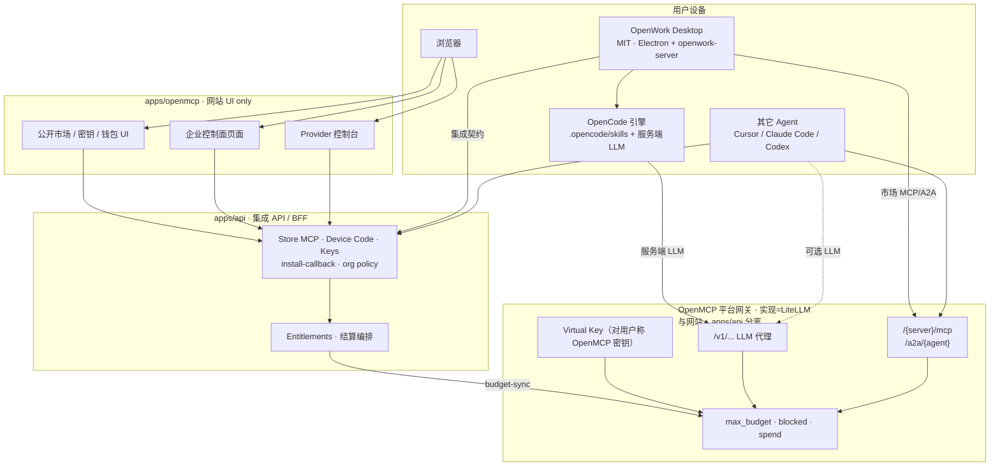

# OpenMCP 产品方案（桌面集成 · 公开市场 · 企业控制面 · 平台网关）

> **文档类型**：产品 / 研发 / 设计向方案（只写文档，不改任何应用代码）  
> **撰写日期**：2026-09-29（Asia/Shanghai）  
> **受众**：产品、研发、设计  
> **证据基线**：`/workspace/docs/OPENWORK_OPENMCP_LITELLM_INTEGRATION.md`；OpenMCP `develop-mcp` tip `9c5e625d`  
> **姊妹文档**：[商业方案](./OPENMCP_COMMERCIAL_PLAN.md) · [技术实现方案](./OPENMCP_TECHNICAL_IMPLEMENTATION.md)  
> **约束**：不写入任何密钥；不对 `openwork` / `n8nshow` 做代码补丁。  
> **品牌提示**：终端用户只见 **OpenMCP** 与 **OpenWork**；**LiteLLM** 仅出现在实现/运维/合作伙伴技术语境（决策 #11）。

---

## 1. 摘要与决策锁定

### 1.1 产品一句话

以 **OpenWork 桌面**为本地执行面，以 **OpenMCP 公开市场**为能力供给与交易中心，以 **OpenMCP 自研企业控制面**替代对 OpenWork Den / EE 的依赖，以 **OpenMCP 平台网关**（实现：**LiteLLM** 单一供应商）统一承载 **LLM + A2A + MCP**，并作为 OpenWork 内置 OpenCode 的**服务端 LLM 网关**。

### 1.2 产品所有者已锁定决策（13 条）

| # | 决策 | 产品结论 |
|---|------|----------|
| 1 | 市场 / 桌面 LLM·MCP·A2A 网关是否走 Den | **否**。一律走 **OpenMCP 平台网关**（LiteLLM 实现） |
| 2 | 控制面 | **OpenMCP 自研**；形态见决策 #13（独立模块 `apps/enterprise`），规避 EE / Den 许可证 |
| 3 | Org / 策略 / 目录等 | 在 **OpenMCP 内**实现，不通过再分发/托管 Den |
| 4 | 企业默认能力源 | **OpenMCP 公开市场**（MCP / A2A / Skills） |
| 5 | 个人可否永不登 Den | **是**；个人路径仅 OpenMCP + 桌面 MIT |
| 6 | Provider 分成是否经 Den | **否**；OpenMCP ↔ 创作者 ↔（背后 LiteLLM 计量） |
| 7 | 中国区 Den 独立托管 | **不提供** |
| 8 | 网关供应商 | **LiteLLM 单一供应商**（实现层）；用户面不另立第二网关品牌 |
| 9 | caution 级 Skill 企业策略 | **默认提示后允许**（用户确认后安装/启用），非硬拦 |
| 10 | A2A 0.3 / 1.0 与客户端矩阵 | **由 OpenMCP 维护**并对外发布 |
| 11 | 统一网关范围与用户品牌 | LiteLLM = **LLM + A2A + MCP** 统一后端，并服务 OpenWork→OpenCode **服务端 LLM**；对终端用户 **无 LiteLLM 产品面**——一律称 **OpenMCP 密钥 / OpenMCP Virtual Key / 平台网关 Key** 与 **OpenMCP 平台网关** |
| 12 | 网站 UI vs 客户端 API | **网站（`apps/openmcp`）= 用户 Web UI only**；**Desktop / Agent 集成 API 在 `apps/api`**（独立服务）。网站不拥有桌面集成契约；平台网关（LiteLLM）与网站、`apps/api` 均分离，专责 LLM+MCP+A2A 热路径 |
| 13 | 企业控制面部署形态 | **阶段 B 锁定**：私有化企业控制面 = **独立可部署模块**（建议 **`apps/enterprise`** / **OpenMCP Enterprise Control Plane**），**不做「先同仓再拆」**。与主应用（市场/钱包/结算/公开目录）**仅 API 交互**。可借鉴 Den 分层与能力清单，**不**嵌入/托管 Den。控制面 **不是** 平台网关；桌面仍走 `apps/api` + 平台网关 |

### 1.3 设计原则

1. **远端集成优先**：Store MCP + 平台网关 URL + `SKILL.md` 对齐；不把市场塞进 `ee/`。  
2. **本地优先执行**：Skill 与本地工具在用户机器跑。  
3. **计费硬闸在平台网关**：OpenMCP 应用不在热路径上代理业务工具/LLM 调用；硬闸在网关实现层。  
4. **身份 MVP 分离**：两套账号 + Device Code；OIDC 链接为 P1+。  
5. **中国区交付物不含 Den**。  
6. **品牌分层**：用户流只出现 OpenMCP / OpenWork；LiteLLM 仅工程与供应商语境。  
7. **UI / API 分轨**：网站只做 UI；OpenWork / OpenCode 等客户端集成走 **`apps/api`**；网站自身也调同一 API 契约。  
8. **企业控制面独立可部署（阶段 B）**：`apps/enterprise` 与主应用 API-only；私有化 SKU 不含 Den。

---

## 2. 系统上下文图



**刻意缺席**：中国区交付路径中**没有** OpenWork Den API / Den Web / Den 作为网关或控制面；也**没有**面向用户的「LiteLLM 控制台」节点；桌面**不以网站 origin 为集成 API**。国际客户若自建上游 Den，与本图虚线解耦。

### 2.1 UI / API / 企业控制面 / 网关分轨（决策 #12 · #13）

| 层 | 模块 | 产品含义 |
|----|------|----------|
| Web UI | `apps/openmcp` | 用户浏览、购买、充值、管理密钥的**页面**；可链到企业控制台 UI |
| 集成 API | `apps/api` | OpenWork / OpenCode / 其它 Agent 的 **Device Code、Store MCP、安装回调、策略投影** 等契约；网站也调同一 API |
| 企业控制面 | **`apps/enterprise`**（阶段 B） | **OpenMCP Enterprise Control Plane**：org/策略/目录/审计；**独立可部署**；与主应用 API-only；**不是**网关 |
| 平台网关 | LiteLLM 实现（OpenMCP 品牌） | 仅 LLM + MCP + A2A **调用与计费硬闸** |

**私有化拓扑（摘要）**：客户 VPC 部署 `apps/enterprise` + `apps/api` + 平台网关 + OpenWork 桌面；可选签名 API 联通 SaaS 主应用（市场/结算）；**无 Den**。完整 mermaid 与 SaaS-only vs on-prem 对照见 [技术实现方案 §4.6](./OPENMCP_TECHNICAL_IMPLEMENTATION.md)。

---

## 3. 角色与核心旅程

### 3.1 个人用户：「永不登 Den」

```text
安装 OpenWork 桌面（MIT，可无任何云账号）
  → 浏览器打开 OpenMCP，注册/登录
  → 在 OpenMCP 创建「平台密钥 / OpenMCP Virtual Key」（文案禁止写 LiteLLM Key）
  → 浏览公开市场；免费获取或钱包购买 Skill
  → Device Code 或平台密钥连接 **`apps/api` Store MCP**（可选，从桌面「市场安装」；**非**网站 `/api`）
  → Skill 写入 .opencode/skills/<slug>/（保留 openmcp.* frontmatter）
  → OpenCode 服务端 LLM：指向 OpenMCP 平台网关 base URL + 同一把平台密钥
  → MCP/A2A：仅配置平台网关 URL + 同一把密钥（禁止 Provider 原始 endpoint）
  → 调用受平台网关预算硬闸；余额不足则失败并引导 OpenMCP 充值
```

**验收标准**：全程无 Den URL、无 Den 登录；用户可见文案/UI/错误提示中**不出现**「LiteLLM」品牌（工程师调试日志除外）。

### 3.2 企业管理员：「公开市场 + 独立企业控制面（阶段 B）」

```text
开通 / 部署 OpenMCP Enterprise Control Plane（apps/enterprise，可 SaaS 或专有云）
  → 控制台创建组织、邀请成员、配置预算池与策略
  → 默认能力目录 = 公开市场（经 API 同步或镜像）；管理员白名单 / 「仅 certified」
  → 桌面策略：caution = 提示后允许（可上收紧）；桌面经 apps/api 拉策略投影
  → 成员用 OpenWork；LLM + 市场调用走 OpenMCP 平台网关（非控制面）
  → 审计落 apps/enterprise；settlement 权威仍在 OpenMCP 主应用
```

**不纳入默认旅程**：部署或登录中国区 Den；向成员发放「LiteLLM 账号」；把 Den `/mcp/agent` 当市场执行总线；「先把企业表做进主站再拆模块」。

### 3.3 Provider（创作者）

```text
KYC 入驻 → 上架 Skill（扫描门控）或 MCP/A2A（注册到平台网关 / LiteLLM 实现）
  → 用户购买/调用 → settlement → provider_earnings → 提现
```

分成**不**出现 Den 节点；计量可来自网关 spend，**应付在 OpenMCP**。

### 3.4 其它 Agent 客户端

与个人类似：Store MCP 安装 + **OpenMCP 平台密钥**调用；OpenWork 为一等推荐 runtime，但不唯一。安装文案写平台网关 URL，不写「LiteLLM」。

---

## 4. 模块划分

### 4.1 公开市场（已有，持续演进）

| 能力 | 说明 | 状态锚点 |
|------|------|----------|
| Skills 浏览/购买/下载/package | `securityGrade`、entitlement、ZIP | ✅ `develop-mcp` |
| Store MCP | `search_assets` / `get_asset` / `install_asset` | ✅ |
| Device Code + Auth Code(+PKCE) | 客户端连接 | ✅ |
| MCP/A2A 市场与「仅平台网关」安装文案 | 禁止直连 Provider；文案用 OpenMCP 品牌 | ✅ / 需文案校对 |
| Provider 入驻、扫描、分成、提现 | 70/30 等 | ✅ |
| runtime=`openwork` 安装说明 | 目标目录 `.opencode/skills`；含 LLM 网关指向 | MVP 补齐 |
| 密钥管理 UI | 「OpenMCP 密钥」创建/吊销/预算展示 | ✅ 能力有；需品牌校对 |

### 4.1.1 网站与 `apps/api`（决策 #12）

| 模块 | 产品职责 |
|------|----------|
| `apps/openmcp` | **仅网站 UI**（市场、账号、钱包/账单页、Provider/Admin；可链企业控制台） |
| `apps/api` | **客户端集成 API**：Store MCP、Device Code、密钥、安装回调、策略投影等；网站共用契约 |
| `apps/enterprise` | **企业控制面**（阶段 B 独立可部署）；org/策略/目录/审计；与主应用 API-only |

桌面与 Agent **不得**依赖网站 HTML 路由作为集成合同；热路径仍只走平台网关；控制面 **不是** 网关。

### 4.2 OpenMCP 平台网关（实现：LiteLLM 唯一供应商）

| 能力 | 用户说法 | 实现说明 |
|------|----------|----------|
| 统一代理 | OpenMCP 平台网关 | LiteLLM：LLM + MCP + A2A |
| 注册 MCP/A2A | 「上架到平台网关」 | `{providerSlug}__{assetName}` 等既有约定 |
| 密钥生命周期 | OpenMCP 密钥签发/删除 | Virtual Key 与 OpenMCP 同步；生产无网关则 fail closed |
| OpenCode LLM | 「桌面使用平台模型」 | OpenWork→OpenCode→同一网关 base URL + 平台密钥 |
| 预算硬闸 | 平台余额不足不可用 | `max_budget = available + spend`；`blocked` |
| 热路径 | — | 请求不经 OpenMCP 应用进程，不经 Den |
| 结算回写 | OpenMCP 账单 / Provider 收益 | cron → `gateway_spend_records` → 扣余额 → 分成 |

**非目标**：第二用户可见网关品牌；用 OpenWork Gateway / Den 代理本方案 LLM 或市场工具；在用户 onboarding 中引导「注册 LiteLLM」。

### 4.3 OpenMCP 企业控制面（`apps/enterprise` · 阶段 B · 替代 Den）

目标：覆盖原「会想用 Den 得到」的企业能力子集，许可证完全在自有栈内。  
**形态锁定（决策 #13）**：产品名 **OpenMCP Enterprise Control Plane**；实现模块建议 **`apps/enterprise`**——**独立可部署，从第一天起不做「先同仓再拆」**；与主应用（市场/钱包/结算/公开目录）**仅 API**；**不是**平台网关。可借鉴 Den 分层与能力清单，**不**嵌入/托管 Den。

| 子域 | MVP | P1 | P2 |
|------|-----|----|----|
| 组织与成员 | 组织、角色（管理员/成员）、邀请链接 | 细粒度角色 | SCIM / 目录同步 |
| 身份 | 平台账号；桌面 Device Code（经 `apps/api`） | OIDC 企业 IdP；账号链接 | 统一会话体验 |
| 能力目录 | 公开市场视图 + 组织白名单 | 「仅 certified」；审批流 | 私有上架通道 / airgap 包 |
| 桌面策略 | caution=提示后允许；可选禁用未认证自动装 | 版本锁定、模型/网关策略扩展 | 与合规套件打包 |
| 预算与密钥 | 组织钱包 / 共享平台密钥池（经 api↔网关） | 部门配额 | 统一账单（座位+用量+采购） |
| 审计 | 安装与 spend 基础日志 | 导出与告警 | 驻留与专有云审计仓 |
| 私有化交付 | 模块边界与 API 契约可安装 | Helm：enterprise + api + 网关 | 空载目录与更高合规 |

**明确不做**：并入 `ee/apps/den-api`；中国区 Den 壳；LiteLLM Admin 当用户产品；控制面代理热路径；阶段 A「先同仓再拆」作默认。

私有化拓扑与 SaaS vs on-prem 对照 → [技术实现 §4.6](./OPENMCP_TECHNICAL_IMPLEMENTATION.md)。

### 4.4 OpenWork 桌面客户端（对接面，非本提案改码范围）

| 能力 | 产品期望 | 实现策略 |
|------|----------|----------|
| 本地 Skill 执行 | 读 `.opencode/skills/**/SKILL.md` | 已有 OpenCode 语义 |
| 服务端 LLM | 默认或可选指向 **OpenMCP 平台网关** + 平台密钥 | 与市场工具共用 Key；**不**走 Den / 上游 OpenWork Gateway（本方案路径） |
| 市场安装 | Library「OpenMCP」或官方安装 Skill | MVP 可用文档+手动/Agent 安装；P1 原生入口 |
| 网关 MCP/A2A | 添加平台 remote MCP/A2A | 用户配置或 `install_asset` snippet（文案 OpenMCP） |
| 企业策略消费 | 拉取 OpenMCP 企业模块策略 | P1；MVP 可用本地确认流 |
| Den 登录 | **个人默认不出现** | 不把 Den 当必经 onboarding |

---

## 5. 集成面

### 5.1 Store MCP（宿主：`apps/api`）

| 项 | 契约 |
|----|------|
| 端点 | **`{API}/mcp/store`**（`apps/api`；**不是**网站 `{APP}/api/mcp/store` 作为长期 SoT） |
| 工具 | `search_assets`、`get_asset`、`install_asset` |
| 鉴权 | **OpenMCP 平台密钥**或 Store OAuth（Device Code / Auth Code+PKCE），均由 `apps/api` 颁发/校验 |
| 语义 | **发现与安装**，不执行上游业务工具 |
| 回调 | `{API}/skills/:id/install-callback` 登记安装 |
| 网站 | UI 需要时调用同一 `apps/api` 契约，不另立桌面专用语义 |

### 5.2 Skills 安装

| 项 | 约定 |
|----|------|
| 包格式 | `SKILL.md` + 可选附属文件；YAML frontmatter |
| 溯源 | 保留 `openmcp.*`（skillUrl、slug、skillId、version…） |
| 落地路径 | workspace `.opencode/skills/<slug>/` |
| 安全展示 | caution 必须展示 `riskSummary`；企业策略见 §6 |
| 升级 | 以 `openmcp.skillId` + version 定位本地目录覆盖 |

### 5.3 平台网关 URL（用户文案）

| 资产 | 客户端应配置（用户说明用语） | 实现备注 |
|------|------------------------------|----------|
| LLM | OpenMCP 平台网关 base + 平台密钥 | LiteLLM OpenAI 兼容等路由 |
| MCP | `{GATEWAY_BASE}/{serverName}/mcp` | 同上栈 |
| A2A | `{GATEWAY_BASE}/a2a/{agentName}` | 同上栈 |
| 鉴权头 | 文档写「OpenMCP 平台密钥」 | `x-litellm-api-key` 或 `Authorization: Bearer`（工程名可保留） |
| 禁止 | Provider 原始 endpoint；用户流写「LiteLLM Key」 | — |

### 5.4 身份：Device Code（MVP）

```text
桌面 → apps/api 发起 Device Code
  → 用户浏览器打开 OpenMCP 网站授权页（UI）
  → 桌面从 apps/api 获 token / 使用已有 OpenMCP 平台密钥
  → 调用 apps/api Store MCP；同一把密钥调平台网关（LLM + MCP/A2A）
```

**不做（MVP）**：嵌入密码表单抓凭据；把 OpenMCP 会话冒充 Den 会话；强制合并用户表；要求用户另开 LiteLLM 控制台账号；以网站 origin 作为桌面集成基址。

**P1+**：OIDC 链接（OpenMCP 作 Client，企业 IdP 作 IdP）；邮箱级账号关联。

### 5.5 双表面说明（若仍出现）

| 表面 | 用途 | 本方案态度 |
|------|------|------------|
| OpenMCP Store MCP | 公开市场安装 | **主推，必达** |
| 上游 `/mcp/agent` | 组织内执行总线（Den） | **中国区不交付**；个人路径永不需要；国际自选则与计费解耦 |

---

## 6. 策略

### 6.1 caution 级 Skill（锁定）

| 场景 | 行为 |
|------|------|
| 个人 | 展示风险摘要；用户确认后下载/安装 |
| 企业默认 | **提示后允许**（confirm → 安装/启用），**非**硬拦截 |
| 企业可配置上收紧 | 例如「仅 certified」「禁止 caution」「需管理员审批」 |

产品文案避免「企业默认拒绝 caution」；**默认以提示后允许为准**。

### 6.2 A2A 版本与客户端支持矩阵（OpenMCP 维护）

OpenMCP 作为 SoT，维护并发布类似下表的矩阵（内容随版本更新；下表为结构示例）：

| A2A 协议 | 平台网关支持（实现 LiteLLM） | OpenWork 桌面 | 其它一等客户端 | 备注 |
|----------|------------------------------|---------------|----------------|------|
| 0.3 | （由 OpenMCP 实测登记） | （登记） | （登记） | 兼容窗口 |
| 1.0 | （由 OpenMCP 实测登记） | （登记） | （登记） | 优先演进 |

职责：

- **OpenMCP**：定义支持声明、变更日志、安装提示词中的版本字段、回归测试清单；对外矩阵用「平台网关」表述。  
- **客户端**：按矩阵实现；不在矩阵内的组合标注「实验/不支持」。  
- **Provider**：上架时申报 Agent Card / 协议版本；门禁可读矩阵拒绝明显不兼容组合（P1）。

### 6.3 文案 / UX 品牌规范（决策 #11）

| 场景 | 应用 |
|------|------|
| 按钮、空态、错误、账单、邮件 | OpenMCP 密钥 / 平台网关 / 平台余额 |
| 帮助中心用户篇 | 不出现 LiteLLM 注册步骤 |
| 工程 README、运维 runbook、供应商合同附件 | 可写 LiteLLM |
| OpenWork 设置项 | 「OpenMCP 平台」而非「LiteLLM」 |

---

## 7. MVP / P1 / P2 范围与非目标

### 7.1 MVP

1. 文档与商业/产品方案（本文与姊妹篇）定稿，含品牌分层。  
2. OpenMCP：`runtime=openwork` 安装提示与目录说明（`.opencode/skills/<slug>`）；LLM 指向平台网关。  
3. 「OpenWork × OpenMCP」入门页：Device Code、下载 Skill、配置 **OpenMCP 平台密钥**（禁止 LiteLLM 用户文案）。  
4. 闭环验证：Skill 安装；OpenCode LLM + MCP/A2A 经同一平台网关；预算硬闸生效。  
5. 明确个人路径无 Den；中国区无 Den 托管 SKU。  
6. caution：UI 风险摘要 + 确认后继续。  
7. 发布初版 A2A/客户端支持矩阵页面（可先手工维护；对外称平台网关）。

### 7.2 P1

1. OpenWork Library「OpenMCP」分组（调用 Store MCP、写 skills、`install-callback`）——以集成任务交付，本提案仍不直接改上游仓。  
2. **`apps/enterprise`（阶段 B）** MVP：组织、成员、白名单、预算池、caution 默认、与主应用 API 契约；平台密钥组织池经 `apps/api`。  
3. OIDC / 账号链接。  
4. 支付：微信/支付宝直连购 Skill（减少仅钱包摩擦）。  
5. Provider Mode ② 或「用户自带上游 OAuth」排期启动。  
6. 矩阵自动化抽检与上架门禁联动；全站用户文案品牌审计。

### 7.3 P2

1. 深度链接 `openwork://install-skill?…`（需协议注册与商标/客户端配合）。  
2. 专有云一键套件（**`apps/enterprise` + `apps/api` + 网关**；**不含 Den**）。  
3. 统一账单视图；Refresh Token；用户禁用密钥同步网关 `blocked`。  
4. 园区白标；SCIM；更高合规审计。  
5. 长期评估网关抽象——**运营上仍可坚持单一供应商 LiteLLM**，工程上降低切换成本；用户品牌仍为 OpenMCP。

### 7.4 非目标（防蔓延）

1. ❌ 修改 `different-ai/openwork` 应用代码作为本文交付物。  
2. ❌ 把 OpenMCP 并进 `ee/apps/den-api`。  
3. ❌ 中国区独立托管 OpenWork Den。  
4. ❌ Den 作为 LLM/市场网关或分成节点。  
5. ❌ Provider 直连 endpoint 写入客户端。  
6. ❌ 用 OpenWork Gateway 账本结算本方案 LLM/市场调用。  
7. ❌ 匿名下载 Skill。  
8. ❌ Eval 分数替代 `securityGrade` 门控。  
9. ❌ MVP 强行合并两套用户表。  
10. ❌ 文档或仓库提交真实密钥 / KYC 样例。  
11. ❌ 冒充 OpenWork 官方发行版或绕过 EE 条款再分发控制面。  
12. ❌ 面向终端用户售卖或引导「LiteLLM」独立产品 / Key 品牌。  
13. ❌ 以网站（`apps/openmcp`）长期承载桌面集成 API（SoT 为 `apps/api`）。  
14. ❌ 企业控制面「先同仓再拆」；❌ 嵌入/托管 Den；❌ 控制面当网关。

---

## 8. 数据与计费流（不经 Den）

```text
充值 / 购 Skill / 签发 OpenMCP 平台密钥
  → OpenMCP balances / skill_entitlements / key records
  → syncUserGatewayBudget
  → 平台网关 /key/update (max_budget, blocked)   ← LiteLLM 实现

OpenWork→OpenCode LLM 或 Agent 调用 MCP/A2A
  → 平台网关鉴权 + spend
  → 超预算则拒绝

定时 gateway-settlement
  → spend logs → gateway_spend_records（request_id 幂等）
  → 扣 balances → 再 sync
  → provider_earnings（约 70%）   ← 仅 OpenMCP 账本；≠ Den
```

| 数据类 | 用户权威系统 | 实现 | Den |
|--------|--------------|------|-----|
| 用户钱包与权益 / 密钥 | OpenMCP | VK 同步至网关 | 不参与 |
| 调用 spend | OpenMCP 账单展示 | LiteLLM → OpenMCP 回写 | 不参与 |
| Provider 应付 | OpenMCP | settlement | 不参与 |
| 企业策略与组织 | OpenMCP 企业模块 | — | 不参与（本方案） |
| 本地 Skill 文件 | 用户磁盘 | — | 不参与 |

Skill **执行**本身不经网关（一次性购买模型）；**LLM 与 MCP/A2A 调用**经同一平台网关。

---

## 9. 风险、依赖、开放问题

### 9.1 风险

| 风险 | 缓解 |
|------|------|
| 企业模块自研落后于市场预期 | MVP 切片；先白名单+预算+caution 默认 |
| LiteLLM 单点（实现层） | SLA、监控、专有云热备；抽象层 P2 |
| 用户面品牌泄漏 | UX 文案清单；错误码映射为 OpenMCP 用语 |
| Mode ① 代持 | 合同披露；高合规专有云 / Mode ② |
| 桌面多来源资产认知混乱 | Library provenance：Local / OpenMCP |
| Skill 多文件包安装不完整 | MVP 限制结构；对齐 OpenCode settle |
| 结算延迟 | UI 提示；硬闸在平台网关 |
| 商标与兼容话术 | 法务审；一等 runtime 需授权则降级为「社区兼容」 |
| OpenCode LLM 与市场 Key 共用误解 | 入门页说明「一把平台密钥同时用于模型与市场工具」 |

### 9.2 外部依赖

- OpenWork 桌面 MIT 行为与 OpenCode Skill / LLM 配置路径稳定。  
- LiteLLM 作为实现供应商的 LLM/MCP/A2A 代理与管理 API。  
- OpenMCP `develop-mcp` 既有 Store / 结算 / 扫描（tip `9c5e625d` 基线）。  
- 支付与 KYC 合规运营。

### 9.3 开放问题（决策已锁外的工程细节）

1. 企业策略下发：推模式 vs 桌面启动拉取？  
2. 组织钱包与个人钱包并存时的平台密钥归属 UX？  
3. A2A 矩阵的自动化程度与发布节奏？  
4. `install_asset` 对 `runtime=openwork` 的 files 布局是否需多文件规范 RFC？  
5. 国际客户「自带 Den」时，产品是否提供「仅兼容说明」页而非集成开关？  
6. 用户协议中第三方网关组件的最小必要披露文案？

---

## 10. 附录：对照旧稿变更说明

相对 `/workspace/docs/OPENWORK_OPENMCP_LITELLM_INTEGRATION.md` 及本双文档上一版：

| 旧表述 / 开放问题 | 现锁定 |
|-------------------|--------|
| 组织内能力分发 → Den | → **OpenMCP 自研企业控制面** |
| 企业包含自托管 Den | → **中国区不提供 Den 独立托管** |
| 市场流量是否可能与 Den 网关混淆 | → **仅 OpenMCP 平台网关**（LiteLLM 实现）；Den 永不做网关 |
| 个人可否永不登 Den | → **是** |
| 分成是否经 Den | → **否**；计量可在 LiteLLM，结算在 OpenMCP |
| 中国区 Den 托管 | → **不提供** |
| 网关单一 vs 可替换 | → 运营 **单一 LiteLLM**；用户品牌恒为 OpenMCP |
| caution 默认 | → **提示后允许** |
| A2A 矩阵谁维护 | → **OpenMCP** |
| 企业默认能力源 | → **公开市场** |
| 用户「使用 LiteLLM」表述 | → 改为 **OpenMCP 平台网关 / 平台密钥**；LiteLLM 仅实现层 |
| OpenCode 服务端 LLM | → **同一平台网关**，非 Den、非第二用户可见品牌 |
| 集成挂在 `apps/openmcp` `/api/*` | → **`apps/api` 为桌面/Agent 集成 SoT**；网站 UI only（决策 #12） |
| 企业控制面同仓扩展 | → **阶段 B：`apps/enterprise` 独立可部署**（决策 #13） |

---

## 11. 附录：用户视角 vs 实现视角

| 维度 | 用户视角 | 实现视角 |
|------|----------|----------|
| 看见谁 | OpenWork + OpenMCP | + LiteLLM 集群 |
| 网关名 | OpenMCP 平台网关 | LiteLLM Proxy |
| 密钥名 | OpenMCP 密钥 / OpenMCP Virtual Key / 平台网关 Key | LiteLLM Virtual Key |
| OpenCode LLM | 桌面「平台模型」设置 | OpenCode → 同一 LiteLLM |
| 市场 MCP/A2A | 「经 OpenMCP 调用」 | LiteLLM 路由 |
| 分成 | OpenMCP Provider 中心 | spend←LiteLLM；应付∈OpenMCP；**Den 不在链上** |
| 文案禁区 | 用户流不出现 LiteLLM 品牌 | 工程/运维/供应商附件可写 |
| 网站 | OpenMCP 网页 | `apps/openmcp` UI |
| 桌面集成 API | 「连接 OpenMCP / 平台 API」 | **`apps/api`** |
| 企业控制面 | OpenMCP 企业控制台 | **`apps/enterprise`**（≠ 网关、≠ Den） |

---

## 12. 附录：关键路径索引（精简）

| 路径 | 用途 |
|------|------|
| `/workspace/docs/OPENWORK_OPENMCP_LITELLM_INTEGRATION.md` | 完整证据与旧集成分析 |
| `/workspace/docs/OPENMCP_COMMERCIAL_PLAN.md` | 商业方案姊妹篇 |
| `/workspace/docs/OPENMCP_TECHNICAL_IMPLEMENTATION.md` | 技术实现（含 `apps/api` 路由分组） |
| OpenMCP `apps/docs/PRODUCT.md` | 产品 SoT |
| OpenMCP Store / 网关 / Settlement 文档 | 见旧稿 §7.2（工程名可含 litellm） |
| OpenWork `LICENSE` / `ee/LICENSE` | MIT vs EE 边界（本方案规避 EE 交付） |

---

*文档结束。路径：`/workspace/docs/OPENMCP_PRODUCT_PLAN.md`*
