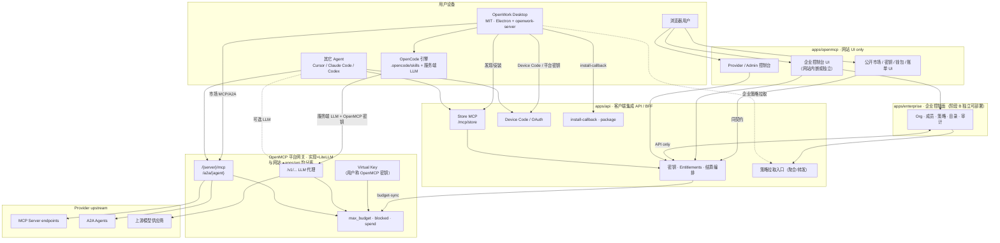
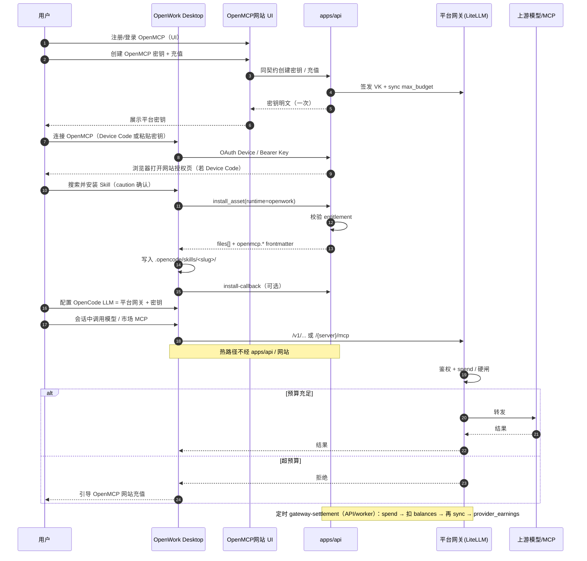
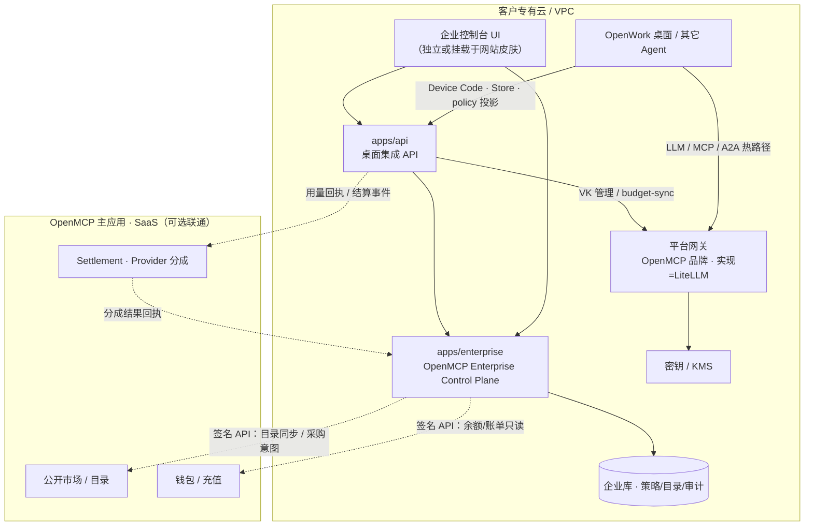

# OpenMCP × OpenWork 技术实现方案（个人 / 企业分轨）

> **文档类型**：研发 / 架构向技术实现方案（只写文档，不改任何应用代码）  
> **撰写日期**：2026-09-29（Asia/Shanghai）  
> **受众**：研发、架构  
> **证据基线**：  
> - `/workspace/docs/OPENMCP_PRODUCT_PLAN.md`（产品主决策）  
> - `/workspace/docs/OPENMCP_COMMERCIAL_PLAN.md`（计费 / 品牌约束）  
> - `/workspace/docs/OPENWORK_OPENMCP_LITELLM_INTEGRATION.md`（API / 路径证据）  
> - OpenMCP `develop-mcp` tip `9c5e625d`；OpenWork 本地克隆约 `b19ea8d`（路径只读，未修改）  
> **姊妹文档**：[产品方案](./OPENMCP_PRODUCT_PLAN.md) · [商业方案](./OPENMCP_COMMERCIAL_PLAN.md)  
> **约束**：不写入任何密钥；不对 `openwork` / `n8nshow` 做代码补丁；不编造生产指标。  
> **品牌提示**：终端用户只见 **OpenMCP** 与 **OpenWork**；**LiteLLM** 仅实现 / 运维 / 供应商语境（决策 #11）。  
> **架构提示**：网站（`apps/openmcp`）= **UI only**；桌面 / 客户端集成契约在 **`apps/api`**；平台网关（LiteLLM 实现）为独立热路径（决策 #12）。  
> **企业控制面**：从第一天起即为**独立可部署模块**（阶段 B / `apps/enterprise`）；与主应用（市场/钱包/结算）**仅 API 交互**；**不做**「先同仓再拆」（决策 #13）。

---

## 1. 目标与非目标、决策锁定表

### 1.1 目标

1. 以 **OpenWork Desktop（MIT）** 为本地执行面，以 **OpenMCP 公开市场** 为能力供给与交易中心。  
2. 以 **OpenMCP 平台网关**（实现：**LiteLLM 单一供应商**）统一承载 **LLM + A2A + MCP**，并作为 OpenWork 内置 **OpenCode 服务端 LLM** 的唯一本方案路径。  
3. **个人轨** 与 **企业轨** 技术路径全程分列：身份、密钥、策略、目录、部署拓扑均不混写为同一默认路径。  
4. **企业控制面** = **OpenMCP Enterprise Control Plane**（建议模块 `apps/enterprise`），**阶段 B：独立可部署**；不依赖 OpenWork Den / EE；**不是** LLM/MCP/A2A 网关。  
5. 计费硬闸在平台网关实现层；网站与 `apps/api` **均不在** LLM/MCP/A2A 热路径上代理业务调用。  
6. 用户面文案恒为 **OpenMCP 平台网关 / OpenMCP 密钥（Virtual Key）**。  
7. **UI / API 分轨**：网站仅 Web UI；OpenWork / OpenCode / 其它客户端的集成 API 一律走 **`apps/api`**（网站自身业务请求亦调用同一 `apps/api` 契约，不把桌面合同绑在网站 origin）。

### 1.2 非目标

1. ❌ 修改 `different-ai/openwork` 或 OpenMCP 应用代码作为本文交付物。  
2. ❌ 把 OpenMCP 并入 `ee/apps/den-api`；中国区独立托管 Den。  
3. ❌ Den 作为 LLM / 市场 MCP·A2A 网关或 Provider 分成节点。  
4. ❌ 面向终端用户售卖或引导「LiteLLM」独立产品 / Key 品牌。  
5. ❌ Provider 原始 endpoint 写入客户端配置。  
6. ❌ 用 OpenWork Gateway（`ee/apps/gateway`，`ow_gw_`）结算本方案 LLM / 市场调用。  
7. ❌ 匿名下载 Skill；Eval 分数替代 `securityGrade` 门控。  
8. ❌ MVP 强行合并 OpenMCP 与任何第三方用户表。  
9. ❌ 文档或仓库提交真实密钥 / KYC 样例。  
10. ❌ 把桌面集成契约继续挂在网站（`apps/openmcp`）Next Route Handlers 上作为长期 SoT（迁移目标：`apps/api`）。  
11. ❌ 让网站直接成为平台网关，或让 `apps/api` 代理 LLM/MCP/A2A 热路径用量。  
12. ❌ 企业控制面「先做同仓扩展再拆包」（阶段 A）作为默认路径；❌ 嵌入/托管 Den。  
13. ❌ 把 `apps/enterprise` 做成平台网关或热路径代理。

### 1.3 决策锁定表（含 #11–#13）

| # | 决策 | 技术结论 |
|---|------|----------|
| 1 | 市场 / 桌面 LLM·MCP·A2A 网关是否走 Den | **否**。一律走 **OpenMCP 平台网关**（LiteLLM 实现） |
| 2 | 控制面 | **OpenMCP 自研**；实现为独立模块 **`apps/enterprise`**（决策 #13），规避 EE / Den 许可证 |
| 3 | Org / 策略 / 目录 | 在 **OpenMCP 内**实现，不通过再分发 / 托管 Den |
| 4 | 企业默认能力源 | **OpenMCP 公开市场**（MCP / A2A / Skills） |
| 5 | 个人可否永不登 Den | **是**；个人路径仅 OpenMCP + 桌面 MIT |
| 6 | Provider 分成是否经 Den | **否**；OpenMCP ↔ 创作者 ↔（背后 LiteLLM 计量） |
| 7 | 中国区 Den 独立托管 | **不提供** |
| 8 | 网关供应商 | **LiteLLM 单一供应商**（实现层）；用户面不另立第二网关品牌 |
| 9 | caution 级 Skill 企业策略 | **默认提示后允许**（用户确认后安装 / 启用），非硬拦 |
| 10 | A2A 0.3 / 1.0 与客户端矩阵 | **由 OpenMCP 维护**并对外发布 |
| 11 | 统一网关范围与用户品牌 | LiteLLM = **LLM + A2A + MCP** 统一后端，并服务 OpenWork→OpenCode **服务端 LLM**；对终端用户 **无 LiteLLM 产品面**——一律称 **OpenMCP 密钥 / OpenMCP Virtual Key / 平台网关 Key** 与 **OpenMCP 平台网关** |
| 12 | 网站 UI vs 客户端 API | **`apps/openmcp`（网站）= 用户可见 Web UI only**；**Desktop ↔ OpenMCP 集成 API 归属 `apps/api`**（独立 API / BFF 服务）。网站不拥有桌面集成契约；OpenWork / OpenCode / 其它 Agent 客户端调 `apps/api`。网站页面所需数据亦经同一 `apps/api` 契约。**平台网关（LiteLLM）与两者分离**，专责 LLM+MCP+A2A 热路径 |
| 13 | 企业控制面部署形态 | **锁定阶段 B**：企业私有化控制面 = **独立可部署模块**（建议名 **`apps/enterprise`** / 产品名 **OpenMCP Enterprise Control Plane**），**从第一天起不做「先同仓再拆」**。与 OpenMCP 主应用（市场 / 钱包 / 结算 / 公开目录）**仅经 API 交互**。可借鉴 Den 的分层与能力清单，**禁止**嵌入/托管 Den。控制面 **不是** LLM/MCP/A2A 网关；桌面仍走 `apps/api` + 平台网关 |

### 1.4 分轨总原则（研发必读）

| 维度 | 个人轨 | 企业轨 |
|------|--------|--------|
| 账号 | 个人 OpenMCP 账号 | 组织 + 成员（**`apps/enterprise`**） |
| Den | **永不依赖** | **中国区交付不含 Den**；国际客户自带 Den 与本栈解耦 |
| 密钥 | 个人 OpenMCP Virtual Key | 组织级 / 成员级 Virtual Key + 预算池 |
| 能力源 | 公开市场 | 公开市场 + 企业目录 / 白名单策略 |
| 策略 | 个人确认（caution 展示 riskSummary） | 策略引擎下发；caution 默认「提示后允许」 |
| 部署 | 公有：网站 + `apps/api` + 平台网关 | 专有云：**`apps/enterprise` + `apps/api` + 平台网关**（± 可选企业控制台 UI；**不含 Den**） |
| 集成入口 | 客户端 → **`apps/api`**（非网站 origin） | 桌面 → `apps/api` + 网关；企业控制台 → `apps/enterprise` + `apps/api` |
| 控制面模块 | — | **`apps/enterprise`（阶段 B 独立部署）**；与主应用 API-only |

---

## 2. 总架构

### 2.1 组件关系（UI · API · 平台网关三分）

相对旧稿「一切在 `apps/openmcp` 单体 Next Route」的表述，**现行锁定**：

| 模块 | 职责 | 不负责 |
|------|------|--------|
| **`apps/openmcp`（网站）** | 用户可见 Web UI：市场浏览、账号、钱包/账单页、Provider/Admin；**可嵌或链到企业控制台 UI** | 桌面集成契约；LLM/MCP/A2A 热路径；企业控制面**数据面** |
| **`apps/api`（API / BFF）** | Desktop ↔ OpenMCP **集成表面**：Device Code、密钥、Store MCP、install helpers / callback、策略拉取（转发/聚合）、A2A 矩阵等；网站亦调同一契约 | 替代平台网关做用量硬闸代理；替代 `apps/enterprise` 做组织权威存储 |
| **`apps/enterprise`（企业控制面）** | **OpenMCP Enterprise Control Plane**：org/成员/策略/目录/审计等；**独立可部署（阶段 B）**；与主应用（市场/钱包/结算）**仅 API** | **不是**网关；不嵌入 Den；不代理 LLM/MCP/A2A 热路径 |
| **平台网关（LiteLLM 实现）** | LLM + MCP + A2A 热路径、VK 预算硬闸 | 用户注册/市场 HTML；企业控制面逻辑 |



**刻意缺席**：中国区交付路径中**没有** OpenWork Den API / Den Web / Den 作为网关或控制面；也**没有**面向用户的「LiteLLM 控制台」节点；桌面**不**把网站 origin 当作集成 API 基址。

### 2.2 热路径 vs 冷路径

| 路径类型 | 流量 | 经过谁 | 不经过谁 |
|----------|------|--------|----------|
| 热路径 · LLM | OpenCode → 平台网关 `/v1/...` | LiteLLM 实现 + 上游模型 | 网站、`apps/api` 业务代理、Den |
| 热路径 · MCP/A2A | 客户端 → `/{server}/mcp`、`/a2a/{agent}` | LiteLLM 实现 + Provider upstream | 网站、`apps/api` 业务代理、Den |
| 冷路径 · 发现/安装 | Store MCP / package / callback | **`apps/api`** | 网站 Route Handler（长期）；不代理业务工具 |
| 冷路径 · Web UI 数据 | 浏览器 → 网站 → **`apps/api`** | 同一 API 契约 | 桌面直连网站做集成 |
| 冷路径 · 预算同步 | `syncUserGatewayBudget` → `/key/update` | **`apps/api`（或其后台 worker）** → LiteLLM 管理面 | 用户请求热路径 |
| 冷路径 · 结算 | `gateway-settlement` cron | LiteLLM spend logs → OpenMCP 账本（经 API/worker） | Den |

### 2.3 关键配置与端点锚点

| 配置 / 端点 | 归属 | 用途 |
|-------------|------|------|
| `NEXT_PUBLIC_APP_BASE_URL` / `www.openmcp.cn` | **`apps/openmcp` 网站** | 仅 Web UI；**不是**桌面集成 base URL |
| `NEXT_PUBLIC_API_BASE_URL`（建议，主机名 TBD） | **`apps/api`** | Desktop / Agent / 网站共用的集成 API origin |
| `NEXT_PUBLIC_GATEWAY_BASE_URL` / `api.openmcp.cn` | **平台网关**对外 | LLM / MCP / A2A 热路径（与 `apps/api` 分离） |
| `LITELLM_BASE_URL` + Master Key | `apps/api`（或内部 worker）→ LiteLLM 管理面 | 签发 Key、注册 server、预算同步（**不暴露给终端用户**） |
| `POST {API}/mcp/store` | **`apps/api`** | JSON-RPC：`search_assets` / `get_asset` / `install_asset` |
| `{API}/mcp/store/oauth/device\|token\|authorize` | **`apps/api`** | Device Code / Auth Code(+PKCE) |
| `GET {API}/skills/:id/package` | **`apps/api`** | Agent Skill 包 |
| `POST {API}/skills/:id/install-callback` | **`apps/api`** | 安装登记 |
| `GET {API}/orgs/:orgId/desktop-policy` | **`apps/api`** | 企业桌面策略（P1） |
| `GET {API}/platform/a2a-matrix` | **`apps/api`** | A2A 支持矩阵 |
| `/{serverName}/mcp`、`/a2a/{agentName}` | **平台网关** | 市场调用；头 `Authorization: Bearer` 或 `x-litellm-api-key`（工程名可保留，用户文档写「OpenMCP 平台密钥」） |
| OpenWork `.opencode/skills/<slug>/SKILL.md` | 用户磁盘 | Skill 落地 |
| OpenWork `apps/server/src/managed-provider-auth.ts`、`runtime-opencode-config-store.ts` | OpenWork（路径证据） | OpenCode provider / baseURL / apiKey 注入面（**建议对接点，本文不改码**） |

> **迁移说明**：既有 `develop-mcp` 可能仍将部分路由挂在 `apps/openmcp` 的 `/api/*`。本方案将 SoT **锁定为 `apps/api`**；实现上允许过渡期反向代理或从网站 rewrite 到 `apps/api`，但**新客户端与文档一律写 `apps/api` origin**，禁止把网站当作长期集成基址。

### 2.4 建议的 `apps/api` 路由分组（草图）

| 路由组（建议） | 能力 | 调用方 |
|----------------|------|--------|
| `/mcp/store` + `/mcp/store/oauth/*` | Store MCP 发现/安装；Device Code / Auth Code+PKCE | OpenWork、其它 Agent、（可选）网站调试 |
| `/keys`、`/wallet`、`/entitlements` | OpenMCP 密钥签发/吊销、余额、权益查询 | 网站 UI、桌面（密钥粘贴/校验） |
| `/skills/:id/package`、`/skills/:id/install-callback`、下载辅助 | Skill 包与安装登记 | 桌面 Library、Agent |
| `/orgs/*` · `desktop-policy`（桌面可见投影） | 聚合/转发自 **`apps/enterprise`**；桌面仍只调 `apps/api` | 桌面、网站 |
| （`apps/enterprise` 内部 API） | org/成员/策略/目录/审计权威 | 企业控制台；经签名调用主应用市场/结算 API |
| `/platform/a2a-matrix` | 协议/客户端支持矩阵 | 桌面、上架门禁、文档站 |
| `/internal/gateway/*`（仅服务端） | budget-sync、settlement 触发、spend webhook | worker / 网关回调；**不对公网桌面开放** |
| 健康检查 / 版本 | `GET /health`、`GET /version` | 运维、客户端兼容探测 |

网站（`apps/openmcp`）对上述**公有契约**使用同一 `NEXT_PUBLIC_API_BASE_URL`，避免 UI 与桌面两套语义漂移。

---

## 3. 个人用户技术实现

> 本章为**完整独立个人轨**。验收：**全程无 Den URL、无 Den 登录**；用户可见文案 / UI / 错误提示中**不出现**「LiteLLM」品牌（工程师调试日志除外）。

### 3.1 身份：Device Code / API Key；永不依赖 Den

#### 3.1.1 MVP 身份模型

| 主体 | 机制 | 说明 |
|------|------|------|
| OpenMCP 账号 | Better Auth（平台既有） | 浏览 / 购买 / 钱包 / 密钥管理 |
| 桌面 ↔ OpenMCP | **Device Code**（Store MCP OAuth）或 **OpenMCP 平台密钥** | 一律调 **`apps/api`**：`{API}/mcp/store/oauth/*`（**非**网站 origin） |
| Den | **不参与** | 个人 onboarding **不出现** Den 登录入口 |

```text
桌面 → apps/api 发起 Device Code
  → 用户浏览器打开 OpenMCP 网站完成授权页（UI only）
  → 桌面从 apps/api 换取 token / 或用户粘贴已有 OpenMCP 平台密钥
  → 桌面调 apps/api Store MCP；同一把密钥调平台网关（LLM + MCP/A2A）
```

**不做（MVP）**：嵌入密码表单抓凭据；把 OpenMCP 会话冒充 Den 会话；强制合并用户表；要求用户另开 LiteLLM 控制台账号；**把网站 `{APP}/api/*` 当作桌面集成基址**。

**P1+**：OIDC 链接（OpenMCP 作 Client，企业 IdP 作 IdP）——企业轨主用；个人轨可选「邮箱关联」但不阻塞 MVP。

#### 3.1.2 客户端存储建议

| 数据 | 存储位置建议 | 明文策略 |
|------|--------------|----------|
| OpenMCP 平台密钥 | OS 密钥链 / Electron safeStorage / openwork-server 加密配置 | **前端 UI 不回显完整明文**；仅创建时一次性展示 |
| Store OAuth access token | 同密钥链；短 TTL | 刷新策略 MVP 可依赖重新 Device Code（Refresh Token = P2） |
| 网关 base URL | 明文配置（非秘密） | 默认 `NEXT_PUBLIC_GATEWAY_BASE_URL` 公开值 |

### 3.2 OpenMCP 密钥签发与钱包；同步 max_budget

#### 3.2.1 生命周期（实现层 = LiteLLM Virtual Key）

```text
用户在 OpenMCP 网站 UI 点击创建「OpenMCP 密钥」
  → 网站调用 apps/api（同契约）
  → apps/api 记录 key metadata（user_id、label、enabled）
  → apps/api 调用 LiteLLM 管理 API 创建 Virtual Key（fail closed：生产无网关则拒绝签发）
  → 经 apps/api → 网站向用户一次性展示密钥明文（之后仅掩码）

充值 / 购 Skill / 余额变更（网站 UI → apps/api）
  → balances 变更
  → syncUserGatewayBudget（apps/api 或 worker）
  → LiteLLM /key/update：max_budget = available + spend；必要时 blocked
```

| 用户说法 | 实现字段 / API |
|----------|----------------|
| OpenMCP 密钥 / Virtual Key | LiteLLM Virtual Key（如 `sk-…`） |
| 平台余额 | OpenMCP `balances`（CNY 额度裸数值，有意不对齐隐式 USD） |
| 不可用 / 已禁用 | `blocked` / OpenMCP `enabled=false`（P2：用户禁用须同步网关 block） |

证据锚点（工程文档名，含 litellm）：`API_KEY_LITELLM_PROXY.md`、`LITELLM_BUDGET_SYNC.md`、`virtual-keys.ts`、`budget-alloc.ts`。

#### 3.2.2 一把密钥多用（个人轨约定）

同一把 **OpenMCP 平台密钥** 用于：

1. **`apps/api` Store MCP** 鉴权（Bearer / 平台约定头）；  
2. 平台网关 LLM（OpenCode 服务端）；  
3. 市场 MCP / A2A 调用（平台网关，**不经** `apps/api` 热路径代理）。

入门页必须写清：「一把平台密钥同时用于模型与市场工具」。

### 3.3 Skills：Store MCP / download → `.opencode/skills`；`openmcp.*` frontmatter

#### 3.3.1 安装路径

| 步骤 | 契约 |
|------|------|
| 发现 | `search_assets` / Web 市场 |
| 鉴权获取 | 免费：`skills.acquire`；付费：钱包 → `skill_entitlements` |
| 包获取 | `install_asset`（runtime=`openwork`）或 `GET /api/skills/:id/package` / ZIP |
| 落地 | workspace `.opencode/skills/<slug>/`（含 `SKILL.md`） |
| 溯源 | **保留** YAML frontmatter `openmcp.*`（`skillUrl`、`slug`、`skillId`、`version`…） |
| 登记 | 可选 `POST /api/skills/:id/install-callback` |
| caution | 展示 `riskSummary`；用户确认后继续（个人轨） |

#### 3.3.2 与 OpenWork / OpenCode 对齐

| 项 | 约定 |
|----|------|
| 引擎消费 | OpenCode 原生读 `.opencode/skills/**/SKILL.md`（OpenWork 构建于 OpenCode） |
| 多文件包 | MVP：单 `SKILL.md` 或扁平目录；多文件需验证 `apps/server/src/claude-plugin-bundle.ts` settle（TBD） |
| 升级 | 以 `openmcp.skillId` + version 定位本地目录覆盖 |
| 执行计费 | Skill **执行**不经网关（一次性购买模型）；仅 LLM / MCP / A2A 经网关 |

### 3.4 MCP / A2A：仅平台网关 URL；配置进 OpenWork / OpenCode

| 资产 | 客户端应配置（用户说明用语） | 实现备注 |
|------|------------------------------|----------|
| MCP | `{GATEWAY_BASE}/{serverName}/mcp` | LiteLLM 路由；注册名约定 `{providerSlug}__{assetName}` |
| A2A | `{GATEWAY_BASE}/a2a/{agentName}` | 同上栈 |
| 鉴权 | 「OpenMCP 平台密钥」 | `Authorization: Bearer` 或 `x-litellm-api-key` |
| **禁止** | Provider 原始 endpoint；用户流写「LiteLLM Key」 | — |

OpenWork Connections：添加 remote MCP 时只写入平台网关 URL + 平台密钥引用（密钥 ID 指针，非明文落库到可导出配置——见 §7）。

### 3.5 OpenCode LLM：base URL + OpenMCP Virtual Key

```text
OpenWork UI / openwork-server
  → 注入 OpenCode provider：
       baseURL = OpenMCP 平台网关（OpenAI 兼容等路由，如 /v1）
       apiKey  = OpenMCP 平台密钥
  → OpenCode 服务端 LLM 请求 → 平台网关 → 上游模型
  → spend 计入同一 Virtual Key 预算池
```

**建议对接面（OpenWork 路径，本文不改码）**：

| 优先级 | 路径 / 能力 | 说明 |
|--------|-------------|------|
| P0 | 文档 + 手动配置：用户在 Connections / Provider 设置中填入平台网关 baseURL + 密钥 | 零代码闭环 |
| P0 | OpenMCP 入门页：`runtime=openwork` 安装提示含 LLM 指向说明 | 平台侧文案 |
| P1 | `managed-provider-auth.ts` / `runtime-opencode-config-store.ts`：一键「使用 OpenMCP 平台模型」 | 上游 PR 或旁路插件 |
| P1 | Library「OpenMCP」分组 | Store MCP + 写 skills |

**明确不走**：Den `/mcp/agent`；OpenWork Gateway `ow_gw_` 账本；第二用户可见网关品牌。

### 3.6 客户端改动面（OpenWork 侧建议，标 P0/P1）

| ID | 改动建议 | 优先级 | 备注 |
|----|----------|--------|------|
| OW-P0-1 | 入门文档 / 官方 Skill：解压到 `.opencode/skills/<slug>` | P0 | 可不改核心代码 |
| OW-P0-2 | Provider 设置支持自定义 baseURL + API Key（若已有则校对文案为 OpenMCP） | P0 | 已有 OpenCode provider 语义 |
| OW-P0-3 | 个人 onboarding **隐藏 / 不强制** Den 登录 | P0 | 产品配置 / 文案 |
| OW-P1-1 | Library「OpenMCP」：Device Code → `install_asset` → 写磁盘 → `install-callback` | P1 | 建议 upstream PR |
| OW-P1-2 | caution 安装确认卡：展示 `riskSummary` / `securityGrade` | P1 | 对齐 DESIGN.md 同意卡 |
| OW-P1-3 | provenance 标签：Local / OpenMCP（**不含 Den 个人默认面**） | P1 | 防多表面混乱 |
| OW-P1-4 | 一键配置「OpenMCP 平台模型」写入 OpenCode provider | P1 | 密钥走 safeStorage |
| OW-P2-1 | `openwork://install-skill?…` 深度链接 | P2 | 需协议注册 |

### 3.7 服务端改动面（网站 / `apps/api` / 平台网关）

| ID | 改动建议 | 优先级 | 备注 |
|----|----------|--------|------|
| API-P0-1 | 确立 **`apps/api`** 为桌面集成 SoT；导出色含 Store MCP、OAuth、keys、package、install-callback | P0 | 决策 #12 |
| API-P0-2 | 公布 `NEXT_PUBLIC_API_BASE_URL`；入门文档禁止写网站 `/api/*` 为桌面基址 | P0 | |
| WEB-P0-1 | 网站 UI only：入门页 / 密钥页调用 `apps/api` 同契约；`runtime=openwork` 安装提示 | P0 | |
| WEB-P0-2 | 全站用户文案品牌审计：密钥 / 网关命名符合决策 #11 | P0 | |
| OM-P0-4 | 闭环验证：桌面→`apps/api` 装 Skill + OpenCode LLM + MCP/A2A 同钥 + 预算硬闸 | P0 | |
| OM-P0-5 | 初版 A2A 矩阵由 `apps/api` 下发；网站可只读展示 | P0 | 对外称「平台网关」 |
| OM-P1-1 | `install_asset` 对 openwork 的 `files[]` 布局规范（多文件 RFC） | P1 | TBD |
| API-P1-1 | 过渡期：网站旧 `/api/*` rewrite → `apps/api` 后下线 | P1 | |
| GW-P0-1 | LiteLLM：确保 LLM 路由与 MCP/A2A 同集群、同 VK 预算 | P0 | 运维配置 |
| GW-P0-2 | 生产无网关 → Virtual Key 签发 fail closed | P0 | 既有 |

### 3.8 序列图：首次登录 → 装 Skill → 调模型 → 计费



---

## 4. 企业用户技术实现

> 本章为**完整独立企业轨**。  
> **控制面** = **OpenMCP Enterprise Control Plane**（建议实现模块 **`apps/enterprise`**）——**决策 #13 锁定阶段 B：从第一天起独立可部署，不做「先同仓再拆」**。  
> 与 OpenMCP **主应用**（市场 / 钱包 / 结算 / 公开目录）**仅经 API 交互**。  
> 桌面 / Agent 仍只谈 **`apps/api` + 平台网关**；企业控制台 UI 可在网站内或独立控制台，**数据面**在 `apps/enterprise` + API。  
> 网关仍为 **OpenMCP 平台网关（LiteLLM）**；控制面 **不是** LLM/MCP/A2A 网关。  
> 可**借鉴** Den 的分层与能力清单，**禁止**嵌入 / 托管 Den。中国区**不**交付 Den。

### 4.0 阶段 B 优先（禁止默认阶段 A）

| 路径 | 含义 | 本方案态度 |
|------|------|------------|
| ~~阶段 A~~ | 企业能力先做进主仓 `apps/openmcp` / 同进程，日后再拆 | **不做默认**；避免私有化交付时二次拆分 |
| **阶段 B（锁定）** | `apps/enterprise` **独立模块 / 独立进程（可独立镜像）**，与主应用 API-only | **从第一天起**按此设计与交付 |

与主应用的边界：

```text
apps/enterprise  ──API──►  OpenMCP 主应用（市场目录只读/采购意图、钱包充值、settlement 查询）
apps/enterprise  ◄──API──  主应用（可选：资产元数据推送、分成结果回执）
桌面 / Agent     ──►  apps/api  +  平台网关     （不直连 enterprise 管理面，除非管理员控制台）
企业控制台 UI    ──►  apps/enterprise  +  apps/api（展示密钥/账单等）
```

### 4.1 `apps/enterprise`：org、成员、策略、预算池、审计（自研，非 Den）

#### 4.1.1 子域与分期

| 子域 | MVP | P1 | P2 |
|------|-----|----|----|
| 组织与成员 | 组织、角色（管理员/成员）、邀请链接 | 细粒度角色 | SCIM / 目录同步 |
| 身份 | 平台账号；桌面 Device Code | OIDC 企业 IdP；账号链接 | 统一会话体验 |
| 能力目录 | 公开市场视图 + 组织白名单 | 「仅 certified」；审批流 | 私有上架通道 |
| 桌面策略 | caution=提示后允许；可选禁用未认证自动装 | 版本锁定、模型/网关策略扩展 | 与合规套件打包 |
| 预算与密钥 | 组织钱包 / 共享平台密钥池 | 部门配额；成员级 Key | 统一账单（座位+用量+采购） |
| 审计 | 安装与 spend 基础日志 | 导出与告警 | 驻留与专有云审计仓 |

**明确不做**：把 OpenMCP 并入 `ee/apps/den-api`；再实现一套「中国区 Den」壳；给企业单独发 LiteLLM Admin 作为用户产品；**「先同仓扩展企业表再拆 `apps/enterprise`」**；让控制面代理 LLM/MCP/A2A 热路径。

**向 Den 学习（仅能力分层，不引进运行时）**：组织 / 成员、桌面策略、能力目录/白名单、审计导出等清单可对标 Den 文档做缺口表；实现全部落在自有 `apps/enterprise` + `apps/api` + 平台网关。

#### 4.1.2 建议数据实体（草图）

| 实体 | 关键字段（建议） | 说明 |
|------|------------------|------|
| `organizations` | id, name, plan, created_at | 企业租户 |
| `org_members` | org_id, user_id, role | admin / member |
| `org_invites` | token, email, expires | 邀请链接 |
| `org_policies` | org_id, caution_mode, allowlist_mode, … | 见 §4.4 |
| `org_directory_entries` | org_id, asset_id, asset_type, status | 白名单 / 审批态 |
| `org_wallets` | org_id, balance | 组织预算池 |
| `org_virtual_keys` | org_id, member_id?, litellm_key_id, scope | 组织级 / 成员级 |
| `org_audit_logs` | actor, action, payload, created_at | 安装、策略变更、spend 摘要 |

（实体权威库落在 **`apps/enterprise`** 数据面；与主应用用户/钱包通过稳定 `external_id` / API 关联。**TBD**：与既有 Better Auth Organization 的迁移或并存策略。）

### 4.2 默认能力源：公开市场 + 企业目录 / 白名单策略

```text
默认目录 = OpenMCP 公开市场（published）
  → 管理员可：
       - 白名单（仅列表内可安装）
       - 「仅 certified」
       - 审批流（P1）：成员申请 → 管理员通过 → 可 install
  → 桌面拉取「对我可见的资产视图」= 公开市场 ∩ 组织策略
```

| 模式 | 成员可见 | 安装行为 |
|------|----------|----------|
| 开放（默认） | 公开市场全部 published | caution 提示后允许 |
| 白名单 | 仅 directory 内 | 同策略 |
| 仅 certified | `certified=true` | 同策略 |
| 审批（P1） | 可浏览或仅已批 | 未批不可 `install_asset`（服务端强制） |

**不**把 Den marketplace / `/mcp/agent` 当作本方案企业能力总线。

### 4.3 密钥：组织级 / 成员级 Virtual Key；预算与 blocked

| 密钥类型 | 预算来源 | 典型用途 | 硬闸 |
|----------|----------|----------|------|
| 组织共享 Key | `org_wallets` | 小团队共享 | `max_budget` / `blocked` |
| 成员级 Key | 从组织池分配配额（P1 `budget-alloc` 扩展） | 审计到人 | 成员超额 block，不影响组织其它 Key（策略可配） |
| 个人钱包 Key | 与企业并存时（开放问题） | 个人试验 | **建议**企业托管设备禁止混用个人 Key（策略开关） |

同步公式与个人轨相同：`max_budget = available + spend`（额度单位与平台 CNY 裸数值对齐，有意不做隐式 CNY↔USD）。

结算：`gateway-settlement` → 扣组织或个人 `balances` → `provider_earnings`；**分成不经 Den**。

### 4.4 caution Skill：提示后允许的策略引擎与桌面交互约定

#### 4.4.1 策略枚举（建议）

| `caution_mode` | 行为 |
|----------------|------|
| `prompt_allow`（**企业默认**） | 展示 `riskSummary` + `securityGrade`；用户确认后安装 / 启用 |
| `certified_only` | 拒绝非 certified；certified 仍可按需提示 |
| `deny_caution` | 拒绝 `securityGrade=caution`（上收紧） |
| `admin_approval`（P1） | 成员确认后进入审批队列，通过后才可写磁盘 |

#### 4.4.2 桌面交互约定

```text
成员触发安装 caution Skill
  → 桌面拉取 org_policies（启动时或安装前）
  → 若 prompt_allow：
       弹出确认卡（标题含风险等级；正文 riskSummary；主按钮「仍要安装」）
       → 用户确认 → 写 .opencode/skills → install-callback（带 org_id）
  → 若 deny / 需审批：
       阻断写盘；展示管理员策略说明与申请入口
```

**审计**：记录 `actor_user_id`、`skill_id`、`version`、`policy_snapshot`、`user_confirmed_at`。

**产品文案**：避免「企业默认拒绝 caution」；默认以提示后允许为准。

### 4.5 A2A 版本矩阵 API / 文档由 OpenMCP 下发

#### 4.5.1 SoT 职责

| 角色 | 职责 |
|------|------|
| OpenMCP | 定义支持声明、变更日志、安装提示中的版本字段、回归清单；对外用「平台网关」表述 |
| 客户端 | 按矩阵实现；矩阵外组合标「实验 / 不支持」 |
| Provider | 上架申报 Agent Card / 协议版本；P1 门禁拒绝明显不兼容组合 |

#### 4.5.2 矩阵结构（示例；内容随版本更新）

| A2A 协议 | 平台网关支持（实现 LiteLLM） | OpenWork 桌面 | 其它一等客户端 | 备注 |
|----------|------------------------------|---------------|----------------|------|
| 0.3 | （OpenMCP 实测登记） | （登记） | （登记） | 兼容窗口 |
| 1.0 | （OpenMCP 实测登记） | （登记） | （登记） | 优先演进 |

#### 4.5.3 建议下发 API（草图）

```http
GET {API}/platform/a2a-matrix
# 宿主：apps/api；建议响应（公开可读或需平台密钥）
{
  "updatedAt": "2026-09-29T00:00:00+08:00",
  "gatewayBrand": "OpenMCP平台网关",
  "protocols": [
    {
      "version": "1.0",
      "gateway": "supported",
      "clients": { "openwork": "supported", "cursor": "experimental" }
    }
  ]
}
```

企业轨：管理员可在策略中「仅允许矩阵状态 = supported 的 A2A 安装」（P1）。

### 4.6 私有化部署拓扑（阶段 B · 仍 OpenMCP 品牌 · 无 Den）

> 专有云 / 客户 VPC 交付的**最小企业栈**：`apps/enterprise` + 客户侧 `apps/api`（或企业面 API）+ **OpenMCP 品牌平台网关**（LiteLLM）+ OpenWork 桌面。  
> 控制面 **≠** 网关；结算权威仍在 **OpenMCP 主应用**（SaaS 或合同约定的结算端点）。

#### 4.6.1 拓扑图（客户 VPC）



#### 4.6.2 图例（中文）

| 元素 | 含义 |
|------|------|
| **`apps/enterprise`** | 企业控制面权威：org、成员、策略、目录、审计；**独立可部署** |
| **`apps/api`** | 桌面 / Agent 唯一集成入口（个人能力 + 企业策略**投影**） |
| **平台网关** | 仅热路径用量与硬闸；用户文案 OpenMCP；实现 LiteLLM |
| **企业控制台 UI** | 管理员页面；可独立域名或嵌在网站；数据面不进桌面热路径 |
| **OpenMCP 主应用 SaaS** | 公开市场、钱包、**settlement 权威**；与企业栈 **API-only** |
| **虚线** | 可选联通（需签名 / mTLS）；**空载 / airgap** 时切断，改用离线目录包（TBD） |
| **无 Den 箱** | 图中故意不出现 Den / `ee/apps/den-api` |

#### 4.6.3 流量约定

| 流量 | 路径 | 禁止 |
|------|------|------|
| 桌面发现/安装/策略拉取 | Desktop → **`apps/api`**（策略数据源自 `apps/enterprise`） | 桌面直连企业库；桌面把网站当 API |
| 桌面模型与市场工具 | Desktop → **平台网关** | 经 `apps/enterprise` 或网站代理热路径 |
| 企业管理 | 控制台 → **`apps/enterprise`**（+ 必要时 `apps/api` 查密钥/账单） | 控制台调 LiteLLM Admin 当产品面 |
| 结算 / Provider 分成 | 网关 spend →（客户 `apps/api`/worker 或回传）→ **OpenMCP 主应用 settlement** | 在 Den 或控制面内自建第二套分成账本冒充平台结算 |
| 公开目录 | online：签名 API 拉主应用目录；airgap：离线包（**TBD**） | 把 Den marketplace 当目录总线 |

#### 4.6.4 SaaS-only vs 专有云落地层

| 能力 | 典型 SaaS（公有 OpenMCP） | 专有云 / 私有化客户 VPC |
|------|---------------------------|-------------------------|
| 公开市场浏览与 Provider 上架 | ✅ 主应用 | 可选只读同步 / 镜像；完整上架常留 SaaS（合同可谈） |
| 钱包充值与 Provider **settlement 权威** | ✅ 主应用 | **默认仍指向主应用**；完全离线结算 = 特例项目（TBD） |
| org / 策略 / 目录白名单 / 审计 | 可托管在 SaaS 的 `apps/enterprise` | ✅ **落客户 VPC 的 `apps/enterprise`** |
| 桌面集成 `apps/api` | 公有 API origin | ✅ 客户侧 API（或企业面 API） |
| 平台网关（LLM+MCP+A2A） | 公有网关 | ✅ 客户侧网关（OpenMCP 品牌） |
| OpenWork 桌面 | 用户设备 | 同左（MIT） |
| Den | ❌ | ❌ |

#### 4.6.5 运维与品牌要求

| 项 | 要求 |
|----|------|
| 对外域名 | 客户定制；网关 UI/文档仍称 **OpenMCP 平台网关** |
| 用户控制台 | **不**提供 LiteLLM Admin 作为产品面；运维 runbook 可写 LiteLLM |
| 数据驻留 | 策略/审计/spend 日志按合同驻留客户侧 |
| 中国区 SKU | **不含** Den；私有化 SKU = **独立控制面模块（`apps/enterprise`）+ API + 网关** |
| 高可用 | 网关多副本；`apps/enterprise` 与网关网络策略分离 |
| online vs airgap | 在线目录同步 vs 离线包 **TBD**；架构预留虚线，不堵死空载 |

### 4.7 与个人轨差异对照表

| 维度 | 个人轨 | 企业轨 |
|------|--------|--------|
| 控制面 | 无组织模块 | **`apps/enterprise`（阶段 B 独立部署）** |
| 身份 | 个人账号 + Device Code / Key | 组织成员；P1 OIDC |
| Den | 永不出现 | 中国区不交付；国际自带则解耦 |
| 能力目录 | 公开市场 | 公开市场 ∩ 白名单 / certified / 审批 |
| caution | 个人确认 | 默认 prompt_allow；可上收紧 |
| 密钥 | 个人 VK | 组织 / 成员 VK + 预算池 |
| 审计 | 个人下载 / 安装 / 账单 | org_audit_logs + spend 导出 |
| 部署 | 公有：网站 + api + 网关 | 专有云：`apps/enterprise` + api + 网关（± 控制台 UI） |
| A2A 矩阵 | 遵循公开矩阵 | 可策略强制 supported |
| 集成 API | 桌面 → **`apps/api`** | 同左；策略/目录亦经 `apps/api` |
| 网站/控制台 | 可选浏览/充值 UI | 企业控制台 UI → `apps/enterprise`；桌面数据面仍经 `apps/api` |
| 与主应用关系 | 一体（个人） | **API-only**（市场/钱包/settlement） |
| OpenWork 改动 | P0 文档闭环；P1 Library | P1 策略拉取 + 确认卡；P2 合规打包 |
| 分成 | OpenMCP settlement（经 API/worker） | 同左；组织钱包扣费 |

### 4.8 企业轨客户端 / 服务端改动面（摘要）

| ID | 改动 | 轨 | 优先级 |
|----|------|----|--------|
| OW-E-P1-1 | 启动 / 安装前拉取 `org_policies` | 企业 · OpenWork | P1 |
| OW-E-P1-2 | caution 确认卡 + 策略阻断 UI | 企业 · OpenWork | P1 |
| ENT-E-P0-1 | 新建 **`apps/enterprise`** 独立模块骨架（阶段 B）；与主应用 API 契约草案 | 企业 · 控制面 | P0 |
| ENT-E-P1-1 | org / 成员 / 邀请 / 白名单 / 策略权威 API 落在 `apps/enterprise` | 企业 · 控制面 | P1 |
| API-E-P1-1 | `apps/api` 暴露桌面用 `desktop-policy` 等投影（转发 enterprise） | 企业 · API | P1 |
| API-E-P1-2 | 组织 VK 签发与 budget sync（api ↔ 网关；配额策略读 enterprise） | 企业 · API | P1 |
| ENT-E-P1-2 | 审计日志与导出；控制台 UI 只做展示 | 企业 · 控制面/UI | P1 |
| API-E-P0-1 | A2A 矩阵由 `apps/api` 下发（可与个人共享） | 共享 | P0 |
| WEB-E-P1-1 | 企业控制台调 `apps/enterprise` + `apps/api`，不直连网关 Admin | 企业 · UI | P1 |
| GW-E-P2-1 | 专有云 Helm：`apps/enterprise` + `apps/api` + 网关（± UI；不含 Den） | 企业 · 运维 | P2 |

---

## 5. 共享数据模型与 API 草图

> 草图级，可标「建议」。以 `develop-mcp` tip `9c5e625d` 既有能力为锚；未知标 TBD。

### 5.1 密钥（OpenMCP Virtual Key）

**建议** `POST {API}/keys`（用户会话；宿主 **`apps/api`**，网站亦调此契约）

```json
{
  "label": "my-laptop",
  "scope": "personal"
}
```

**建议**响应（创建时唯一明文）：

```json
{
  "id": "key_xxx",
  "label": "my-laptop",
  "key": "sk-***（仅此响应）",
  "gatewayBaseUrl": "https://api.openmcp.cn",
  "brand": "OpenMCP平台密钥"
}
```

组织级 **建议** `POST {API}/orgs/:orgId/keys`：`{ "scope": "org"|"member", "memberId": null, "budgetCap": 100 }`。

预算同步（内部）：`syncUserGatewayBudget(userId|orgId)` → LiteLLM `/key/update`。

### 5.2 安装（Store MCP + callback）

| 工具 / API | 作用 |
|------------|------|
| `search_assets` | 发现；企业轨服务端应叠加 directory 过滤 |
| `get_asset` | 详情含 `securityGrade`、`riskSummary`、协议版本 |
| `install_asset` | 返回 `files[]` 或网关 snippet；校验 entitlement + 企业策略 |
| `POST {API}/skills/:id/install-callback` | 登记 `skill_installs`；企业带 `org_id`；宿主 **`apps/api`** |

**建议** `install_asset` 参数扩展：

```json
{
  "assetId": "...",
  "runtime": "openwork",
  "version": "1.2.0",
  "orgId": null,
  "userConfirmedCaution": true
}
```

### 5.3 Usage webhook / spend 回写

既有路径（非实时 webhook 为主）：定时 `gateway-settlement`（默认约 5min 量级，以运维配置为准）：

```text
LiteLLM /spend/logs
  → gateway_spend_records（request_id 幂等）
  → 扣 balances / org_wallets
  → 再 sync max_budget
  → provider_earnings（约 70%，以 PROVIDER_SETTLEMENT 为准）
```

**建议**（P1）可选推送：

```http
POST {API}/internal/gateway/spend-webhook
# 宿主：apps/api（仅内网/网关回调）；鉴权：共享密钥（运维配置，本文不写值）
# 用途：缩短展示延迟；硬闸仍以 max_budget 为准
```

### 5.4 Settlement

| 环节 | 权威系统 | Den |
|------|----------|-----|
| 购买 / 充值 / 密钥 UI | OpenMCP | 不参与 |
| 调用硬闸 | 平台网关（LiteLLM） | 不参与 |
| 分成应付 | OpenMCP `provider_earnings` | 不参与 |
| 提现 | OpenMCP Admin + Provider 收款信息 | 不参与 |

Skill 购买与网关用量账本隔离字段建议：`ledger_type = skill_purchase | gateway_usage`。

### 5.5 企业策略下发（建议）

```http
GET {API}/orgs/:orgId/desktop-policy
Host: apps/api origin（非网站）
Authorization: Bearer <member token or device token>
```

```json
{
  "cautionMode": "prompt_allow",
  "directoryMode": "allowlist",
  "allowedAssetIds": ["..."],
  "a2aMinMatrixStatus": "supported",
  "forbidPersonalKeysOnManagedDevices": true,
  "etag": "W/\"...\"",
  "fetchedAt": "2026-09-29T07:00:00+08:00"
}
```

推 vs 拉：**开放问题**（见 §8）；MVP 建议桌面启动 + 安装前拉取。

---

## 6. MVP / P1 / P2 技术 backlog

### 6.1 个人轨

| 阶段 | 项 |
|------|----|
| **MVP** | **`apps/api` 为桌面入口**；`runtime=openwork` 安装提示；入门页 Device Code + 平台密钥；Skill→`.opencode/skills`；OpenCode LLM 接同一网关；预算硬闸验证；caution 确认；A2A 矩阵初版；文案去 LiteLLM 用户面；明确无 Den |
| **P1** | Library「OpenMCP」；OIDC / 邮箱关联（可选）；直连支付购 Skill；`install_asset` 多文件规范；全站品牌审计；矩阵抽检自动化 |
| **P2** | 深度链接；Refresh Token；用户禁用密钥同步 `blocked`；网关抽象层评估（运营仍可坚持单一 LiteLLM） |

### 6.2 企业轨（阶段 B 优先）

| 阶段 | 项 |
|------|----|
| **MVP** | 与个人共享：平台网关闭环 + 矩阵页；**`apps/enterprise` 独立模块立项与 API 边界**；企业 SKU=独立控制面（无中国区 Den）；禁止「先同仓」默认 |
| **P1** | `apps/enterprise`：组织/成员/邀请/白名单/caution 默认 prompt_allow；`apps/api` 策略投影；组织 VK；桌面确认卡；审计；OIDC；上架门禁读矩阵；主应用签名 API（目录/账单） |
| **P2** | 专有云 Helm（enterprise + api + 网关）；SCIM；统一账单；审批流；私有上架；airgap 目录包；合规审计仓；Mode ② |

### 6.3 共享 / `apps/api` / 平台网关

| 阶段 | 项 |
|------|----|
| **MVP** | **`apps/api` 集成 SoT** 上线；网站改调 API；桌面文档改 API origin；LLM+MCP+A2A 同 VK；fail closed；settlement 幂等；监控与告警 |
| **P1** | 网站旧 `/api/*` 下线或纯 rewrite；spend 展示延迟优化；错误码映射为 OpenMCP 用语 |
| **P2** | 热备 / 多活；抽象层降低切换成本（用户品牌不变） |

---

## 7. 安全、合规、运维

### 7.1 密钥不落前端明文（最佳实践）

1. 创建密钥：仅一次完整展示 + 复制；之后 API 只返回掩码（`sk-…****`）。  
2. OpenWork：写入 OS 密钥链 / Electron `safeStorage`；配置文件存 **key id 引用**，不把明文提交到 git 或可导出 workspace。  
3. 渲染进程：设置页用「已保存」状态，不绑定可控的明文 input value 回显。  
4. 日志：禁止打印 Authorization / `x-litellm-api-key` 全量；网关与 OpenMCP 访问日志脱敏。  
5. 轮换：支持吊销旧 Key（同步删除 / block LiteLLM VK）并签发新 Key。  
6. 管理面 Master Key：仅服务端环境变量 / KMS；**永不**下发客户端。

### 7.2 Mode ① OAuth 披露

| 项 | 要求 |
|----|------|
| 含义 | 平台代持上游 Provider OAuth token，经平台网关代表用户调用 |
| 合同 / 隐私政策 | 明确披露「平台可代表调用」；最短保存与加密（`GATEWAY_SECRET_KEY` 等编排，本文不记录值） |
| 高合规客户 | 导向专有云或未来 **Mode ②**（用户自带上游 OAuth，P1/P2） |
| 用户 UI | 不引导「去 LiteLLM 配置 OAuth」 |

### 7.3 其它合规

| 项 | 说明 |
|----|------|
| 匿名下载 | 不做 |
| KYC / 收款 | 最短保存、加密、权限最小化 |
| 调用日志 | 落网关实现层；结算回写 OpenMCP；企业可驻留 |
| 货币语义 | CNY 额度裸数值对齐 `max_budget`；跨境模型成本报表分列 |
| 商标 | 「兼容 OpenWork 桌面」；书面授权前不冒充官方发行版 |
| EE | 不把 `ee/` 拷进 MIT 发行物；中国区不以 Den 转售为交付前提 |

### 7.4 运维要点

| 项 | 建议 |
|----|------|
| SLA | 平台网关可用性与错误预算单独监控 |
| 结算窗 | UI 提示用量展示可能延迟；硬闸在网关 |
| 品牌泄漏 | 用户错误页映射表：把实现层供应商字符串替换为 OpenMCP 用语 |
| 密钥轮换演练 | 定期吊销测试 Key 验证 fail closed |
| 账本隔离 | 禁止 `ow_gw_` / OpenWork Gateway 写入 `gateway_spend_records` |

---

## 8. 风险与开放问题

### 8.1 风险

| 风险 | 缓解 |
|------|------|
| 企业模块自研落后于市场预期 | 阶段 B 独立模块 MVP 切片：白名单 + 预算 + caution 默认 |
| 主应用 ↔ enterprise API 契约不稳 | 版本化签名 API；契约测试；私有化以契约冻结表交付 |
| LiteLLM 单点（实现层） | SLA、监控、专有云热备；抽象层 P2 |
| 用户面品牌泄漏 | UX 文案清单；错误码映射 |
| Mode ① 代持 | 合同披露；高合规专有云 / Mode ② |
| 桌面多来源资产认知混乱 | Library provenance：Local / OpenMCP |
| Skill 多文件包安装不完整 | MVP 限制结构；对齐 OpenCode settle |
| 结算延迟 | UI 提示；硬闸在平台网关 |
| OpenCode LLM 与市场 Key 共用误解 | 入门页说明一把密钥两用 |
| caution 提示后允许引发安全顾虑 | 可升级 certified_only / deny_caution |
| 组织钱包与个人钱包并存 UX | 策略禁止托管设备混用个人 Key |

### 8.2 开放问题（决策已锁外的工程细节）

1. 企业策略下发：推模式 vs 桌面启动拉取？  
2. 组织钱包与个人钱包并存时的平台密钥归属 UX？  
3. A2A 矩阵的自动化程度与发布节奏？  
4. `install_asset` 对 `runtime=openwork` 的 files 布局是否需多文件规范 RFC？  
5. 国际客户「自带 Den」时，是否仅提供「兼容说明」页而非集成开关？  
6. 用户协议中第三方网关组件的最小必要披露文案？  
7. OpenWork 作为一等 runtime 是否需上游商标书面许可？  
8. 专有云中 `apps/api` / 网站与网关是否必须同 VPC，或允许市场元数据只读同步？  
9. `apps/api` 对外主机名与网关 `api.openmcp.cn` 的最终命名，避免用户混淆「平台 API」与「平台网关」？  
10. 过渡期网站 `/api/*` 保留多久、是否对桌面返回弃用头？  
11. 私有化 airgap 目录包格式与签名校验细节？  
12. SaaS 托管的 `apps/enterprise` 与客户 VPC 实例之间的租户迁移工具范围？

---

## 9. 附录：用户文案 ↔ 实现名对照

| 用户文案 / UI / 账单 | 实现名（工程 / 运维 / 供应商） |
|----------------------|-------------------------------|
| OpenMCP 平台网关 | LiteLLM Proxy |
| OpenMCP 密钥 / OpenMCP Virtual Key / 平台网关 Key | LiteLLM Virtual Key |
| OpenMCP 钱包余额 / 平台余额 | `balances` + sync `max_budget` |
| 平台模型（OpenWork 设置） | OpenCode → 同一 LiteLLM `/v1/...` |
| 经 OpenMCP 调用 MCP/A2A | LiteLLM `/{server}/mcp`、`/a2a/{agent}` |
| OpenMCP 账单 / Provider 收益 | spend logs ← LiteLLM；settlement ∈ OpenMCP |
| 企业控制面 | OpenMCP 自研模块（**≠** OpenWork Den） |
| OpenMCP 网站 | `apps/openmcp` Web UI |
| OpenMCP 平台 API / 集成 API | **`apps/api`**（桌面与网站共用契约） |
| OpenMCP 企业控制面 / Enterprise Control Plane | **`apps/enterprise`**（独立可部署；≠ 网关、≠ Den） |
| （禁止用户流）LiteLLM Key / 去 LiteLLM 注册 | 仅 README / runbook / 合同附件可写 LiteLLM |

### 9.1 关键路径索引

| 路径 | 用途 |
|------|------|
| `/workspace/docs/OPENMCP_PRODUCT_PLAN.md` | 产品决策 SoT |
| `/workspace/docs/OPENMCP_COMMERCIAL_PLAN.md` | 商业 / 品牌 / 分成 |
| `/workspace/docs/OPENWORK_OPENMCP_LITELLM_INTEGRATION.md` | 完整证据与旧集成分析 |
| OpenMCP `apps/docs/PRODUCT.md` | 产品 SoT（仓内） |
| OpenMCP **`apps/api`**：`{API}/mcp/store`；OAuth：`{API}/mcp/store/oauth/*` | 桌面/Agent 发现与安装（网站 UI 同契约） |
| OpenMCP **`apps/openmcp`** | 网站 UI only（`www.openmcp.cn`） |
| OpenMCP **`apps/enterprise`** | 企业控制面（阶段 B；私有化核心模块） |
| OpenMCP `virtual-keys` / `settlement` / 预算同步（迁移宿主目标：`apps/api` 或 worker） | 密钥与结算 |
| OpenWork `.opencode/skills/**/SKILL.md` | Skill 落地 |
| OpenWork `apps/server/src/managed-provider-auth.ts` | LLM 凭证注入建议对接点 |
| OpenWork `apps/server/src/claude-plugin-bundle.ts` | Skill 目录识别 |
| OpenWork `ee/apps/den-api` | **本方案中国区不交付**；路径仅作边界说明 |

### 9.2 相对旧集成稿的技术纠偏

详见产品方案附录「对照旧稿变更说明」与本文 §1.3 决策锁定表；技术侧要点：控制面自研、个人永不 Den、用户品牌恒为 OpenMCP 平台网关/密钥、OpenCode LLM 走同一网关、caution 企业默认提示后允许、**网站 UI only + `apps/api` 集成面 + 平台网关三分（决策 #12）**；**企业控制面阶段 B 独立模块 `apps/enterprise`（决策 #13）**。

---

*文档结束。路径：`/workspace/docs/OPENMCP_TECHNICAL_IMPLEMENTATION.md`*
