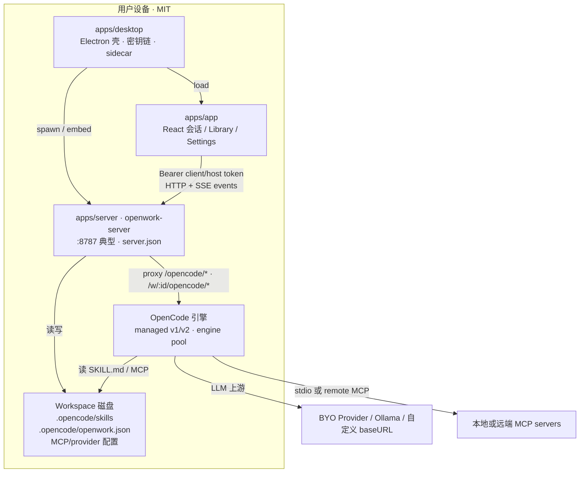
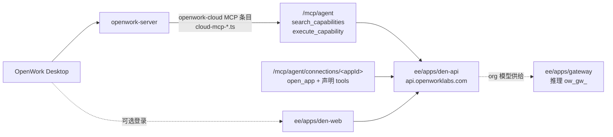
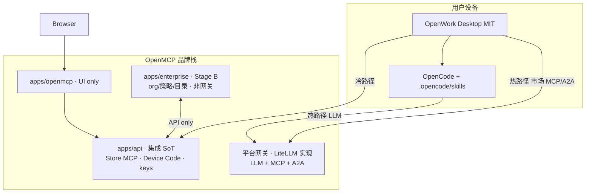
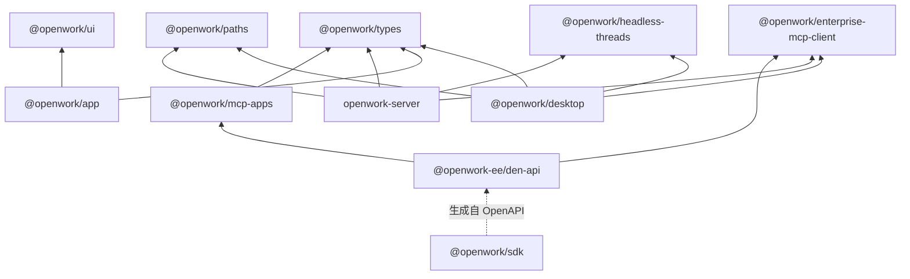

# OpenWork 模块关系与最快上线改造优先级

> **文档类型**：架构分析 + 上线 backlog（只写文档，不改任何应用代码）  
> **撰写日期**：2026-09-30（Asia/Shanghai）  
> **证据 tip（OpenWork）**：`/workspace/repos/openwork` @ **`6f60fa9`**  
>   `feat(mcp): build Apps as their own MCP servers behind a per-org flag (#5332)` on `dev`  
> **姊妹文档**（已锁定决策 #1–#13）：  
> - [商业方案](./OPENMCP_COMMERCIAL_PLAN.md)  
> - [产品方案](./OPENMCP_PRODUCT_PLAN.md)  
> - [技术实现方案](./OPENMCP_TECHNICAL_IMPLEMENTATION.md)  
> - 证据基线姊妹：[OPENWORK_OPENMCP_LITELLM_INTEGRATION.md](./OPENWORK_OPENMCP_LITELLM_INTEGRATION.md)  
> **约束**：不写入任何密钥；不对 `openwork` / `n8nshow` 做代码补丁；不编造未在仓库出现的 API。  
> **品牌提示**：终端用户只见 **OpenMCP** 与 **OpenWork**；LiteLLM / Den 仅工程或上游语境。

---

## 0. 一页摘要（给忙碌读者）

| 维度 | 结论 |
|------|------|
| OpenWork 是什么 | 本地优先桌面执行面：Electron（`apps/desktop`）+ React UI（`apps/app`）+ `openwork-server`（`apps/server`）+ 内嵌 OpenCode；**MIT**（`ee/` 外） |
| 上游 Den / Gateway | 在 `ee/`（EE License）：组织控制面、`/mcp/agent` 能力轨、推理网关 `ow_gw_` |
| 本商业方案态度 | **中国区永不交付 / 托管 Den**；LLM+MCP+A2A 走 **OpenMCP 平台网关**（LiteLLM 实现）；企业控制面 = 自研 `apps/enterprise`（阶段 B） |
| tip `6f60fa9` | Den 侧「Apps 自成 MCP server」：`/mcp/agent/connections/<appId>` + `open_app`；门控 `DEN_APP_MCP_SERVERS_ENABLED`。**CN 上线路径不依赖此能力** |
| 最快 lovable 路径 | **个人轨先**：Device Code / 平台密钥 → `apps/api` Store MCP → Skill 写 `.opencode/skills` → OpenCode LLM + 市场 MCP 同钥走平台网关 → **再**企业 Stage B |
| OpenWork 侧策略 | **优先配置 / 文档 / 薄插件**；避免 fork 整仓；必要时 upstream 小 PR（Library「OpenMCP」） |

---

# Part A — OpenWork 各模块逻辑关系与交互流程

## A.1 仓库地图（Repo map）

### A.1.1 顶层布局（tip `6f60fa9`）

| 路径 | 职责 | 许可证 |
|------|------|--------|
| `apps/` | 桌面产品面：UI / Electron / server / review / ui-demo | **MIT**（根 `LICENSE`） |
| `packages/` | 共享库：sdk、ui、world、mcp-*、enterprise-mcp-client、bootstrap、handsfree 等 | **MIT** |
| `ee/` | OpenWork Den 控制面、推理网关、Den DB、telemetry | **OpenWork EE License**（`ee/LICENSE`） |
| `docs/` | 运维 / 功能 / 架构 / 发布说明 | — |
| `evals/`、`worlds/`、`scenarios/` | 可执行测试、声明式环境、旅程 | — |
| `.opencode/skills/` | **本仓库** 开发用 agent skills（非用户 workspace） | — |
| `integrations/`、`examples/`、`packaging/` | 集成样例、LiteLLM 示例、Docker/AUR 打包 | — |

根 `README.md` 明示目录分许可（类 GitLab）：`ee/` 外 MIT；`ee/` 源码可见但生产使用需订阅（≤5 用户免费、30 天评估、开发测试免费；发布两年后该版本转 MIT）。

工作区声明见 `pnpm-workspace.yaml`：

```text
packages:
  - "apps/*"
  - "packages/*"
  - "ee/apps/*"
  - "ee/packages/*"
```

根 `package.json` 名称：`@different-ai/openwork-workspace`；默认开发入口 `pnpm dev` → `@openwork/desktop`；Node 24（`.nvmrc`）、pnpm 11。

### A.1.2 `apps/*`（MIT 桌面栈）

| 包 | `package.json` name | 角色 |
|----|---------------------|------|
| `apps/desktop` | `@openwork/desktop` | **Electron 壳**：`electron/main.mjs`、sidecar 打包、工作区/密钥链、自动化 runner、与本地 `openwork-server` 生命周期绑定；`pnpm dev` 起点 |
| `apps/app` | `@openwork/app` | **React/Vite UI**：会话、Library、Connections、Settings；可被 Electron 加载，也可 headless-web / `openwork-server web` 同源托管 |
| `apps/server` | `openwork-server` | **本地文件系统 API + OpenCode 引擎宿主**：workspace 授权、skills/MCP/plugins CRUD、审批、MCP Apps host、OpenCode proxy；可独立 `npm i -g openwork-server` |
| `apps/review` | `@openwork/review-app`（README 称 OpenWork Review） | **评测证据只读页**（Next）：合成/本地 review 目录；不跑模型、不改生产路径 |
| `apps/ui-demo` | `@openwork/ui-demo` | UI 组件演示沙箱（Vite） |

**依赖方向（事实，来自各 `package.json`）**：

- `desktop` → `browser-logins` / `browser-tabs` / `enterprise-mcp-client` / `headless-threads` / `paths` / `types` + Electron 原生  
- `app` → `ui` / `types` / `workbook` / `install-config` / `browser-*`（UI 层）  
- `server` → `enterprise-mcp-client` / `types` / `paths` / `workbook` / `headless-threads` + `@opencode-ai/sdk` / MCP SDK  

UI **不**直接 spawn OpenCode；一律经 `openwork-server`（或 Electron 嵌入的 server 进程）。

#### 域结构锚点（`apps/app`）

`apps/app/src/react-app/domains/` 可见产品域：`session`、`connections`、`settings`、`workspace`、`cloud`、`onboarding`、`automations`、`dashboard`、`browser-logins` 等。  
Composer / Library 相关路径（HANDOFF 与现网并存，仅作导航）：

- `apps/app/src/react-app/domains/session/surface/composer/`  
- `apps/app/src/react-app/domains/connections/`  
- `apps/app/src/react-app/domains/settings/`  

> 注意：根 `HANDOFF.md` 描述的是 **另一条 feature 分支**（Library↔composer Connections）的交接，**不是** tip `6f60fa9` 的变更说明。本文件以 tip 与 `README`/`DESIGN`/`AGENTS`/`apps/server` 为准。

### A.1.3 `packages/*`（精选）

| 包 | name | 与上线相关的职责 |
|----|------|------------------|
| `packages/sdk` | `@openwork/sdk` | **Den cloud API** 生成客户端（`createDenClient`）；**不** wrap 本地 server / OpenCode。源：`ee/apps/den-api` OpenAPI |
| `packages/ui` | `@openwork/ui` | 共享 UI 原语；`DESIGN.md` 约束用户面 |
| `packages/types` | `@openwork/types` | 跨端 schema（含 desktop-policies、workflows、mcp-app 子路径等） |
| `packages/world` | `@openwork/world` | `pnpm world` 声明式环境加载 |
| `packages/paths` | `@openwork/paths` | workspace / opencode 配置路径解析 |
| `packages/mcp-apps` | `@openwork/mcp-apps` | MCP Apps 前端资源构建（如 connection-action）；供 Den / host 嵌入 |
| `packages/enterprise-mcp-client` | `@openwork/enterprise-mcp-client` | **服务端** remote MCP + OAuth 生命周期参考实现；Den 是适配器之一，包本身不 import Den |
| `packages/enterprise-mcp-mock-server` | `@openwork/enterprise-mcp-mock-server` | 企业 OAuth/MCP 确定性 mock |
| `packages/openwork-bootstrap` | `openwork-bootstrap` | Agent 可安装的 bootstrap CLI：装桌面、Device Code 登录 **Den**、cloud onboard |
| `packages/openwork-ui-mcp` | `openwork-ui-mcp` | 面向 app 上下文 / 语义 UI 控制的 MCP server |
| `packages/handsfree` | `@openwork/handsfree` | macOS AX / 后台 computer-use runtime（可 MCP stdio 包装） |
| `packages/computer-use` | `@openwork/computer-use` | App-scoped computer use + consent |
| `packages/headless-threads` | `@openwork/headless-threads` | 无头会话驱动客户端（远程 chat / automation 复用） |
| `packages/install-config` | `@openwork/install-config` | 安装/配置清单相关 |
| `packages/connect-link` | `@openwork/connect-link` | Connect 深链/handoff 辅助 |
| `packages/automations` / `codemode` / `freestyle` / `presentation` / `workbook` / `email` / `browser-*` / `review` | 各垂直能力 | 桌面运行时与产物；**非** OpenMCP 市场 SoT |

### A.1.4 `ee/*`（EE · 上游存在，CN 商业方案不交付）

| 路径 | name / 角色 |
|------|-------------|
| `ee/apps/den-api` | `@openwork-ee/den-api` — Den 控制面 API；**`/mcp/agent`** 能力轨、org、plugins、marketplaces、desktop policies、MCP Apps 构建 |
| `ee/apps/den-web` | `@openwork-ee/den-web` — Den 管理 UI（Next） |
| `ee/apps/den-gateway` | 成员 ↔ cloud worker 网关解析/代理（与「推理 Gateway」不同） |
| `ee/apps/gateway` | `@openwork-ee/gateway` — **OpenWork 推理网关**（`ow_gw_` 账本；`docs` 中 managed usage / settlement） |
| `ee/apps/den-worker-runtime` / `den-controller` | Worker 运行时与控制 |
| `ee/apps/diagnostics` / `enterprise-mock-lab` / `landing` | 诊断、企业 mock lab、落地页 |
| `ee/packages/den-db` | MySQL schema / drizzle |
| `ee/packages/den-admin-mcp` | Admin MCP |
| `ee/packages/cloud-runtime*` / `telemetry*` / `utils` | 云 runtime、遥测契约 |

**本方案硬边界**（决策 #1/#7/#13）：中国区产品栈 **不含** Den 托管；**不**把 OpenMCP 并入 `den-api`；市场/桌面 LLM·MCP·A2A **不**走 Den `/mcp/agent` 或 `ee/apps/gateway` 结算。

### A.1.5 关键文档索引（只读导航）

| 文档 | 用途 |
|------|------|
| `README.md` | 产品定位、MIT/EE、`pnpm dev`、MCP `/mcp/agent` 客户端示例 |
| `AGENTS.md` | 三表面：Desktop / MCP gateway / Den；保密与编码约定 |
| `DESIGN.md` | UI 原则（P1–P11 等）；同意卡、MCP Apps 卡片密度 |
| `HANDOFF.md` | *Feature 分支* Library/composer 交接（非 tip 说明） |
| `apps/server/README.md` | server 端点、MCP App launch lease、配置与 env |
| `docs/features/mcp-apps-host/README.md` | 桌面内联 MCP Apps host 流 |
| `docs/features/dynamic-artifact-mcp-apps/README.md` | Workflow 产物 → MCP Apps |
| `docs/marketplace-capabilities-architecture.md` | Den marketplace 进 `/mcp/agent` rail（**Den-only 设计**） |
| `docs/remote-chat-over-mcp-architecture.md` | 经 gateway 远程会话提案 |
| `docs/external-mcp-oauth.md` / `docs/mcp-client-oauth.md` | Den 外连 MCP OAuth |
| `ee/apps/den-api/src/mcp/README.md` | MCP 暴露策略 + **Apps as MCP servers** |
| `examples/litellm-per-member-keys/README.md` | 上游 LiteLLM 样例（工程语境） |

---

## A.2 运行时交互（Mermaid）

### A.2.1 Desktop ↔ openwork-server ↔ OpenCode ↔ skills/MCP（本地主路径）



**证据锚点**：

- Skills 目录：`apps/server/src/workspace-files.ts` → `projectSkillsDir` = `{workspace}/.opencode/skills`  
- Skills CRUD：`apps/server/src/skills.ts`；HTTP：`GET|POST /workspace/:id/skills`（`apps/server/README.md`）  
- MCP CRUD：`GET|POST|DELETE /workspace/:id/mcp`；实现 `apps/server/src/mcp.ts`、`local-managed-mcp.ts`  
- Provider / runtime 配置：`apps/server/src/runtime-opencode-config-store.ts`（`provider`、`mcp`、`managedPolicy`）  
- Cloud 凭证下发到引擎：`apps/server/src/managed-provider-auth.ts`（注释写明对齐桌面直调引擎 auth API）  
- MCP Apps host：`apps/server/src/mcp-app-host.ts`；`POST .../mcp-apps/resolve|call|release`

### A.2.2 可选「云」路径（上游 Den · CN 方案刻意缺席）



公开客户端示例（`README.md`）：

```text
https://api.openworklabs.com/mcp/agent
```

工具面（`AGENTS.md`）：`search_capabilities` / `execute_capability`（及 skills 辅助工具描述）。  
**本商业方案**：个人与中国区企业交付 **不要求、不捆绑** 此路径；用 OpenMCP `apps/api` + 平台网关替代「发现/安装/计费」。

### A.2.3 OpenMCP × OpenWork 目标拓扑（锁定 · 对照姊妹文档）



完整序列见 [技术实现 §3.8](./OPENMCP_TECHNICAL_IMPLEMENTATION.md)。

---

## A.3 模块职责与依赖（表）

### A.3.1 运行时责任分层

| 层 | 模块 | 负责 | 不负责 |
|----|------|------|--------|
| 壳 | `apps/desktop` | 进程、更新、OS 集成、嵌入 server、安全存储 | 市场结算、组织权威 |
| UI | `apps/app` | 会话 UX、Library/Connections 表面、策略展示 | 直接 spawn 引擎；热路径代理 LLM |
| 本地 API | `apps/server` | workspace、skills/MCP 文件面、审批、引擎池、MCP Apps lease | Den 组织 DB；OpenMCP 钱包 |
| 引擎 | OpenCode（managed） | Agent 推理、读 skills、调 MCP | 计费权威 |
| 共享类型/UI | `packages/types`、`packages/ui` | 契约与原语 | 业务策略权威 |
| 企业 MCP 客户端 | `packages/enterprise-mcp-client` | remote MCP OAuth/工具调用原语 | 租户模型（由宿主注入） |
| Den API | `ee/apps/den-api` | 组织、marketplace、`/mcp/agent`、Apps-as-MCP | **CN 交付包** |
| Den 推理网关 | `ee/apps/gateway` | org 推理配额与 `ow_gw_` | OpenMCP 市场账本 |
| OpenMCP API | `apps/api`（n8nshow 侧） | Device Code、Store MCP、密钥、install-callback | LLM 热路径代理 |
| OpenMCP 网关 | LiteLLM（OpenMCP 品牌） | VK 硬闸、LLM/MCP/A2A | 用户注册 HTML |
| OpenMCP 企业 | `apps/enterprise` | org/策略/审计（Stage B） | 当网关用 |

### A.3.2 包依赖简图（MIT 侧）



`@openwork/sdk` **仅**服务 Den；OpenMCP 集成 **不应**把 Den SDK 当桌面 SoT。

---

## A.4 关键流程（Key flows）

### A.4.1 启动会话（start session）

```text
pnpm dev / 安装包启动
  → Electron（apps/desktop）准备 profile、可选 mock keychain
  → 启动或嵌入 openwork-server（workspace 列表来自 ~/.config/openwork/server.json 或等价）
  → 加载 apps/app UI，带 client bearer
  → server 确保 managed OpenCode 引擎（engine-pool / managed-opencode*.ts）
  → UI 创建/恢复 session → 经 /opencode/* 或 /w/:id/opencode/* 发 prompt
  → 工具调用：本地文件 / skills / MCP；需批准则走 /approvals（host token）
```

Headless 变体：`pnpm world up dev-app-web`（README）— Vite + server，无 Electron；Den 代理可选且对本方案非必须。

### A.4.2 Skill 安装路径（`.opencode/skills`）

**本地权威路径**（证据）：

```12:14:apps/server/src/workspace-files.ts
export function projectSkillsDir(workspaceRoot: string): string {
  return join(workspaceRoot, ".opencode", "skills");
}
```

`skills.ts` 还会扫描兼容位置（只读发现）：`.claude/skills`、`~/.config/opencode/skills`、`~/.agents/skills` 等；**写入项目技能**走 `projectSkillsDir`。

HTTP：`GET|POST /workspace/:id/skills`（`apps/server/README.md`）。  
Claude 插件包 settle：`apps/server/src/claude-plugin-bundle.ts`（hooks 等有明确不支持警告，见 marketplace 架构文）。

**OpenMCP 对齐约定**（产品/技术方案，非本 tip 改动）：

| 步骤 | 约定 |
|------|------|
| 发现/授权 | `apps/api` Store MCP：`search_assets` / `get_asset` / `install_asset` |
| 落地 | `{workspace}/.opencode/skills/<slug>/` + `SKILL.md` |
| 溯源 | 保留 YAML `openmcp.*` frontmatter |
| 登记 | 可选 `POST {API}/skills/:id/install-callback` |
| caution | 展示 `riskSummary`；确认后继续（决策 #9） |

### A.4.3 MCP 连接

| 类型 | 在 OpenWork 中的位置 | 说明 |
|------|----------------------|------|
| 工作区 MCP | server `mcp` 配置 + OpenCode | stdio / remote；`POST /workspace/:id/mcp` |
| Local managed MCP OAuth | `apps/server/src/local-managed-mcp.ts` + docs/features/local-managed-mcp-oauth | 桌面本地托管连接 |
| Den org connections | Den + `enterprise-mcp-client` + UI `use-org-mcp-connections` | **需 Den**；CN 个人路径不依赖 |
| openwork-cloud | `cloud-mcp*.ts` / reconciler | 把 `/mcp/agent` 挂进引擎；**CN 方案用 OpenMCP Store MCP + 平台网关 URL 替代** |
| MCP Apps 内联 | `mcp-app-host.ts` + `docs/features/mcp-apps-host` | 工具结果 `ui://` → 沙箱 iframe |

**OpenMCP 市场 MCP**：客户端只配 `{GATEWAY}/{server}/mcp` + OpenMCP 平台密钥（禁止 Provider 原始 endpoint）— 见产品方案 §5.3。

### A.4.4 企业 / Den 路径（文档现状 vs 商业锁定）

上游能力（真实存在）：

- Den：组织、桌面策略、marketplace plugins、共享 MCP、推理供给  
- `/mcp/agent`：跨客户端能力轨  
- tip 功能：Apps 独立 MCP server（下一节）  
- `ee/apps/gateway`：与 Den DB 绑定的推理网关  

**商业锁定**（决策 #1/#5/#7/#13）：

| 项 | 锁定 |
|----|------|
| 个人 | **允许永不登 Den** |
| 中国区 | **不提供 Den 独立托管** |
| 企业控制面 | OpenMCP `apps/enterprise` Stage B，**不**转售/嵌入 Den |
| 网关 | OpenMCP 平台网关，**不**用 Den `/mcp/agent` 或 `ow_gw_` 结本方案账 |

国际客户若自建上游 Den：与 OpenMCP 资金链/网关账本 **解耦**（商业方案 §2.5）。

### A.4.5 tip `6f60fa9`：Apps-as-MCP（相关性说明）

**是什么**（`ee/apps/den-api/src/mcp/README.md` + commit message）：

- Connect 上 `create_app` / `update_app` / `read_app` 仍是 **构建**工具  
- 每个已构建 App 暴露为独立 MCP：`/mcp/agent/connections/<appId>`  
- 该 server 列出 `open_app`（绑定不可变 `ui://` revision）+ App 声明的 tools + revision resources  
- 门控：`DEN_APP_MCP_SERVERS_ENABLED`（默认 true）+ org 的 member-facing MCP connections 设置  
- Demo：`worlds/mcp-apps-demo.ts`；参考 host：`evals/fixtures/standard-mcp-app-host-serve.ts`

**与 OpenMCP 上线的关系**：

| 判断 | 说明 |
|------|------|
| 依赖？ | **否**。能力在 Den EE 面；CN 交付不含 Den |
| 可借鉴？ | MCP Apps 宿主（MIT `mcp-app-host` / `packages/mcp-apps`）仍可用于 **本地/平台网关** 返回的 UI 资源；不必启用 Den App servers |
| backlog 位置 | **P2+ / 观察项**：若未来 OpenMCP 自研「应用型 MCP」，可参考「一 App 一 MCP URL」模型，但实现落在 OpenMCP 栈而非 fork den-api |

---

## A.5 许可证边界速查

```text
┌──────────────── MIT（可自由分发桌面）────────────────┐
│  apps/{desktop,app,server,review,ui-demo}           │
│  packages/*（含 enterprise-mcp-client、mcp-apps…）   │
│  evals / worlds / docs（内容本身）                    │
└─────────────────────────────────────────────────────┘
┌──────────────── EE（ee/LICENSE）────────────────────┐
│  ee/apps/{den-api,den-web,gateway,den-gateway,…}    │
│  ee/packages/{den-db,telemetry,…}                   │
│  生产使用需订阅（小团队/评估/开发例外）；≠ 中国区商品 │
└─────────────────────────────────────────────────────┘
```

**风险提醒**：把 OpenMCP 服务端「合并进 den-api」或「中国区托管 Den」会触发 EE 与商业决策双重冲突 → 列入 Part B **不做**。

---

# Part B — 按已锁定方案：最快上线改造优先级

> 目标：在决策 #1–#13 下，**最快**交付 OpenMCP × OpenWork 可爱最小闭环。  
> 列拆分：**OpenWork 侧** vs **OpenMCP 侧**（`apps/api` / `apps/openmcp` / `apps/enterprise` / 平台网关）。  
> 工作量：S &lt; 约 1–3 人日 · M 约 1–2 周 · L &gt; 2 周（量级，非承诺）。

## B.1 Minimum lovable path（推荐顺序）

```text
① 个人轨闭环（Week 1–2 / P0）
   Device Code 或粘贴 OpenMCP 平台密钥
   → apps/api Store MCP 发现/安装 Skill
   → 写入 .opencode/skills/<slug>/
   → OpenCode LLM = 平台网关 baseURL + 同一密钥
   → 市场 MCP/A2A = 平台网关 URL + 同一密钥
   → 预算硬闸可见失败 → 引导网站充值
   验收：全程无 Den URL、无「LiteLLM」用户文案

② 体验打磨（Week 3–4 / P1）
   Library「OpenMCP」入口、caution 同意卡、一键「平台模型」、
   网站旧 /api rewrite 下线、文案审计

③ 企业 Stage B（Later / P1 立项 → P2 交付）
   apps/enterprise 独立部署：org/成员/白名单/策略投影
   桌面拉 GET {API}/orgs/:id/desktop-policy
   仍无 Den、无第二网关品牌
```

---

## B.2 P0 — Week 1–2（阻断上线的最短集）

| ID | OpenWork 侧 | OpenMCP 侧 | 为何 unblock | 量级 | 依赖 |
|----|-------------|------------|--------------|------|------|
| **P0-1** | **文档 / 官方安装 Skill**：说明解压到 `.opencode/skills/<slug>`；可用 Agent 执行 Store MCP 结果（**可不改核心代码**） | `runtime=openwork` 安装提示 + package 布局与 frontmatter `openmcp.*` | 无落地路径则市场无桌面价值 | S | API Store MCP 可用 |
| **P0-2** | 确认 Provider UI **已支持**自定义 baseURL + API Key；文案改为「OpenMCP 平台网关 / 平台密钥」（设置页校对） | 密钥创建响应含 `gatewayBaseUrl`；入门页「一把密钥多用」 | 无 LLM 同钥则飞轮断 | S–M | 平台网关 `/v1` 就绪 |
| **P0-3** | 个人 onboarding **不强制 / 可隐藏** Den 登录（配置或渠道包；避免 bootstrap 默认 `login --base-url` Den） | 入门页 **零 Den**；Device Code 授权页在网站 UI | 决策 #5 验收 | S | — |
| **P0-4** | （验证）手动添加 remote MCP：平台网关 URL + 密钥；不写 Provider 原始 URL | Store MCP / 安装文案只输出网关 URL；品牌审计 | 市场 MCP 可调用 | S | GW MCP 路由 |
| **P0-5** | — | **`apps/api` 确立为桌面集成 SoT**（决策 #12）：`/mcp/store`、OAuth device/token、keys、package、install-callback；公布 `API_BASE_URL` | 避免绑网站 origin | M | 迁移/rewrite 策略 |
| **P0-6** | — | 网站 `apps/openmcp` **UI only**：入门、密钥、钱包调同一 API；去 LiteLLM 用户文案 | 决策 #11/#12 | S–M | P0-5 |
| **P0-7** | — | 平台网关：LLM+MCP+A2A **同 VK 预算**；生产无网关 → 签发 fail closed；settlement cron 幂等 | 变现硬闸 | M | LiteLLM 集群 |
| **P0-8** | 内部走查：Skill 安装 → 会话调用 → 超预算错误可读 | 闭环验收脚本 / 清单（OM-P0-4） | 「可爱」可演示 | S | P0-1…7 |
| **P0-9** | — | 初版 A2A/客户端矩阵页（可手工；对外称平台网关） | 决策 #10 | S | — |

**P0 明确不做**：fork Den、改 `ee/apps/gateway` 结 OpenMCP 账、Library 大改、`apps/enterprise` 阻塞个人轨。

---

## B.3 P1 — Week 3–4（体验与企业立项）

| ID | OpenWork 侧 | OpenMCP 侧 | 为何 | 量级 | 依赖 |
|----|-------------|------------|------|------|------|
| **P1-1** | Library「OpenMCP」分组：Device Code → `install_asset` → 写磁盘 → install-callback（**建议 upstream 小 PR** 或旁路插件） | `install_asset` openwork `files[]` 稳定；callback 记安装 | 减少纯文档摩擦 | M–L | P0 |
| **P1-2** | caution 安装确认卡（对齐 `DESIGN.md` 同意卡：action·data·risk） | 返回 `securityGrade` / `riskSummary`；企业默认 `prompt_allow` | 决策 #9 | M | P1-1 |
| **P1-3** | 一键「使用 OpenMCP 平台模型」→ 写 `runtime-opencode-config-store` / `managed-provider-auth` 对接面（密钥进 safeStorage） | 密钥校验 API；错误码映射 OpenMCP 用语 | 降低配置失误 | M | P0-2 |
| **P1-4** | provenance 标签：Local / OpenMCP（个人默认 **不**露 Den） | — | 多表面防混 | S | P1-1 |
| **P1-5** | — | 网站旧 `/api/*` → `apps/api` rewrite 后下线计划 | 决策 #12 长期 | M | P0-5 |
| **P1-6** | — | **`apps/enterprise` Stage B 立项**：模块边界、API-only 与主应用、策略投影草图 | 决策 #13；不挡个人 GA | L（启动 M） | 个人轨稳定 |
| **P1-7** | 可选：拉 `GET {API}/orgs/:id/desktop-policy` 骨架（feature-flag） | 策略投影聚合（转发 enterprise） | 为企业轨铺路 | M | P1-6 |
| **P1-8** | — | 直连支付购 Skill（微信/支付宝）排期；OIDC 设计 | 降钱包摩擦 | L | 合规 |
| **P1-9** | — | A2A 矩阵抽检自动化；全站品牌审计 | 决策 #10/#11 | M | P0-9 |

---

## B.4 P2 — Later

| ID | OpenWork 侧 | OpenMCP 侧 | 量级 |
|----|-------------|------------|------|
| **P2-1** | `openwork://install-skill?…` 深链（协议注册） | 安装 URL 签发与签名 | L |
| **P2-2** | Refresh Token / 企业策略热更新 UX | Token 刷新；密钥 disable → 网关 `blocked` | M |
| **P2-3** | — | 专有云 Helm：`enterprise` + `api` + 网关（**无 Den**） | L |
| **P2-4** | — | SCIM、审批流、私有上架、airgap 包、统一账单 | L |
| **P2-5** | 观察 Den Apps-as-MCP / remote-chat 提案 | 若自研「应用型 MCP」则参考模型，**不** fork den-api | — |
| **P2-6** | — | Provider Mode ②（用户自带上游 OAuth） | L |

---

## B.5 双列总览（按系统）

### B.5.1 OpenWork 侧（改动金字塔）

```text
P0  配置/文案/文档/渠道包隐藏 Den ........ 最大速度
P1  Library 薄集成 + 同意卡 + 一键模型 ... upstream PR 或插件
P2  深链 / 策略热更新 ................... 可后置
```

**优先接触的真实路径（改码时，本文不改）**：

| 目的 | 路径 |
|------|------|
| Skills 落地 | `apps/server/src/skills.ts`、`workspace-files.ts` |
| Provider 注入 | `managed-provider-auth.ts`、`runtime-opencode-config-store.ts` |
| MCP 条目 | `apps/server/src/mcp.ts`、`local-managed-mcp.ts` |
| UI Library | `apps/app/src/react-app/domains/settings/`、`connections/` |
| 桌面分发变体 | `apps/desktop/electron-builder*.yml`（渠道包可预置 OpenMCP 入门、关 Den） |

### B.5.2 OpenMCP 侧

| 模块 | P0 | P1 | P2 |
|------|----|----|----|
| `apps/api` | SoT 路由、Store MCP、Device Code、keys、package、callback | rewrite 收口、策略投影、错误码 | Refresh、webhook 加速 |
| `apps/openmcp` | 入门/密钥/钱包 UI；品牌文案；调 API | 支付 UX、企业控制台入口 | 白标 |
| 平台网关 | 同 VK、fail closed、监控 | spend 延迟、错误映射 | 多活 |
| `apps/enterprise` | **边界设计即可** | org/成员/白名单/caution/审计 MVP | Helm、SCIM、airgap |

---

## B.6 明确 **不做** 清单

1. ❌ Fork / 中国区托管 **OpenWork Den**（决策 #7）  
2. ❌ 把 OpenMCP 并入 `ee/apps/den-api` 或「Den 壳 + 换皮」（决策 #2/#13）  
3. ❌ 用 Den `/mcp/agent` 或 `ee/apps/gateway`（`ow_gw_`）做本方案 LLM/市场 **网关或分成节点**（决策 #1/#6）  
4. ❌ 面向用户的第二网关品牌或「LiteLLM Key」SKU（决策 #8/#11）  
5. ❌ 个人轨强制 Den 登录（决策 #5）  
6. ❌ Provider 原始 endpoint 写入客户端（产品 §5.3）  
7. ❌ 企业控制面「先同仓再拆」（阶段 A）（决策 #13）  
8. ❌ 让 `apps/openmcp` 或 `apps/api` **代理** LLM/MCP/A2A 热路径用量  
9. ❌ 让 `apps/enterprise` 充当网关  
10. ❌ 为上线而整仓 fork OpenWork（见 B.7）  
11. ❌ 依赖 tip `6f60fa9` Apps-as-MCP 作为 CN MVP 前提  
12. ❌ 在本文或仓库提交真实密钥 / KYC 样例  

---

## B.7 Fork vs 薄客户端 / 配置 vs upstream — 速度建议

| 策略 | 速度 | 许可/维护 | 建议 |
|------|------|-----------|------|
| **A. 配置 + 文档 + 渠道包 only** | 最快 | MIT 桌面原样分发；预置入门 URL、隐藏 Den 入口 | **P0 默认** |
| **B. 旁路插件 / 外部 Skill**（Store MCP 安装器写 `.opencode/skills`） | 快 | 不改 upstream；迭代独立 | **P0–P1 主力** |
| **C. Upstream 小 PR**（Library「OpenMCP」、caution 卡、一键模型） | 中 | 需 DCO；进 `dev`；长期最干净 | **P1 并行提交** |
| **D. 薄 fork（只 cherry-pick 桌面 MIT 树）** | 慢启动 | 丢上游安全修复；双轨成本高 | **仅当 upstream 拒绝关键 PR 且合规要求改壳** |
| **E. 整仓 fork（含 ee/）** | 最慢且险 | EE 纠缠；违反「不托管 Den」叙事 | **禁止作为 CN 方案** |

**实操建议**：

1. 发布渠道：**官方 OpenWork MIT 构建** + OpenMCP 入门文档/安装 Skill（A+B）。  
2. 需要原生按钮时走 **C**，PR 保持小、可关 feature-flag、附 `evals` 证据（`AGENTS.md` 合约）。  
3. 不要为了「去掉 Den 字符串」去 fork `ee/`；用产品配置与 UI 显隐即可。  
4. `packages/openwork-bootstrap` 的 `login`/`cloud onboard` 指向 Den — CN 文档 **改指向 OpenMCP Device Code**，或提供并行 bootstrap 脚本（仍可不改 upstream）。  

---

## B.8 验收清单（个人轨 lovable）

- [ ] 新用户只打开 OpenWork + OpenMCP 网站即可完成：注册 → 密钥 → 装 Skill → 聊天出活  
- [ ] 磁盘出现 `.opencode/skills/<slug>/SKILL.md`，且含 `openmcp.*`  
- [ ] OpenCode 请求命中平台网关；用量进同一 VK；超预算失败文案引导充值  
- [ ] 市场 MCP 仅网关 URL；无 Provider 直连  
- [ ] 全流程无 Den URL / 无 Den 登录 / 用户可见无「LiteLLM」  
- [ ] caution Skill 有确认，非静默装  

企业轨另加：`apps/enterprise` 可独立部署；桌面策略经 `apps/api`；**仍无 Den**。

---

## B.9 与姊妹文档交叉索引

| 主题 | 文档锚点 |
|------|----------|
| 决策 #1–#13 全文 | 商业 / 产品 / 技术 §1 |
| UI/API/企业/网关分轨 | 产品 §2.1；技术 §2.1、§4.6 |
| 个人序列图 | 技术 §3.8 |
| OpenWork 改动面表 | 技术 §3.6–3.7 |
| 企业 Stage B | 产品 §4.3；技术 §4 |
| 收入与不做 SKU | 商业 §4 |
| 本仓模块与 tip | **本文 Part A** |
| 上线 backlog | **本文 Part B** |

---

## 附录 A — tip `6f60fa9` 文件级提示（Den 侧，只读）

与 Apps-as-MCP 直接相关的上游路径（便于对照，**非 CN 必交付**）：

- `ee/apps/den-api/src/mcp/README.md` — 「Apps as MCP servers」  
- `ee/apps/den-api/src/mcp/app-builder-tools.ts`、`app-server.ts`、`app-tools.ts`  
- `ee/apps/den-api/src/mcp/connect-mcp-server-index.ts`  
- `ee/apps/den-api/src/mcp/external-connection-proxy.ts`（`/mcp/agent/connections/:connectionId`）  
- `ee/apps/den-api/src/routes/org/mcp-app-catalog.ts`、`dashboards.ts`  
- `ee/apps/den-api/src/mcp-app-rollout.ts`、`env.ts`（`DEN_APP_MCP_SERVERS_ENABLED`）  
- `worlds/mcp-apps-demo.ts`、`evals/fixtures/standard-mcp-app-host-serve.ts`  

MIT 侧 MCP Apps 宿主仍独立有价值：`apps/server/src/mcp-app-host.ts`、`docs/features/mcp-apps-host/README.md`、`packages/mcp-apps`。

---

## 附录 B — openwork-server 端点速查（本地集成）

摘自 `apps/server/README.md`（完整列表以该文件为准）：

| 组 | 例 |
|----|----|
| 健康 | `GET /health`、`/status`、`/capabilities` |
| 工作区 | `GET /workspaces`、`GET|PATCH /workspace/:id/config`、`GET /workspace/:id/events` |
| Skills / MCP / Plugins / Commands | `/workspace/:id/skills|mcp|plugins|commands` |
| MCP Apps | `POST .../mcp-apps/resolve|call|release` |
| OpenCode | `/opencode/*`、`/w/:id/opencode/*` |
| 审批 | `GET /approvals`、`POST /approvals/:id` |

OpenMCP **冷路径**应打 `apps/api`，**不要**把这些本地端点误当成市场 API。

---

## 附录 C — 词汇对照（防混）

| 说法 | 含义 |
|------|------|
| OpenWork Desktop | MIT 本地执行面 |
| openwork-server | 本地 API + 引擎宿主 |
| OpenCode | 引擎；读 `.opencode/skills` |
| OpenWork Den | EE 组织控制面（CN 不交付） |
| `/mcp/agent` | Den 能力轨（CN 个人不依赖） |
| OpenWork Gateway | `ee/apps/gateway` 推理；**≠** OpenMCP 平台网关 |
| OpenMCP 平台网关 | 用户可见；实现 LiteLLM |
| OpenMCP 密钥 / VK | 用户说法；实现层 Virtual Key |
| Store MCP | `apps/api` 发现/安装；不执行业务工具 |
| Apps-as-MCP（#5332） | Den 上 App 独立 MCP URL |

---

*完。证据 tip `6f60fa9`；决策锁定见姊妹三份方案。本文不修改 `openwork` / `n8nshow` 代码。*
