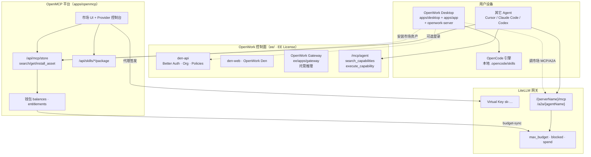
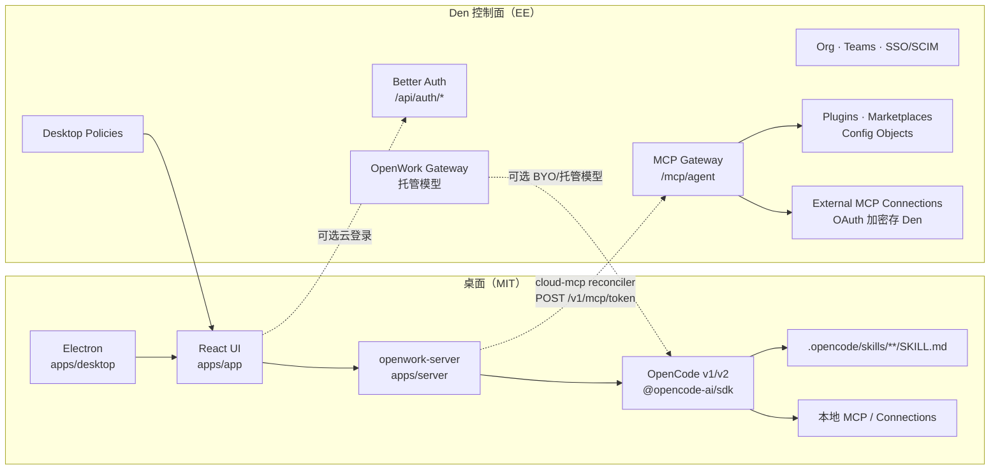
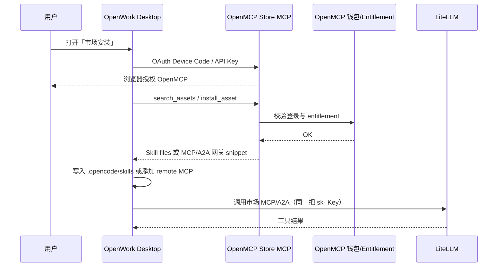

# OpenWork × OpenMCP × LiteLLM 商业与集成方案

> **文档类型**：产品定位 + 商业方案 + 工程集成提案（只写文档，不改任何应用代码）  
> **撰写日期**：2026-09-29（Asia/Shanghai）  
> **证据基线**：  
> - OpenWork 本地克隆：`/workspace/repos/openwork`（上游 `different-ai/openwork`，检视提交约 `b19ea8d`）  
> - OpenMCP：`docsify001/n8nshow` 分支 `develop-mcp`（tip `9c5e625d`；用户记忆点 `61703fe1` = P0+P1 生产就绪审计修复，仍在本分支历史中）  
> **约束**：不写入任何 `.env` 密钥；不对 `openwork` / `n8nshow` 做代码补丁。

---

## 1. 摘要 / 定位三角

### 1.1 一句话

| 产品 | 角色 | 谁拥有运行时 | 商业形态 |
|------|------|--------------|----------|
| **OpenWork** | 终端用户桌面工作台（个人 + 企业），本地文件与 Agent 工作流 | 用户机器上的 Electron + `openwork-server`；可选连 Den 控制面 | 桌面 MIT 开源免费；`ee/` Den 控制面 source-available（EE License） |
| **OpenMCP** | MCP / A2A / Skills **双边市场与统一入口**（创作者 ↔ 用户） | 平台 Web（`www.openmcp.cn`）+ 资产注册表 + Store MCP | 免费/付费资产交易；平台抽成；后续可产品化交付园区/政府 |
| **LiteLLM** | **网关与计费真相源**：市场 MCP/A2A 代理、Virtual Key、预算/限流、上游 OAuth 代持 | `api.openmcp.cn`（或自托管 LiteLLM） | 用量计费事件的执行与拦截点；OpenMCP 钱包余额镜像为 `max_budget` |

用户愿景对齐：**OpenWork = 桌面端**；**OpenMCP = 引导注册 / 使用 / 下载 A2A·MCP·Skills 的平台**；**LiteLLM = 网关与计费来源**。三者不合并成一个 monorepo，而是通过身份、资产目录、安装协议与计费事件对接。

### 1.2 责任边界（谁拥有什么）



**硬边界**：

1. **本地执行**（读文件、跑 Skill、stdio MCP、浏览器自动化）→ OpenWork / OpenCode，不经过 OpenMCP。  
2. **组织内能力分发**（技能、插件、企业 MCP 连接、桌面策略）→ OpenWork Den（`ee/`），不是 OpenMCP 公开市场。  
3. **公开市场发现、付费授权、创作者分成** → OpenMCP。  
4. **对外暴露的市场 MCP/A2A 调用路径与用量硬闸** → LiteLLM（请求不经 OpenMCP 应用进程）。  
5. **OpenWork 自有托管模型计费** → `ee/apps/gateway`（与 LiteLLM 不同栈；集成时勿混为同一计费账本）。

### 1.3 本方案要回答的问题

1. 个人与企业客户如何分层售卖，桌面开源与云/市场增值如何切分。  
2. OpenWork 如何**发现并安装** OpenMCP 上的 Skills / MCP / A2A，而不破坏本地优先模型。  
3. Store MCP（`/api/mcp/store`）与 OpenWork MCP agent（`/mcp/agent`）如何分工、避免双轨冲突。  
4. Skills 包格式如何对齐（`SKILL.md` + OpenMCP `openmcp` 元数据 ↔ OpenWork `.opencode/skills`）。  
5. LiteLLM 计费事件如何回流到钱包与 Provider 分成，以及分阶段路线图。

---

## 2. OpenWork 代码与能力深析

### 2.1 仓库布局与许可证边界

| 路径 | 包名 / 角色 | 许可证 |
|------|-------------|--------|
| `apps/app` | `@openwork/app` — React UI（会话、Library、Connections） | MIT |
| `apps/desktop` | `@openwork/desktop` — Electron 壳（多 builder 配置：base / enterprise / cloud） | MIT |
| `apps/server` | `openwork-server` — 本机文件系统 API、引擎桥接、云 MCP 对账 | MIT |
| `packages/*` | UI、MCP Apps、enterprise-mcp-client、bootstrap、sdk、automations、computer-use… | MIT |
| `ee/apps/den-api` | `@openwork-ee/den-api` — 组织控制面 + **`/mcp/agent`** | EE License |
| `ee/apps/den-web` | `@openwork-ee/den-web` — Den 管理后台（Next.js） | EE |
| `ee/apps/gateway` | `@openwork-ee/gateway` — 托管推理网关（Models / `ow_gw_` keys） | EE |
| `ee/apps/den-gateway` | `@openwork-ee/den-gateway` — 云 worker 解析与代理 | EE |
| `ee/packages/den-db` 等 | Drizzle schema、telemetry、cloud-runtime | EE |
| `packaging/docker|helm|aur` | 自托管与评估栈 | 随目录 |
| `integrations/agent-plugins` | Agent Plugins 示例 / 连接 | MIT 侧 |

**许可证要点**（`LICENSE` + `ee/LICENSE`）：

- `ee/` 外全部 MIT：桌面可自由使用、分发、商用，**无需 OpenWork 账号**。  
- `ee/`：生产使用需订阅；**≤5 用户免费**；任意规模 **30 天评估**；开发测试始终免费；**每个版本公开两年后自动转为 MIT**。  
- 客户端侧图片/字体/CSS/编译进浏览器的 JS 即使源自 ee 构建，仍按 MIT 说明处理（EE 文本中的 client-side 条款）。  
- 贡献：`ee/` 需 CLA；全仓 DCO sign-off。

**与 OpenWorkLabs 上游关系**：产品与品牌归属 Different AI / openworklabs.com；本方案若基于 fork 或旁路市场集成，需明确：**不修改上游协议条款**，增值层放在自有 OpenMCP / LiteLLM / 可选旁路插件，避免把 EE 控制面「重新开源」或混淆订阅义务。

### 2.2 架构总图（桌面 ↔ 控制面 ↔ 引擎）



### 2.3 桌面栈

- **壳**：Electron（`apps/desktop`），支持 macOS / Windows / Linux；开发用 `pnpm dev`，多 worktree 用 `pnpm dev:worktree`。  
- **UI**：React 19 + Tailwind + shadcn/Base UI；设计规约见根目录 `DESIGN.md`（状态优先、渐进披露、同意卡命名风险）。  
- **服务**：`openwork-server` 提供 workspace、会话、引擎进程管理、本地 MCP 同步、云 MCP 健康检查等。  
- **本地优先**：文件留在用户磁盘；云可选。Headless Web（`pnpm world up dev-headless`）可在无 Electron 时跑 UI + server。  
- **Bootstrap**：`packages/openwork-bootstrap` — Agent 可执行安装 CLI、`login`（Device Code）、`cloud onboard`。  
- **能力面**：Skills、Anthropic 兼容插件、浏览器自动化（`computer-use` / `browser-*`）、定时自动化（`automations`）、MCP Apps（`packages/mcp-apps`）。

### 2.4 控制面 OpenWork Den

**OpenWork Den**（README / AGENTS.md）：

- 规模化配置推理与成员/团队对模型的访问。  
- 邀请、团队、访问管理。  
- **桌面策略**、限制本地模型、锁定可用 App 版本（`docs/desktop-app-policies.md`，`GET /v1/me/desktop-config`）。  
- 通过 marketplace 发布 skills / plugins，并按 org / team / 人分配。  
- 导入 Agent Plugins / Anthropic 兼容插件，使其 skill 与 remote MCP 经 OpenWork MCP 可用。

**技术**：`den-api` 为 Hono；Better Auth（含 SSO/SAML、SCIM、API Key、OAuth Provider 插件）；MySQL + Redis；自托管见 `packaging/docker`、`packages/docs/self-host/*`、Helm。

**企业计划门控**（`docs/enterprise-plan-gating.md`）：Solo $0（开源桌面 + BYO keys）；Team Starter ~$50/月（5 seats、marketplace、分发密钥）；Enterprise 定制（SSO/SCIM、桌面策略、托管部署、技能开发、MCP 咨询）。原则：**闸写不闸读**——失去 entitlement 后既有 SSO/策略仍可登录与下发，只是不能再改企业配置。

### 2.5 OpenWork MCP Agent（`/mcp/agent`）

公开托管端点：`https://api.openworklabs.com/mcp/agent`。

工具面刻意保持极小（见 `docs/marketplace-capabilities-architecture.md`、`ee/apps/den-api/src/mcp/`）：

| 工具 | 作用 |
|------|------|
| `search_capabilities` | 搜索当前成员可见能力 |
| `execute_capability` | 执行指定能力 |
| `list_skills` / `get_skill` | 列出 / 读取已分配 skill 的 SKILL.md（产品文档亦强调） |

能力来源（设计中的四源）：

1. Den REST 目录（含 native provider capability routes）  
2. External MCP Connections（`enterprise-mcp-client`，OAuth 令牌加密存 Den）  
3. Marketplace plugin capabilities（DB 索引，instructional 执行为主）  
4. （规划）Remote session 等扩展仍挂在同一 gateway，不新增顶层工具数量

第三方客户端 OAuth：RFC 9728 资源元数据 + Authorization Code + PKCE + `resource` 参数（`docs/mcp-client-oauth.md`）。桌面通过 `cloud-mcp-reconciler` + `POST /v1/mcp/token` 挂载同一 gateway。

**与 OpenMCP Store MCP 的本质区别**：OpenWork agent 是 **组织作用域的能力执行总线**；OpenMCP Store 是 **公开市场的发现与安装总线**。前者执行 org 已授权连接；后者返回安装 payload / Skill 包，运行时仍在客户端或 LiteLLM。

### 2.6 Skills 与插件

- **本地路径**：workspace 下 `.opencode/skills/<name>/SKILL.md`（及插件命名空间路径）。  
- **引擎**：依赖 OpenCode（`@opencode-ai/sdk`）；v1/v2 并行与 parity 见 `docs/opencode-app-parity.md`。  
- **云 Skills**：可通过 Connect 元数据目录按需拉取正文（v2 不再预下载全部到磁盘）。  
- **Claude 插件包**：`apps/server/src/claude-plugin-bundle.ts` 识别含 `SKILL.md` 的目录；目前安装侧重 SKILL.md。  
- **Library / Composer**：HANDOFF 显示仍在统一「Connections (MCPs)」与 Den My Library；本地 OpenCode agents/commands 与 Den 插件仍有分裂面——集成 OpenMCP 时应走明确「市场安装」入口，避免再增加第三条无说明来源。

### 2.7 与 OpenCode 的关系

- OpenWork **构建于 OpenCode**：会话、工具、skills、本地 MCP 配置语义继承 OpenCode。  
- 「Anything OpenCode can do is available in OpenWork」（AGENTS.md）。  
- OpenWork 增加：桌面 UX、Den 组织分发、MCP gateway、策略、托管模型、MCP Apps、自动化与计算机使用。  
- 集成含义：OpenMCP 交付的 Skill 包只要是标准 `SKILL.md` 目录，即可落入 `.opencode/skills`，由引擎原生消费；无需 OpenMCP 理解 OpenCode 内部协议。

### 2.8 企业 / 自托管

- Docker 评估栈：`packaging/docker/docker-compose.eval.yml`（loopback、公开注册，仅评估）。  
- 生产向：Helm（EKS/AKS/GKE 文档）、`DEN_BASE_URL` / `DEN_API_PUBLIC_URL`、批准 Web origins、组织安装链接（`docs/org-install-links.md`）。  
- Outbound 访问策略、托管用量结算（`docs/managed-usage-settlement.md`）属于 **OpenWork Gateway** 账本，与 LiteLLM 账本分离。

### 2.9 OpenWork 侧与本集成相关的缺口（证据）

| 缺口 | 说明 |
|------|------|
| 无内置「OpenMCP 市场」客户端 | 桌面 Library 面向 Den plugins / 本地 MCP，不浏览 openmcp.cn |
| Skill 安装路径假定 org 或本地作者 | 无 `openmcp` frontmatter 解析、无 entitlement 校验 |
| 计费 | 自有 Gateway/Stripe Models；无 LiteLLM Virtual Key 生命周期 |
| HANDOFF 中的产品分裂 | Agents/Commands 本地 vs Den；MCPs 三表面——集成需避免第四表面无命名 |
| EE 订阅与中国市场渠道 | 上游定价美元化；与 OpenMCP CNY 钱包并存时需商务与合规设计 |

---

## 3. OpenMCP 已具备能力清单（对照 `develop-mcp`）

产品真相来源：`apps/docs/PRODUCT.md`。主模块：`apps/openmcp`（dev 端口 30021）。

### 3.1 用户侧（普通用户 / Agent 团队）

| 能力 | 状态 | 证据 |
|------|------|------|
| 浏览已上架 Skills（仅 `status=published`） | ✅ | `USER_MARKETPLACE.md`；`src/web/skills/index.ts` |
| `securityGrade` / `certified` 徽标与风险提示 | ✅ | `SKILLS_PUBLISH_POLICY.md`；caution 须展示 riskSummary |
| 免费获取（强制登录） | ✅ | `skills.acquire`；`skill_downloads` |
| 付费购买（钱包 `balances` CNY MVP） | ✅ | `skills.createPurchase`；`skill_entitlements`；不足跳转充值 |
| Web ZIP 下载 | ✅ | `GET/POST /api/skills/[id]/download`（仅 Session） |
| Agent Skill 包下载 | ✅ | `/api/skills/[id]/package`（Session / Bearer / OAuth） |
| 我的安装（合并） | ✅ | `skill_downloads` / `skill_installs` / `asset_installs`；`/dashboard/installs`（下载页已移除） |
| Install into Agent 提示词（Cursor/Claude/Codex/generic） | ✅ | `AGENT_INSTALL.md` P0；仅平台网关 URL |
| Store MCP `search_assets` / `get_asset` / `install_asset` | ✅ | `/api/mcp/store`；P1 |
| Device Code OAuth + Auth Code(+PKCE) | ✅ | `/api/mcp/store/oauth/*`；`SKILL_USER_DOWNLOAD_INSTALL.md` v2.x |
| 一把 LiteLLM Virtual Key 同时用于安装与网关调用 | ✅ | `API_KEY_LITELLM_PROXY.md` |
| Eval 软评分展示（不覆盖门控） | ✅ | `OPENMCP_EVAL_V1.md`；`metadata.evalReport` |
| MCP/A2A 市场浏览与「仅网关」安装 | ✅（安装文案） | 禁止 Provider 直连 endpoint |
| 微信/支付宝原生 Skill 结账（非钱包） | ⚠️ 可扩展 | 文档标明钱包 MVP |
| 深度链接一键写入本地 skills 目录 | ❌ P2+ | 需协议注册 |
| Refresh Token | ❌ | 标记未来 |

### 3.2 创作者侧（Provider）

| 能力 | 状态 | 证据 |
|------|------|------|
| 个人/企业入驻 KYC 向导 | ✅ | `PROVIDER_ONBOARDING_UED.md` Batches A–E |
| 个人仅 Skills；企业可 MCP+A2A+Skills | ✅ | Batch D 服务端门禁 |
| 提交门禁（登录→实名→上传） | ✅ | `PROVIDER_SUBMIT_GATE.md` |
| Skills：GitHub 同步 / ZIP 上传 | ✅ | webhook `POST /api/webhook/daily/skills`；`/api/skills/upload-zip` |
| 安全扫描门控 + 自动/人工上架 | ✅ | `securityGrade`；`SKILLS_AUTO_PUBLISH_GRADES` |
| Admin 认证 `certified` | ✅ | 仅人工 pass |
| MCP/A2A 两步接入向导 + LiteLLM 注册 | ✅ | `PROVIDER_GATEWAY_REGISTRATION_UED.md` |
| OAuth Mode ① 平台代持 | ✅ | `PROVIDER_OAUTH_MODE1.md`；Mode ② 未做 |
| Skill 版本管理（多版本/回滚/当前版本） | ✅ | commit `2ae1f0bd` 等 |
| 分成 70/30 + 提现申请 | ✅ | `PROVIDER_SETTLEMENT.md`；`provider_earnings` |
| 收款账户绑定（微信/支付宝账号或二维码） | ✅ P0 | 商户 OAuth 绑定为 P1 |
| Mode ② 每用户上游 OAuth | ❌ | 文档明确未实现 |
| Better Auth Organization 企业团队协作 | ✅ 部分 | Batches B/C 已绑 org；完整成员运营仍演进中 |

### 3.3 平台侧（运营 / Admin）

| 能力 | 状态 | 证据 |
|------|------|------|
| Admin 安全复核队列 | ✅ | `ADMIN_REVIEW_QUEUE_UED.md` |
| Provider KYC 审核与提现审批 | ✅ | admin providers API |
| 安全扫描规则 + LLM | ✅ | `src/lib/security-scan/run-scan.ts` |
| Enrichment（分类文案，不改门控） | ✅ | 扫描后异步 |
| 园区/政府统一入口完整交付包 | 路线图 | PRODUCT.md §4 Out of Scope for core |
| Personas / Blog 导航 | 注释掉未发 | tip commit 说明 |

### 3.4 网关侧（LiteLLM + OpenMCP 编排）

| 能力 | 状态 | 证据 |
|------|------|------|
| MCP/A2A 在 LiteLLM 注册（`{providerSlug}__{assetName}`） | ✅ | `src/lib/litellm/mcp-gateway.ts` / `a2a-gateway.ts` |
| Virtual Key 代理签发 / 删除同步 | ✅ | `virtual-keys.ts`；生产无 LiteLLM 则 fail closed |
| 余额 → `max_budget` + `blocked` | ✅ | `LITELLM_BUDGET_SYNC.md`；公式 `max_budget = available + spend` |
| 多 Key 共享池分配 | ✅ | `budget-alloc.ts` |
| 消费回写 `gateway_spend_records` + Provider 分成 | ✅ | `settlement.ts`；本地 cron |
| 数值直传、不做 CNY↔USD 换算 | ✅（有意） | 文档 §1 |
| 请求路径硬拦截 | ✅ 在 LiteLLM | OpenMCP 不在请求链上 |
| `enabled=false` 同步 block 网关 Key 的 UI | ⚠️ | 文档承认仅影响 OpenMCP 侧解析 |
| 实时扣款（非 5min 结算窗） | ⚠️ | 硬闸仍靠 max_budget |

### 3.5 近期提交锚点（`develop-mcp`）

| SHA | 主题 |
|-----|------|
| `524d56a1` | P0 Device Code + Skill Downloads |
| `5c4748cc` | P1 Skill Installs + Auth Code OAuth |
| `2ae1f0bd` | Skill 版本管理 |
| `61703fe1` | P0+P1 生产就绪审计修复 |
| `b29b0c8f` | 关闭 gateway billing loop 端到端 |
| `9c5e625d` | tip：typecheck + install/config UI |

---

## 4. 商业方案

### 4.1 客户分层

| 分层 | 画像 | 桌面（OpenWork） | 市场（OpenMCP） | 网关（LiteLLM） | 建议报价逻辑 |
|------|------|------------------|-----------------|-----------------|--------------|
| **个人开发者** | BYO 模型密钥，本地干活 | MIT 桌面免费 | 免费 Skills；小额付费 Skills；自充值调用市场 MCP | 按钱包余额限流 | 获客：桌面免费 + 市场免费资产；变现：付费 Skill / 网关调用加价 |
| **Agent 团队（5–20 人）** | 共享 Skills/MCP，要审计 | 可用免费桌面；可选 OpenWork Team Starter（≤5 免费 Den / 付费扩座） | 团队共用 OpenMCP 账号或企业 Provider | 共享或分 Key 的预算池 | OpenMCP 企业钱包 + 座位费；或捆绑「市场企业版」 |
| **中大型企业** | SSO、策略、数据驻留、私有目录 | OpenWork Enterprise（Den 自托管或托管）+ 桌面策略 | 私有化 OpenMCP 或「企业目录」白名单同步到 Den marketplace | 自托管 LiteLLM 或专有云网关 | 项目制：部署 + 抽成分成谈判 + 合规 |
| **创作者 / ISV** | 卖 Skill 或出租 MCP/A2A | 用任意客户端验证 | Provider 入驻；70% 分成 | 调用量进入结算 | 平台 30% + 支付通道成本 |
| **园区 / 政府（扩展）** | 统一入口、本地审核 | 可选预装 OpenWork + 组织安装链接 | OpenMCP 白标 / 专有云 | 本地 LiteLLM | 解决方案项目收入（非当前核心闭环） |

### 4.2 收入飞轮

```text
创作者上架 MCP/A2A/Skills
        ↓
用户在 OpenMCP 发现并付费授权 / 充值
        ↓
桌面或其它 Agent 安装 Skill；MCP/A2A 经 LiteLLM 调用
        ↓
LiteLLM spend → OpenMCP 结算 → Provider 70% / 平台 30%
        ↓
平台用抽成补贴审核、扫描、托管与获客（OpenWork 桌面分发）
```

**桌面本身不收费**（MIT），其价值是：**安装与执行面**，把市场资产变成日常工作流，降低「仅有目录无运行时」的冷启动。

### 4.3 与 OpenWorkLabs 上游关系与风险

| 项 | 建议 |
|----|------|
| 商标与域名 | OpenWork / OpenWorkLabs 归属上游；集成文案用「兼容 OpenWork 桌面」而非冒充官方发行版，除非有书面授权 |
| EE 订阅 | 若为中国客户提供托管 Den，需自行持有或转售上游订阅，或引导客户直连 openworklabs 定价 |
| Fork 风险 | 不建议长期硬 fork `ee/`；优先 **远端集成**（OpenMCP 作为外部 marketplace 源） |
| 贡献回馈 | Skill 格式、MCP 安装协议若需改 OpenWork，以 upstream PR 方式回馈，降低分叉成本 |
| 许可证传染 | OpenMCP / LiteLLM 部署栈保持独立许可证；勿把 EE 源码拷进 MIT 发行物 |

### 4.4 合规与数据驻留

- **KYC / 实名**：OpenMCP 已收个人/企业证件与收款信息——需隐私政策、最短保存、加密（`GATEWAY_SECRET_KEY` / `BETTER_AUTH_SECRET` 编排密钥，文档级要求，本提案不记录具体值）。  
- **技能内容**：扫描门控 + caution 风险提示；企业客户应可要求「仅 certified」或私有审核队列。  
- **调用日志**：落在 LiteLLM；结算回写 OpenMCP；企业版应支持日志不出境 / 专有云。  
- **OAuth Mode ①**：平台代持上游 token——合同上需披露「平台可代表调用」；高合规客户应等 Mode ② 或自托管上游。  
- **货币**：OpenMCP 有意 CNY 裸数值对齐 LiteLLM `max_budget`；跨境美元模型成本与报表不可比——对财务披露需单独说明。  
- **开源供应链**：OpenWork 桌面分发需保留 MIT 声明与上游版权；增值组件分开发布。

### 4.5 可行商业包装（示例，非法律报价）

1. **OpenMCP 创作者计划**：免费入驻；付费资产与调用 30% 平台费；认证 skill 加流量倾斜。  
2. **OpenMCP Pro 用户**：月费含网关额度包 + 付费 Skill 折扣；Key 预算自愈。  
3. **OpenWork 企业包（渠道）**：桌面 + 自托管 Den（按上游 EE）+ OpenMCP 私有目录同步 + 本地 LiteLLM。  
4. **园区统一入口**：PRODUCT.md §4 项目制，核心市场跑通后再售。

---

## 5. 集成方案

### 5.1 身份联邦

| 主体 | 现状 | 集成建议 |
|------|------|----------|
| OpenWork Den | Better Auth（`ee/apps/den-api`），桌面 handoff、SSO/SCIM | 企业场景 SSO 以 Den 为准 |
| OpenMCP | Better Auth（`auth-schema.ts`），Store OAuth JWT 依赖平台 secret | 用户场景登录以 OpenMCP 为准（购买/下载） |
| 联邦选项 A（MVP） | 两套账号 | 桌面「连接 OpenMCP」用 **Device Code**（已实现于 Store MCP），用户浏览器登录 OpenMCP；不强制账号合并 |
| 联邦选项 B（P1） | OIDC | OpenMCP 作 OIDC Client，企业 IdP 或 Den 作 IdP；映射 `external_id` |
| 联邦选项 C（P2） | 账号合并 | 同一邮箱链接钱包与 Den member；需明确数据控制方 |

**不做（MVP）**：把 OpenMCP 会话当 Den 会话；在 OpenWork 桌面嵌入 OpenMCP 密码表单抓凭据。

### 5.2 桌面如何发现 / 安装 OpenMCP 资产

**推荐路径（不改引擎内核即可验证）**：

1. **用户在 OpenMCP Web** 完成浏览/购买。  
2. 详情页 **Install into Agent** 选择 runtime=`generic` 或未来 `openwork`，复制提示词 / 下载 ZIP。  
3. OpenWork 中：将 ZIP 解压到 workspace `.opencode/skills/<slug>/`，或粘贴给 Agent 按 `/install/openmcp.md` 执行。  
4. **进阶（MVP 工程）**：OpenWork Library 增加「从 OpenMCP 安装」——内部调用 Store MCP `install_asset`（runtime 新增 `openwork`），把返回的 `files[]` 写入 `.opencode/skills`，并可选 `install-callback`。



MCP/A2A：**只添加 LiteLLM 网关 URL**（`NEXT_PUBLIC_GATEWAY_BASE_URL/{serverName}/mcp`），**禁止**写入 Provider 原始 endpoint——与 `AGENT_INSTALL.md` 决策一致。

### 5.3 Store MCP vs OpenWork MCP Agent

| 维度 | OpenMCP Store MCP | OpenWork `/mcp/agent` |
|------|-------------------|------------------------|
| URL | `{APP}/api/mcp/store` | `{DEN_API}/mcp/agent` |
| 受众 | 任意开发者与公开市场 | 组织成员与已授权连接 |
| 工具 | `search_assets` `get_asset` `install_asset` | `search_capabilities` `execute_capability`（+ skills helpers） |
| 执行 | 返回安装物；不代理上游工具业务（除平台编排） | **执行** org 能力与外部 MCP 工具 |
| 鉴权 | LiteLLM VK / Store OAuth | Den OAuth / desktop token |
| 计费 | 安装与购买在 OpenMCP；调用在 LiteLLM | Den/Gateway 组织计费 |

**集成原则**：桌面可同时配置两个 MCP：

- `openmcp-store` → 发现与安装  
- `openwork` → 组织内执行（若客户使用 Den）

Agent 提示词应写清：先 `install_asset`，再对业务调用走网关或 OpenWork connections，**不要**对 Store 调业务工具。

### 5.4 Skills 包格式对齐

| 项 | OpenMCP | OpenWork | 对齐动作 |
|----|---------|----------|----------|
| 入口文件 | `SKILL.md` + YAML frontmatter | `.opencode/skills/**/SKILL.md` | 已兼容 |
| 溯源元数据 | `openmcp.*` 块（skillUrl, slug, skillId…） | 无一阶解析 | OpenWork 安装器保留 frontmatter；Library 可展示「来自 OpenMCP」链接 |
| 附加文件 | ZIP 可含多文件 | 插件安装对「仅 SKILL.md」更成熟 | MVP 以单 SKILL.md 或扁平目录为准；多文件需验证 `claude-plugin-bundle` / v2 settle |
| 版本 | Skill 版本管理 + downloads 记录 version | 本地目录覆盖 / 云配置对象版本 | `install_asset` 传 version；本地保留 `openmcp.skillId` 便于升级 |
| 安全 | `securityGrade` 门控 | 组织策略 / 用户信任 | 企业可配置拒绝 `caution` 自动安装 |

### 5.5 A2A / MCP 运行时谁执行

| 资产 | 注册 | 执行位置 | 计费 |
|------|------|----------|------|
| Skill | OpenMCP 注册表 | **客户端引擎**（OpenWork/OpenCode/Cursor…）读 SKILL.md | 购买一次性（钱包）；执行不再经 LiteLLM |
| MCP Server | OpenMCP → LiteLLM `createServer` | **LiteLLM 代理** → Provider endpoint | 按调用 spend |
| A2A Agent | OpenMCP → LiteLLM A2A | **LiteLLM** Agent Card / invoke | 按调用 spend |
| 企业 External MCP | Den Connections | **den-api `/mcp/agent`** 经由 `enterprise-mcp-client` | OpenWork 组织侧 |
| 本地 stdio MCP | 用户机器 | OpenWork/OpenCode 本地 | 无平台计费 |

### 5.6 LiteLLM 计费事件流

```text
充值/购 Skill
  → balances 变更
  → syncUserGatewayBudget
  → LiteLLM /key/update (max_budget, blocked)

Agent 调用 {GATEWAY}/{name}/mcp
  → LiteLLM 鉴权 + spend++
  →（若超）拒绝

定时 gateway-settlement（默认 5min）
  → /spend/logs → gateway_spend_records（request_id 幂等）
  → 扣 balances
  → 再 sync max_budget
  → provider_earnings（70%）
```

**与 OpenWork Gateway 隔离**：OpenWork Models / `ow_gw_` / Stripe inference **不要**写入 `gateway_spend_records`。若未来「桌面托管模型也走 LiteLLM」，需单独产品决策与账本命名。

### 5.7 分阶段路线图

#### MVP（4–8 周，文档与薄客户端，尽量少改 OpenWork）

1. OpenMCP：新增 runtime=`openwork` 的安装提示词与目标目录说明（`.opencode/skills/<slug>`）。  
2. 发布「OpenWork + OpenMCP」入门页：Device Code 登录、下载 Skill、配置网关 Key。  
3. OpenWork：**不改核心**情况下，用现有「打开文件夹 / 本地 skill」完成闭环；可选官方 skill `install-from-openmcp`（内容技能，非 ee 补丁）。  
4. 商务：明确 70/30、桌面免费、网关充值价目。  
5. 合规：隐私政策覆盖 KYC、Mode ①、下载审计。

#### P1（集成深化）

1. OpenWork Library「OpenMCP」分组：调用 Store MCP；写入 skills；登记 `install-callback`。  
2. 身份：OIDC 或「用 OpenMCP Key 换短期安装票据」。  
3. 企业：Den marketplace 可 **镜像** OpenMCP 上 `certified` 资产（管理员一键导入为 config objects），执行仍可走 `/mcp/agent` instructional 或本地安装。  
4. Mode ② 排期或企业客户专用「用户自带上游 OAuth」。  
5. 支付：微信/支付宝直连购 Skill（减少仅钱包摩擦）。

#### P2（平台化）

1. 账号合并与企业统一账单（桌面座位 + 网关用量 + 市场采购）。  
2. 深度链接 `openwork://install-skill?…`。  
3. 园区白标；数据驻留套件（OpenMCP + LiteLLM + 可选 Den）一键 Helm。  
4. Refresh Token、Key 用户禁用同步 LiteLLM block。  
5. 评估是否将 LiteLLM 与 OpenWork Gateway 做「统一用量视图」（仅 BI，不宜强行共库）。

### 5.8 接口与配置清单（集成契约）

| 配置项 | 归属 | 用途 |
|--------|------|------|
| `NEXT_PUBLIC_APP_BASE_URL` / `www.openmcp.cn` | OpenMCP | 市场与 Store MCP |
| `NEXT_PUBLIC_GATEWAY_BASE_URL` / `api.openmcp.cn` | LiteLLM 对外 | MCP/A2A 调用 |
| `LITELLM_BASE_URL` + Master Key | OpenMCP→LiteLLM 管理面 | 签发 Key、注册 server、预算同步 |
| `BETTER_AUTH_SECRET` | OpenMCP | 会话与 Store OAuth JWT |
| `GATEWAY_SECRET_KEY` | OpenMCP | 加密 Provider client_secret |
| `SKILLS_AUTO_PUBLISH_GRADES` | OpenMCP | 上架松紧 |
| `ENABLE_LOCAL_CRON` / settlement 间隔 | OpenMCP | 结算与预算自愈 |
| `DEN_BASE_URL` / `DEN_API_PUBLIC_URL` | OpenWork | 控制面与 `/mcp/agent` |
| `BETTER_AUTH_SECRET`（Den） | OpenWork | 与 OpenMCP **不得共用同一生产密钥** |
| Desktop 侧用户配置 | 用户 | `openmcp-store` URL + Key 或 OAuth；网关 Key |

**对外 API（只读契约，供客户端实现）**：

- `POST /api/mcp/store` — JSON-RPC MCP  
- `GET/POST /api/mcp/store/oauth/device|token|authorize`  
- `GET /api/skills/:id/package`  
- `POST /api/skills/:id/install-callback`  
- LiteLLM：`/{serverName}/mcp`、`/a2a/{agentName}`，头 `x-litellm-api-key` 或 `Authorization: Bearer`

### 5.9 不做清单（防范围蔓延）

1. ❌ 修改 `different-ai/openwork` 应用代码作为本提案交付物。  
2. ❌ 把 OpenMCP 后端并进 `ee/apps/den-api`。  
3. ❌ Provider 直连 endpoint 写入 OpenWork MCP 配置。  
4. ❌ 用 OpenWork Gateway 账本结算 OpenMCP 市场调用。  
5. ❌ 匿名下载 Skill（与 OpenMCP v2.0 决策冲突）。  
6. ❌ 让 Eval 分数替代 `securityGrade` 门控。  
7. ❌ MVP 强行合并两套 Better Auth 用户表。  
8. ❌ 在文档或仓库提交真实密钥、客户 KYC 样例。  
9. ❌ 将 n8n 工作流社区叙事重新定义为 OpenMCP 核心（PRODUCT.md 已降级）。  
10. ❌ 冒充 OpenWork 官方发行版或绕过 EE 订阅条款分发控制面。

---

## 6. 风险与开放问题

### 6.1 风险

| 风险 | 影响 | 缓解 |
|------|------|------|
| 双身份体系摩擦 | 用户要登 Den 又登 OpenMCP | MVP Device Code；P1 OIDC |
| 双网关认知负担 | OpenWork Gateway vs LiteLLM | 文案区分「组织模型」vs「市场工具」 |
| Mode ① 代持合规 | 企业拒平台持上游 token | 主推企业自托管或加速 Mode ② |
| CNY 裸数值 vs LiteLLM 美元语义 | 财务审计异议 | 合同注明「平台内部额度单位」；报表分列 |
| 结算 5 分钟窗 | 余额展示滞后 | 硬闸在 LiteLLM；UI 提示延迟 |
| OpenWork Library 多表面 | 用户不知资产来自哪 | 强制 provenance 标签（Den / Local / OpenMCP） |
| 上游 EE 与国内售卖 | 法律与渠道 | 法务审转售；或只卖 OpenMCP+桌面 MIT |
| Skill 多文件包 | 安装不完整 | MVP 限制包结构；对齐 OpenWork settle |
| Store OAuth 未做 well-known 发现 | 部分客户端难自动 OAuth | 保留 API Key；补 RFC 9728 文档 |
| 多副本 cron 无分布式锁 | 重复 API 调用 | 已有 request_id 幂等；生产可加 DB 锁 |

### 6.2 开放问题（需产品决策）

1. OpenWork 是否作为 OpenMCP 的「一等 runtime」出现在官方安装矩阵，是否需要上游商标许可？  
2. 企业客户默认能力来源：Den 私有 marketplace，还是 OpenMCP 公开市场经管理员审批镜像？  
3. 个人用户是否允许「仅 OpenMCP、永不登 Den」——答案建议为 **是**（符合桌面 MIT）。  
4. Provider 分成是否对「通过 Den 镜像后的调用」仍归属原作者（跨平台归因）？  
5. 是否在中国区提供 OpenWork Den 的独立托管，还是引导国际 upstream？  
6. LiteLLM 与自建网关长期是单一供应商还是可替换抽象（OpenMCP `src/lib/litellm` 已偏耦合）？  
7. caution 级 Skill 在企业桌面策略中默认拒绝还是提示后允许？  
8. A2A 协议版本（0.3/1.0）与 OpenWork 客户端支持矩阵谁维护？

---

## 7. 附录：关键文件路径索引

### 7.1 OpenWork（`/workspace/repos/openwork`）

| 路径 | 说明 |
|------|------|
| `README.md` / `AGENTS.md` / `DESIGN.md` / `HANDOFF.md` | 产品定位、代理规约、UI、进行中 Library 工作 |
| `LICENSE` / `ee/LICENSE` | MIT vs EE |
| `package.json` / `pnpm-workspace.yaml` | apps + packages + ee 工作区 |
| `apps/app` | 桌面 UI |
| `apps/desktop` | Electron |
| `apps/server` | openwork-server；skills / cloud-mcp / claude-plugin-bundle |
| `packages/enterprise-mcp-client` | 远端 MCP OAuth 客户端 |
| `packages/mcp-apps` | MCP Apps 渲染 |
| `packages/openwork-bootstrap` | 安装与 Device Code 登录 CLI |
| `packages/sdk` | Den API SDK |
| `ee/apps/den-api` | 控制面；`src/mcp/*` agent gateway |
| `ee/apps/den-web` | Den Web |
| `ee/apps/gateway` | 托管推理网关 |
| `ee/apps/den-gateway` | Cloud worker 网关 |
| `ee/packages/den-db` | Schema / migrations |
| `docs/marketplace-capabilities-architecture.md` | `/mcp/agent` 市场能力源设计 |
| `docs/remote-chat-over-mcp-architecture.md` | 远程会话能力提案 |
| `docs/mcp-client-oauth.md` / `docs/external-mcp-oauth.md` | OAuth |
| `docs/enterprise-plan-gating.md` | Solo/Team/Enterprise |
| `docs/desktop-app-policies.md` | 桌面策略 |
| `docs/managed-usage-settlement.md` | OpenWork 托管用量结算 |
| `docs/org-install-links.md` | 组织安装链接 |
| `docs/opencode-app-parity.md` | 与 OpenCode 引擎 parity |
| `packaging/docker/*` / `packaging/helm/*` | 自托管 |
| `integrations/agent-plugins` | 插件集成样例 |

### 7.2 OpenMCP（`docsify001/n8nshow` @ `develop-mcp`）

| 路径 | 说明 |
|------|------|
| `apps/docs/PRODUCT.md` | **产品 SoT** |
| `apps/openmcp/README.md` | 模块入口 |
| `apps/openmcp/docs/USER_MARKETPLACE.md` | 用户获取 |
| `apps/openmcp/docs/SKILLS_PUBLISH_POLICY.md` | 扫描门控 |
| `apps/openmcp/docs/SKILL_USER_DOWNLOAD_INSTALL.md` | 下载安装 + OAuth v2 |
| `apps/openmcp/docs/AGENT_INSTALL.md` | Agent 安装与 Store MCP |
| `apps/openmcp/docs/API_KEY_LITELLM_PROXY.md` | Virtual Key |
| `apps/openmcp/docs/LITELLM_BUDGET_SYNC.md` | 预算与结算 |
| `apps/openmcp/docs/PROVIDER_SETTLEMENT.md` | 70/30 分成 |
| `apps/openmcp/docs/PROVIDER_GATEWAY_REGISTRATION_UED.md` | Provider 接入 UED |
| `apps/openmcp/docs/PROVIDER_OAUTH_MODE1.md` | 平台代持 OAuth |
| `apps/openmcp/docs/PROVIDER_ONBOARDING_UED.md` | 入驻 |
| `apps/openmcp/docs/PROVIDER_SUBMIT_GATE.md` | 提交门禁 |
| `apps/openmcp/docs/OPENMCP_EVAL_V1.md` | 软评测 |
| `apps/openmcp/docs/ADMIN_REVIEW_QUEUE_UED.md` | Admin 复核 |
| `apps/openmcp/src/app/api/mcp/store/**` | Store MCP + OAuth |
| `apps/openmcp/src/app/api/skills/**` | package/download/installs |
| `apps/openmcp/src/lib/agent-install/**` | 提示词、包、Store handler |
| `apps/openmcp/src/lib/litellm/**` | 网关客户端、预算、结算、cron |
| `apps/openmcp/src/web/skills/**` | acquire/purchase/versions |
| `apps/openmcp/src/db/schema/*` | auth / registry / mcp schema |

### 7.3 术语对照

| 中文 | OpenWork | OpenMCP / LiteLLM |
|------|----------|-------------------|
| 组织控制面 | Den | Provider 控制台 / Admin（市场运营） |
| 能力执行 MCP | `/mcp/agent` | 市场工具走 LiteLLM proxy |
| 商店 MCP | （无对等物） | `/api/mcp/store` |
| Skill 落地 | `.opencode/skills` | ZIP / `install_asset` files |
| 用户密钥 | Den API keys / desktop tokens | LiteLLM `sk-…` Virtual Key |
| 推理网关 | `ee/apps/gateway` | LiteLLM（工具/A2A；亦可代理 LLM，但本方案主用工具链） |

---

## 8. 结论

OpenWork、OpenMCP、LiteLLM 已经分别覆盖 **执行面、市场面、计量面**。商业上最优路径是：**桌面 MIT 获客 → OpenMCP 完成交易与信任 → LiteLLM 执行并硬闸计费 → 创作者 70% 分成**。工程上最优路径是 **远端集成优先**（Store MCP + 网关 URL + SKILL.md 对齐），避免把市场平台塞进 OpenWork `ee/` 或反向把 Den 组织模型塞进公开市场。

下一步若进入实施，应单独开「OpenWork runtime 安装器」与「企业镜像流水线」两项工程任务，并先完成商标/EE 转售/Mode ① 披露三项法务确认。

---

*文档结束。路径：`/workspace/docs/OPENWORK_OPENMCP_LITELLM_INTEGRATION.md`*
